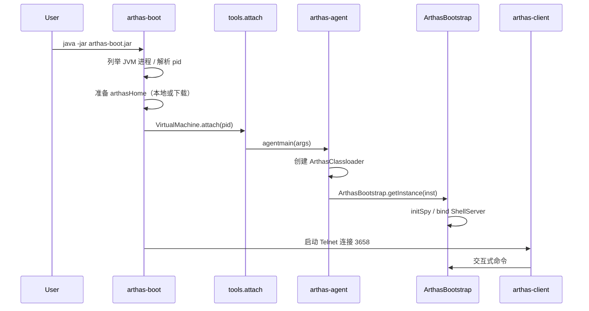
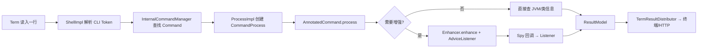

# Arthas 项目架构与实现原理分析

> 文档基于 Arthas 4.2.0 源码梳理，生成日期：2026-05-27  
> 仓库：[alibaba/arthas](https://github.com/alibaba/arthas)

---

## 目录

1. [项目定位与能力边界](#1-项目定位与能力边界)
2. [Maven 模块与产物结构](#2-maven-模块与产物结构)
3. [整体架构](#3-整体架构)
4. [核心工作流程](#4-核心工作流程)
5. [实现原理详解](#5-实现原理详解)
6. [技术栈与依赖](#6-技术栈与依赖)
7. [设计亮点](#7-设计亮点)
8. [扩展机制](#8-扩展机制)
9. [附录：关键类索引](#9-附录关键类索引)

---

## 1. 项目定位与能力边界

**Arthas** 是阿里巴巴开源的 **Java 应用诊断工具**，以 **Attach 到目标 JVM** 的方式运行，无需修改业务代码或重启应用，即可在线完成：

| 能力域 | 典型命令 | 原理概要 |
|--------|----------|----------|
| 类/方法检索 | `sc`、`sm`、`jad` | 遍历 Instrumentation 已加载类、反编译 |
| 运行时观测 | `watch`、`trace`、`monitor`、`stack` | 字节码增强 + Spy 回调 |
| JVM 状态 | `thread`、`jvm`、`memory`、`dashboard` | JMX / JDK API |
| 热更新 | `redefine`、`retransform` | `Instrumentation` 类重定义 |
| 表达式求值 | `ognl`、`getstatic` | OGNL 引擎 |
| 性能分析 | `profiler` | 集成 async-profiler |
| 堆/对象 | `heapdump`、`vmtool` | JVM 工具与本地库 |

当前版本（4.x）支持 **JDK 8+**（含 17/21/25），跨 Linux / macOS / Windows，交互方式包括 **Telnet CLI、HTTP/WebConsole、Tunnel 远程、MCP（AI 集成）**。

---

## 2. Maven 模块与产物结构

根 POM：`arthas-all`（`com.taobao.arthas`，版本 `${revision}` = 4.2.0）。

### 2.1 核心模块（构建主链路）

| 模块 | Artifact | 职责 |
|------|----------|------|
| **spy** | `arthas-spy.jar` | 极小的 `java.arthas.SpyAPI`，打入 BootstrapClassLoader |
| **agent** | `arthas-agent.jar` | Java Agent 入口，`premain` / `agentmain` |
| **core** | `arthas-core.jar` | 诊断引擎：命令、Shell、增强、HTTP 等（shade 后） |
| **boot** | `arthas-boot.jar` | 启动器：选进程、下载包、触发 attach |
| **client** | `arthas-client.jar` | Telnet 客户端（JLine） |
| **common** | — | 公共工具（IO、Socket、Ansi 等） |
| **arthas-model** | — | 命令结果 VO / Model，供 API 序列化 |
| **memorycompiler** | — | 动态编译（`mc` 命令） |
| **arthas-vmtool** | — | JNI 层堆内对象操作 |
| **packaging** | `arthas-bin.zip` | 组装发布包 |
| **web-ui** | — | WebConsole 前端，打包进 core |

### 2.2 远程与集成模块

| 模块 | 职责 |
|------|------|
| **tunnel-client** | Agent 侧 WebSocket 客户端，注册到 Tunnel Server |
| **tunnel-common** | Tunnel 协议常量、URI 参数 |
| **tunnel-server**（独立仓库/可选构建） | 多机 Agent 汇聚与转发 |
| **arthas-agent-attach** | 进程内自 attach（Spring Boot Starter） |
| **arthas-spring-boot-starter** | 应用启动时嵌入 Arthas |
| **arthas-mcp-server** | Model Context Protocol 服务，暴露 Arthas 为 AI Tool |

### 2.3 辅助与实验模块

- **math-game**：示例/demo 进程  
- **testcase**：集成测试  
- **site**：VuePress 文档站  
- **labs/**：grpc-server、JFR 分析、集群 native-agent 等实验性代码（部分未纳入默认 modules）

### 2.4 发布包内容（`assembly.xml`）

构建后 `arthas-bin.zip` 典型包含：

```
arthas-spy.jar          # Bootstrap 桥接
arthas-core.jar         # 核心（依赖已 shade）
arthas-agent.jar        # Attach Agent
arthas-boot.jar         # 启动器
arthas-client.jar       # 客户端
arthas.properties       # 默认配置
logback.xml
async-profiler/         # 各平台 native 库
bin/as.sh, as.bat       # 脚本入口
```

---

## 3. 整体架构

### 3.1 逻辑分层

```
┌─────────────────────────────────────────────────────────────────┐
│  用户接入层                                                       │
│  arthas-boot / as.sh │ arthas-client │ Web UI │ HTTP API │ MCP   │
└───────────────────────────────┬─────────────────────────────────┘
                                │ Telnet / HTTP / WebSocket(Tunnel)
┌───────────────────────────────▼─────────────────────────────────┐
│  目标 JVM 内 — Arthas Server（core）                             │
│  ┌─────────────┐  ┌──────────────┐  ┌─────────────────────────┐ │
│  │ ShellServer │→ │ Command 体系 │→ │ 各类 *Command 实现         │ │
│  └─────────────┘  └──────────────┘  └───────────┬─────────────┘ │
│  ┌─────────────┐  ┌──────────────┐              │               │
│  │ Session/Job │  │ Result 分发   │              ▼               │
│  └─────────────┘  └──────────────┘  ┌─────────────────────────┐ │
│                                      │ Instrumentation 增强层   │ │
│                                      │ Enhancer / Transformer  │ │
│                                      └───────────┬─────────────┘ │
└──────────────────────────────────────────────────┼───────────────┘
                                                   │ 方法进出/调用
┌──────────────────────────────────────────────────▼───────────────┐
│  BootstrapClassLoader: java.arthas.SpyAPI ← SpyImpl 回调        │
└──────────────────────────────────────────────────────────────────┘
                                │
┌───────────────────────────────▼─────────────────────────────────┐
│  业务应用类（被 watch/trace/monitor 等增强的业务字节码）            │
└─────────────────────────────────────────────────────────────────┘
```

### 3.2 进程与 ClassLoader 隔离

设计目标：**尽量减少对业务 ClassLoader 的污染**。

1. **agent 模块**（`AgentBootstrap`）体积很小，由 **系统/App ClassLoader** 加载，仅负责 attach 与拉起 core。  
2. **core** 由专用 **`ArthasClassloader`** 加载（`arthas-core.jar` 单 URL），与业务类隔离。  
3. **spy** 通过 `Instrumentation.appendToBootstrapClassLoaderSearch` 加入 **Bootstrap**，保证被增强的业务代码在任意 ClassLoader 下都能调用 `SpyAPI.atEnter/atExit` 等静态方法。

```java
// ArthasBootstrap.initSpy() 核心思路
instrumentation.appendToBootstrapClassLoaderSearch(new JarFile(spyJarFile));
```

4. 重复 attach 时通过 `SpyAPI.isInited()` 短路，避免重复启动 Server。

---

## 4. 核心工作流程

### 4.1 标准启动流程（arthas-boot）



**关键代码路径：**

- 启动器：`boot/.../Bootstrap.java` — 选 PID、拼 attach 参数、拉起 client  
- Attach：`core/.../Arthas.java` — `VirtualMachine.loadAgent(arthas-agent.jar, options)`  
- Agent 入口：`agent/.../AgentBootstrap.java` — `agentmain` → 反射调用 `ArthasBootstrap`  
- Server 启动：`core/.../ArthasBootstrap.java` — `bind(configure)`

### 4.2 Server 内部初始化顺序（ArthasBootstrap 构造）

| 步骤 | 动作 | 说明 |
|------|------|------|
| 1 | `initSpy()` | 将 `arthas-spy.jar` 加入 Bootstrap |
| 2 | `initArthasEnvironment()` | 合并命令行、环境变量、`arthas.properties` |
| 3 | `LogUtil.initLogger()` | Logback（shade 到 `com.alibaba.arthas.deps`） |
| 4 | `enhanceClassLoader()` | 可选增强 `ClassLoader#loadClass`，解决 Spy 加载问题 |
| 5 | `bind()` | 启动 TunnelClient（可选）、ShellServer、HTTP/MCP |
| 6 | `TransformerManager` | 注册全局 `ClassFileTransformer` |
| 7 | `SpyAPI.init()` | 标记 Spy 已初始化 |

配置优先级（默认）：**命令行参数 > 环境变量 > System Properties > arthas.properties**；可通过 `arthas.config.overrideAll=true` 反转。

### 4.3 命令执行流程



- **Shell 模型**：借鉴 Vert.x Shell 思想（`ShellServerImpl`、`ShellImpl`、`JobController`）。  
- **命令定义**：继承 `AnnotatedCommand`，用 `@Name`、`@Option` 等（`com.taobao.middleware.cli`）声明。  
- **内置命令注册**：`BuiltinCommandPack` 硬编码 30+ 命令类列表。  
- **并发**：命令在 `arthas-command-execute` 等线程池执行；`trace`/`watch` 等通过 **Job** 后台运行，会话超时不会打断有 Job 的 Shell。

### 4.4 字节码增强类命令流程（watch / trace / monitor）

1. 用户执行命令 → `EnhancerCommand` / 子类解析类名、方法、条件表达式。  
2. `Enhancer` 作为 `ClassFileTransformer`，通过 **ByteKit** 在方法入口/出口/异常/调用点织入对 `SpyAPI` 的调用。  
3. `Instrumentation.retransformClasses` 或 **懒加载 Transformer**（类首次加载时增强）。  
4. 运行时 `SpyAPI.atEnter` → `SpyImpl` → `AdviceListenerManager` 分发到具体 `AdviceListener`（如 `WatchAdviceListener`）。  
5. `reset` / `stop` 时卸载 Transformer 并 `SpyAPI.setNopSpy()`。

### 4.5 Tunnel 远程诊断流程

当配置 `tunnel-server=ws://host:port/ws`：

1. **TunnelClient**（Netty WebSocket）向 Server 注册 `agentRegister`，携带 `appName`、`agentId`、版本。  
2. 用户通过 **WebConsole / tunnel-server** 选择 Agent，流量由 Server **转发** 到目标 JVM 的 Telnet/HTTP 端口。  
3. 适用于 **容器/K8s、无法直连 3658 端口** 的场景。

### 4.6 MCP 集成流程（4.x）

配置 `mcp-endpoint` 后：

1. `ArthasMcpBootstrap` 启动 Netty MCP Server。  
2. `CommandExecutorImpl` 将 MCP Tool 调用映射为 Arthas 命令执行。  
3. 支持将 `watch`、`thread` 等能力暴露给 **LLM / IDE Agent** 调用。

---

## 5. 实现原理详解

### 5.1 Java Agent 与 Attach API

- **动态 attach**：`com.sun.tools.attach.VirtualMachine#loadAgent`，由 **arthas-boot** 或 **arthas-core 的 Arthas main** 在独立 JVM 中调用。  
- **静态 premain**：支持 `-javaagent:arthas-agent.jar`，与 `agentmain` 共用 `AgentBootstrap.main`。  
- **进程内 attach**：`arthas-agent-attach` 使用 **ByteBuddy Agent**（`ByteBuddyAgent.install()`）在同一进程获取 `Instrumentation`，适合 Spring Boot Starter。

Agent 参数格式：`arthasCoreJarPath;{后续传给 Server 的 Configure 参数}`。

### 5.2 Spy 桥接机制

**问题**：增强后的业务代码运行在 **业务 ClassLoader**，不能直接引用 Arthas 实现类。

**方案**：

1. 在 **Bootstrap** 放置接口级 API：`java.arthas.SpyAPI`（包名故意使用 `java.*` 风格，仅 spy 模块）。  
2. 增强代码只调用 `SpyAPI.atEnter/atExit/atBeforeInvoke/...` 静态方法。  
3. `Enhancer` 静态块中 `SpyAPI.setSpy(new SpyImpl())`，将调用委托到 `AdviceListenerManager`。

```java
// SpyAPI — 默认 NOP，未增强时几乎零开销
private static volatile AbstractSpy spyInstance = NOPSPY;
```

**adviceId**：同一 trace/watch 会话内，enter/exit/invoke 共用 id，便于关联调用链。

### 5.3 字节码增强（Enhancer + ByteKit）

- **ASM** 经 `repackage-asm` 重定位，避免与用户应用 ASM 冲突。  
- **ByteKit**（`com.alibaba:bytekit-core`）提供 `InterceptorProcessor`、`LocationFilter` 等，比手写 ASM 更易维护。  
- **TransformerManager** 维护多组 Transformer 链：`reTransformers` → `watchTransformers` → `traceTransformers`，按序合并 `transform` 结果。  
- **懒加载**：`isLazy=true` 时注册 `lazyClassFileTransformer`，在类 **首次定义** 时增强（`addTransformer(..., false)`）。  
- **批量 retransform**：`GlobalOptions.isBatchReTransform` 减少大批量类增强时的开销。

**ClassLoader 增强**：对配置的 `arthas.enhanceLoaders` 增强 `ClassLoader.loadClass`，确保自定义 ClassLoader 能加载到 Spy（见 issue #1596）。

### 5.4 表达式与条件过滤

- **OGNL**（`OgnlCommand` 及 watch 条件）：在目标 JVM 内对对象图求值。  
- **Express**（`com.taobao.arthas.core.command.express`）：轻量表达式，用于 `watch`/`trace` 的 `condition-express`、`finish-condition`。  
- 监听器内通过 `AdviceListenerManager` + 类加载器维度索引，降低每次回调的查找成本。

### 5.5 TimeTunnel（tt）

- **原理**：在方法 **正常返回或异常** 时，将当前栈帧的参数、返回值、异常等封装为 `TimeTunnel`，存入有界队列/表。  
- **价值**：线上 **无法断点** 时，对「某一次」调用现场做 `tt -i` 重放、查看 `params`、`target`。  
- 实现：`TimeTunnelAdviceListener` + `TimeTunnelCommand` + `TimeTunnelTable` 展示。

### 5.6 热替换（redefine / retransform）

- **redefine**：`Instrumentation.redefineClasses`，用新字节码替换已加载类（限制较多，不可改 schema 等）。  
- **retransform**：触发已注册的 Transformer 再次运行，与 Arthas 自身增强兼容。  
- **mc + redefine**：`memorycompiler` 模块内存编译 Java 源码后 redefine。

### 5.7 Profiler 与 JFR

- **profiler**：封装 **async-profiler**（`one.profiler.AsyncProfiler`），通过 native agent 采样 CPU/alloc 等，输出 flamegraph/html/jfr。  
- **JFR**：labs 中有 jfr-backend/frontend；核心侧持续演进 JFR 相关能力。

### 5.8 VmTool

- **arthas-vmtool**：JNI 库，支持 `heapdump` 相关能力、`vmtool` 命令在堆内 **按类型查实例、强制 GC** 等。  
- 通过 `ProfilerCommand` 等加载 native 库，需注意平台与 JDK 版本。

### 5.9 网络与多终端

| 组件 | 技术 | 端口默认 |
|------|------|----------|
| Telnet | `HttpTelnetTermServer` + termd | 3658 |
| HTTP / WebConsole | `HttpTermServer` + Netty | 8563 |
| HTTP API | `HttpApiHandler` | 同 HTTP 端口 |
| 认证 | `SecurityAuthenticatorImpl` | 用户名密码；监听 `0.0.0.0` 且无密码时 **强制生成随机密码** |

**termd-core**：提供终端模拟、HTTP 与 Telnet 统一抽象（`io.termd.core`）。

**web-ui**：Vue 构建产物在 core 打包阶段复制到 `com/taobao/arthas/core/http/`，由 HTTP 服务静态资源提供 WebConsole。

### 5.10 依赖 Shade 与冲突隔离

`arthas-core` 使用 **maven-shade-plugin** 将 Netty、Logback、Fastjson2、SLF4J 等重定位到 `com.alibaba.arthas.deps.*`，避免与业务依赖版本冲突。`arthas-spy.jar` **独立** 不打进 core，单独加入 Bootstrap。

---

## 6. 技术栈与依赖

### 6.1 语言与构建

- **Java 8** 编译目标（运行支持 JDK 8–25）  
- **Maven** 多模块，**flatten-maven-plugin** 管理 `${revision}`  
- 打包：**assembly**、**shade**、**jar-with-dependencies**

### 6.2 核心依赖一览

| 类别 | 库 | 用途 |
|------|-----|------|
| 字节码 | bytekit-core, repackage-asm | 增强与解析 |
| Attach | tools.jar / jdk.attach | VirtualMachine |
| 网络 | Netty 4.1.x | HTTP/Telnet/Tunnel/MCP |
| 终端 | termd-core, jline | Shell 交互 |
| CLI | middleware cli | 命令行解析与补全 |
| 序列化 | Fastjson2 | API/结果 JSON |
| 日志 | SLF4J + Logback（shade） | 诊断日志 `~/logs/arthas/` |
| 反编译 | CFR | `jad` 命令 |
| 性能 | async-profiler | `profiler` |
| Attach 嵌入 | ByteBuddy | agent-attach 模块 |
| MCP | Jackson, 自研 mcp-server | AI Tool 协议 |
| 测试 | JUnit, Mockito, AssertJ | 单测与集成测 |

### 6.3 与 Spring Boot 集成

`arthas-spring-boot-starter` 依赖 `arthas-agent-attach`，在应用启动时按配置 **静默或显式 attach**，适合开发/测试环境常驻诊断端点。

---

## 7. 设计亮点

### 7.1 极小的侵入面

- **spy.jar** 仅 API + NOP 实现，常驻 Bootstrap。  
- 业务代码仅多几条 `SpyAPI` 静态调用；`reset` 后恢复原始字节码。  
- 核心逻辑不在业务 ClassLoader，降低 **LinkageError / 依赖冲突** 风险。

### 7.2 可扩展命令体系

- **BuiltinCommandPack**：内置命令集中注册。  
- **Java SPI**：`META-INF/services/com.taobao.arthas.core.shell.command.CommandResolver` 加载外部 JAR 命令（见 `arthas-demo-external-command`）。  
- **command-locations**：支持目录或 JAR 列表，启动时合并进 `CommandRegistry`。

### 7.3 统一的 Shell 与 Job 模型

- 前台/后台命令、`Ctrl+C` 中断、管道（`grep`、`tee`）与 **Session 锁**（增强类命令互斥）。  
- **JobController** 管理长时间运行任务，与会话生命周期解耦。

### 7.4 结构化输出与多端一致

- 命令输出抽象为 **`ResultModel`**（`arthas-model`），HTTP API 返回 JSON，WebConsole 渲染表格/树。  
- **ResultDistributor** 支持同时向 Telnet 与 HTTP 会话分发。

### 7.5 安全与运维友好

- 非本机监听强制密码；`auth` 命令；可 **disabled-commands** 禁用危险命令（如 `stop`）。  
- **Tunnel** 集中管理多实例；**stat-url** 上报启动统计。  
- 配置项丰富（`arthas.properties`），支持会话超时、随机端口等。

### 7.6 诊断能力深度

- **trace** 多层 `-n` 限制、JDK 方法过滤。  
- **monitor** 定时聚合统计。  
- **dashboard** 一屏多指标刷新。  
- **profiler** 与 **tt** 互补：宏观火焰图 + 微观单次调用现场。

### 7.7 面向未来的 MCP

将诊断能力 Tool 化，便于 IDE/Cursor 等 **AI Agent** 自动执行 `thread`、`jad`、`watch`，是人机协作方向上的架构扩展。

---

## 8. 扩展机制

### 8.1 自定义命令（SPI）

1. 实现 `CommandResolver` 或提供 `AnnotatedCommand` 子类。  
2. 在 JAR 中增加：  
   `META-INF/services/com.taobao.arthas.core.shell.command.CommandResolver`  
3. 启动时：`arthas-boot.jar --command-locations /path/to/ext.jar`

### 8.2 配置扩展

- 环境变量与 `arthas.properties` 见官方文档 [arthas-properties](https://arthas.aliyun.com/doc/arthas-properties.html)。  
- 常用：`telnet-port`、`http-port`、`ip`、`username`、`password`、`tunnel-server`、`app-name`、`agent-id`、`mcp-endpoint`。

### 8.3 实验性 labs

- **arthas-grpc-server**：gRPC 协议实验。  
- **cluster-management/native-agent**：无 JVM attach 的 native agent 方案（探索中）。  
- **arthas-jfr-***：JFR 录制与分析前后端。

---

## 9. 附录：关键类索引

| 类 | 路径 | 说明 |
|----|------|------|
| `AgentBootstrap` | `agent/.../AgentBootstrap.java` | Agent 入口 |
| `ArthasBootstrap` | `core/.../ArthasBootstrap.java` | Server 单例与生命周期 |
| `Arthas` | `core/.../Arthas.java` | attach 主类 |
| `Bootstrap` | `boot/.../Bootstrap.java` | arthas-boot 入口 |
| `ShellServerImpl` | `core/.../ShellServerImpl.java` | 会话与 TermServer |
| `ProcessImpl` | `core/.../ProcessImpl.java` | 命令进程 |
| `BuiltinCommandPack` | `core/.../BuiltinCommandPack.java` | 内置命令表 |
| `Enhancer` | `core/.../Enhancer.java` | 字节码增强 |
| `TransformerManager` | `core/.../TransformerManager.java` | Transformer 链 |
| `SpyAPI` | `spy/.../SpyAPI.java` | Bootstrap 桥 |
| `SpyImpl` | `core/.../SpyImpl.java` | Spy 实现 |
| `TunnelClient` | `tunnel-client/.../TunnelClient.java` | Tunnel 客户端 |
| `TelnetConsole` | `client/.../TelnetConsole.java` | CLI 客户端 |
| `ArthasAgent` | `arthas-agent-attach/.../ArthasAgent.java` | 进程内 attach |
| `McpServer` | `arthas-mcp-server/.../McpServer.java` | MCP 服务构建 |

---

## 10. 架构小结

Arthas 的本质是：**在目标 JVM 内嵌一个带 Instrumentation 的轻量 Server**，通过 **Bootstrap Spy 桥 + ByteKit 增强** 实现无侵入观测，通过 **Shell/HTTP/Tunnel/MCP** 多端接入，通过 **丰富的 JDK 工具封装** 完成诊断闭环。其工程上最值得学习的点包括：**ClassLoader 隔离 + spy 桥设计**、**Transformer 分层与懒加载**、**命令式插件 SPI**、**shade 避免依赖冲突**，以及 **从单机 CLI 到 Tunnel/MCP 的渐进式扩展**。

如需对某一命令或模块做更细的源码级 walkthrough，可指定模块名继续深入。
