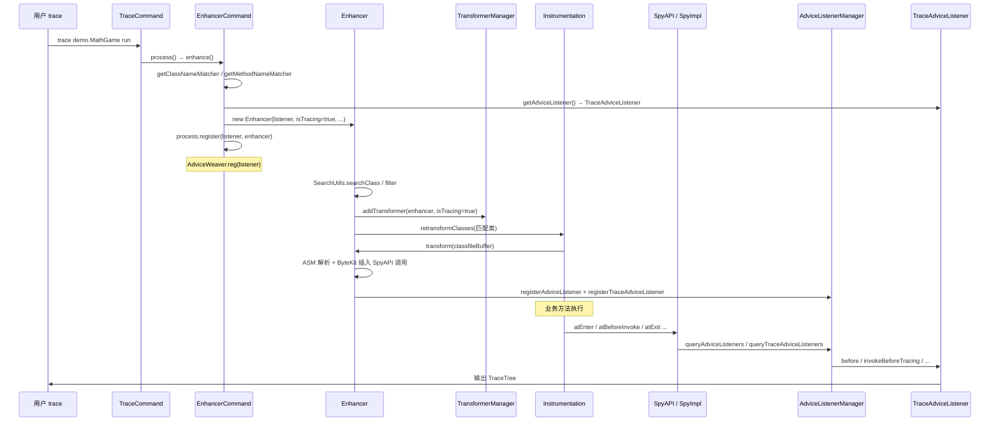

# Arthas 字节码增强与 trace 命令源码深度分析

> 文档基于 Arthas 4.2.0 源码梳理，生成日期：2026-05-27  
> 仓库：[alibaba/arthas](https://github.com/alibaba/arthas)  
> 关联文档：[ARTHAS_ARCHITECTURE_CN.md](./ARTHAS_ARCHITECTURE_CN.md)、[ARTHAS_IDEA_DEBUG_CN.md](./ARTHAS_IDEA_DEBUG_CN.md)

---

## 目录

1. [一句话总结](#1-一句话总结)
2. [命令体系与继承关系](#2-命令体系与继承关系)
3. [端到端调用链](#3-端到端调用链)
4. [阶段一：命令解析与 Listener 创建](#4-阶段一命令解析与-listener-创建)
5. [阶段二：类搜索与过滤](#5-阶段二类搜索与过滤)
6. [阶段三：Transformer 注册与 retransform](#6-阶段三transformer-注册与-retransform)
7. [阶段四：字节码增强核心（ASM + ByteKit）](#7-阶段四字节码增强核心asm--bytekit)
8. [阶段五：Spy 桥接与运行时回调](#8-阶段五spy-桥接与运行时回调)
9. [阶段六：trace 调用树构建与输出](#9-阶段六trace-调用树构建与输出)
10. [trace / watch / monitor / stack 差异对比](#10-trace--watch--monitor--stack-差异对比)
11. [生命周期、叠加增强与 reset](#11-生命周期叠加增强与-reset)
12. [常见问题与排障](#12-常见问题与排障)
13. [IDEA 调试断点速查](#13-idea-调试断点速查)
14. [附录：关键类索引](#14-附录关键类索引)

---

## 1. 一句话总结

**trace 增强** = 用 JVM `Instrumentation.retransformClasses` 对匹配类重新转换 → ASM 解析 class 字节码 → ByteKit 在**匹配方法**的入口/出口/异常处，以及方法体内每条 **invoke** 指令前后插入对 `java.arthas.SpyAPI` 的静态调用 → 增强前将 `TraceAdviceListener` 注册到 `AdviceListenerManager` → 业务线程执行时 `SpyImpl` 查表回调 Listener，构建 **TraceTree** 并按条件表达式输出。

增强**不是**改 Java 源码，而是在**已加载 class** 的字节码层面织入埋点。

---

## 2. 命令体系与继承关系

`trace`、`watch`、`monitor`、`stack`、`tt` 等观测类命令均继承 `EnhancerCommand`，统一走 `enhance()` 流程：

```text
AnnotatedCommand
    └── EnhancerCommand          # 抽象基类：匹配器、enhance()、Session 锁
            ├── TraceCommand     # trace，Listener 实现 InvokeTraceable
            ├── WatchCommand     # watch，仅方法级 enter/exit/exception
            ├── MonitorCommand   # monitor，统计 RT/成功率
            ├── StackCommand     # stack，类似 trace 的 invoke 级埋点
            └── ...
```

核心模块分工：

| 模块 | 路径 | 职责 |
|------|------|------|
| 命令层 | `core/.../command/monitor200/` | 解析参数、构造 Matcher 与 AdviceListener |
| 增强引擎 | `core/.../advisor/Enhancer.java` | `ClassFileTransformer`，ASM + ByteKit 插桩 |
| 插桩模板 | `core/.../advisor/SpyInterceptors.java` | ByteKit 注解定义插桩位置 |
| Spy 门面 | `spy/.../SpyAPI.java` | Bootstrap 类，极薄静态转发 |
| Spy 实现 | `core/.../advisor/SpyImpl.java` | 查 `AdviceListenerManager` 并回调 |
| 监听注册 | `core/.../advisor/AdviceListenerManager.java` | ClassLoader 维度的 listener 映射表 |
| Transformer 链 | `core/.../advisor/TransformerManager.java` | watch/trace 分链，避免互相覆盖 |

---

## 3. 端到端调用链



---

## 4. 阶段一：命令解析与 Listener 创建

### 4.1 TraceCommand 参数与 Matcher

`trace` 命令解析类名模式、方法名模式、条件表达式等：

```46:173:core/src/main/java/com/taobao/arthas/core/command/monitor200/TraceCommand.java
public class TraceCommand extends EnhancerCommand {
    // class-pattern, method-pattern, condition-express
    // -n limits, -p path, --skipJDKMethod, -c classloader ...
    @Override
    protected Matcher getClassNameMatcher() { ... }
    @Override
    protected Matcher getMethodNameMatcher() { ... }
    @Override
    protected AdviceListener getAdviceListener(CommandProcess process) {
        if (pathPatterns == null || pathPatterns.isEmpty()) {
            return new TraceAdviceListener(this, process, GlobalOptions.verbose || this.verbose);
        } else {
            return new PathTraceAdviceListener(this, process);
        }
    }
}
```

- **类名匹配**：`WildcardMatcher` / `RegexMatcher`（`-E`），由 `SearchUtils.classNameMatcher` 构造
- **方法名匹配**：同上；构造函数用 `<init>`
- **`-p path`**：走 `PathTraceAdviceListener`，按路径模式匹配调用链
- **`--skipJDKMethod true`（默认）**：增强时选用 `SpyTraceExcludeJDKInterceptor*`，`excludes = "java.**"`

### 4.2 EnhancerCommand.enhance() 入口

```188:217:core/src/main/java/com/taobao/arthas/core/command/monitor200/EnhancerCommand.java
    protected void enhance(CommandProcess process) {
        Session session = process.session();
        if (!session.tryLock()) { ... }  // 同一 Session 同时只允许一个增强命令

        Instrumentation inst = session.getInstrumentation();
        AdviceListener listener = getAdviceListenerWithId(process);

        boolean skipJDKTrace = false;
        if(listener instanceof AbstractTraceAdviceListener) {
            skipJDKTrace = ((AbstractTraceAdviceListener) listener).getCommand().isSkipJDKTrace();
        }

        Enhancer enhancer = new Enhancer(listener, listener instanceof InvokeTraceable, skipJDKTrace,
                getClassNameMatcher(), getClassNameExcludeMatcher(), getMethodNameMatcher(), this.lazy, this.hashCode);
        process.register(listener, enhancer);
        effect = enhancer.enhance(inst, this.maxNumOfMatchedClass);
```

关键决策：

| 参数 | trace | watch |
|------|-------|-------|
| `listener instanceof InvokeTraceable` | `true` → `isTracing=true` | `false` → `isTracing=false` |
| `skipJDKTrace` | 来自 `--skipJDKMethod` | 不适用 |
| `lazy` | `-L` / `--lazy` 懒加载 | 同左 |
| `hashCode` | `-c` 指定 ClassLoader | 同左 |

### 4.3 process.register：Listener 全局注册

`process.register(listener, enhancer)` 最终调用 `AdviceWeaver.reg(listener)`，为 Listener 分配 ID 并触发 `create()`：

```546:559:core/src/main/java/com/taobao/arthas/core/shell/system/impl/ProcessImpl.java
        public void register(AdviceListener adviceListener, ClassFileTransformer transformer) {
            ...
            this.listener = adviceListener;
            AdviceWeaver.reg(listener);
            this.transformer = transformer;
        }
```

`AdviceListenerManager` 的注册发生在 **`Enhancer.transform()` 字节码改写过程中**（见第 7 节），与 `AdviceWeaver` 是两层映射：

- **AdviceWeaver**：`listenerId → AdviceListener`（命令生命周期管理）
- **AdviceListenerManager**：`ClassLoader + className|method|desc → List<AdviceListener>`（运行时 Spy 查表）

---

## 5. 阶段二：类搜索与过滤

### 5.1 搜索匹配类

```472:476:core/src/main/java/com/taobao/arthas/core/advisor/Enhancer.java
    public synchronized EnhancerAffect enhance(final Instrumentation inst, int maxNumOfMatchedClass) {
        this.matchingClasses = GlobalOptions.isDisableSubClass
                ? SearchUtils.searchClass(inst, classNameMatcher)
                : SearchUtils.searchSubClass(inst, SearchUtils.searchClass(inst, classNameMatcher));
```

- 默认会搜索**子类**（除非 `options disable-sub-class true`）
- 匹配数量超过 `-m` 限制时直接返回，不执行增强

### 5.2 filter() 排除不可增强的类

```379:410:core/src/main/java/com/taobao/arthas/core/advisor/Enhancer.java
    private List<Pair<Class<?>, String>> filter(Set<Class<?>> classes) {
        // 逐项检查并 remove
    }
```

过滤规则汇总：

| 条件 | 原因 | 解决办法 |
|------|------|----------|
| ClassLoader 与 `-c` 指定 hash 不匹配 | 多 ClassLoader 环境 | `sc -d` 查 hash，`-c` 指定 |
| Arthas 自身 ClassLoader 加载的类 | 避免自增强 | 自动跳过 |
| Bootstrap 类（`classLoader==null`） | 默认不安全 | `options unsafe true` |
| exclude-class-pattern 命中 | 用户排除 | 调整 `--exclude-class-pattern` |
| lambda / 数组 / `Integer.class` 等 | 暂不支持 | 换目标类 |
| 接口（且未开 default method 支持） | 限制 | `options support-default-method true` |

### 5.3 ClassLoader 必须能加载 SpyAPI

在 `transform()` 入口首先检查：

```143:152:core/src/main/java/com/taobao/arthas/core/advisor/Enhancer.java
            try {
                if (inClassLoader != null) {
                    inClassLoader.loadClass(SpyAPI.class.getName());
                }
            } catch (Throwable e) {
                logger.error("the classloader can not load SpyAPI, ignore it. ...");
                return null;
            }
```

`spy.jar` 通过 Agent 挂到 **Bootstrap ClassLoader**，业务类增强后静态调用 `SpyAPI`；若目标 CL 因隔离策略无法解析该类，则跳过增强。这是多 ClassLoader（OSGi、Tomcat 等）场景下的常见失败原因。

---

## 6. 阶段三：Transformer 注册与 retransform

### 6.1 TransformerManager：watch / trace 分链

```49:118:core/src/main/java/com/taobao/arthas/core/advisor/TransformerManager.java
        classFileTransformer = new ClassFileTransformer() {
            public byte[] transform(...) {
                // 1. reTransformers
                // 2. watchTransformers
                // 3. traceTransformers
                return classfileBuffer;
            }
        };
        instrumentation.addTransformer(classFileTransformer, true);

    public void addTransformer(ClassFileTransformer transformer, boolean isTracing) {
        if (isTracing) {
            traceTransformers.add(transformer);
        } else {
            watchTransformers.add(transformer);
        }
    }
```

**设计意图**：多个 `Enhancer` 实例的 `transform()` 按链式顺序执行，trace 与 watch 分开列表，避免同一命令类型互相覆盖；最终由**一个** retransform-capable 的包装 Transformer 统一注册到 JVM。

### 6.2 触发 retransform

```496:531:core/src/main/java/com/taobao/arthas/core/advisor/Enhancer.java
            ArthasBootstrap.getInstance().getTransformerManager().addTransformer(this, isTracing);
            if (isLazy) {
                ArthasBootstrap.getInstance().getTransformerManager().addLazyTransformer(this);
            }
            if (GlobalOptions.isBatchReTransform) {
                inst.retransformClasses(classArray);  // 批量
            } else {
                for (Class<?> clazz : matchingClasses) {
                    inst.retransformClasses(clazz);   // 逐个
                }
            }
```

- **普通模式**：对已加载类 `retransformClasses`，`classBeingRedefined != null`
- **懒加载 `-L`**：额外注册 `lazyClassFileTransformer`（`addTransformer(..., false)`），在类**首次 define** 时增强

---

## 7. 阶段四：字节码增强核心（ASM + ByteKit）

`Enhancer.transform()` 是增强本体，流程如下：

```text
classfileBuffer
    → ClassReader + ClassNode（ASM9）
    → removeJSRInstructions
    → 选择 InterceptorProcessor 列表
    → 筛选 matchedMethods（方法名匹配、非 abstract、非 <clinit>）
    → 对每个 matchedMethod：
        若已有 atBeforeInvoke → 只补注册 trace listener
        否则 → MethodProcessor + InterceptorProcessor.process() 插桩
    → registerAdviceListener（方法级 enter/exit）
    → AsmUtils.toBytes → 返回新字节码
```

### 7.1 插桩模板：SpyInterceptors

ByteKit 通过解析带注解的模板类，生成 `InterceptorProcessor`：

```19:112:core/src/main/java/com/taobao/arthas/core/advisor/SpyInterceptors.java
    // 方法级（watch/trace 共用）
    SpyInterceptor1  @AtEnter          → SpyAPI.atEnter(...)
    SpyInterceptor2  @AtExit           → SpyAPI.atExit(...)
    SpyInterceptor3  @AtExceptionExit  → SpyAPI.atExceptionExit(...)

    // invoke 级（仅 isTracing=true 时启用）
    SpyTraceInterceptor1       @AtInvoke(whenComplete=false)  → SpyAPI.atBeforeInvoke(...)
    SpyTraceInterceptor2       @AtInvoke(whenComplete=true)   → SpyAPI.atAfterInvoke(...)
    SpyTraceInterceptor3       @AtInvokeException             → SpyAPI.atInvokeException(...)

    // skipJDKTrace=true 时的变体（excludes = "java.**"）
    SpyTraceExcludeJDKInterceptor1/2/3
```

Interceptor 对照表：

| Interceptor | ByteKit 注解 | 插入位置 | SpyAPI 调用 |
|-------------|-------------|----------|-------------|
| SpyInterceptor1 | `@AtEnter` | 目标方法入口 | `atEnter` |
| SpyInterceptor2 | `@AtExit` | 正常返回前 | `atExit` |
| SpyInterceptor3 | `@AtExceptionExit` | 异常退出 | `atExceptionExit` |
| SpyTraceInterceptor1 | `@AtInvoke(whenComplete=false)` | 每条 invoke 指令前 | `atBeforeInvoke` |
| SpyTraceInterceptor2 | `@AtInvoke(whenComplete=true)` | invoke 正常返回后 | `atAfterInvoke` |
| SpyTraceInterceptor3 | `@AtInvokeException` | invoke 抛异常 | `atInvokeException` |

`SpyTraceInterceptor*` 的 `excludes` 还排除了 `SpyAPI` 自身及基本类型装箱类，避免递归跟踪。

### 7.2 按 isTracing 选择 Processor

```197:211:core/src/main/java/com/taobao/arthas/core/advisor/Enhancer.java
            interceptorProcessors.addAll(defaultInterceptorClassParser.parse(SpyInterceptor1.class));
            interceptorProcessors.addAll(defaultInterceptorClassParser.parse(SpyInterceptor2.class));
            interceptorProcessors.addAll(defaultInterceptorClassParser.parse(SpyInterceptor3.class));

            if (this.isTracing) {
                if (!this.skipJDKTrace) {
                    interceptorProcessors.addAll(... SpyTraceInterceptor1/2/3 ...);
                } else {
                    interceptorProcessors.addAll(... SpyTraceExcludeJDKInterceptor1/2/3 ...);
                }
            }
```

**watch** 只解析前三个；**trace** 额外解析 invoke 级三个。

### 7.3 只增强匹配的方法

```213:218:core/src/main/java/com/taobao/arthas/core/advisor/Enhancer.java
            for (MethodNode methodNode : classNode.methods) {
                if (!isIgnore(methodNode, methodNameMatcher)) {
                    matchedMethods.add(methodNode);
                }
            }
```

```340:343:core/src/main/java/com/taobao/arthas/core/advisor/Enhancer.java
    private boolean isIgnore(MethodNode methodNode, Matcher methodNameMatcher) {
        return null == methodNode || isAbstract(methodNode.access) || !methodNameMatcher.matching(methodNode.name)
                || ArthasCheckUtils.isEquals(methodNode.name, "<clinit>");
    }
```

此外 **native 方法**在插桩循环中跳过。

### 7.4 防重复增强：已有 trace 埋点时只补注册

同一方法若已被其他 trace/watch 增强过，字节码中已存在 `SpyAPI.atBeforeInvoke`，则**不再重复插桩**，只为新的 listener 补注册 invoke 点：

```259:301:core/src/main/java/com/taobao/arthas/core/advisor/Enhancer.java
                if(AsmUtils.containsMethodInsnNode(methodNode, ..., "atBeforeInvoke")) {
                    // 遍历已有 invoke 埋点，registerTraceAdviceListener
                    ...
                } else {
                    MethodProcessor methodProcessor = new MethodProcessor(classNode, methodNode, groupLocationFilter);
                    for (InterceptorProcessor interceptor : interceptorProcessors) {
                        List<Location> locations = interceptor.process(methodProcessor);
                        // 每个 invoke 点 registerTraceAdviceListener
                    }
                }
                // enter/exit 总是要插入 listener
                AdviceListenerManager.registerAdviceListener(inClassLoader, className, methodNode.name, methodNode.desc, listener);
```

`groupLocationFilter` 用于检测方法内是否已有 `atEnter`/`atExit`/`atBeforeInvoke` 等，避免同一位置重复插入。

### 7.5 增强后字节码示意

以 `demo.MathGame.run()` 为例（概念示意，非真实 dump）：

```java
// 增强前
public void run() {
    List<Integer> result = primeFactors(number);
    print(result);
}

// 增强后（概念）
public void run() {
    SpyAPI.atEnter(MathGame.class, "run|()V", this, args);
    try {
        SpyAPI.atBeforeInvoke(MathGame.class, "demo.MathGame|primeFactors|(I)Ljava/util/List;|42", this);
        List<Integer> result = primeFactors(number);
        SpyAPI.atAfterInvoke(MathGame.class, "demo.MathGame|primeFactors|(I)Ljava/util/List;|42", this);

        SpyAPI.atBeforeInvoke(MathGame.class, "demo.MathGame|print|(Ljava/util/List;)V|43", this);
        print(result);
        SpyAPI.atAfterInvoke(MathGame.class, "demo.MathGame|print|(Ljava/util/List;)V|43", this);

        SpyAPI.atExit(MathGame.class, "run|()V", this, args, null);
    } catch (Throwable t) {
        SpyAPI.atExceptionExit(MathGame.class, "run|()V", this, args, t);
        throw t;
    }
}
```

`invokeInfo` 字符串格式由 ByteKit `@Binding.InvokeInfo` 绑定，包含 **owner、methodName、methodDesc、lineNumber**，供 `SpyImpl` 解析。

### 7.6 其它 transform 细节

- **CGLIB 增强类**：构造函数需 `fixConstructorExceptionTable`（issue #1690）
- **class 版本 < 49（Java 5）**：强制提升到 49，避免 verify 失败
- **`options dump`**：增强后 class 写入 `./arthas-class-dump/`
- **成功增强的类**记入 `classBytesCache`，供 `reset` 使用

---

## 8. 阶段五：Spy 桥接与运行时回调

### 8.1 为什么需要 SpyAPI（Bootstrap 薄层）

业务类字节码里插入的是 `SpyAPI.atEnter(...)` 等**静态调用**。`SpyAPI` 位于 `spy` 模块，由 Agent 加载到 **Bootstrap ClassLoader**，保证所有业务 ClassLoader 都能链接到同一入口，而不把 Arthas core 打进业务 classpath。

```91:93:core/src/main/java/com/taobao/arthas/core/advisor/Enhancer.java
    static {
        SpyAPI.setSpy(spyImpl);
    }
```

```58:82:spy/src/main/java/java/arthas/SpyAPI.java
    public static void atEnter(Class<?> clazz, String methodInfo, Object target, Object[] args) {
        spyInstance.atEnter(clazz, methodInfo, target, args);
    }
    public static void atBeforeInvoke(Class<?> clazz, String invokeInfo, Object target) {
        spyInstance.atBeforeInvoke(clazz, invokeInfo, target);
    }
    // ...
```

### 8.2 SpyImpl：查表分发

**方法级**（enter/exit/exception）：

```28:48:core/src/main/java/com/taobao/arthas/core/advisor/SpyImpl.java
    public void atEnter(Class<?> clazz, String methodInfo, Object target, Object[] args) {
        ClassLoader classLoader = clazz.getClassLoader();
        String[] info = StringUtils.splitMethodInfo(methodInfo);
        List<AdviceListener> listeners = AdviceListenerManager.queryAdviceListeners(
                classLoader, clazz.getName(), methodName, methodDesc);
        for (AdviceListener adviceListener : listeners) {
            adviceListener.before(clazz, methodName, methodDesc, target, args);
        }
    }
```

**invoke 级**（trace 专用）：

```101:123:core/src/main/java/com/taobao/arthas/core/advisor/SpyImpl.java
    public void atBeforeInvoke(Class<?> clazz, String invokeInfo, Object target) {
        List<AdviceListener> listeners = AdviceListenerManager.queryTraceAdviceListeners(
                classLoader, clazz.getName(), owner, methodName, methodDesc);
        for (AdviceListener adviceListener : listeners) {
            final InvokeTraceable listener = (InvokeTraceable) adviceListener;
            listener.invokeBeforeTracing(classLoader, owner, methodName, methodDesc, lineNumber);
        }
    }
```

### 8.3 AdviceListenerManager 键设计

```106:112:core/src/main/java/com/taobao/arthas/core/advisor/AdviceListenerManager.java
        private String key(String className, String methodName, String methodDesc) {
            return className + methodName + methodDesc;
        }
        private String keyForTrace(String className, String owner, String methodName, String methodDesc) {
            return className + owner + methodName + methodDesc;
        }
```

- **方法级 key**：`被增强类` + `被增强方法名` + `描述符`
- **trace invoke key**：`被增强类` + `被调用类 owner` + `被调用方法` + `描述符`

存储结构：`ConcurrentWeakKeyHashMap<ClassLoader, ClassLoaderAdviceListenerManager>`，避免强引用业务 ClassLoader 导致泄漏。后台定时任务每 3 秒清理已终止进程的 Listener。

### 8.4 跳过已结束命令的回调

```178:191:core/src/main/java/com/taobao/arthas/core/advisor/SpyImpl.java
    private static boolean skipAdviceListener(AdviceListener adviceListener) {
        if (adviceListener instanceof ProcessAware) {
            ExecStatus status = process.status();
            if (status.equals(ExecStatus.TERMINATED) || status.equals(ExecStatus.STOPPED)) {
                return true;
            }
        }
        return false;
    }
```

命令结束后字节码埋点仍在，但 Spy 不再回调（除非 `reset` 去掉字节码）。

---

## 9. 阶段六：trace 调用树构建与输出

### 9.1 InvokeTraceable 接口

```8:60:core/src/main/java/com/taobao/arthas/core/advisor/InvokeTraceable.java
public interface InvokeTraceable {
    void invokeBeforeTracing(ClassLoader, String tracingClassName, String tracingMethodName,
                             String tracingMethodDesc, int tracingLineNumber);
    void invokeAfterTracing(...);
    void invokeThrowTracing(...);
}
```

`TraceAdviceListener` 实现该接口；`EnhancerCommand` 据此设置 `isTracing=true`。

### 9.2 方法边界：AbstractTraceAdviceListener

```48:116:core/src/main/java/com/taobao/arthas/core/command/monitor200/AbstractTraceAdviceListener.java
    public void before(...) {
        traceEntity.tree.begin(clazz.getName(), method.getName(), -1, false);  // 根节点，无行号
        traceEntity.deep++;
        threadLocalWatch.start();
    }
    public void afterReturning(...) {
        traceEntity.tree.end();
        finishing(loader, advice);  // deep==0 时评估条件并输出
    }
```

- **`deep`**：嵌套深度计数器
- **仅当 `deep == 0`**（根方法完整结束）才评估条件表达式（如 `'#cost>100'`）并输出整棵 TraceTree
- **`-n`** 次数限制在 `finishing()` 中检查

### 9.3 方法内部子调用：TraceAdviceListener

```22:39:core/src/main/java/com/taobao/arthas/core/command/monitor200/TraceAdviceListener.java
    public void invokeBeforeTracing(..., int tracingLineNumber) {
        threadLocalTraceEntity(classLoader).tree.begin(tracingClassName, tracingMethodName, tracingLineNumber, true);
    }
    public void invokeAfterTracing(...) {
        threadLocalTraceEntity(classLoader).tree.end();
    }
    public void invokeThrowTracing(...) {
        threadLocalTraceEntity(classLoader).tree.end(true);
    }
```

`tracingLineNumber` 来自 ByteKit `@AtInvoke` 绑定的源码行号，对应 trace 输出中的 `[12]` 等形式。

### 9.4 TraceTree 数据结构（概念）

```text
TraceEntity (ThreadLocal)
    ├── deep: int                    # 嵌套深度
    ├── tree: TraceTree              # 调用树
    │     └── TraceNode (begin/end 成对)
    └── loader: ClassLoader

输出时机：根方法 afterReturning / afterThrowing 且 deep 归零 → OGNL 条件满足 → process.appendResult
```

---

## 10. trace / watch / monitor / stack 差异对比

| 维度 | trace | watch | monitor | stack |
|------|-------|-------|---------|-------|
| `InvokeTraceable` | 是 | 否 | 否 | 是 |
| `isTracing` | true | false | false | true |
| invoke 级埋点 | 是 | 否 | 否 | 是 |
| Transformer 列表 | traceTransformers | watchTransformers | watchTransformers | traceTransformers |
| Listener 行为 | TraceTree + `#cost` | OGNL 观察 params/returnObj | 计数/RT/成功率 | 打印线程栈 |
| skipJDK | `--skipJDKMethod` | 无 | 无 | 类似 trace |

**共性**：同一套 `Enhancer` 引擎、同一套 `SpyInterceptor1/2/3` 方法级埋点、同一套 `AdviceListenerManager` 查表机制。

---

## 11. 生命周期、叠加增强与 reset

### 11.1 命令生命周期

```text
启动 trace
  → Session.tryLock()
  → AdviceWeaver.reg(listener)
  → Enhancer.enhance() + retransform
  → 命令阻塞（前台），等待业务触发

结束（Ctrl+C / Q / -n 满 / --timeout）
  → process.unregister()
  → TransformerManager.removeTransformer(enhancer)
  → AdviceWeaver.unReg(listener)
  → Session.unlock()
```

**注意**：`unregister` **不会**自动把字节码恢复为增强前状态，只是不再回调 Listener。

### 11.2 多次增强叠加

- 同一方法可被多个 watch/trace 命令增强：第二次起检测到已有 `SpyAPI` 调用，**只追加 listener 注册**，不重复插桩
- 多个 Listener 挂在同一 key 下，`SpyImpl` 遍历全部回调

### 11.3 reset 恢复字节码

```558:581:core/src/main/java/com/taobao/arthas/core/advisor/Enhancer.java
    public static synchronized EnhancerAffect reset(final Instrumentation inst, final Matcher classNameMatcher) {
        // 从 classBytesCache 找曾增强的类
        // retransform 触发 transform，此时无活跃 Enhancer 匹配 → 返回原始字节码逻辑
        // 清除 classBytesCache
    }
```

要彻底去掉 Spy 埋点，需执行 `reset`（或 `reset CLASS_NAME`）。

---

## 12. 常见问题与排障

| 现象 | 可能原因 | 处理 |
|------|----------|------|
| `No class or method is affected` | 类未加载、方法在父类、Bootstrap 类 | `sc`/`sm` 确认；`-L` 懒加载；`options unsafe true` |
| 增强成功但无输出 | 条件表达式不满足 | 去掉条件或调整 `'#cost>100'` |
| 多 ClassLoader 未增强 | CL 无法 load SpyAPI | `-c` 指定正确 hash |
| 方法体过大增强失败 | JVM 方法字节码限制 | `reset` 后重试；缩小范围 |
| trace 行号不准 | 无行号表或优化 | 属已知限制，ByteKit 取最近行号 |
| 停止后仍有开销 | 字节码埋点仍在 | 执行 `reset` |

增强失败时日志路径见 `LogUtil.loggingFile()`；可 `options dump true` 查看增强后 class。

---

## 13. IDEA 调试断点速查

本地调试流程见 [ARTHAS_IDEA_DEBUG_CN.md](./ARTHAS_IDEA_DEBUG_CN.md)。

| 阶段 | 推荐断点 |
|------|----------|
| 命令入口 | `TraceCommand.getAdviceListener` |
| 增强编排 | `EnhancerCommand.enhance` |
| 类搜索 | `Enhancer.enhance` → `SearchUtils.searchClass` |
| 字节码改写 | `Enhancer.transform` |
| ByteKit 插桩 | `InterceptorProcessor.process` |
| Listener 注册 | `AdviceListenerManager.registerAdviceListener` |
| 业务触发 | `SpyImpl.atEnter` / `SpyImpl.atBeforeInvoke` |
| 树输出 | `AbstractTraceAdviceListener.finishing` |

---

## 14. 附录：关键类索引

| 类 | 路径 |
|----|------|
| `TraceCommand` | `core/.../command/monitor200/TraceCommand.java` |
| `EnhancerCommand` | `core/.../command/monitor200/EnhancerCommand.java` |
| `Enhancer` | `core/.../advisor/Enhancer.java` |
| `SpyInterceptors` | `core/.../advisor/SpyInterceptors.java` |
| `TransformerManager` | `core/.../advisor/TransformerManager.java` |
| `AdviceListenerManager` | `core/.../advisor/AdviceListenerManager.java` |
| `AdviceWeaver` | `core/.../advisor/AdviceWeaver.java` |
| `SpyImpl` | `core/.../advisor/SpyImpl.java` |
| `SpyAPI` | `spy/.../SpyAPI.java` |
| `InvokeTraceable` | `core/.../advisor/InvokeTraceable.java` |
| `TraceAdviceListener` | `core/.../command/monitor200/TraceAdviceListener.java` |
| `AbstractTraceAdviceListener` | `core/.../command/monitor200/AbstractTraceAdviceListener.java` |
| `SearchUtils` | `core/.../util/SearchUtils.java` |

---

## 参考

- Arthas 官方文档：[trace](https://arthas.aliyun.com/doc/trace.html)
- ByteKit（阿里开源 AOP 字节码工具）：`com.alibaba.bytekit`
- JVM Instrumentation：`java.lang.instrument.ClassFileTransformer`
