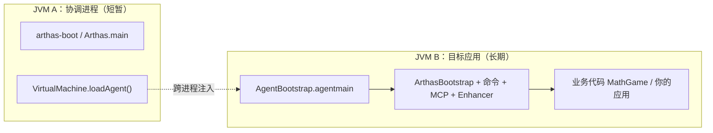

# 在本地 IDEA 调试 Arthas 源码指南

> 基于 Arthas 4.2.x 源码与官方 [Issue #222](https://github.com/alibaba/arthas/issues/222)、[CONTRIBUTING.md](CONTRIBUTING.md) 整理  
> 适用环境：Windows / macOS / Linux + IntelliJ IDEA  
> 生成日期：2026-05-27  
> 相关文档：[ARTHAS_ARCHITECTURE_CN.md](ARTHAS_ARCHITECTURE_CN.md)

---

## 目录

1. [调试原理（必读）](#1-调试原理必读)
2. [环境准备](#2-环境准备)
3. [导入工程](#3-导入工程)
4. [本地打包](#4-本地打包)
5. [三种调试场景](#5-三种调试场景)
6. [场景三详解：调试注入后的 core（推荐）](#6-场景三详解调试注入后的-core推荐)
7. [IDEA Run Configuration 配置示例](#7-idea-run-configuration-配置示例)
8. [断点推荐与调用链](#8-断点推荐与调用链)
9. [改代码后的迭代流程](#9-改代码后的迭代流程)
10. [常见问题](#10-常见问题)
11. [快速检查清单](#11-快速检查清单)

---

## 1. 调试原理（必读）

Attach 时存在 **两个 JVM**，职责不同：



| 进程 | 运行内容 | 适合调试什么 |
|------|----------|--------------|
| **JVM A** | `Arthas.java` / `arthas-boot`：找 PID、`loadAgent` 后退出 | attach 协调逻辑 |
| **JVM B** | Agent 注入后，`ArthasClassloader` 加载 `arthas-core.jar`，在目标进程内起 Server | **命令、MCP、字节码增强（重点）** |

**调试注入后的 core** = 给 **目标 JVM** 加 JDWP，IDEA **Remote Debug** 连上去；断点打在 `core` / `agent` 模块，在 Telnet / MCP 触发命令时命中。

注入链路（源码）：

```text
Arthas.loadAgent()
  → 目标 JVM: AgentBootstrap.agentmain(inst)
  → new ArthasClassloader(arthas-core.jar)
  → 反射调用 ArthasBootstrap.getInstance(inst, args)
  → 起 Telnet / HTTP / MCP，注册命令
```

---

## 2. 环境准备

### 2.1 JDK（编译）

| 要求 | 说明 |
|------|------|
| **推荐** | Azul **Zulu JDK 8**（8u262+，带 `jdk.jfr`）或 **JDK 11/17** 编译 |
| **避免** | 部分 Oracle JDK 8 无 `jdk.jfr`，会报 `程序包jdk.jfr不存在` |
| **字节码** | 项目 `pom.xml` 仍为 `source/target=1.8`，用 JDK 11 编译产出仍是 Java 8 字节码 |

验证 JDK 是否含 JFR（可选）：

```powershell
# 应有输出或存在 jfr.jar
jar tf "%JAVA_HOME%\jre\lib\rt.jar" | findstr "jdk/jfr/Event"
```

### 2.2 其他工具

| 工具 | 用途 |
|------|------|
| **Maven** | 使用项目自带 `mvnw.cmd` / `./mvnw` |
| **Git Bash**（Windows 可选） | 跑 `as.sh`、`as-package.sh` |
| **gcc**（Windows 可选） | 编译 `arthas-vmtool` 等 native 模块；只调试 core 可先 `-DskipTests` 打包 |

### 2.3 IDEA 设置

1. **File → Project Structure → Project**
   - **SDK**：Zulu 8 或 JDK 11/17
   - **Language level**：8
2. **Settings → Build → Build Tools → Maven → Runner**
   - **JRE**：与 Project SDK 一致
3. **Settings → Build → Compiler → Java Compiler**
   - **Project bytecode version**：8

---

## 3. 导入工程

1. IDEA → **File → Open** → 选择仓库根目录 **`pom.xml`**
2. 选择 **Open as Project**，Trust Project
3. 等待 Maven 依赖下载完成（右下角进度条结束）
4. 验证编译：

```powershell
cd d:\workspace\java_projects\source_projects\arthas
.\mvnw.cmd compile -DskipTests
```

编译成功后再配置调试。

---

## 4. 本地打包

调试 attach 时加载的是 **jar**，不是 IDEA 里直接编译的 `target/classes`。改源码后必须重新打包，且 attach 时要指向新 jar。

### 4.1 方式 A：Git Bash + as-package.sh（推荐）

```bash
cd /d/workspace/java_projects/source_projects/arthas

# 首次或全量
./as-package.sh

# 日常快速迭代（跳过 clean、跳过 site 文档前端）
./as-package.sh --fast
```

会自动解压到：`C:\Users\<你>\.arthas\lib\<版本号>\arthas\`

### 4.2 方式 B：Windows PowerShell + mvnw

```powershell
cd d:\workspace\java_projects\source_projects\arthas

.\mvnw.cmd package -DskipTests -Dmaven.test.skip=true `
  -Dmaven.javadoc.skip=true -Darthas.site.frontend.skip=true
```

产物：

- **ZIP**：`packaging\target\arthas-bin.zip`
- 解压到固定目录，例如：`d:\workspace\java_projects\source_projects\arthas\build\arthas\`

解压后目录应包含：

```text
arthas-boot.jar
arthas-core.jar
arthas-agent.jar
arthas-spy.jar
arthas-client.jar
as.bat / as.sh
...
```

### 4.3 调试时如何指定本地包

**不要**依赖 `~/.arthas` 里可能更旧的版本，显式指定本地构建目录：

```text
--arthas-home d:\workspace\java_projects\source_projects\arthas\build\arthas
```

或在 `as-package.sh` 之后使用 `~/.arthas\lib\<刚打的版本>\arthas`。

---

## 5. 三种调试场景

| 场景 | 调试目标 | IDEA 方式 | 连哪个端口 |
|------|----------|-----------|------------|
| **1** | arthas-boot 选进程、下载、attach | Application 调试 `Bootstrap` | 无需 Remote |
| **2** | attach 协调进程 `Arthas.main` | Remote Debug | **8888**（`--debug-attach`） |
| **3** | 注入后 core（命令/MCP/增强） | Remote Debug **目标 JVM** | **5005**（示例） |

**日常开发优先用场景 3。**

---

## 6. 场景三详解：调试注入后的 core（推荐）

### 6.1 步骤总览

```text
① 打包本地 arthas
② 启动目标进程（带 JDWP）
③ IDEA Remote Debug 连接目标 JVM
④ 用 --arthas-home 指向本地 jar 执行 attach
⑤ 在 core 类打断点
⑥ Telnet / MCP 触发命令，断点命中
```

### 6.2 步骤 1：打包

见 [§4 本地打包](#4-本地打包)。记下解压路径，下文记为：

```text
ARTHAS_HOME = d:\workspace\java_projects\source_projects\arthas\build\arthas
```

### 6.3 步骤 2：启动 demo 目标进程（带 JDWP）

**Run → Edit Configurations → + → Application**

| 字段 | 值 |
|------|-----|
| **Name** | `MathGame (JDWP)` |
| **Main class** | `demo.MathGame` |
| **Module** | `math-game` |
| **VM options** | `-agentlib:jdwp=transport=dt_socket,server=y,suspend=n,address=*:5005` |
| **Working directory** | 项目根目录 |

点击 **Run**（不要 Debug 这个配置本身；JDWP 已内嵌在 VM options 里）。

验证：

```powershell
jps -l
# 应看到 demo.MathGame 及 PID
```

### 6.4 步骤 3：IDEA Remote Debug 连接目标 JVM

**Run → Edit Configurations → + → Remote JVM Debug**

| 字段 | 值 |
|------|-----|
| **Name** | `Remote - MathGame` |
| **Host** | `localhost` |
| **Port** | `5005` |
| **Debugger mode** | Attach |
| **Use module classpath** | `core` 或整个项目（便于源码跳转） |

点击 **Debug** 连接。状态栏出现 “Connected to the target VM” 即成功。

> `suspend=n`：目标进程先正常跑，不等待调试器；若需启动即暂停，改为 `suspend=y`，连上 Remote 后再 F9 继续。

### 6.5 步骤 4：Attach 本地构建的 Arthas

任选一种方式。

#### 方式 A：IDEA 调试 Bootstrap（可同时看 boot 逻辑）

**Application 配置**

| 字段 | 值 |
|------|-----|
| **Name** | `Bootstrap attach` |
| **Main class** | `com.taobao.arthas.boot.Bootstrap` |
| **Module** | `boot` |
| **Program arguments** | `<MathGame的PID> --arthas-home <ARTHAS_HOME>` |
| **示例** | `12345 --arthas-home d:\workspace\java_projects\source_projects\arthas\build\arthas` |

用 **Debug** 启动可在 `Bootstrap.java` 里断点。

#### 方式 B：命令行 attach（更简单）

```powershell
cd d:\workspace\java_projects\source_projects\arthas\build\arthas
java -jar arthas-boot.jar <PID> --arthas-home .
```

#### 方式 C：Git Bash as.sh

```bash
./as.sh <PID> --arthas-home /d/workspace/java_projects/source_projects/arthas/build/arthas
```

attach 成功后日志类似：

```text
arthas home: d:\...\build\arthas
```

### 6.6 步骤 5：下断点

在 **Remote - MathGame** 会话中生效的推荐断点：

| 阶段 | 类 | 方法 |
|------|-----|------|
| Agent 注入 | `com.taobao.arthas.agent334.AgentBootstrap` | `agentmain` / `bind` |
| Server 启动 | `com.taobao.arthas.core.server.ArthasBootstrap` | `getInstance`、构造函数 |
| 同步命令 | `com.taobao.arthas.core.command.CommandExecutorImpl` | `executeSync` |
| thread 命令 | `com.taobao.arthas.core.command.jvm300.ThreadCommand` 或 MCP `ThreadTool` | 对应 execute 方法 |
| 字节码增强 | `com.taobao.arthas.core.advisor.Enhancer` | `enhance` |
| MCP | `com.taobao.arthas.core.mcp.tool.util.McpToolUtils` | `callFunction` 内 lambda |

### 6.7 步骤 6：触发断点

**Telnet：**

```text
telnet 127.0.0.1 3658
thread
```

**或 MCP**（HTTP 8563）：Cursor / `mcp_comm_probe.py` 调用 `tools/call` `thread`。

IDEA 在 **Remote - MathGame** 窗口暂停并高亮源码行。

---

## 7. IDEA Run Configuration 配置示例

建议保存以下 3 个配置（名称可自定）：

### 7.1 MathGame (JDWP) — Application

```
Main: demo.MathGame
Module: math-game
VM options: -agentlib:jdwp=transport=dt_socket,server=y,suspend=n,address=*:5005
```

### 7.2 Remote - MathGame — Remote JVM Debug

```
Host: localhost
Port: 5005
Mode: Attach
```

### 7.3 Bootstrap attach — Application

```
Main: com.taobao.arthas.boot.Bootstrap
Module: boot
Program arguments: <pid> --arthas-home <ARTHAS_HOME绝对路径>
```

### 7.4 场景二（可选）：调试 Arthas.main 协调进程

Git Bash：

```bash
./as.sh --debug-attach
# 默认 JDWP 端口 8888，suspend=y
```

IDEA **Remote JVM Debug** → `localhost:8888`

断点：`com.taobao.arthas.core.Arthas#main`、`attachAgent`

Windows 无 Git Bash 时，可手动起 `Arthas` Application：

```
Main: com.taobao.arthas.core.Arthas
Module: core
VM options: -agentlib:jdwp=transport=dt_socket,server=y,suspend=y,address=*:8888
Program arguments: -pid <PID> -target-ip 127.0.0.1 -telnet-port 3658 -http-port 8563
  -core <ARTHAS_HOME>\arthas-core.jar
  -agent <ARTHAS_HOME>\arthas-agent.jar
```

---

## 8. 断点推荐与调用链

### 8.1 执行 `thread` 命令（Telnet）

```text
Telnet 输入 thread
  → Shell / JobController
  → ThreadCommand.execute
  → PackingResultDistributorImpl
  → ResultModel 返回
```

### 8.2 执行 MCP `tools/call` thread

```text
McpStreamableHttpRequestHandler
  → McpStreamableServerSession.responseStream
  → McpNettyServer.toolsCallRequestHandler
  → McpToolUtils.toToolSpecification → callFunction
  → ThreadTool.thread
  → AbstractArthasTool.executeSync
  → CommandExecutorImpl.executeSync
```

### 8.3 执行 `watch`（增强）

```text
WatchCommand / WatchTool
  → Enhancer.enhance
  → TransformerManager
  → SpyAPI（Bootstrap 类）
  → 业务方法被增强后的入口
```

---

## 9. 改代码后的迭代流程

```text
1. 修改 core / agent / arthas-mcp-server 等源码
2. 重新打包（as-package.sh --fast 或 mvnw package）
3. 目标进程内执行 stop，或 Ctrl+C 停掉 MathGame
4. 重新 Run MathGame (JDWP)
5. 重新 Remote Debug 连接 5005
6. 重新 attach（--arthas-home 指向新 jar）
7. 再次触发命令验证断点
```

注意：

- IDEA **Build → Rebuild Project** 不足以让 attach 用到新代码，**必须打 jar**。
- 若断点灰色或不命中，检查 `arthas home` 日志是否指向你的 `build\arthas`，而非旧版 `~/.arthas`。

---

## 10. 常见问题

### 10.1 程序包 jdk.jfr 不存在

**原因**：当前 JDK 8 无 JFR API。  
**处理**：换 Zulu JDK 8u262+，或 **Project SDK 改为 JDK 11/17** 编译。

### 10.2 断点从不命中

| 可能原因 | 处理 |
|----------|------|
| Remote Debug 连错 JVM | 必须连 **MathGame 的 5005**，不是 boot 进程 |
| attach 了旧 jar | 加 `--arthas-home` 指本地 build |
| 源码与 jar 不一致 | 重新 package 后再 attach |
| 断点打在协调进程 | 应打在 core，在 **Remote 会话** 里停 |

### 10.3 source code does not match bytecode

重新打包并 attach 新 jar；确认 IDEA 打开的是当前仓库源码。

### 10.4 attach 失败

- 目标进程与 arthas-boot **同一用户** 运行（Windows 权限）
- JDK 版本：attach 用的 `java` 与目标 JVM 大版本尽量一致
- 端口 3658 / 8563 被占用：换 `--telnet-port` / `--http-port`，或先 `stop`

### 10.5 用 release 包启动 boot 会跑最新版吗？

若 **arthas-boot.jar 与 arthas-core.jar 在同一完整目录**，用的是 **该 release 版本**，不会自动拉 Maven 最新。本地调试请用 `--arthas-home` 指本地 build。详见源码 `Bootstrap.main` 中 arthas home 解析顺序。

### 10.6 Windows 下 as.sh 集成测试

官方部分脚本依赖 bash；Windows 可用 **IDEA Application** + **mvnw.cmd** 替代。

---

## 11. 快速检查清单

```text
□ JDK 11 或 Zulu 8（含 jdk.jfr）
□ IDEA 打开 pom.xml，Maven 编译通过
□ package 产出 build\arthas（含 core/agent jar）
□ MathGame 已 Run，VM 含 address=*:5005
□ Remote Debug 已连 localhost:5005
□ attach 带 --arthas-home 指向 build\arthas
□ 断点在 AgentBootstrap / ArthasBootstrap / ThreadCommand
□ Telnet thread 或 MCP tools/call 触发
□ IDEA Remote 窗口断点命中
```

---

## 附录：官方参考

- [Debug Arthas In IDEA (Issue #222)](https://github.com/alibaba/arthas/issues/222)
- [CONTRIBUTING.md — Debug / as-package.sh](CONTRIBUTING.md)
- 架构与 ClassLoader：[ARTHAS_ARCHITECTURE_CN.md](ARTHAS_ARCHITECTURE_CN.md)

---

*文档维护：Arthas 版本升级时请核对 `pom.xml` `${revision}` 与打包路径。*
