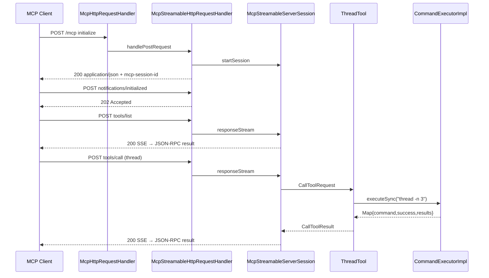
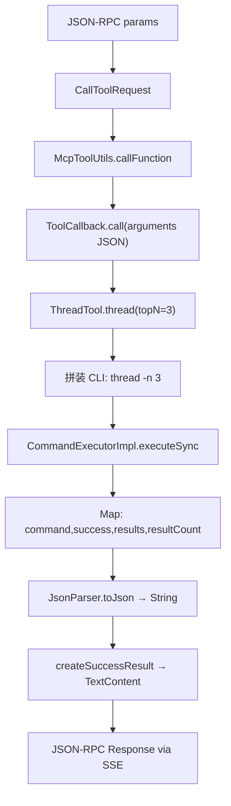

# Arthas MCP 客户端与服务端通信深度分析

> 基于 Arthas 4.2.2 源码与本机实测（`http://127.0.0.1:8563/mcp`）梳理  
> 生成日期：2026-05-27  
> 相关模块：`arthas-mcp-server`、`core/.../mcp/`  
> 姊妹文档：[ARTHAS_MCP_ANALYSIS_CN.md](Arthas%20MCP%20源码深度分析.md)、[ARTHAS_ARCHITECTURE_CN.md](Arthas%20项目架构与实现原理分析.md)

---

## 目录

1. [总体架构](#1-总体架构)
2. [传输协议：STREAMABLE（默认）](#2-传输协议streamable默认)
3. [完整握手流程（含真实 JSON）](#3-完整握手流程含真实-json)
4. [tools/list：工具元数据](#4-toolslist工具元数据)
5. [tools/call：核心数据变形](#5-toolscall核心数据变形)
6. [长任务工具（watch / trace 等）](#6-长任务工具watch--trace-等)
7. [STATELESS 模式对比](#7-stateless-模式对比)
8. [客户端实现参考](#8-客户端实现参考)
9. [抓包与调试建议](#9-抓包与调试建议)
10. [JSON 三层结构小结](#10-json-三层结构小结)
11. [关键源码索引](#11-关键源码索引)

---

## 1. 总体架构

Arthas **不内置 MCP 客户端**；客户端是 Cursor、Claude Desktop、Cherry Studio、官方 Java MCP SDK 等。**服务端**在 attach 后的目标 JVM 内，挂在 Arthas HTTP 端口（默认 **8563**）的 **`/mcp`** 路径上。

```
┌────────────────────────────────────────────────────────────────────┐
│  MCP Client（Cursor / Claude Desktop / mcp Java SDK 等）            │
│  JSON-RPC 2.0：initialize、tools/list、tools/call、tasks/*       │
└────────────────────────────┬───────────────────────────────────────┘
                             │ HTTP POST/GET/DELETE
                             │ 默认: http://host:8563/mcp
┌────────────────────────────▼───────────────────────────────────────┐
│  HttpRequestHandler → McpHttpRequestHandler（协议分发）              │
│  McpStreamableHttpRequestHandler / McpStatelessHttpRequestHandler  │
│  SSE (text/event-stream) 或 application/json                       │
└────────────────────────────┬───────────────────────────────────────┘
                             │ McpStreamableServerSession
┌────────────────────────────▼───────────────────────────────────────┐
│  McpNettyServer（JSON-RPC 方法路由）                                 │
│  tools/call → McpToolUtils → ToolCallback → AbstractArthasTool     │
└────────────────────────────┬───────────────────────────────────────┘
                             │ CommandExecutor
┌────────────────────────────▼───────────────────────────────────────┐
│  CommandExecutorImpl → JobController → Arthas 命令引擎              │
│  ResultModel 序列化 → JSON 字符串 → CallToolResult.content.text    │
└────────────────────────────────────────────────────────────────────┘
```

### 1.1 默认配置

来源：`core/src/main/java/arthas.properties`

| 配置项 | 默认值 | 说明 |
|--------|--------|------|
| `arthas.mcpEndpoint` | `/mcp` | MCP HTTP 路径 |
| `arthas.mcpProtocol` | `STREAMABLE` | 也支持 `STATELESS` |

启动日志示例（`ArthasBootstrap`）：

```text
as-server listening on network=...;telnet=3658;http=8563;...;mcp=/mcp;mcpProtocol=STREAMABLE;
```

### 1.2 通信时序（STREAMABLE）



---

## 2. 传输协议：STREAMABLE（默认）

所有 MCP 消息本质是 **JSON-RPC 2.0**，封装在 HTTP 请求体中。

### 2.1 公共 HTTP 约定

| 项 | 值 |
|----|-----|
| URL | `POST http://<host>:8563/mcp` |
| Request `Content-Type` | `application/json` |
| Request `Accept` | **必须同时包含** `text/event-stream` 和 `application/json` |
| 会话 Header | `mcp-session-id: <uuid>`（`initialize` 之后所有请求） |

### 2.2 JSON-RPC 消息类型识别

`McpSchema.deserializeJsonRpcMessage` 根据 JSON 结构判断消息类型：

| 结构特征 | 类型 |
|----------|------|
| 有 `method` 且有 `id` | `JSONRPCRequest` |
| 有 `method` 无 `id` | `JSONRPCNotification` |
| 有 `result` 或 `error` | `JSONRPCResponse` |

源码：`arthas-mcp-server/.../protocol/spec/McpSchema.java`

### 2.3 三种 HTTP 响应形态

| 场景 | HTTP 状态 | Content-Type | 说明 |
|------|-----------|--------------|------|
| `initialize` | 200 | `application/json` | 响应体直接是 JSON-RPC；响应头带 `mcp-session-id` |
| `notifications/initialized` | **202** | 空 body | 仅确认收到 |
| `tools/list`、`tools/call`、`ping` 等 | 200 | `text/event-stream` | **SSE 流**，每条消息一个 event |
| 协议/参数错误 | 4xx | `application/json` | `McpError` 对象（非 JSON-RPC 包装） |

### 2.4 SSE 帧格式

服务端 `NettyStreamableMcpSessionTransport.sendSseEvent` 输出：

```text
id: <sessionId>
event: message
data: {"jsonrpc":"2.0","id":3,"result":{...}}

```

- `event` 固定为 `message`（常量 `MESSAGE_EVENT_TYPE`）
- `data` 行内是**完整** JSON-RPC 消息（单行 JSON）
- 每个 `tools/call` 请求通常只收到 **一帧** SSE，然后连接关闭

### 2.5 GET：SSE 长连接（可选）

部分客户端在握手后会发：

```http
GET /mcp HTTP/1.1
Accept: text/event-stream
mcp-session-id: <sessionId>
```

用于接收服务端主动推送：

- `notifications/progress`（流式工具进度）
- `notifications/tasks/status`（任务状态变更）

**注意**：Arthas 当前 **不支持** `last-event-id` 断线重放；带该 Header 会返回 404，客户端需重新 `initialize`。

---

## 3. 完整握手流程（含真实 JSON）

以下 JSON 来自本机 attach 进程实测（`http://127.0.0.1:8563/mcp`）。

### 3.1 步骤 1：initialize

**客户端 → 服务端**

```http
POST /mcp HTTP/1.1
Content-Type: application/json
Accept: text/event-stream, application/json
```

```json
{
  "jsonrpc": "2.0",
  "id": 1,
  "method": "initialize",
  "params": {
    "protocolVersion": "2025-11-25",
    "capabilities": {},
    "clientInfo": {
      "name": "probe",
      "version": "1.0"
    }
  }
}
```

**服务端 → 客户端**

```http
HTTP/1.1 200 OK
Content-Type: application/json
mcp-session-id: c5679028-4b64-4c99-abb3-4fcadff2c8a7
Connection: close
```

```json
{
  "jsonrpc": "2.0",
  "id": 1,
  "result": {
    "protocolVersion": "2025-11-25",
    "capabilities": {
      "prompts": { "listChanged": true },
      "resources": { "subscribe": false, "listChanged": true },
      "tools": { "listChanged": true },
      "tasks": {
        "list": {},
        "cancel": {},
        "requests": { "tools": { "call": {} } }
      }
    },
    "serverInfo": {
      "name": "arthas-mcp-server",
      "version": "4.2.2"
    }
  }
}
```

说明：

- 协议版本协商在 `McpNettyServer.initializeRequestHandler`：客户端版本在支持列表内则原样返回，否则服务端回退到最高支持版本。
- `tasks` 能力表示支持 `watch`、`trace`、`tt` 等长任务工具。
- 此时尚未建立 SSE 长连接；仅在内存 `ConcurrentHashMap` 中创建 `McpStreamableServerSession`。

### 3.2 步骤 2：notifications/initialized

**客户端 → 服务端**

```http
POST /mcp HTTP/1.1
Content-Type: application/json
Accept: text/event-stream, application/json
mcp-session-id: c5679028-4b64-4c99-abb3-4fcadff2c8a7
```

```json
{
  "jsonrpc": "2.0",
  "method": "notifications/initialized",
  "params": {}
}
```

**服务端 → 客户端**

```http
HTTP/1.1 202 Accepted
Content-Length: 0
```

无响应 body。客户端必须保存 `mcp-session-id` 供后续所有请求使用。

### 3.3 步骤 3（可选）：DELETE 销毁会话

```http
DELETE /mcp HTTP/1.1
mcp-session-id: <sessionId>
```

成功返回 HTTP 200，服务端从 `sessions` Map 移除会话并清理 Arthas Command Session。

---

## 4. tools/list：工具元数据

### 4.1 请求

```json
{
  "jsonrpc": "2.0",
  "id": 2,
  "method": "tools/list",
  "params": {}
}
```

Header 必须带 `mcp-session-id`。

### 4.2 响应（SSE 单帧）

```text
id: c5679028-4b64-4c99-abb3-4fcadff2c8a7
event: message
data: {"jsonrpc":"2.0","id":2,"result":{"tools":[...]}}
```

`result.tools` 中单个工具示例（`thread`，本机实测）：

```json
{
  "name": "thread",
  "description": "Thread 诊断工具: 查看线程信息及堆栈，对应 Arthas 的 thread 命令。一次性输出结果。",
  "inputSchema": {
    "type": "object",
    "properties": {
      "threadId": {
        "description": "线程 ID",
        "type": "integer"
      },
      "topN": {
        "description": "最忙前 N 个线程并打印堆栈 (-n)",
        "type": "integer"
      },
      "blocking": {
        "description": "是否查找阻塞其他线程的线程 (-b)",
        "type": "boolean"
      },
      "all": {
        "description": "是否显示所有匹配线程 (--all)",
        "type": "boolean"
      }
    },
    "required": [],
    "additionalProperties": false
  },
  "execution": {
    "taskSupport": "forbidden"
  }
}
```

本机当前共 **30** 个工具。

### 4.3 taskSupport 字段含义

| 值 | 含义 | 示例工具 |
|----|------|----------|
| `forbidden` | 仅支持同步 `tools/call` | `thread`、`jvm`、`jad`、`memory` |
| `optional` | 可走 Task 长任务，也可服务端自动轮询 | `watch`、`trace`、`tt`、`monitor` |
| `required` | 请求必须带 `params.task` 元数据 | （若存在此类工具） |

`inputSchema` 由 `@Tool` / `@ToolParam` 注解扫描生成（`DefaultToolCallbackProvider`）。

---

## 5. tools/call：核心数据变形

以 `thread` 工具为例，展示 **三层 JSON 嵌套**。

### 5.1 处理链路



### 5.2 客户端请求

```json
{
  "jsonrpc": "2.0",
  "id": 3,
  "method": "tools/call",
  "params": {
    "name": "thread",
    "arguments": {
      "topN": 3
    }
  }
}
```

可选扩展字段（MCP 规范）：

```json
{
  "name": "watch",
  "arguments": {
    "classPattern": "demo.MathGame",
    "methodPattern": "primeFactors"
  },
  "_meta": {
    "progressToken": "pt-001"
  },
  "task": {
    "ttl": 1800000
  }
}
```

| 字段 | 作用 |
|------|------|
| `arguments` | 映射为 Arthas CLI 参数（`@ToolParam` 名 → 命令行 flag） |
| `_meta.progressToken` | 流式工具执行时推送 `notifications/progress` |
| `task.ttl` | 显式 Task 模式，立即返回 `CreateTaskResult` 而非最终结果 |

### 5.3 参数 → 命令行映射（ThreadTool 示例）

```java
// topN=3 → "thread -n 3"
StringBuilder cmd = buildCommand("thread");
if (topN != null && topN > 0) {
    cmd.append(" -n ").append(topN);
}
return executeSync(toolContext, cmd.toString());
```

源码：`core/.../mcp/tool/function/jvm300/ThreadTool.java`

### 5.4 CommandExecutorImpl 中间层 Map

`executeSync` 返回结构（在包装为 `CallToolResult` 之前）：

```json
{
  "command": "thread -n 3",
  "success": true,
  "sessionId": "0af7658c-4c9e-4860-b359-4a7150e1247a",
  "executionTime": 1780910986882,
  "resultCount": 2,
  "results": [
    {
      "type": "thread",
      "jobId": 0,
      "all": false,
      "busyThreads": [ "/* ThreadVO 列表 */" ]
    }
  ]
}
```

- `results[]` 元素为 Arthas `ResultModel` 序列化结果（与 WebConsole/Telnet 一致）
- MCP 工具方法返回类型为 `String`，即上述 Map 的 JSON 字符串

### 5.5 包装为 CallToolResult

`McpToolUtils.createSuccessResult` 将 JSON 字符串放入 MCP 标准结构：

```json
{
  "content": [
    {
      "type": "text",
      "text": "{\"command\":\"thread -n 3\",\"success\":true,...}"
    }
  ],
  "isError": false
}
```

注意：`text` 字段是 **字符串**，其内容是第二层 JSON，需要再次 `JSON.parse`。

### 5.6 服务端 SSE 完整响应（外层 JSON-RPC）

```text
id: c5679028-4b64-4c99-abb3-4fcadff2c8a7
event: message
data: {"jsonrpc":"2.0","id":3,"result":{"content":[{"type":"text","text":"{...}"}],"isError":false}}
```

解析 `data` 后：

```json
{
  "jsonrpc": "2.0",
  "id": 3,
  "result": {
    "content": [
      {
        "type": "text",
        "text": "{\"command\":\"thread -n 3\",\"success\":true,\"sessionId\":\"...\",\"executionTime\":1780910986882,\"resultCount\":2,\"results\":[...]}"
      }
    ],
    "isError": false
  }
}
```

### 5.7 错误响应

**工具级错误**（仍走 `result`，`isError: true`）：

```json
{
  "jsonrpc": "2.0",
  "id": 3,
  "result": {
    "content": [
      {
        "type": "text",
        "text": "Error executing tool: Required parameter 'classPattern' is missing"
      }
    ],
    "isError": true
  }
}
```

**协议级错误**（走 JSON-RPC `error` 字段）：

```json
{
  "jsonrpc": "2.0",
  "id": 3,
  "error": {
    "code": -32602,
    "message": "Unknown tool: foo",
    "data": "Tool not found: foo"
  }
}
```

常见错误码（`McpSchema.ErrorCodes`）：

| code | 含义 |
|------|------|
| -32700 | Parse error |
| -32600 | Invalid request |
| -32601 | Method not found |
| -32602 | Invalid params |
| -32603 | Internal error |

---

## 6. 长任务工具（watch / trace 等）

`taskSupport=optional` 的工具有两种客户端用法。

### 6.1 简单用法：普通 tools/call（服务端自动轮询）

客户端 JSON 与普通工具完全相同：

```json
{
  "jsonrpc": "2.0",
  "id": 4,
  "method": "tools/call",
  "params": {
    "name": "watch",
    "arguments": {
      "classPattern": "demo.MathGame",
      "methodPattern": "primeFactors",
      "timeout": 30
    }
  }
}
```

服务端内部流程（对客户端透明）：

1. `ServerTaskToolHandler.handleAutomaticTaskPolling` 自动 `createTask`
2. `ToolCallbackCreateTaskHandler` 在 `mcp-task-*` 线程池异步执行
3. `StreamableToolUtils.executeAndCollectResults` 轮询 Arthas 异步结果
4. 任务到达终态后，仍返回 **单个** `CallToolResult`

`content[0].text` 内典型结构：

```json
{
  "status": "completed",
  "message": "Command execution completed successfully",
  "resultCount": 5,
  "results": [ "/* watch 每次采样的 ResultModel */" ],
  "timedOut": false
}
```

超时场景：

```json
{
  "status": "completed",
  "message": "Command execution ended (Timed out). Captured 3 results.",
  "resultCount": 3,
  "results": [ "..." ],
  "timedOut": true
}
```

### 6.2 显式 Task 模式：带 task 元数据

**请求：**

```json
{
  "jsonrpc": "2.0",
  "id": 5,
  "method": "tools/call",
  "params": {
    "name": "watch",
    "arguments": {
      "classPattern": "demo.MathGame",
      "methodPattern": "primeFactors",
      "timeout": 30
    },
    "task": {
      "ttl": 1800000
    }
  }
}
```

**立即响应（CreateTaskResult，非最终结果）：**

```json
{
  "jsonrpc": "2.0",
  "id": 5,
  "result": {
    "task": {
      "taskId": "a1b2c3d4-e5f6-7890-abcd-ef1234567890",
      "status": "working",
      "statusMessage": "Task created",
      "createdAt": "2026-05-27T10:00:00.000Z",
      "lastUpdatedAt": "2026-05-27T10:00:00.000Z",
      "ttl": 1800000,
      "pollInterval": 1000
    }
  }
}
```

**后续轮询 tasks/get：**

```json
{
  "jsonrpc": "2.0",
  "id": 6,
  "method": "tasks/get",
  "params": {
    "taskId": "a1b2c3d4-e5f6-7890-abcd-ef1234567890"
  }
}
```

```json
{
  "jsonrpc": "2.0",
  "id": 6,
  "result": {
    "taskId": "a1b2c3d4-e5f6-7890-abcd-ef1234567890",
    "status": "working",
    "statusMessage": "Executing tool",
    "createdAt": "2026-05-27T10:00:00.000Z",
    "lastUpdatedAt": "2026-05-27T10:00:05.000Z",
    "pollInterval": 1000
  }
}
```

**获取最终结果 tasks/result：**

```json
{
  "jsonrpc": "2.0",
  "id": 7,
  "method": "tasks/result",
  "params": {
    "taskId": "a1b2c3d4-e5f6-7890-abcd-ef1234567890"
  }
}
```

```json
{
  "jsonrpc": "2.0",
  "id": 7,
  "result": {
    "content": [
      {
        "type": "text",
        "text": "{\"status\":\"completed\",\"message\":\"...\",\"results\":[...]}"
      }
    ],
    "isError": false,
    "_meta": {
      "io.modelcontextprotocol/related-task": {
        "taskId": "a1b2c3d4-e5f6-7890-abcd-ef1234567890"
      }
    }
  }
}
```

任务状态枚举（`McpSchema.TaskStatus`）：

| status | 含义 | 是否终态 |
|--------|------|----------|
| `working` | 执行中 | 否 |
| `input_required` | 需要交互输入 | 否 |
| `completed` | 成功完成 | 是 |
| `failed` | 执行失败 | 是 |
| `cancelled` | 已取消 | 是 |

### 6.3 进度通知（progressToken）

请求带 `_meta.progressToken` 时，服务端在轮询 Arthas 结果期间经 **GET SSE 通道** 推送：

```json
{
  "jsonrpc": "2.0",
  "method": "notifications/progress",
  "params": {
    "progressToken": "pt-001",
    "progress": 3,
    "total": 10.0
  }
}
```

推送逻辑：`StreamableToolUtils.sendProgressNotification` → `McpNettyServerExchange.progressNotification`。

### 6.4 任务状态变更通知

```json
{
  "jsonrpc": "2.0",
  "method": "notifications/tasks/status",
  "params": {
    "taskId": "a1b2c3d4-...",
    "status": "completed",
    "statusMessage": "Task completed successfully",
    "createdAt": "2026-05-27T10:00:00.000Z",
    "lastUpdatedAt": "2026-05-27T10:00:30.000Z",
    "pollInterval": 1000
  }
}
```

---

## 7. STATELESS 模式对比

配置 `arthas.mcpProtocol=STATELESS` 时行为差异：

| 对比项 | STREAMABLE（默认） | STATELESS |
|--------|-------------------|-----------|
| Session | 有 `mcp-session-id` | 无 |
| 握手 | initialize + initialized | 每次请求独立，无握手 |
| 响应载体 | 多数走 SSE | **全部** `application/json` 同步返回 |
| Task 支持 | 支持 | **不支持**（所有工具当普通工具注册） |
| GET SSE | 支持 | 不支持 |
| 适用场景 | Cursor 等现代 MCP 客户端 | 简单 HTTP 探活、一次性调用 |

Stateless 下 `tools/call` 响应示例（无 SSE 包装）：

```http
HTTP/1.1 200 OK
Content-Type: application/json
```

```json
{
  "jsonrpc": "2.0",
  "id": 1,
  "result": {
    "content": [
      {
        "type": "text",
        "text": "{\"command\":\"jvm\",\"success\":true,...}"
      }
    ],
    "isError": false
  }
}
```

源码：`McpStatelessHttpRequestHandler.handlePostRequest` — 所有 JSON-RPC Request 均同步返回 `application/json`。

---

## 8. 客户端实现参考

Arthas 集成测试 `ArthasMcpToolsIT.StreamableMcpHttpClient` 是最小可用客户端实现，完整复现上述流程。

核心步骤：

```java
// 1. initialize → 保存 mcp-session-id
HttpURLConnection conn = openPostConnection(null);
writeJson(conn, initializeRequest);
String sessionId = conn.getHeaderField("mcp-session-id");
JSONRPCResponse initResp = deserialize(readBody(conn));

// 2. notifications/initialized
writeJson(conn, initializedNotification);  // 期望 HTTP 202

// 3. tools/list / tools/call → 解析 SSE
conn.setRequestProperty("mcp-session-id", sessionId);
writeJson(conn, toolsCallRequest);
// Content-Type: text/event-stream
JSONRPCResponse resp = readJsonRpcResponseFromSse(inputStream, requestId);

// 4. 提取结果
CallToolResult result = objectMapper.convertValue(resp.getResult(), CallToolResult.class);
String arthasJson = result.getContent().get(0).getText();  // 第二层 JSON
```

SSE 解析逻辑（按空行分帧，取 `data:` 行）：

```java
while ((line = reader.readLine()) != null) {
    if (line.startsWith("data:")) {
        data = line.substring("data:".length()).trim();
    }
    if (line.isEmpty() && data != null) {
        JSONRPCResponse resp = deserialize(data);
        if (Objects.equals(resp.getId(), expectedId)) {
            return resp;
        }
    }
}
```

本仓库探测脚本：`.codex/mcp_comm_probe.py`（可对运行中的 Arthas 实例快速验证 JSON）。

---

## 9. 抓包与调试建议

### 9.1 日志

将 `com.taobao.arthas.mcp` 包日志级别设为 DEBUG，可看到：

- `McpSchema.deserializeJsonRpcMessage`：收到的原始 JSON
- `NettyStreamableMcpSessionTransport`：发出的 SSE 消息（截断至 200 字符）

### 9.2 IDEA 断点推荐

| 阶段 | 类 / 方法 |
|------|-----------|
| HTTP 入口 | `McpStreamableHttpRequestHandler.handlePostRequest` |
| JSON 反序列化 | `McpSchema.deserializeJsonRpcMessage` |
| RPC 分发 | `McpStreamableServerSession.responseStream` |
| tools/call 路由 | `McpNettyServer.toolsCallRequestHandler` |
| 工具桥接 | `McpToolUtils.toToolSpecification` → `callFunction` |
| 命令执行 | `CommandExecutorImpl.executeSync` |
| 结果包装 | `McpToolUtils.createSuccessResult` |
| SSE 发送 | `NettyStreamableMcpSessionTransport.sendSseEvent` |

### 9.3 curl 注意点

- Windows PowerShell 的 `curl` 是别名，建议用 Python / `curl.exe`
- `Accept` 必须同时包含 `text/event-stream` 和 `application/json`
- `initialize` 后必须带 `mcp-session-id` Header

### 9.4 认证

若 Arthas 配置了 HTTP 认证（`BasicHttpAuthenticatorHandler`），MCP 请求需带 `Authorization: Basic ...`；JSON 结构不变，认证主体通过 `McpAuthExtractor` 注入 `transportContext`，最终写入 Arthas Session 的 `SUBJECT_KEY`。

---

## 10. JSON 三层结构小结

```text
┌─────────────────────────────────────────────────────────────┐
│ 第 1 层：HTTP + SSE 传输帧                                   │
│   event: message                                            │
│   data: { JSON-RPC Response }                               │
├─────────────────────────────────────────────────────────────┤
│ 第 2 层：MCP 标准结果 (CallToolResult)                       │
│   result.content[0].type = "text"                           │
│   result.content[0].text   = "<字符串>"                      │
│   result.isError           = false | true                   │
├─────────────────────────────────────────────────────────────┤
│ 第 3 层：Arthas 命令执行结果（text 内 JSON.parse）            │
│   { command, success, sessionId, executionTime,             │
│     resultCount, results: [ ResultModel... ] }              │
└─────────────────────────────────────────────────────────────┘
```

**客户端（Cursor 等）通常只解析第 1、2 层，将 `text` 整段交给 LLM；诊断细节在第 3 层。**

设计原则：

- MCP 协议层完全复用 `arthas-mcp-server`（JSON-RPC、SSE、Task）
- 业务层只需写 `@Tool` 方法，把 Arthas CLI 输出序列化为 JSON 字符串
- 塞进 `TextContent.text`，无需为 MCP 重写诊断逻辑

---

## 11. 关键源码索引

| 主题 | 路径 |
|------|------|
| MCP Schema / 方法名 / 数据结构 | `arthas-mcp-server/.../protocol/spec/McpSchema.java` |
| HTTP Header 常量 | `arthas-mcp-server/.../protocol/spec/HttpHeaders.java` |
| 协议版本 | `arthas-mcp-server/.../protocol/spec/ProtocolVersions.java` |
| HTTP 协议分发 | `arthas-mcp-server/.../handler/McpHttpRequestHandler.java` |
| STREAMABLE 传输 | `arthas-mcp-server/.../handler/McpStreamableHttpRequestHandler.java` |
| STATELESS 传输 | `arthas-mcp-server/.../handler/McpStatelessHttpRequestHandler.java` |
| 会话与 RPC 处理 | `arthas-mcp-server/.../spec/McpStreamableServerSession.java` |
| JSON-RPC 方法注册 | `arthas-mcp-server/.../server/McpNettyServer.java` |
| 工具桥接 | `core/.../mcp/tool/util/McpToolUtils.java` |
| 命令执行 | `core/.../command/CommandExecutorImpl.java` |
| 流式工具轮询 | `core/.../mcp/tool/function/StreamableToolUtils.java` |
| 任务处理 | `arthas-mcp-server/.../task/ServerTaskToolHandler.java` |
| MCP 服务启动 | `core/.../mcp/ArthasMcpServer.java` |
| 集成测试客户端 | `arthas-mcp-integration-test/.../ArthasMcpToolsIT.java` |
| 本机探测脚本 | `.codex/mcp_comm_probe.py` |

---

## 附录 A：支持的 JSON-RPC 方法一览

| method | 方向 | 说明 |
|--------|------|------|
| `initialize` | C→S | 握手，返回 capabilities + session |
| `notifications/initialized` | C→S | 握手完成通知 |
| `ping` | C→S | 心跳，返回 `{}` |
| `tools/list` | C→S | 列出所有 Tool 及 inputSchema |
| `tools/call` | C→S | 调用 Tool |
| `tasks/list` | C→S | 列出任务 |
| `tasks/get` | C→S | 查询任务状态 |
| `tasks/result` | C→S | 获取任务最终结果 |
| `tasks/cancel` | C→S | 取消任务 |
| `notifications/progress` | S→C | 流式工具进度 |
| `notifications/tasks/status` | S→C | 任务状态变更 |
| `notifications/tools/list_changed` | S→C | 工具列表变更（若启用） |

---

## 附录 B：本机实测记录摘要

环境：Windows 10，Arthas attach 至 `com.kyexpress.App`，HTTP 8563。

| 操作 | HTTP 状态 | 关键结果 |
|------|-----------|----------|
| initialize | 200 | `protocolVersion: 2025-11-25`，`tasks` 能力已启用 |
| notifications/initialized | 202 | 空 body |
| tools/list | 200 SSE | 30 个工具 |
| tools/call thread `{topN:3}` | 200 SSE | `command: "thread -n 3"`，`resultCount: 2` |

---

*文档维护：随 Arthas 版本升级时，注意核对 `pom.xml` 中 `${revision}` 与 `serverInfo.version` 字段。*
