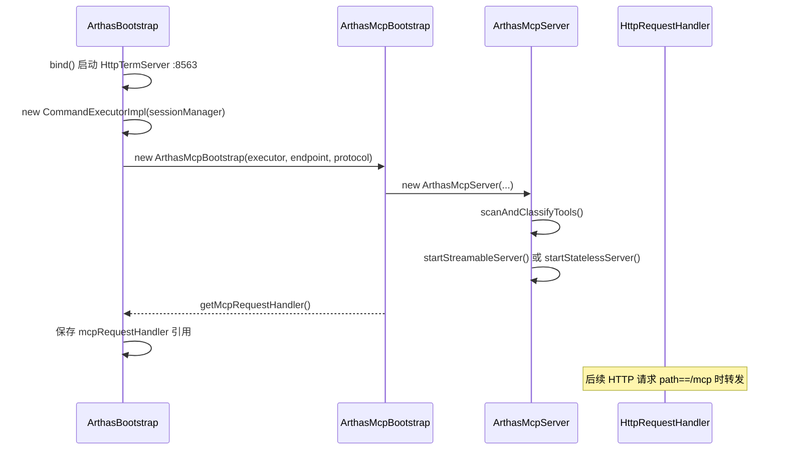
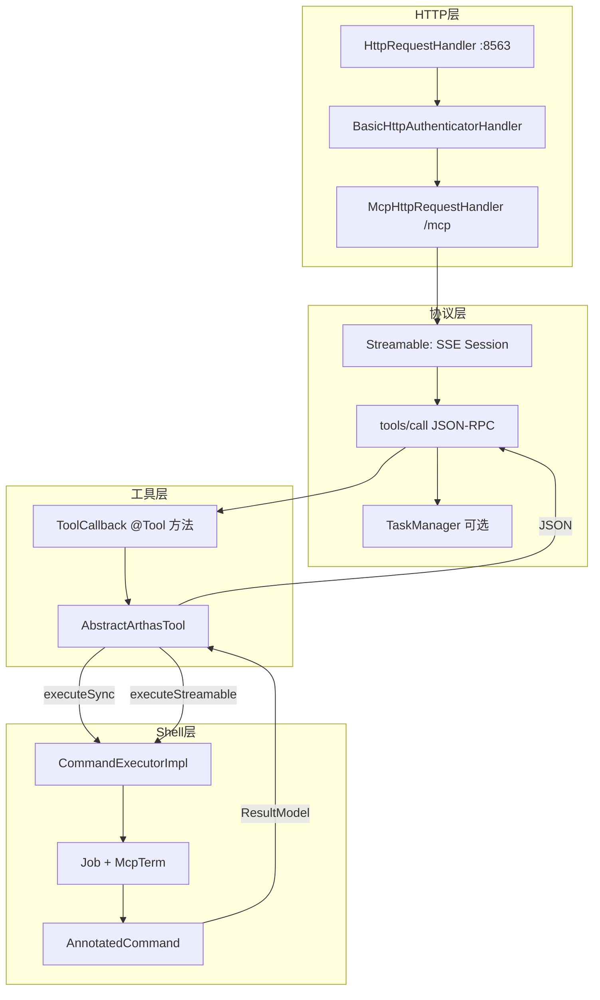

# Arthas MCP 源码深度分析

> 基于 Arthas 4.2.0 源码梳理，生成日期：2026-05-27  
> 相关模块：`arthas-mcp-server`、`core/.../mcp/`  
> 官方文档：[mcp-server.md](site/docs/doc/mcp-server.md)

---

## 目录

1. [定位与整体架构](#1-定位与整体架构)
2. [模块划分与依赖](#2-模块划分与依赖)
3. [启动与 HTTP 接入链路](#3-启动与-http-接入链路)
4. [传输协议：STREAMABLE vs STATELESS](#4-传输协议streamable-vs-stateless)
5. [工具注册与扫描机制](#5-工具注册与扫描机制)
6. [命令执行桥接层](#6-命令执行桥接层)
7. [同步工具 vs 流式工具](#7-同步工具-vs-流式工具)
8. [MCP Tasks 长任务机制](#8-mcp-tasks-长任务机制)
9. [会话与认证](#9-会话与认证)
10. [29 个诊断工具一览](#10-29-个诊断工具一览)
11. [序列化与结果处理](#11-序列化与结果处理)
12. [生命周期与资源回收](#12-生命周期与资源回收)
13. [设计亮点](#13-设计亮点)
14. [关键类索引](#14-关键类索引)
15. [扩展开发指南](#15-扩展开发指南)

---

## 1. 定位与整体架构

Arthas MCP Server 将 **Arthas 诊断命令** 以 [Model Context Protocol (MCP)](https://modelcontextprotocol.io/) 标准 **Tool** 形式暴露给 AI 客户端（Claude Desktop、Cherry Studio、Cline、Cursor 等）。其核心思路是：

> **MCP Tool 调用 → 拼装 Arthas 命令行 → 复用现有 Shell/Job 执行引擎 → 将 `ResultModel` 序列化为 JSON 返回**

并非为 MCP 重写诊断逻辑，而是在 Arthas 已有命令体系上增加 **协议适配层**。

### 1.1 架构分层

```
┌────────────────────────────────────────────────────────────────────┐
│  AI 客户端（MCP Client）                                            │
│  tools/call、tasks/create、SSE 订阅等 JSON-RPC 2.0 请求             │
└────────────────────────────┬───────────────────────────────────────┘
                             │ HTTP(S)  POST/GET/DELETE
                             │ 默认: http://host:8563/mcp
┌────────────────────────────▼───────────────────────────────────────┐
│  arthas-mcp-server（协议层）                                        │
│  McpHttpRequestHandler → Streamable/Stateless Handler              │
│  McpServer / McpNettyServer / TaskManager / ToolCallback           │
└────────────────────────────┬───────────────────────────────────────┘
                             │ CommandExecutor 接口
┌────────────────────────────▼───────────────────────────────────────┐
│  core（桥接层）                                                     │
│  CommandExecutorImpl → JobController → AnnotatedCommand            │
│  ArthasMcpServer / AbstractArthasTool / *Tool.java                 │
└────────────────────────────┬───────────────────────────────────────┘
                             │ 与 Telnet/WebConsole 共用
┌────────────────────────────▼───────────────────────────────────────┐
│  Arthas Shell 引擎（Instrumentation、Enhancer、ResultModel）        │
└────────────────────────────────────────────────────────────────────┘
```

### 1.2 两条核心设计原则

1. **命令即工具**：每个 MCP Tool 本质是对一条（或一组）Arthas CLI 命令的薄封装。  
2. **执行引擎复用**：MCP 不走独立执行路径，而是通过 `CommandExecutorImpl` 创建 `Job`，与 Telnet 用户敲命令走同一套 `ProcessImpl`。

---

## 2. 模块划分与依赖

| 模块/包 | 职责 |
|---------|------|
| **`arthas-mcp-server`** | 通用 MCP 协议实现：JSON-RPC、SSE Streamable 传输、Task 管理、Tool 注解扫描、`@Tool`/`@ToolParam` |
| **`core/.../mcp/`** | Arthas 侧集成：`ArthasMcpBootstrap`、`ArthasMcpServer`、29 个 `*Tool`、认证提取、JSON 过滤器 |
| **`core/.../command/CommandExecutorImpl`** | `CommandExecutor` 接口实现，连接 MCP 与 Shell |
| **`arthas-mcp-integration-test`** | 集成测试（依赖官方 `mcp` Java SDK） |

**依赖关系：**

```
arthas-core  →  arthas-mcp-server  →  netty + jackson + fastjson2 + arthas-model
```

`arthas-mcp-server` **不依赖** `arthas-core`，保持协议层可独立演进；Arthas 特有逻辑全部在 `core/mcp` 中。

---

## 3. 启动与 HTTP 接入链路

### 3.1 配置项

`arthas.properties` 默认：

```properties
arthas.mcpEndpoint=/mcp
arthas.mcpProtocol=STREAMABLE
```

对应 `Configure.mcpEndpoint` / `Configure.mcpProtocol`。`mcpEndpoint` 为空则不启动 MCP。

### 3.2 启动时序



关键代码（`ArthasBootstrap.bind()`）：

```java
if (mcpEndpoint != null && !mcpEndpoint.trim().isEmpty()) {
    CommandExecutor commandExecutor = new CommandExecutorImpl(sessionManager);
    this.arthasMcpBootstrap = new ArthasMcpBootstrap(commandExecutor, mcpEndpoint, mcpProtocol);
    this.mcpRequestHandler = this.arthasMcpBootstrap.start().getMcpRequestHandler();
}
```

### 3.3 HTTP 路由挂载

MCP **不单独开端口**，复用 Arthas HTTP 端口（默认 **8563**）。`HttpRequestHandler` 在解析 URI 后判断：

```java
// core/.../HttpRequestHandler.java
if (mcpRequestHandler != null) {
    String mcpEndpoint = mcpRequestHandler.getMcpEndpoint();
    if (mcpEndpoint.equals(path)) {
        mcpRequestHandler.handle(ctx, request);
        return;
    }
}
```

认证在 `BasicHttpAuthenticatorHandler` 中：`isMcpRequest()` 识别 `/mcp` 路径，支持 **Bearer Token** 与 **Basic Auth**，认证主体写入 Netty Channel 的 `AttributeKey`，供后续 MCP 请求提取。

---

## 4. 传输协议：STREAMABLE vs STATELESS

`ArthasMcpServer` 支持两种 `ServerProtocol`（配置 `arthas.mcpProtocol`）：

| 模式 | 传输实现 | 会话 | Task 支持 | 典型场景 |
|------|----------|------|-----------|----------|
| **STREAMABLE**（默认） | `NettyStreamableServerTransportProvider` + **SSE** | 有 `mcp-session-id` | 支持 | 长连接、进度通知、watch/trace 等 |
| **STATELESS** | `NettyStatelessServerTransport` | 无状态 | **不支持** | 简单请求-响应 |

### 4.1 STREAMABLE 模式

- `McpStreamableHttpRequestHandler` 管理 `ConcurrentHashMap<String, McpStreamableServerSession>`。  
- 支持 **Server-Sent Events**（`text/event-stream`），事件类型 `message` 承载 JSON-RPC。  
- `KeepAliveScheduler` 默认 **15 秒** ping（`DEFAULT_KEEP_ALIVE_INTERVAL`），维持会话存活。  
- 请求经 `McpTransportContextExtractor` 提取认证上下文，注入 `ToolContext`。

### 4.2 STATELESS 模式

- 每次 `tools/call` 独立处理，无 SSE 长连接。  
- `ArthasMcpServer.startStatelessServer()` 将 **全部工具**（含 taskSupport=OPTIONAL 的）都注册为普通工具，**不启用 Task 能力**。  
- 适合轻量集成，但不适合 `watch`/`trace` 等需持续拉取结果的命令。

### 4.3 统一入口分发

`McpHttpRequestHandler` 根据 `protocol` 字段路由：

```java
if (protocol == ServerProtocol.STREAMABLE) {
    streamableHandler.handle(ctx, request);
} else {
    statelessHandler.handle(ctx, request);
}
```

关闭时 `isClosing` 置位，新请求返回 `503 Service Unavailable`。

---

## 5. 工具注册与扫描机制

### 5.1 扫描包路径

```java
// ArthasMcpServer.java
public static final String ARTHAS_TOOL_BASE_PACKAGE = "com.taobao.arthas.core.mcp.tool.function";
```

`DefaultToolCallbackProvider` 递归扫描该包下所有 `.class`，查找带 `@Tool` 注解的 **方法**（支持静态方法或实例方法）。

### 5.2 @Tool 注解语义

```java
@Tool(
    name = "watch",
    description = "...",
    streamable = true,                              // 是否走流式执行路径（实现层约定）
    taskSupport = TaskSupportMode.OPTIONAL          // MCP Tasks 支持级别
)
public String watch(..., ToolContext toolContext) { ... }
```

| `taskSupport` | 含义 | 注册方式 |
|---------------|------|----------|
| `FORBIDDEN`（默认） | 普通同步工具 | `serverSpec.tools(...)` |
| `OPTIONAL` | 可直接调用，也可走 Task | `serverSpec.taskTool(...)` |
| `REQUIRED` | 必须以 Task 模式调用 | `serverSpec.taskTool(...)` |

`ArthasMcpServer.scanAndClassifyTools()` 按 `taskSupport` 分为三类列表，分别注册。

### 5.3 ToolDefinition 与 JSON Schema

`ToolDefinitions.from(method)` 根据 `@ToolParam` 注解生成 **input JSON Schema**（供 MCP Client 展示参数表单）。`ToolCallback.call(argumentsJson, toolContext)` 将 JSON 反序列化为方法参数。

### 5.4 适配为 MCP ToolSpecification

`McpToolUtils.toToolSpecification()` 将 `ToolCallback` 包装为：

```java
McpServerFeatures.ToolCallFunction callFunction = (exchange, commandContext, request) -> {
    ToolContext toolContext = new ToolContext(Map.of(
        EXCHANGE, exchange,
        COMMAND_CONTEXT, commandContext,
        PROGRESS_TOKEN, request.progressToken(),
        MCP_TRANSPORT_CONTEXT, exchange.getTransportContext()
    ));
    String result = toolCallback.call(requestJson, toolContext);
    return CompletableFuture.completedFuture(createSuccessResult(result));
};
```

**关键点**：每个 Tool 调用都会收到 `ArthasCommandContext`（绑定 MCP Session 与 Arthas Session）和可选的 `McpNettyServerExchange`（用于 SSE 进度推送）。

---

## 6. 命令执行桥接层

### 6.1 CommandExecutor 接口

`arthas-mcp-server` 定义抽象接口，`CommandExecutorImpl` 在 core 中实现：

| 方法 | 用途 |
|------|------|
| `executeSync` | 阻塞执行至 Job 结束，收集全部 `ResultModel` |
| `executeAsync` | 启动后台 Job，立即返回 jobId |
| `pullResults` | 从 `SharingResultDistributor` 拉取增量结果 |
| `interruptJob` | Ctrl+C 等价操作 |
| `createSession` / `closeSession` | MCP↔Arthas Session 生命周期 |

### 6.2 同步执行路径

```java
// CommandExecutorImpl.executeSync()
session = getCurrentSession(sessionId, true);  // null 则创建 one-time session
PackingResultDistributorImpl resultDistributor = new PackingResultDistributorImpl(session);
Job job = createJob(commandLine, session, resultDistributor);
job.run();
waitForJob(job, timeout);  // 轮询 status 直至 TERMINATED/STOPPED
return { success, sessionId, results: List<ResultModel> };
// finally: 销毁 one-time session
```

**One-time Session**：`sessionId` 为空时创建临时 Session，执行完自动 `removeSession`，适合 `jvm`、`thread` 等一次性查询。

### 6.3 异步执行路径

```java
// CommandExecutorImpl.executeAsync()
session.tryLock();  // 同 Shell 增强命令互斥
Job job = createJob(commandLine, session, session.getResultDistributor());
session.setForegroundJob(job);
job.run();
return { success, jobId, jobStatus };
```

异步命令使用 Session 上持久的 `SharingResultDistributorImpl`，MCP 侧通过 `pullResults` 轮询。

### 6.4 McpTerm：无终端的命令执行

MCP 命令不连接真实 TTY，`createJob` 时注入 **`McpTerm`**（`type()="mcp"`，`width=1000`，`height=200`）：

- `write`/`echo` 为空操作（输出走 `ResultDistributor` 而非 TTY）。  
- `readline` 不阻塞（MCP 不支持交互式输入，除 `createSession` 后的 API 拉取模式）。

这使 **同一套 `ProcessImpl` 无需为 MCP 分叉**。

### 6.5 ArthasCommandSessionManager：双层 Session 映射

```
MCP Session ID  ──映射──►  Arthas Session ID + Consumer ID
```

| 映射表 | 用途 |
|--------|------|
| `sessionBindings` | 普通 MCP 连接，key = `mcp-session-id` |
| `taskSessionBindings` | Task 隔离 Session，key = `taskId`，上限 `DEFAULT_MAX_CONCURRENT_TASK_SESSIONS` |

**过期策略**：25 分钟无访问（`SESSION_EXPIRY_THRESHOLD_MS`）主动重建 Arthas Session，避免绑定已失效的 Shell 会话。

`ArthasCommandContext` 封装对 `CommandExecutor` 的调用，是 Tool 层直接使用的门面。

---

## 7. 同步工具 vs 流式工具

### 7.1 分类标准

| 类型 | 实现方法 | 典型工具 | 执行模式 |
|------|----------|----------|----------|
| **同步** | `AbstractArthasTool.executeSync()` | `jvm`、`thread`、`sc`、`jad`、`ognl` 等 | `executeSync` 一次返回 |
| **流式** | `AbstractArthasTool.executeStreamable()` | `watch`、`trace`、`monitor`、`dashboard`、`stack`、`tt` | `executeAsync` + 轮询 `pullResults` |

`@Tool(streamable = true)` 是文档/约定标记；实际分支由 Tool 方法内调用 `executeSync` 还是 `executeStreamable` 决定。

### 7.2 流式执行详解（StreamableToolUtils）

```
1. setSessionAuth / setSessionUserId（传递 MCP 认证到 Arthas Session）
2. executeAsyncWithRetry(command)     // 若 "Another job is running" 则 interrupt + 重试
3. executeAndCollectResults() 循环:
   ├─ cancellationChecker（Task 取消检测）
   ├─ pullResults() 每 100ms（可配置）
   ├─ 过滤 InputStatusModel / MessageModel 等非业务结果
   ├─ 检测 jobStatus == TERMINATED
   ├─ 检测 InputStatus == ALLOW_INPUT 出现 ≥2 次（命令完成信号）
   └─ sendProgressNotification() 通过 SSE 推送进度（有 progressToken 时）
4. finally: interruptJob() 释放前台 Job
```

**完成判定逻辑**（`StreamableToolUtils`）：

- `jobStatus` 为 `TERMINATED`；或  
- `allowInputCount >= MIN_ALLOW_INPUT_COUNT_TO_COMPLETE (2)`；或  
- 收集的结果数 `>= expectedResultCount`（如 `watch -n 3` 则 expected=3）。

### 7.3 WatchTool 示例：参数到命令行的映射

```java
// 拼装: watch --timeout 30 -n 1 -m 50 -x 1 -f 'com.demo.Demo' 'method' '{params}' 'condition'
return executeStreamable(toolContext, cmd.toString(), execCount, 50, timeoutSeconds * 1000, "...");
```

- `addParameter` 对字符串参数做 **单引号转义**（`'` → `'\''`），防止命令注入。  
- `-f` 默认观察方法 **结束** 时输出（未指定 -b/-e/-s 时）。

### 7.4 DashboardTool：动态超时计算

```java
int calculatedTimeoutMs = execCount * interval + 5000;
return executeStreamable(..., execCount, interval / 10, calculatedTimeoutMs, ...);
```

轮询间隔取刷新间隔的 1/10，超时 = 次数 × 间隔 + 5s 缓冲。

---

## 8. MCP Tasks 长任务机制

针对 `watch`、`trace`、`monitor` 等可能 **长时间运行** 的工具，Arthas 实现 MCP **Tasks** 规范（2025-11-25），避免 HTTP 请求阻塞。

### 8.1 组件

| 组件 | 实现 | 职责 |
|------|------|------|
| `InMemoryTaskStore` | 内存 | 任务状态、TTL 默认 30 分钟 |
| `InMemoryTaskMessageQueue` | 内存 | 任务消息队列 |
| `TaskManager` | 协议层 | `tasks/list`、`tasks/cancel`、`tools/call` 任务增强 |
| `ToolCallbackCreateTaskHandler` | 适配器 | 将 `ToolCallback` 包装为 `CreateTaskHandler` |
| `taskExecutor` | 固定大小线程池 | `SynchronousQueue` + `AbortPolicy`，大小 = maxConcurrentTaskSessions |

### 8.2 Task 创建流程

```
Client: tools/call (task mode) 或 tasks/create
  → ToolCallbackCreateTaskHandler.createTask()
      ├─ 前置检查 isAtConcurrencyLimit()，超限立即拒绝（避免孤儿 Task）
      ├─ context.createTask() 生成 taskId
      └─ taskExecutor.runAsync(() -> executeToolAndUpdateTaskStatus())
            ├─ createIsolatedTaskSession(taskId)  // 独立 Arthas Session
            ├─ 执行 ToolCallback（同普通调用）
            ├─ context.updateTaskStatus / failTask
            └─ closeTaskSession(taskId)
```

### 8.3 取消支持

`AbstractArthasTool.buildCancellationChecker()` 从 `ToolContext` 取 `CREATE_TASK_CONTEXT` + `TASK_ID`，轮询 `taskContext.isCancellationRequested(taskId)`；检测到取消后 `StreamableToolUtils` 返回 `{ cancelled: true }` 并停止拉取。

### 8.4 并发控制

- `ArthasCommandSessionManager.maxConcurrentTaskSessions`（默认见 `TaskDefaults`）。  
- 线程池 **core = max = maxSessions**，`SynchronousQueue` 无排队，超限直接 `RejectedExecutionException`。  
- 与 Shell `session.tryLock()` 配合，避免同一 Arthas Session 上多个增强命令冲突。

---

## 9. 会话与认证

### 9.1 认证链路

```
HTTP Authorization: Bearer <token>  或  Basic <user:pass>
  → BasicHttpAuthenticatorHandler.extractMcpAuthSubject()
  → ctx.channel().attr(SUBJECT_ATTRIBUTE_KEY) = Principal
  → McpStreamableHttpRequestHandler 提取为 McpTransportContext
  → ToolExecutionContext.authSubject
  → CommandExecutorImpl: session.put(SUBJECT_KEY, authSubject)
  → Arthas auth 命令体系认可的主体
```

### 9.2 UserId 统计

HTTP Header `X-User-Id` → `McpAuthExtractor.MCP_USER_ID_KEY` → `session.setUserId()` → 对接 `UserStatUtil` 上报。

### 9.3 MCP Session 与 Arthas Session 关系

| 概念 | 生命周期 | 说明 |
|------|----------|------|
| MCP Session | SSE 连接存续期间 | `mcp-session-id` Header |
| Arthas Session | `createSession` 到 `closeSession` | 含 `consumerId` 用于 `pullResults` |
| One-time Session | 单次 `executeSync` | 无 sessionId 时自动创建/销毁 |
| Task Session | 单个 MCP Task | 隔离执行，防止与普通 MCP 会话互相干扰 |

---

## 10. 29 个诊断工具一览

工具类位于 `core/mcp/tool/function/`，按子包分类：

### 10.1 basic1000（3 个）

| Tool | 类 | 执行方式 |
|------|-----|----------|
| `options` | `OptionsTool` | sync |
| `viewfile` | `ViewFileTool` | sync（目录白名单） |
| `stop` | `StopTool` | sync |

### 10.2 klass100（8 个）

| Tool | 类 | 执行方式 |
|------|-----|----------|
| `sc` | `SearchClassTool` | sync |
| `sm` | `SearchMethodTool` | sync |
| `jad` | `JadTool` | sync |
| `classloader` | `ClassLoaderTool` | sync |
| `mc` | `MemoryCompilerTool` | sync |
| `redefine` | `RedefineTool` | sync |
| `retransform` | `RetransformTool` | sync |
| `dump` | `DumpClassTool` | sync |

### 10.3 jvm300（13 个）

| Tool | 类 | 执行方式 |
|------|-----|----------|
| `jvm` | `JvmTool` | sync |
| `memory` | `MemoryTool` | sync |
| `thread` | `ThreadTool` | sync |
| `dashboard` | `DashboardTool` | **streamable** |
| `sysprop` | `SysPropTool` | sync |
| `sysenv` | `SysEnvTool` | sync |
| `vmoption` | `VMOptionTool` | sync |
| `perfcounter` | `PerfCounterTool` | sync |
| `mbean` | `MBeanTool` | sync（监控模式参数预留） |
| `heapdump` | `HeapdumpTool` | sync |
| `vmtool` | `VMToolTool` | sync |
| `getstatic` | `GetStaticTool` | sync |
| `ognl` | `OgnlTool` | sync |

### 10.4 monitor200（7 个）

| Tool | 类 | 执行方式 | taskSupport |
|------|-----|----------|-------------|
| `watch` | `WatchTool` | streamable | OPTIONAL |
| `trace` | `TraceTool` | streamable | OPTIONAL |
| `monitor` | `MonitorTool` | streamable | OPTIONAL |
| `stack` | `StackTool` | streamable | OPTIONAL |
| `tt` | `TimeTunnelTool` | streamable | OPTIONAL |
| `profiler` | `ProfilerTool` | sync（多 action 子命令） | FORBIDDEN |

> 注：官方文档写 29 个工具；`stop` 通常不在 AI 场景默认暴露，但代码中存在 `StopTool`。

---

## 11. 序列化与结果处理

### 11.1 返回格式

Tool 方法返回 **JSON 字符串**（非 Java 对象），由 `DefaultToolCallResultConverter` 包装为 `McpSchema.CallToolResult` 的 `TextContent`。

同步工具典型结构：

```json
{
  "command": "jvm",
  "success": true,
  "sessionId": "...",
  "results": [ { /* JvmModel */ } ],
  "resultCount": 1
}
```

流式工具经 `StreamableToolUtils.createCompletedResponse()` 封装，可能含 `timedOut`、`resultCount`、`results` 数组。

### 11.2 McpObjectVOFilter

`watch`/`ognl` 等命令输出 `ObjectVO`（含展开层级）。MCP 启动时：

```java
McpObjectVOFilter.register();  // 注册到 JsonParser（Fastjson2 ValueFilter）
```

将 `ObjectVO` 转为 `ObjectView` 渲染后的字符串或 JSON 树，避免直接把复杂对象 TO_STRING 导致 AI 难以理解。

### 11.3 协议层 JSON 库分工

| 库 | 用途 |
|----|------|
| **Jackson** | MCP 协议消息（`McpSchema`、JSON-RPC） |
| **Fastjson2** | Arthas `ResultModel` 序列化（`JsonParser.toJson`） |

---

## 12. 生命周期与资源回收

### 12.1 启动

`ArthasMcpServer.start()` → 扫描工具 → 构建 Netty Transport → `McpNettyServer` / `McpStatelessNettyServer` 随 HTTP 服务就绪。

### 12.2 停止（stop 命令 / destroy）

```
ArthasBootstrap.destroy()
  → arthasMcpBootstrap.shutdown()
      → ArthasMcpServer.stop()
          ├─ unifiedMcpHandler.closeGracefully()   // 拒绝新请求，关闭 SSE
          ├─ streamableServer.closeGracefully()    // 5s 超时
          ├─ statelessServer.closeGracefully()
          └─ taskExecutor.shutdown() + awaitTermination(5s)
  → mcpRequestHandler = null
```

**设计意图**（见 `ArthasBootstrap` 注释）：主动关闭 MCP keep-alive 调度线程，避免 stop 后残留线程导致 **ArthasClassLoader 无法 GC**。

### 12.3 流式工具的资源释放

`AbstractArthasTool.executeStreamable()` 的 `finally` 块 **始终调用 `interruptJob()`**，即使正常完成也释放前台 Job，防止 Session 锁泄漏影响后续 Tool 调用。

---

## 13. 设计亮点

### 13.1 薄封装，零重复

MCP 层不重新实现 `watch`/`trace` 逻辑，仅做 **参数映射 + 结果收集**，保证 CLI / WebConsole / MCP **行为一致**。

### 13.2 协议与业务解耦

`arthas-mcp-server` 可独立测试（`ServerTaskToolHandlerTest` 等），`CommandExecutor` 接口使协议层不感知 Arthas 内部结构。

### 13.3 双模传输

STREAMABLE 支持 SSE 进度与 Task；STATELESS 降级为简单 HTTP，方便受限环境集成。

### 13.4 注解驱动工具发现

`@Tool` + `@ToolParam` 自动生成 JSON Schema，新增诊断能力只需加一个 `*Tool.java` 方法，无需改 MCP 协议代码。

### 13.5 长任务三件套

Task Store + Message Queue + 隔离 Session + 专用线程池，解决 AI 客户端 HTTP 超时与 Arthas 长运行命令（`trace` 等）的矛盾。

### 13.6 安全传递

MCP HTTP 认证主体透传到 Arthas Session `SUBJECT_KEY`，与 WebConsole 认证体系统一；命令参数单引号转义防注入。

### 13.7 流式结果的「完成语义」

不依赖单一 Job 状态，而是结合 `jobStatus`、`InputStatusModel`、`expectedResultCount` 多重判断，适配 Arthas 命令多样的结束方式。

---

## 14. 关键类索引

| 类 | 模块 | 说明 |
|----|------|------|
| `ArthasMcpBootstrap` | core/mcp | MCP 启动/关闭入口 |
| `ArthasMcpServer` | core/mcp | 工具扫描、双协议 Server 构建 |
| `CommandExecutorImpl` | core/command | MCP↔Shell 桥接 |
| `AbstractArthasTool` | core/mcp | 同步/流式执行基类 |
| `StreamableToolUtils` | core/mcp | 轮询收集结果 |
| `ArthasCommandSessionManager` | mcp-server | MCP/Arthas Session 映射 |
| `ArthasCommandContext` | mcp-server | Tool 层命令门面 |
| `McpHttpRequestHandler` | mcp-server | HTTP 统一入口 |
| `McpStreamableHttpRequestHandler` | mcp-server | SSE + Session 管理 |
| `McpServer` | mcp-server | Server Builder（tools/taskTools/capabilities） |
| `DefaultToolCallbackProvider` | mcp-server | @Tool 扫描注册 |
| `ToolCallbackCreateTaskHandler` | mcp-server | Task 模式适配 |
| `McpToolUtils` | core/mcp | ToolCallback → ToolSpecification |
| `McpAuthExtractor` | core/mcp | 认证/UserId 提取 |
| `McpObjectVOFilter` | core/mcp | ObjectVO JSON 友好化 |

---

## 15. 扩展开发指南

### 15.1 新增一个同步 Tool

1. 在 `core/mcp/tool/function/` 对应子包新建类，继承 `AbstractArthasTool`。  
2. 添加 `@Tool(name="xxx", description="...")` 方法，参数用 `@ToolParam`。  
3. 方法末尾 `return executeSync(toolContext, "arthas命令");`。  
4. 重新打包 `arthas-core`，无需改 `arthas-mcp-server`。

### 15.2 新增一个流式 Tool

1. `@Tool(..., streamable=true, taskSupport=OPTIONAL)`（若运行时间较长）。  
2. 拼装命令行，调用 `executeStreamable(toolContext, cmd, expectedCount, pollMs, timeoutMs, successMsg)`。  
3. 合理设置 `expectedResultCount`（对应 `-n`）与 `timeoutMs`。

### 15.3 配置示例

```properties
arthas.mcpEndpoint=/mcp
arthas.mcpProtocol=STREAMABLE
arthas.httpPort=8563
arthas.username=admin
arthas.password=your-password
```

AI 客户端 MCP 配置（Cherry Studio 等）：

```json
{
  "mcpServers": {
    "arthas": {
      "url": "http://127.0.0.1:8563/mcp",
      "headers": {
        "Authorization": "Bearer <token>"
      }
    }
  }
}
```

---

## 附录：MCP 请求处理总览图



---

## 相关文档

- [ARTHAS_ARCHITECTURE_CN.md](Arthas%20项目架构与实现原理分析.md) — 项目整体架构  
- [site/docs/doc/mcp-server.md](site/docs/doc/mcp-server.md) — 用户配置与 AI 客户端接入  
- [MCP Tasks Specification](https://modelcontextprotocol.io/specification/2025-11-25/basic/utilities/tasks) — Task 协议规范
