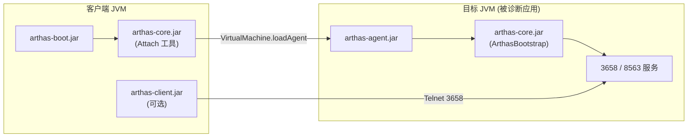
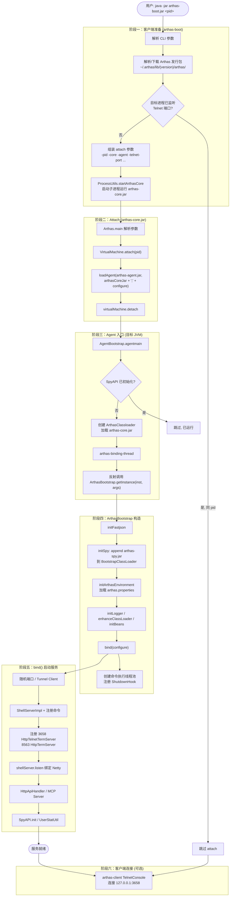
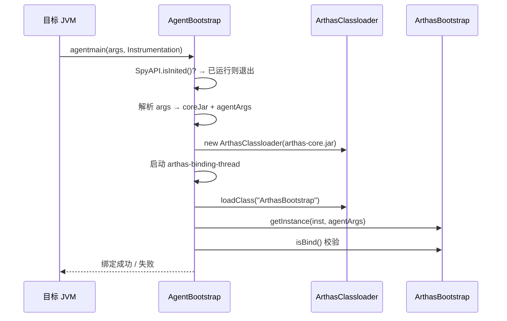
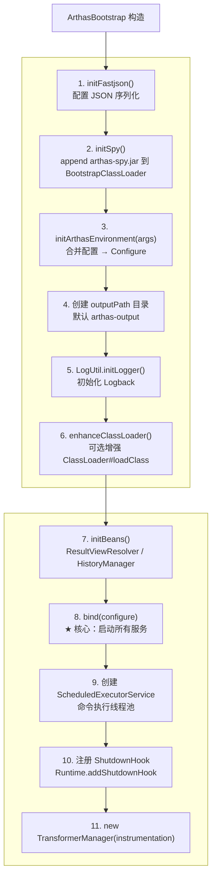
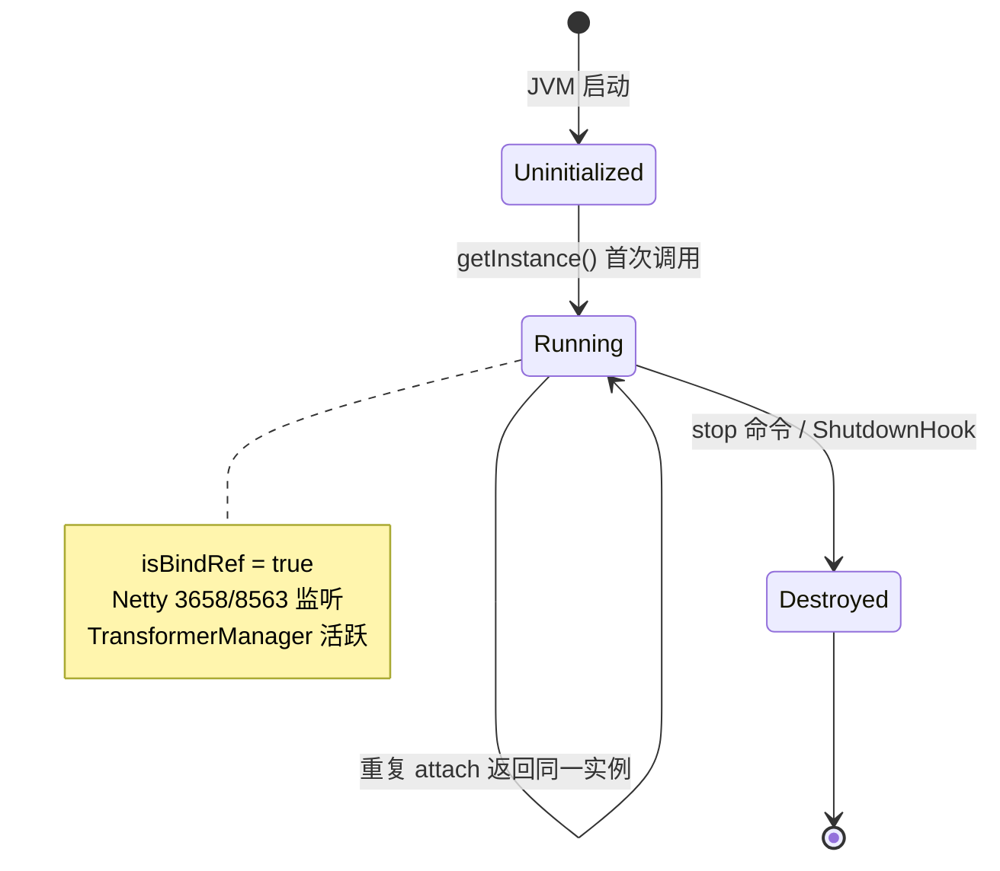
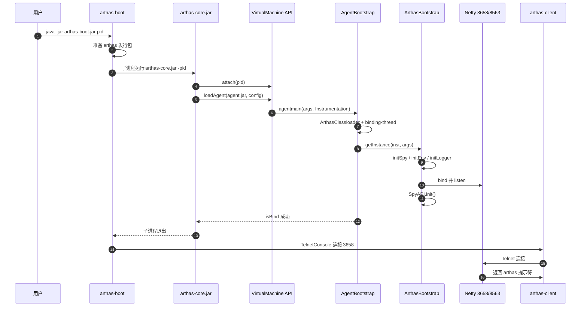

# Arthas 启动流程深度剖析

> 文档日期：2026-06-06  
> 分析范围：`arthas-boot` → attach → `AgentBootstrap` → `ArthasBootstrap` → 服务就绪  
> 默认端口：Telnet **3658**，HTTP **8563**

---

## 1. 总体认知：两个 JVM

Arthas 的典型启动涉及 **两个 JVM 进程**：

| JVM | 角色 | 关键组件 |
|-----|------|----------|
| **客户端 JVM** | 运行 `arthas-boot.jar` / `arthas-core.jar`（attach 工具） | `Bootstrap`、`Arthas.java` |
| **目标 JVM** | 被诊断的应用进程 | `AgentBootstrap`、`ArthasBootstrap`、Netty 服务 |

Attach 完成后，**诊断服务运行在目标 JVM 内部**；客户端可选择启动 `arthas-client` 连接，也可通过 HTTP/MCP 远程访问。



---

## 2. 端到端启动流程（主路径）



---

## 3. 阶段一：arthas-boot 客户端准备

**入口**：`com.taobao.arthas.boot.Bootstrap#main`

### 3.1 主要步骤

1. **解析命令行**：目标 pid、`--telnet-port`、`--http-port`、`--target-ip`、认证、Tunnel 等
2. **定位 Arthas 发行包**：
   - 优先 `--use-version` → `~/.arthas/lib/{version}/arthas/`
   - 或 arthas-boot.jar 同目录
   - 必要时从远程仓库下载
3. **防重复 attach**：通过 `arthas-client -c session` 探测 Telnet 端口是否已被同一 pid 占用
4. **启动 attach 子进程**：

```java
// ProcessUtils.startArthasCore(pid, attachArgs)
// 等价于:
java [-Xbootclasspath/a:tools.jar] -jar arthas-core.jar
     -pid <pid> -core <path>/arthas-core.jar -agent <path>/arthas-agent.jar
     -target-ip ... -telnet-port ... -http-port ... [其他配置]
```

5. **attach 成功后**（非 `--attach-only`）：加载 `arthas-client.jar`，Telnet 连接 `targetIp:telnetPort`

### 3.2 attach 参数传递

`Bootstrap` 将 CLI 选项转为 `arthas-core.jar` 的参数，最终通过 `Configure.toString()` 序列化后作为 **agent 第二参数** 传入目标 JVM。

---

## 4. 阶段二：Attach 工具 (arthas-core.jar / Arthas.java)

**入口**：`com.taobao.arthas.core.Arthas#main`

```java
VirtualMachine vm = VirtualMachine.attach(pid);
vm.loadAgent(arthasAgentPath, arthasCoreJar + ";" + configure.toString());
vm.detach();
```

要点：

- 使用 JDK **`com.sun.tools.attach`** API（需 `tools.jar` 或 JDK 9+ 内置 attach 模块）
- `loadAgent` 第一参数：`arthas-agent.jar` 路径
- 第二参数：`{arthas-core.jar路径};{Configure序列化字符串}`
- attach 完成后立即 `detach`，**attach 工具进程退出**；Agent 在目标 JVM 内继续运行

---

## 5. 阶段三：AgentBootstrap（目标 JVM 内）

**入口**：`com.taobao.arthas.agent334.AgentBootstrap#agentmain`（JVM attach 机制回调）



### 5.1 关键设计

| 设计 | 目的 |
|------|------|
| **独立 ArthasClassloader** | 隔离 Arthas 与业务 classpath，减少污染 |
| **binding 专用线程** | 避免 attach 线程内存泄漏（#195） |
| **SpyAPI 重复检测** | 防止多次 attach 重复初始化 |
| **日志重定向** | Agent 日志写入 `~/logs/arthas/arthas.log` |

### 5.2 反射调用

```java
Class<?> bootstrapClass = agentLoader.loadClass("com.taobao.arthas.core.server.ArthasBootstrap");
Object bootstrap = bootstrapClass.getMethod("getInstance", Instrumentation.class, String.class)
    .invoke(null, inst, args);
boolean isBind = (Boolean) bootstrapClass.getMethod("isBind").invoke(bootstrap);
```

---

## 6. 阶段四：ArthasBootstrap 构造与初始化

**入口**：`ArthasBootstrap.getInstance(instrumentation, args)` → `new ArthasBootstrap(...)`

构造函数内的**严格顺序**：



### 6.1 配置加载优先级

`initArthasEnvironment` 合并配置，默认优先级（`arthas.config.overrideAll=false`）：

```
命令行/agent 参数 (最高)
  > 环境变量
  > System Properties
  > arthas.properties (最低)
```

配置文件默认路径：`{arthas.home}/arthas.properties`（与 `arthas-core.jar` 同目录）。

常用配置项：

```properties
arthas.telnetPort=3658
arthas.httpPort=8563
arthas.ip=127.0.0.1
arthas.sessionTimeout=10800
arthas.mcpEndpoint=/mcp
arthas.mcpProtocol=STREAMABLE
```

### 6.2 initSpy：字节码增强的基础设施

`arthas-spy.jar` 被 append 到 **BootstrapClassLoader**，使业务类中的增强代码能调用 `java.arthas.SpyAPI`（位于 Bootstrap 层级，避免 ClassLoader 隔离问题）。

---

## 7. 阶段五：bind() — 服务启动核心

**方法**：`ArthasBootstrap.bind(Configure configure)`

```mermaid
flowchart TB
    subgraph bind["bind(configure)"]
        B1["端口处理\n0 → 随机端口\n-1 → 不监听"]
        B2["TunnelClient 启动\n(可选, tunnelServer 配置)"]
        B3["SecurityAuthenticator\n0.0.0.0 且无密码 → 自动生成 64 位密码"]
        B4["new ShellServerImpl(options)"]
        B5["BuiltinCommandPack + 外部命令 jar"]
        B6["NioEventLoopGroup\narthas-TermServer"]
        B7["registerTermServer\nHttpTelnetTermServer :3658\nHttpTermServer :8563"]
        B8["registerCommandResolver"]
        B9["shellServer.listen()\nNetty bind"]
        B10["SessionManagerImpl\nHttpApiHandler"]
        B11["ArthasMcpBootstrap.start()\n(可选)"]
        B12["SpyAPI.init()\nUserStatUtil.arthasStart()"]
    end

    B1 --> B2 --> B3 --> B4 --> B5 --> B6 --> B7 --> B8 --> B9 --> B10 --> B11 --> B12
```



### 7.1 ShellServer 与 Netty 绑定

```java
// 3658: Telnet + 协议探测 (ProtocolDetectHandler)
shellServer.registerTermServer(new HttpTelnetTermServer(ip, telnetPort, ...));

// 8563: HTTP + WebSocket + API + MCP
shellServer.registerTermServer(new HttpTermServer(ip, httpPort, ...));

shellServer.listen(new BindHandler(isBindRef));
```

`ShellServerImpl.listen()` 对每个 TermServer：

1. 设置 `termHandler(new TermServerTermHandler(this))`
2. 启动 Netty 监听
3. 客户端连接后 → `handleTerm` → `ShellImpl` → `readline`

绑定失败时 `isBindRef` 置 false，`AgentBootstrap` 抛出 "port binding failed"。

### 7.2 HTTP API 与 MCP

| 组件 | 创建时机 | 作用 |
|------|----------|------|
| `SessionManagerImpl` | bind 内 | HTTP API / MCP 命令 Session |
| `HttpApiHandler` | bind 内 | `POST /api` REST 接口 |
| `ArthasMcpBootstrap` | `mcpEndpoint` 非空时 | MCP Server（挂载 8563 `/mcp`） |

### 7.3 启动完成标志

```java
SpyAPI.init();           // 标记 Spy 可用，AgentBootstrap 重复检测依赖此标志
UserStatUtil.arthasStart();  // 异步上报启动统计
logger.info("as-server started in {} ms", ...);
```

---

## 8. 阶段六：客户端连接（attach 之后）

attach 成功后，`arthas-boot` 默认启动客户端：

```java
// arthas-client.jar → TelnetConsole.main
telnetArgs = [targetIp, telnetPort, 可选 -c/-f 命令]
```

连接路径：

```
Telnet 3658
  → ProtocolDetectHandler (识别 Telnet)
  → TelnetChannelHandler
  → TelnetTtyConnection.checkAccept()
  → TermServerTermHandler.handle(TermImpl)
  → ShellServerImpl.handleTerm()
  → ShellImpl.readline("[arthas@pid]$ ")
```

用户也可通过 **8563 HTTP/WebConsole/MCP** 接入，无需 arthas-client。

---

## 9. 单例与生命周期



| 方法 | 行为 |
|------|------|
| `ArthasBootstrap.getInstance(inst, args)` | 双重检查锁单例，首次创建并 bind |
| `isBind()` | 检查 `isBindRef`，AgentBootstrap 用于验证 |
| `destroy()` | 关闭 ShellServer、MCP、Tunnel、Transformer、Netty |
| `stop` 命令 | 触发 destroy，卸载 Agent |

---

## 10. 其他启动方式

| 方式 | 说明 |
|------|------|
| `as.sh <pid>` | Shell 脚本封装，逻辑类似 arthas-boot |
| `--attach-only` | 只 attach 不启动 client |
| `-javaagent:arthas-agent.jar` | premain 路径，适用于启动时挂载 |
| Tunnel 模式 | 目标 JVM 主动连接 Tunnel Server，可不开 3658/8563 公网端口 |
| Spring Boot Starter | 应用内嵌启动，跳过 attach 工具链 |

---

## 11. 关键类索引

| 类 | 模块 | 职责 |
|----|------|------|
| `Bootstrap` | boot | CLI 入口、下载发行包、触发 attach |
| `ProcessUtils` | boot | 启动 arthas-core.jar 子进程 |
| `Arthas` | core | VirtualMachine.attach + loadAgent |
| `AgentBootstrap` | agent | JVM Agent 入口、隔离 ClassLoader |
| `ArthasBootstrap` | core | 服务端总控、bind 所有组件 |
| `Configure` | core | 配置模型与序列化 |
| `ShellServerImpl` | core | Shell 会话、Netty TermServer 管理 |
| `HttpTelnetTermServer` | core | 3658 Telnet/HTTP 双协议 |
| `HttpTermServer` | core | 8563 HTTP/WebSocket/API/MCP |
| `ArthasMcpBootstrap` | core | MCP 服务装配 |
| `SpyAPI` | spy | 增强埋点 API，启动完成标志 |

---

## 12. 时序总览



---

## 13. 小结

1. **启动是分层的**：boot（客户端）→ attach 工具 → agent（目标 JVM 入口）→ bootstrap（服务总控）→ Netty 监听。
2. **核心工作在目标 JVM 的 `ArthasBootstrap`**：配置、Spy、日志、ShellServer、HTTP API、MCP 全部在此完成。
3. **`bind()` 是服务就绪的分界线**：Netty 端口绑定成功 + `SpyAPI.init()` 后，Arthas 才算真正可用。
4. **attach 工具进程短暂存在**：`loadAgent` 后 detach 并退出；长期运行的是目标 JVM 内的 Agent 与服务线程。
5. **客户端连接是独立步骤**：attach 不会自动阻塞等待用户输入；`arthas-client` 或 Web/HTTP/MCP 是 attach 之后的接入方式。

---

*本文档基于 Arthas 源码静态分析，主要参考 `boot`、`agent`、`core` 模块。*
