# Arthas 命令处理与字节码增强全流程深度分析

> 本文深入 arthas 源码，完整剖析「从 Netty Handler 接入请求 → 命令分发 → Command 执行 → 字节码增强（ClassFileTransformer + ByteKit）→ 运行时事件回调」的端到端流程。所有结论均基于源码精读，附带 `文件:行号` 引用，并配以大量 Mermaid 流程图与时序图。

---

## 目录

- [一、整体架构总览](#一整体架构总览)
- [二、Arthas 启动流程](#二arthas-启动流程)
- [三、Netty 通信层与命令接入](#三netty-通信层与命令接入)
- [四、Command 命令执行模型](#四command-命令执行模型)
- [五、字节码增强流程（ClassFileTransformer 侧）](#五字节码增强流程classfiletransformer-侧)
- [六、ByteKit 字节码增强引擎深入](#六bytekit-字节码增强引擎深入)
- [七、运行时事件回调与结果输出](#七运行时事件回调与结果输出)
- [八、端到端全链路总览](#八端到端全链路总览)
- [九、关键设计点与实现技巧总结](#九关键设计点与实现技巧总结)

---

## 一、整体架构总览

Arthas 通过 Java Agent（` Premain`/`Agentmain`） attach 到目标 JVM，在目标进程内启动一套自包含的诊断服务。其核心由以下几个子系统组成：

| 子系统 | 模块/包 | 职责 |
|--------|---------|------|
| 启动引导 | `core/server/ArthasBootstrap` | Agent 入口，初始化 Spy、增强 ClassLoader、启动通信服务、创建 TransformerManager |
| 通信层 | `core/shell/term/impl` | 基于 Netty 的 Telnet / HTTP / WebSocket 多协议接入 |
| Shell 层 | `core/shell/impl` | ShellServer/ShellImpl，会话、Job、命令注册与分发 |
| 命令框架 | `core/shell/command` | Command/AnnotatedCommand/CommandProcess，命令元数据与生命周期 |
| 命令实现 | `core/command/*` | 各具体命令（watch/trace/stack/monitor/jad/...） |
| 字节码增强 | `core/advisor` | TransformerManager/Enhancer/AdviceWeaver/SpyImpl/AdviceListenerManager |
| Spy 桥接 | `spy/.../SpyAPI` | 注入目标 JVM BootstrapClassLoader 的桥接类 |
| 增强引擎 | `bytekit-core`（外部依赖） | 基于注解的声明式字节码织入（InterceptorProcessor/MethodProcessor/Binding） |

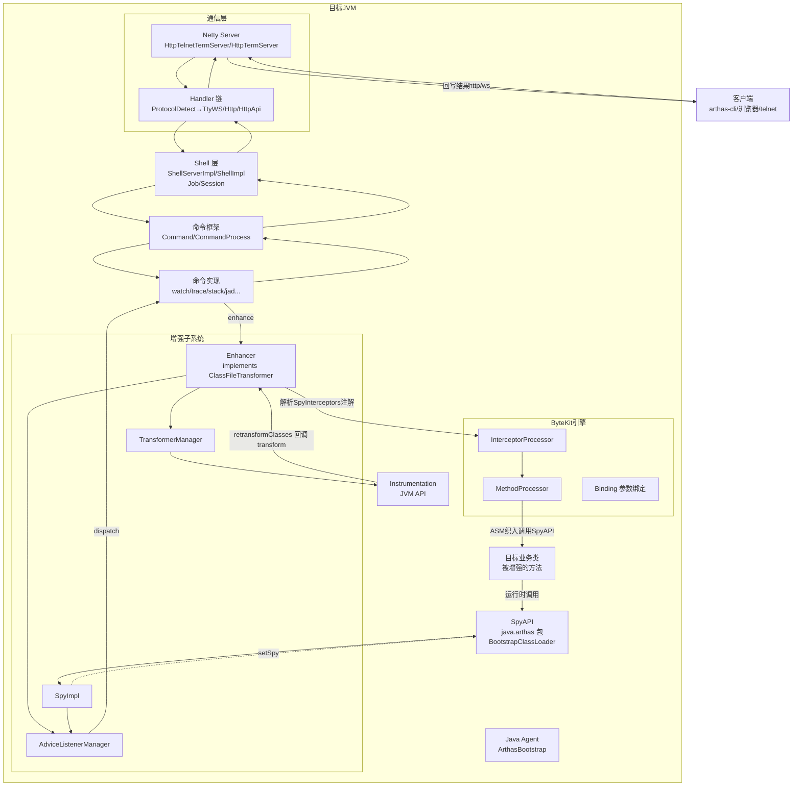
```mermaid
flowchart TB
    subgraph 目标JVM
        direction TB
        AGENT[Java Agent<br/>ArthasBootstrap]
        subgraph 通信层
            NETTY[Netty Server<br/>HttpTelnetTermServer/HttpTermServer]
            HANDLER[Handler 链<br/>ProtocolDetect→TtyWS/Http/HttpApi]
        end
        SHELL[Shell 层<br/>ShellServerImpl/ShellImpl<br/>Job/Session]
        CMD[命令框架<br/>Command/CommandProcess]
        CMDS[命令实现<br/>watch/trace/stack/jad...]
        subgraph 增强子系统
            TM[TransformerManager]
            ENH[Enhancer<br/>implements ClassFileTransformer]
            ALM[AdviceListenerManager]
            SPYIMPL[SpyImpl]
        end
        INSTR[Instrumentation<br/>JVM API]
        SPY[ SpyAPI<br/>java.arthas 包<br/>BootstrapClassLoader]
        TARGET[目标业务类<br/>被增强的方法]
        subgraph ByteKit引擎
            IP[InterceptorProcessor]
            MP[MethodProcessor]
            BIND[Binding 参数绑定]
        end
    end
    CLIENT[客户端<br/>arthas-cli/浏览器/telnet]

    CLIENT -->|telnet/http/ws| NETTY
    NETTY --> HANDLER
    HANDLER --> SHELL
    SHELL --> CMD
    CMD --> CMDS
    CMDS -->|enhance| ENH
    ENH --> TM
    TM --> INSTR
    INSTR -->|retransformClasses 回调 transform| ENH
    ENH -->|解析SpyInterceptors注解| IP
    IP --> MP
    MP -->|ASM织入调用SpyAPI| TARGET
    ENH --> ALM
    SPYIMPL -.->|setSpy| SPY
    TARGET -->|运行时调用| SPY
    SPY --> SPYIMPL
    SPYIMPL --> ALM
    ALM -->|dispatch| CMDS
    CMDS --> CMD
    CMD --> SHELL
    SHELL --> HANDLER
    HANDLER --> NETTY
    NETTY -->|回写结果| CLIENT
```

上图揭示了 arthas 的两条核心链路：

- **增强期链路（编译/织入时）**：命令 → `Enhancer` → `TransformerManager` → `Instrumentation.retransformClasses` → JVM 回调 `Enhancer.transform` → ByteKit 解析 `SpyInterceptors` 注解并用 ASM 织入「调用 `SpyAPI`」的字节码 → 同时向 `AdviceListenerManager` 注册路由。
- **运行期链路（事件回调时）**：目标方法执行到织入点 → 调用 `SpyAPI.atEnter/atExit/...` → `SpyImpl` → `AdviceListenerManager` 查路由表 → 分发到对应 `AdviceListener`（如 `WatchAdviceListener`）→ 求值、过滤、输出到 `CommandProcess` → 回写客户端。

---

## 二、Arthas 启动流程

启动入口为 `core/server/ArthasBootstrap.java`。Agent 被 attach 后由 `ArthasBootstrap` 完成全部初始化。关键步骤如下（行号对应 `ArthasBootstrap.java`）：

### 2.1 构造函数主要阶段

```
1. outputPath 初始化          (L163)
2. initLogger                 (L167)
3. enhanceClassLoader()       (L170)  ← 增强 ClassLoader#loadClass
4. initBeans()                (L172)
5. bind(configure)            (L175)  ← 启动 Netty 通信服务
6. executorService 线程池      (L177)
7. transformerManager = new TransformerManager(instrumentation)  (L194)
```

### 2.2 initSpy()：把 Spy 注入 BootstrapClassLoader

`SpyAPI` 位于 `java.arthas` 包（特殊命名，可被任意 ClassLoader 加载）。`initSpy()` 先尝试用父 ClassLoader 加载 `java.arthas.SpyAPI`，若失败则把 `arthas-spy.jar` 追加到 BootstrapClassLoader 搜索路径：

```java
// ArthasBootstrap.java L222-231
File spyJarFile = new File(arthasCoreJarFile.getParentFile(), ARTHAS_SPY_JAR);
instrumentation.appendToBootstrapClassLoaderSearch(new JarFile(spyJarFile));
```

这样保证目标 JVM 中**所有 ClassLoader** 都能加载到 `SpyAPI`，这是增强代码能调用 `SpyAPI.atEnter(...)` 的前提。

### 2.3 enhanceClassLoader()：用 ByteKit 增强 ClassLoader

对于部分自定义 ClassLoader 加载不到 `SpyAPI` 的问题（见 [issue #1596](https://github.com/alibaba/arthas/issues/1596)），arthas 用 ByteKit 的 `InstrumentTransformer` 增强 `ClassLoader#loadClass`：

```java
// ArthasBootstrap.java L248-260
SimpleClassMatcher matcher = new SimpleClassMatcher(loaders);
InstrumentConfig instrumentConfig = new InstrumentConfig(AsmUtils.toClassNode(classBytes), matcher);
InstrumentParseResult instrumentParseResult = new InstrumentParseResult();
instrumentParseResult.addInstrumentConfig(instrumentConfig);
classLoaderInstrumentTransformer = new InstrumentTransformer(instrumentParseResult);
instrumentation.addTransformer(classLoaderInstrumentTransformer, true);
InstrumentationUtils.trigerRetransformClasses(instrumentation, loaders);
```

这是 ByteKit 的「启动期 instrument」路径，与运行期 watch/trace 的 `Enhancer` 路径不同。

### 2.4 bind()：启动 Netty 通信服务

`bind()`（L366-518）创建 `ShellServerImpl`，注册命令解析器，并注册一个或多个 `TermServer`：

```java
// ArthasBootstrap.java L448-468
workerGroup = new NioEventLoopGroup(...);                       // Netty 事件循环组
// telnet 端口（同时支持 telnet/http/websocket 协议检测）
shellServer.registerTermServer(new HttpTelnetTermServer(...));
// http 端口（纯 http + http api）
shellServer.registerTermServer(new HttpTermServer(...));
...
shellServer.listen(new BindHandler(isBindRef));                 // 启动监听
sessionManager = new SessionManagerImpl(...);                  // HTTP API 会话
httpApiHandler = new HttpApiHandler(historyManager, sessionManager); // HTTP API 处理器
...
SpyAPI.init();                                                  // L507 标记 Spy 就绪
```

### 2.5 启动时序图

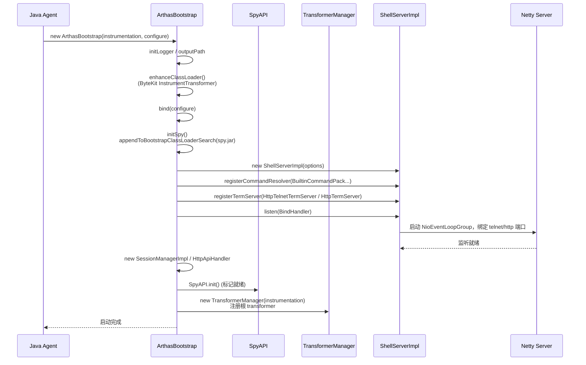
```mermaid
sequenceDiagram
    participant Agent as Java Agent
    participant BS as ArthasBootstrap
    participant Spy as SpyAPI
    participant TM as TransformerManager
    participant SS as ShellServerImpl
    participant Netty as Netty Server

    Agent->>BS: new ArthasBootstrap(instrumentation, configure)
    BS->>BS: initLogger / outputPath
    BS->>BS: enhanceClassLoader()<br/>(ByteKit InstrumentTransformer)
    BS->>BS: bind(configure)
    BS->>BS: initSpy()<br/>appendToBootstrapClassLoaderSearch(spy.jar)
    BS->>SS: new ShellServerImpl(options)
    BS->>SS: registerCommandResolver(BuiltinCommandPack...)
    BS->>SS: registerTermServer(HttpTelnetTermServer / HttpTermServer)
    BS->>SS: listen(BindHandler)
    SS->>Netty: 启动 NioEventLoopGroup，绑定 telnet/http 端口
    Netty-->>SS: 监听就绪
    BS->>BS: new SessionManagerImpl / HttpApiHandler
    BS->>Spy: SpyAPI.init()  (标记就绪)
    BS->>TM: new TransformerManager(instrumentation)<br/>注册根 transformer
    BS-->>Agent: 启动完成
```

---

## 三、Netty 通信层与命令接入

Arthas 的通信层完全基于 Netty，在目标 JVM 内启动一个（或多个）NIO 端口，同时承载 **Telnet / HTTP / WebSocket / HTTP API** 多种接入方式。关键设计是「协议自检测」：telnet 端口并不预先固定 pipeline，而是在连接建立后读取首字节判断协议，再动态装配对应 handler 链。

### 3.1 两个 TermServer

`bind()` 阶段注册的通信服务（见 2.4）：

| TermServer | 端口 | 能力 |
|------------|------|------|
| `HttpTelnetTermServer` | telnet 端口（默认 3658） | telnet + http + websocket 三协议自检测 |
| `HttpTermServer` | http 端口（默认 8563） | 纯 http + http api，固定 pipeline |

两者最终都通过 `ShellServerImpl.listen`（L120-140）为每个 TermServer 注册 `TermServerTermHandler`，在 channelActive 时 `termServer.accept(channel)`，进而创建 `TermImpl` 并交给 `ShellServerImpl.handleTerm`。

### 3.2 ProtocolDetectHandler：协议自检测

`core/shell/term/impl/httptelnet/ProtocolDetectHandler.java`（107 行）是 telnet 端口的协议探测核心。它作为 pipeline 第一个 handler，在连接建立后调度一个 1 秒延时任务作为 telnet「兜底」，同时读取首个数据包前 3 字节判断协议：

```java
// ProtocolDetectHandler.java
public void channelActive(ChannelHandlerContext ctx) {
    // 1秒后若仍无 HTTP 迹象，按 telnet 处理
    ctx.channel().eventLoop().schedule(new Runnable() {
        public void run() { becomeTelnet(ctx); }   // 兜底转 telnet
    }, 1000, TimeUnit.MILLISECONDS);
}

public void channelRead(ChannelHandlerContext ctx, Object msg) {
    ByteBuf buf = (ByteBuf) msg;
    buf.retain();   // 保留引用，转交后续 handler
    if (buf.readableBytes() < 3) return;
    int b1 = buf.getByte(buf.readerIndex());
    // 首字节非 'G'(GET) -> 肯定是 telnet
    if (b1 != 'G') {
        becomeTelnet(ctx);    // 动态装配 TelnetChannelHandler
    } else {
        // 可能是 GET 请求 -> 动态装配 HTTP pipeline
        becomeHttp(ctx);
    }
    ctx.fireChannelRead(msg);  // 把首个 buf 交给新 pipeline
    ctx.pipeline().remove(this);   // 探测完自我移除
}
```

`becomeHttp(ctx)` 动态向 pipeline 追加一整套 HTTP handler（与 `TtyServerInitializer` 的固定链一致，见 3.3）。这是 Netty「运行时改 pipeline」的典型用法--首个 `channelRead` 之后 pipeline 已定型，后续请求直接走对应协议。

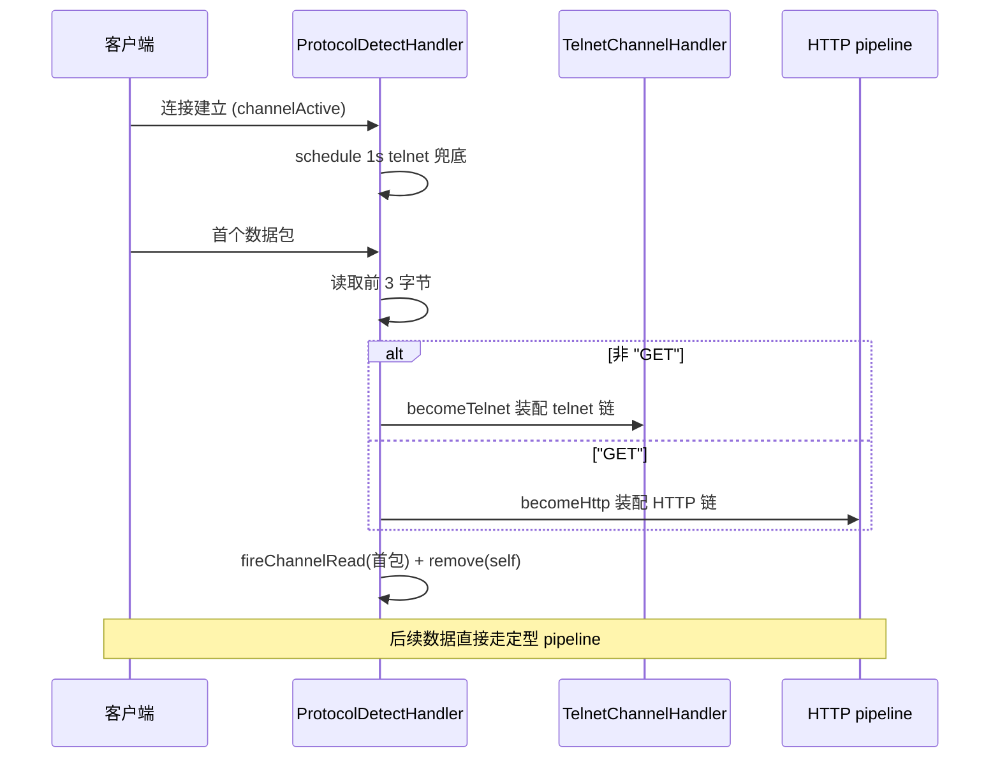
```mermaid
sequenceDiagram
    participant C as 客户端
    participant PD as ProtocolDetectHandler
    participant TEL as TelnetChannelHandler
    participant HTTP as HTTP pipeline

    C->>PD: 连接建立 (channelActive)
    PD->>PD: schedule 1s telnet 兜底
    C->>PD: 首个数据包
    PD->>PD: 读取前 3 字节
    alt 非 "GET"
        PD->>TEL: becomeTelnet 装配 telnet 链
    else "GET"
        PD->>HTTP: becomeHttp 装配 HTTP 链
    end
    PD->>PD: fireChannelRead(首包) + remove(self)
    Note over C,HTTP: 后续数据直接走定型 pipeline
```

### 3.3 ChannelHandler 链装配

无论 telnet 端口的 HTTP 分支（`ProtocolDetectHandler.becomeHttp`）还是 http 端口（`core/shell/term/impl/http/TtyServerInitializer.java`，51 行），装配的 handler 链一致：

```
HttpServerCodec          (HTTP 编解码)
  └─ ChunkedWriteHandler (大块/分块写支持)
       └─ HttpObjectAggregator(65535) (聚合成 FullHttpRequest)
            └─ BasicHttpAuthenticatorHandler (可选 HTTP Basic 认证)
                 └─ HttpRequestHandler (路由: /ws /api /ui 静态资源)
                      ├─ /ws  -> WebSocketServerProtocolHandler(握手)
                      │         └─ IdleStateHandler(读/写空闲)
                      │              └─ TtyWebSocketFrameHandler (WS 终端)
                      ├─ /api -> HttpApiHandler (HTTP API)
                      └─ /ui  -> 静态资源/DirectoryBrowser
```

`TtyServerInitializer.initChannel`（L30-49）是 http 端口的固定初始化器；`ProtocolDetectHandler.becomeHttp` 在运行时往同一 pipeline 逐个 `addLast` 同样的 handler。两者殊途同归。

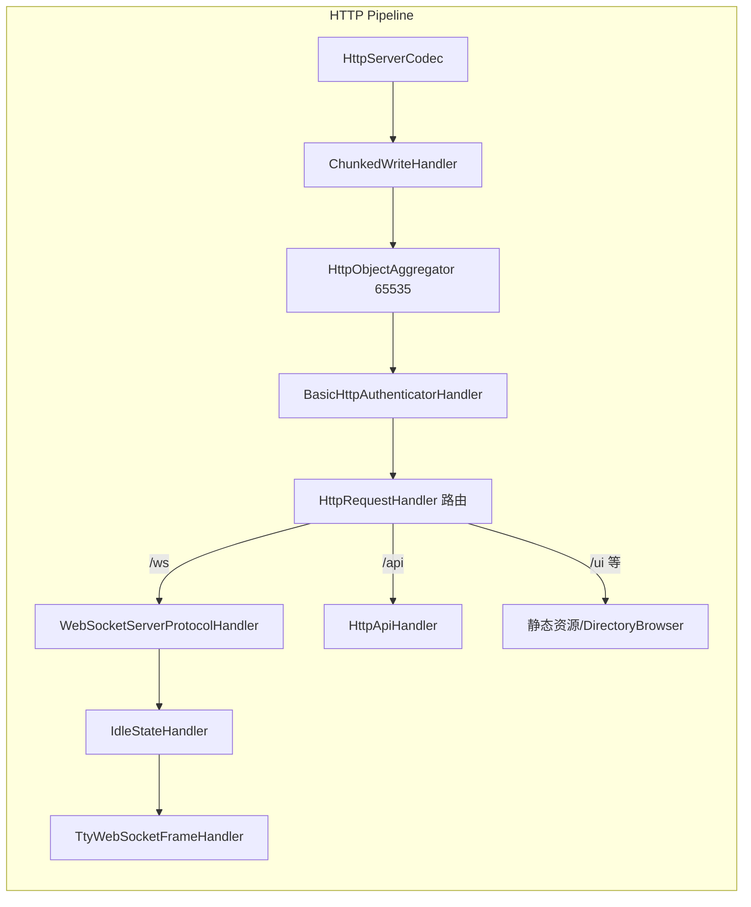
```mermaid
flowchart LR
    subgraph HTTP["HTTP Pipeline"]
        H1[HttpServerCodec]
        H2[ChunkedWriteHandler]
        H3[HttpObjectAggregator 65535]
        H4[BasicHttpAuthenticatorHandler]
        H5[HttpRequestHandler 路由]
        W1[WebSocketServerProtocolHandler]
        I1[IdleStateHandler]
        TW[TtyWebSocketFrameHandler]
        API[HttpApiHandler]
        RES[静态资源/DirectoryBrowser]
    end
    H1 --> H2 --> H3 --> H4 --> H5
    H5 -->|/ws| W1 --> I1 --> TW
    H5 -->|/api| API
    H5 -->|/ui 等| RES
```

### 3.4 HttpRequestHandler：HTTP 路由

`core/shell/term/impl/http/HttpRequestHandler.java`（190 行）在 `channelRead0` 中按 URI 分流：

```java
// HttpRequestHandler.java
public void channelRead0(ChannelHandlerContext ctx, FullHttpRequest request) {
    String uri = request.uri();
    QueryStringDecoder decoder = new QueryStringDecoder(uri);
    String path = decoder.path();
    if (path.startsWith("/ws")) {
        // 交给 WebSocketServerProtocolHandler 握手
        ctx.fireChannelRead(request.retain());
    } else if (path.startsWith("/api")) {
        // HTTP API：转交 HttpApiHandler
        httpApiHandler.handle(ctx, request, decoder);
    } else if (mcpEndpoint != null && path.startsWith(mcpEndpoint)) {
        mcpRequestHandler.handle(ctx, request, decoder);   // MCP 端点
    } else {
        // /ui 及静态资源：从 jar 内读取 webui 资源，或目录浏览
        readFileFromResource(ctx, request, path);
    }
}
```

`/ui` 与静态资源走 `readFileFromResource`（从 arthas jar 内的 `webui/` 目录读取），支持目录浏览（`DirectoryBrowser`）。这使 arthas 自带一个 Web 控制台，访问 `http://host:8563/ui/` 即可。

### 3.5 TtyWebSocketFrameHandler：WebSocket 终端

`core/shell/term/impl/http/TtyWebSocketFrameHandler.java`（130 行）在 WebSocket 握手完成后接管连接：

```java
// TtyWebSocketFrameHandler.java
public void userEventTriggered(ChannelHandlerContext ctx, Object evt) {
    if (evt instanceof WebSocketServerProtocolHandler.HandshakeComplete) {
        handleHandshakeComplete(ctx);   // 握手成功
    }
}

private void handleHandshakeComplete(ChannelHandlerContext ctx) {
    ExtHttpTtyConnection conn = new ExtHttpTtyConnection(ctx);
    handler.accept(conn);   // 交给 ShellServerImpl 创建 TermImpl
    ctx.pipeline().replace(...);   // 切换到 TextWebSocketFrame 读写
}

public void channelRead0(ChannelHandlerContext ctx, TextWebSocketFrame msg) {
    conn.writeToDecoder(msg.text());   // 把客户端输入写入 term 的解码器
}
```

握手后创建的 `ExtHttpTtyConnection` 实现 `Tty` 接口，作为 WebSocket 与 Shell 之间的桥梁：客户端的文本帧 -> `writeToDecoder` -> term readline；命令输出 -> `conn` -> WebSocket 文本帧回写。`IdleStateHandler` 配合发送 `PingWebSocketFrame` 保活。

### 3.6 HttpApiHandler：HTTP API 与异步结果分发

`core/shell/term/impl/http/api/HttpApiHandler.java`（684 行）提供程序化接入 arthas 的 RESTful API，是 arthas-http-api 与各种 SDK/IDE 插件的基础。`processRequest` 按 `ApiAction` 分发：

| ApiAction | 含义 |
|-----------|------|
| `INIT_SESSION` | 创建会话 |
| `EXEC` | 同步执行命令（阻塞等结果，默认 30s） |
| `ASYNC_EXEC` | 异步执行，立即返回 jobId |
| `PULL_RESULTS` | 轮询拉取异步命令的结果 |
| `INTERRUPT_JOB` | 中断指定 job |
| `SESSION_INFO` / `JOIN_SESSION` / `CLOSE_SESSION` | 会话管理 |

**同步执行 `processExecRequest`（L318-402）**：

```java
// HttpApiHandler.java L318-402（核心节选）
String jobId = ...;  // 创建 job
PackingResultDistributor distributor = new PackingResultDistributor(...);  // 结果打包器
job.run();   // 同步执行命令
List<ResultModel> results = distributor.waitForJob(timeout != null ? ... : 30000);  // 阻塞等结果
// 把 results 打包进 ApiResponse 返回
```

**异步执行 `processAsyncExecRequest`（L411-467）**：`job.run()` 立即返回 `SCHEDULED` 状态 + jobId，结果不阻塞等待，而是写入 `SharingResultDistributor`（一个 job 的结果可被多个消费者拉取）。客户端轮询 `processPullResultsRequest`（L491）：

```java
ResultConsumer consumer = sessionManager.findConsumer(jobId);
List<ResultModel> results = consumer.pollResults();   // 拉取已产生但未消费的结果
```

> **设计要点**：HTTP API 的同步/异步双模式，对应「一次性查询命令」（如 `jad`、`sc`，同步等结果）与「持续监听命令」（如 `watch`，异步轮询）两类用法。`SharingResultDistributor` 使同一命令的输出可被多个客户端订阅（如同时开两个终端看同一 `watch`）。

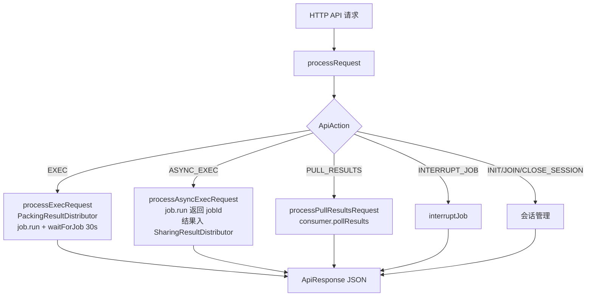
```mermaid
flowchart TB
    REQ[HTTP API 请求] --> PR[processRequest]
    PR --> D{ApiAction}
    D -->|EXEC| SYNC[processExecRequest<br/>PackingResultDistributor<br/>job.run + waitForJob 30s]
    D -->|ASYNC_EXEC| ASYNC[processAsyncExecRequest<br/>job.run 返回 jobId<br/>结果入 SharingResultDistributor]
    D -->|PULL_RESULTS| PULL[processPullResultsRequest<br/>consumer.pollResults]
    D -->|INTERRUPT_JOB| INT[interruptJob]
    D -->|INIT/JOIN/CLOSE_SESSION| SESS[会话管理]
    SYNC --> RESP[ApiResponse JSON]
    ASYNC --> RESP
    PULL --> RESP
    INT --> RESP
    SESS --> RESP
```

### 3.7 从 Netty 到 Shell：连接接受流程

无论 telnet、websocket 还是 http-api，最终都要落到 `ShellServerImpl.handleTerm`（L89-105）创建会话与命令循环。以 WebSocket 为例的完整接入链路：

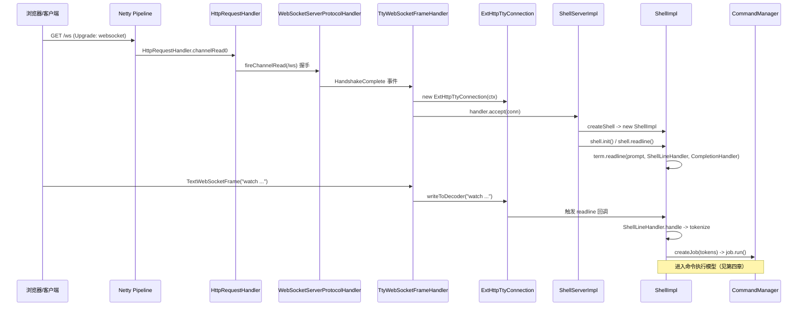
```mermaid
sequenceDiagram
    participant C as 浏览器/客户端
    participant N as Netty Pipeline
    participant HR as HttpRequestHandler
    participant WS as WebSocketServerProtocolHandler
    participant TW as TtyWebSocketFrameHandler
    participant CONN as ExtHttpTtyConnection
    participant SS as ShellServerImpl
    participant SH as ShellImpl
    participant CM as CommandManager

    C->>N: GET /ws (Upgrade: websocket)
    N->>HR: HttpRequestHandler.channelRead0
    HR->>WS: fireChannelRead(/ws) 握手
    WS->>TW: HandshakeComplete 事件
    TW->>CONN: new ExtHttpTtyConnection(ctx)
    TW->>SS: handler.accept(conn)
    SS->>SH: createShell -> new ShellImpl
    SS->>SH: shell.init() / shell.readline()
    SH->>SH: term.readline(prompt, ShellLineHandler, CompletionHandler)
    C->>TW: TextWebSocketFrame("watch ...")
    TW->>CONN: writeToDecoder("watch ...")
    CONN->>SH: 触发 readline 回调
    SH->>SH: ShellLineHandler.handle -> tokenize
    SH->>CM: createJob(tokens) -> job.run()
    Note over SH,CM: 进入命令执行模型（见第四章）
```

---

## 四、Command 命令执行模型

命令执行模型是 arthas 的中枢：把用户输入的一行命令文本，解析、分发到对应的 `Command`，再以 `CommandProcess` 承载其生命周期。核心类位于 `core/shell`。

### 4.1 命令类继承体系

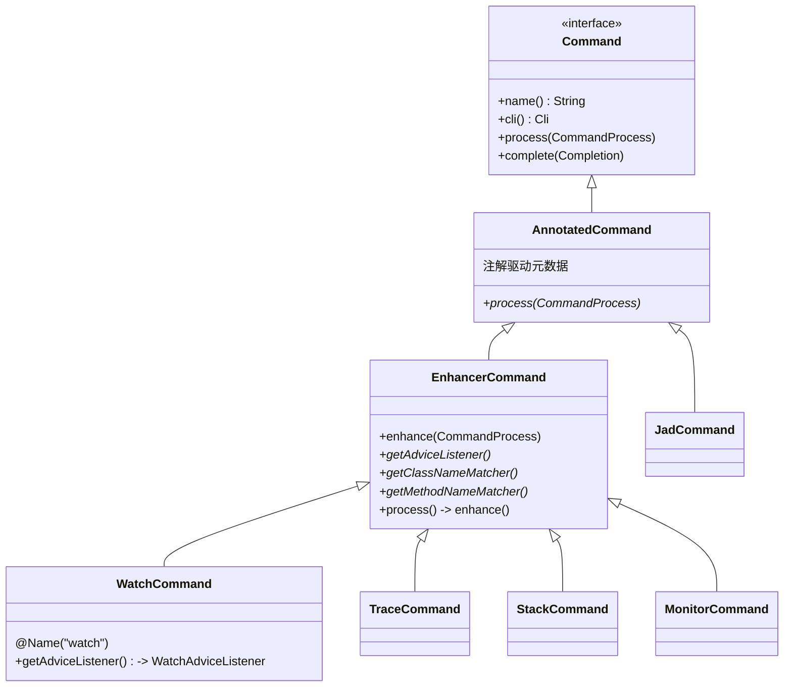
```mermaid
classDiagram
    class Command {
        <<interface>>
        +name() String
        +cli() Cli
        +process(CommandProcess)
        +complete(Completion)
    }
    class AnnotatedCommand {
        注解驱动元数据
        +process(CommandProcess)*
    }
    class EnhancerCommand {
        +enhance(CommandProcess)
        +getAdviceListener()*
        +getClassNameMatcher()*
        +getMethodNameMatcher()*
        +process() -> enhance()
    }
    class WatchCommand {
        @Name("watch")
        +getAdviceListener() -> WatchAdviceListener
    }
    class TraceCommand
    class StackCommand
    class MonitorCommand
    class JadCommand

    Command <|-- AnnotatedCommand
    AnnotatedCommand <|-- EnhancerCommand
    AnnotatedCommand <|-- JadCommand
    EnhancerCommand <|-- WatchCommand
    EnhancerCommand <|-- TraceCommand
    EnhancerCommand <|-- StackCommand
    EnhancerCommand <|-- MonitorCommand
```

- `Command`（接口，`core/shell/command/Command.java`）：命令抽象，定义 `name()/cli()/process(CommandProcess)/complete(Completion)`。
- `AnnotatedCommand`（`core/shell/command/AnnotatedCommand.java`，48 行）：基于注解的命令基类，从 `@Name/@Summary/@Description` 读元数据，`process` 仍为抽象。
- `EnhancerCommand`（`core/command/monitor200/EnhancerCommand.java`，331 行）：所有「增强类」命令基类，统一 `process` 模板（见 7.1）。
- `WatchCommand/TraceCommand/StackCommand/MonitorCommand/TtCommand/LineCommand`：具体命令，用注解声明参数，实现 `getAdviceListener` 等抽象方法。

### 4.2 注解元数据声明

arthas 命令用一套注解声明式描述 CLI 元数据，`AnnotatedCommand` 在 `cli()` 时反射读取：

```java
@Name("watch")                          // 命令名
@Summary("Display ...")                 // 一句话描述
@Description("...")                     // 详细帮助
public class WatchCommand extends EnhancerCommand {
    @Argument(index = 0, argName = "class-pattern", required = true)  // 位置参数
    @DefaultValue("false") String classPattern;

    @Argument(index = 2, argName = "express", required = false)
    @DefaultValue("{params, target, returnObj}")  // OGNL 表达式默认值
    String express;

    @Option(shortName = "b", flag = true)   // -b 选项（flag 无值）
    @DefaultValue("false") boolean before;

    @Option(shortName = "n")                  // -n N 选项（带值）
    @DefaultValue("-1") int numberOfLimit;
    ...
}
```

- `@Argument(index, argName, required)`：位置参数。
- `@Option(shortName, longName, flag)`：选项；`flag=true` 表示无值开关（`-b`），否则带值（`-n 5`）。
- `@DefaultValue`：缺省值，当用户未提供时填充。

`CommandManagerCompletionHandler` 在用户按 Tab 时回调 `command.complete(Completion)`，基于这些注解完成参数补全。

### 4.3 命令注册与分发

`BuiltinCommandPack` 在启动时把内置命令注册到 `CommandManager`：

```java
// 简化
List<Command> commands = new ArrayList<>();
commands.add(new WatchCommand());
commands.add(new TraceCommand());
commands.add(new StackCommand());
commands.add(new MonitorCommand());
commands.add(new JadCommand());
// ... 数十个内置命令
commandManager.register(commands);
// 外部命令通过 ServiceLoader<Command> SPI 加载
```

`CommandManager` 维护 `name -> Command` 映射，`createJob(tokens)` 时按 `tokens[0]`（命令名）查表。未注册则提示 `command not found`。

### 4.4 CommandProcess：命令生命周期载体

`core/shell/command/CommandProcess.java`（186 行）是命令执行的核心接口（`extends Tty`），承载命令运行的全部上下文与控制能力：

```java
// CommandProcess.java（核心方法）
public interface CommandProcess extends Tty {
    String[] argsTokens();          // 已解析的参数 token
    String commandLine();           // 原始命令行
    Session session();              // 会话
    boolean isForeground();

    // handler 注册（命令可在运行时挂载各种处理器）
    void stdinHandler(Handler<String> handler);          // 标准输入
    void interruptHandler(Handler<Void> handler);        // Ctrl+C
    void suspendHandler(Handler<Void> handler);          // 挂起
    void resumeHandler(Handler<Void> handler);           // 恢复
    void endHandler(Handler<Void> handler);              // 结束回调

    // 增强命令专用
    void register(AdviceListener listener, ClassFileTransformer transformer);
    void unregister();

    // 结果输出与结束
    boolean isRunning();
    void write(String message);    // 来自 Tty
    void appendResult(ResultModel model);   // 追加结构化结果
    AtomicInteger times();          // 命令执行计数（watch -n 用）
    void end(int statusCode);
    void end(int statusCode, String message);
    void resume();  void suspend();
}
```

**生命周期状态（`ExecStatus`）**：`NEW -> RUNNING -> (SUSPENDED <-> RUNNING) -> TERMINATED`。命令一旦 `end()` 即转 `TERMINATED`，后续 `appendResult` 被忽略（`ProcessImpl.appendResult` 检查 RUNNING）。

### 4.5 ProcessImpl：CommandProcess 实现

`core/shell/system/impl/ProcessImpl.java` 实现 `CommandProcess`。关键方法：

```java
// ProcessImpl.java
@Override
public void register(AdviceListener listener, ClassFileTransformer transformer) {
    if (listener instanceof ProcessAware) {
        ((ProcessAware) listener).setProcess(this);   // 让 listener 能反查 process
    }
    AdviceWeaver.reg(listener);                       // 旧路由表
    this.transformer = transformer;                   // 记录 transformer 用于卸载
}

@Override
public void unregister() {
    if (transformer != null) {
        ArthasBootstrap.getInstance().getTransformerManager()
                .removeTransformer(transformer);      // 从 TransformerManager 移除
    }
    AdviceWeaver.unReg(listener);                       // 清理路由
}

@Override
public void end(int statusCode, String message) {
    terminate(statusCode, null, message);   // 转 TERMINATED，触发 endHandler
}

@Override
public void appendResult(ResultModel result) {
    if (status() == ExecStatus.RUNNING) {
        resultDistributor.appendResult(result);   // 仅运行时才输出
    }
}
```

`end()` 内部 `terminate` 会：①置 `TERMINATED`、②回调 `endHandler`、③`unregister()` 清理 transformer 与 listener、④通过 `JobHandler` 通知 Job 终止。这是增强命令「结束时自动卸载增强」的关键路径。

### 4.6 ShellImpl 与 readline 循环

`core/shell/impl/ShellImpl.java`（287 行）代表一次交互会话。`readline()`（L209-212）把控制权交给终端的 readline：

```java
// ShellImpl.java L209-212
public void readline() {
    term.readline(prompt, new ShellLineHandler(this), new CommandManagerCompletionHandler(commandManager));
}
```

- `ShellLineHandler`：收到一行输入后的回调，负责分词与创建 Job。
- `CommandManagerCompletionHandler`：Tab 补全。

`createJob(args)`（`ShellImpl`）委托 `jobController.createJob(commandManager, args, session, ShellJobHandler, term, null)` 创建 `Job`。

### 4.7 ShellLineHandler：分词与分发

`core/shell/handlers/shell/ShellLineHandler.java`（177 行）的 `handle(String line)`：

```java
// ShellLineHandler.java
public void handle(String line) {
    List<CliToken> tokens = CliTokenizer.tokenize(line);   // 分词
    if (tokens.isEmpty()) { shell.readline(); return; }     // 空行重新读

    String name = tokens.get(0).value();
    // 内建命令：exit/jobs/fg/bg/kill
    if ("exit".equals(name) || "logout".equals(name)) { ... }
    else if ("jobs".equals(name)) { ... }
    else if ("fg".equals(name) || "bg".equals(name) || "kill".equals(name)) { ... }
    else {
        Job job = createJob(tokens);   // 创建 Job
        job.run();                      // 运行
    }
}
```

`Job.run()` 最终调用 `command.process(process)`--即命令的 `process` 方法。

### 4.8 Job 调度与前台/后台

`JobControllerImpl` 管理 Shell 内的多个 Job（前台/后台）。每个 Job 关联一个 `Thread`（`JobProcess`），`job.run()` 在该线程执行命令。Job 状态：`INITIAL -> RUNNING -> SUSPENDED -> TERMINATED`。

- **前台 Job**：独占终端，运行时用户输入被视为命令的 stdin（`stdinHandler`）；结束后 `ShellJobHandler.onTerminated` 回调 `shell.resetAndReadLine` 重新读取下一行。
- **后台 Job**：用 `&` 触发，不阻塞终端，立即重新读取下一行；后台 Job 的输出与前台交织。

`ShellJobHandler.onTerminated`（`ShellImpl` 内部类）：

```java
public void onTerminated(Job job) {
    // 前台 Job 结束后重新读取下一行
    if (job.isForeground()) {
        shell.resetAndReadLine();
    }
}
```

### 4.9 中断机制

增强类命令（watch/trace）常会长时间挂起，需要中断：

- **`CommandInterruptHandler`**（`core/shell/handlers/command/CommandInterruptHandler.java`）：在 `EnhancerCommand.process` 中通过 `process.interruptHandler(new CommandInterruptHandler(process))` 注册。用户按 `Ctrl+C` 时 term 触发，handler 调用 `process.end(...)` 结束命令，并 `unregister` 清理增强。
- **`QExitHandler`**：通过 `process.stdinHandler(new QExitHandler(process))` 注册，用户输入 `Q` 退出监听。

命令结束时的资源清理（`ProcessImpl.terminate` -> `unregister`）保证 `TransformerManager.removeTransformer` + `AdviceListenerManager` 清理，避免增强残留。

### 4.10 命令执行流程图

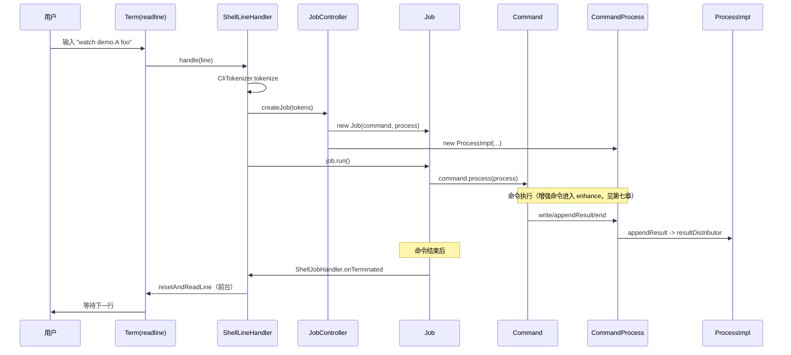
```mermaid
sequenceDiagram
    participant U as 用户
    participant T as Term(readline)
    participant SLH as ShellLineHandler
    participant JC as JobController
    participant J as Job
    participant CMD as Command
    participant CP as CommandProcess
    participant PI as ProcessImpl

    U->>T: 输入 "watch demo.A foo"
    T->>SLH: handle(line)
    SLH->>SLH: CliTokenizer.tokenize
    SLH->>JC: createJob(tokens)
    JC->>J: new Job(command, process)
    JC->>CP: new ProcessImpl(...)
    SLH->>J: job.run()
    J->>CMD: command.process(process)
    Note over CMD,CP: 命令执行（增强命令进入 enhance，见第七章）
    CMD->>CP: write/appendResult/end
    CP->>PI: appendResult -> resultDistributor
    Note over J: 命令结束后
    J->>SLH: ShellJobHandler.onTerminated
    SLH->>T: resetAndReadLine（前台）
    T->>U: 等待下一行
```

### 4.11 命令生命周期状态机

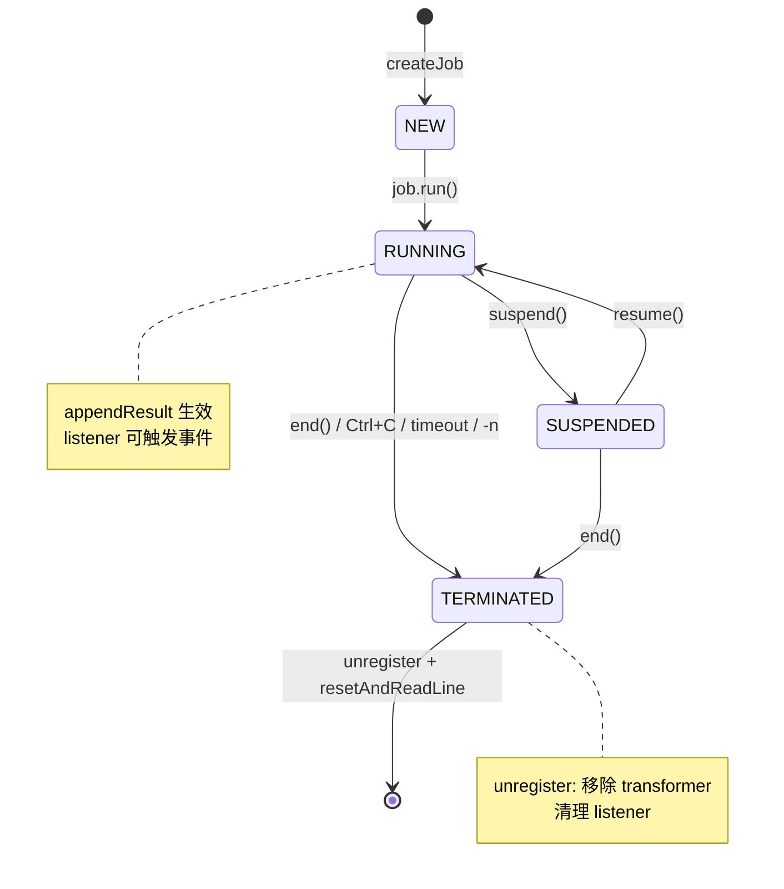
```mermaid
stateDiagram-v2
    [*] --> NEW: createJob
    NEW --> RUNNING: job.run()
    RUNNING --> SUSPENDED: suspend()
    SUSPENDED --> RUNNING: resume()
    RUNNING --> TERMINATED: end() / Ctrl+C / timeout / -n
    SUSPENDED --> TERMINATED: end()
    TERMINATED --> [*]: unregister + resetAndReadLine

    note right of RUNNING
      appendResult 生效
      listener 可触发事件
    end note
    note right of TERMINATED
      unregister: 移除 transformer
      清理 listener
    end note
```

---

## 五、字节码增强流程（ClassFileTransformer 侧）

本节是全文核心之一，剖析 arthas 如何通过 `ClassFileTransformer` + ByteKit 完成对目标方法的增强。

### 5.1 TransformerManager：统一管理 ClassFileTransformer

`core/advisor/TransformerManager.java` 是所有增强命令 transformer 的统一管理者。它持有 `Instrumentation`，并维护 **4 组 transformer 列表** + **2 个根 transformer**：

```java
// TransformerManager.java L24-44
private List<ClassFileTransformer> watchTransformers    = new CopyOnWriteArrayList<>(); // watch 类命令
private List<ClassFileTransformer> traceTransformers    = new CopyOnWriteArrayList<>(); // trace 类命令
private List<ClassFileTransformer> reTransformers        = new CopyOnWriteArrayList<>(); // 先于 watch/trace
private List<ClassFileTransformer> lazyTransformers     = new CopyOnWriteArrayList<>(); // 类首次加载时增强
private ClassFileTransformer classFileTransformer;       // 根 transformer（retransform-capable）
private ClassFileTransformer lazyClassFileTransformer;  // 根 transformer（仅类首次定义触发）
```

**两个根 transformer 的职责不同**：

1. `classFileTransformer`（L49-81）以 `addTransformer(transformer, true)` 注册（retransform-capable），在 `transform` 内部**链式串联**调用 `reTransformers → watchTransformers → traceTransformers`——前一个 transformer 的输出字节码作为后一个的输入：

```java
// TransformerManager.java L54-76（节选）
for (ClassFileTransformer t : reTransformers) {
    byte[] r = t.transform(loader, className, classBeingRedefined, protectionDomain, classfileBuffer);
    if (r != null) classfileBuffer = r;   // 链式传递
}
for (ClassFileTransformer t : watchTransformers) { ... }  // 同上
for (ClassFileTransformer t : traceTransformers) { ... }
return classfileBuffer;
```

2. `lazyClassFileTransformer`（L86-107）以 `addTransformer(transformer, false)` 注册，**只在类首次定义时**（`classBeingRedefined == null`）触发 `lazyTransformers`，实现「类尚未加载时也能在加载瞬间增强」（对应 `watch --lazy` / `-L`）：

```java
// TransformerManager.java L92-94
if (classBeingRedefined != null) {
    return null;   // 仅处理首次加载
}
```

> **设计要点**：arthas 只向 JVM 注册了 2 个根 transformer，所有命令级 transformer 由 `TransformerManager` 在内部列表里管理，避免向 JVM 注册过多 transformer；同时通过 `watch/trace/re/lazy` 分组与链式串联实现多命令对同一类的叠加增强。

#### TransformerManager 与 Instrumentation 关系

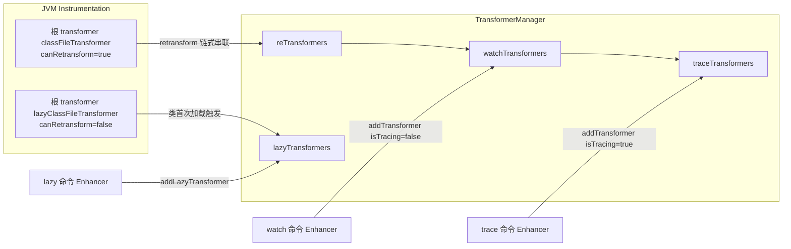
```mermaid
flowchart LR
    subgraph JVM["JVM Instrumentation"]
        RT1["根 transformer classFileTransformer<br/>canRetransform=true"]
        RT2["根 transformer lazyClassFileTransformer<br/>canRetransform=false"]
    end
    subgraph TM["TransformerManager"]
        RE[reTransformers]
        W[watchTransformers]
        T[traceTransformers]
        LZY[lazyTransformers]
    end
    CMD1["watch 命令 Enhancer"] -->|addTransformer isTracing=false| W
    CMD2["trace 命令 Enhancer"] -->|addTransformer isTracing=true| T
    CMD3["lazy 命令 Enhancer"] -->|addLazyTransformer| LZY
    RT1 -->|retransform 链式串联| RE
    RE --> W
    W --> T
    RT2 -->|类首次加载触发| LZY
```

### 5.2 Enhancer：ClassFileTransformer 的核心实现

`core/advisor/Enhancer.java`（760 行）是每个增强命令对应的 transformer，`implements ClassFileTransformer`。

#### 5.2.1 关键字段与 Spy 注入

```java
// Enhancer.java L77-95
private final AdviceListener listener;          // 命令对应的监听器
private final boolean isTracing;                 // 是否 trace（影响用哪组 SpyTraceInterceptor）
private final boolean skipJDKTrace;             // 是否跳过 JDK 方法
private final Matcher classNameMatcher;         // 类名匹配
private final Matcher classNameExcludeMatcher;  // 排除类名匹配
private final Matcher methodNameMatcher;        // 方法名匹配
private final String targetClassLoaderHash;     // 指定 ClassLoader hash
private final EnhancerAffect affect;            // 影响统计
private static SpyImpl spyImpl = new SpyImpl();

static {
    SpyAPI.setSpy(spyImpl);   // L97-99：把 SpyImpl 注入到 SpyAPI
}
```

> 静态块在 `Enhancer` 类首次加载时执行一次，将 `SpyImpl` 设置为 `SpyAPI` 的 spy 实例。由于 `SpyAPI` 在 BootstrapClassLoader、`SpyImpl` 在 arthas ClassLoader，二者通过 `SpyAPI.AbstractSpy` 抽象类解耦。

#### 5.2.2 enhance()：触发增强的入口

`Enhancer.enhance(inst, maxNumOfMatchedClass)`（L639-705）是命令侧调用的入口，完成「搜索匹配类 → 注册 transformer → retransform」：

```java
// Enhancer.java L639-705（核心节选）
public synchronized EnhancerAffect enhance(Instrumentation inst, int maxNumOfMatchedClass) {
    // 1. 搜索匹配类（含子类）
    this.matchingClasses = GlobalOptions.isDisableSubClass
            ? SearchUtils.searchClass(inst, classNameMatcher)
            : SearchUtils.searchSubClass(inst, SearchUtils.searchClass(inst, classNameMatcher));

    // 2. 过滤无法增强的类（lambda/接口/数组/arthas自身/unsafe等）
    List<Pair<Class<?>, String>> filtedList = filter(matchingClasses);

    // 3. 数量上限检查
    if (matchingClasses.size() > maxNumOfMatchedClass) { ... return affect; }

    affect.setTransformer(this);
    // 4. 注册到 TransformerManager
    ArthasBootstrap.getInstance().getTransformerManager().addTransformer(this, isTracing);
    if (isLazy) {
        ArthasBootstrap.getInstance().getTransformerManager().addLazyTransformer(this);
    }

    // 5. 触发 retransform，JVM 将回调 transform()
    if (GlobalOptions.isBatchReTransform) {
        inst.retransformClasses(classArray);     // 批量
    } else {
        for (Class<?> clazz : matchingClasses) {
            inst.retransformClasses(clazz);       // 逐个
        }
    }
    return affect;
}
```

#### 5.2.3 transform()：字节码织入核心

JVM 回调 `Enhancer.transform(loader, className, classBeingRedefined, protectionDomain, classfileBuffer)`（L149-369）。其完整逻辑：

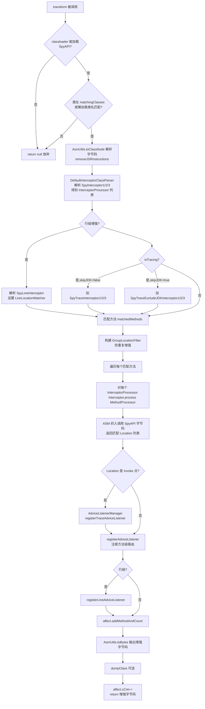
```mermaid
flowchart TD
    S[transform 被调用] --> C1{classloader 能加载<br/>SpyAPI?}
    C1 -->|否| SKIP[return null 放弃]
    C1 -->|是| C2{类在 matchingClasses<br/>或懒加载类名匹配?}
    C2 -->|否| SKIP
    C2 -->|是| P1[AsmUtils.toClassNode 解析字节码<br/>removeJSRInstructions]
    P1 --> P2[DefaultInterceptorClassParser<br/>解析 SpyInterceptor1/2/3<br/>得到 InterceptorProcessor 列表]
    P2 --> P3{行级增强?}
    P3 -->|是| P3a[解析 SpyLineInterceptor<br/>设置 LineLocationMatcher]
    P3 --> P4{isTracing?}
    P4 -->|是,skipJDK=false| P4a[加 SpyTraceInterceptor1/2/3]
    P4 -->|是,skipJDK=true| P4b[加 SpyTraceExcludeJDKInterceptor1/2/3]
    P4 -->|否| P5
    P3a --> P5[匹配方法 matchedMethods]
    P4a --> P5
    P4b --> P5
    P5 --> P6[构建 GroupLocationFilter<br/>防重复增强]
    P6 --> P7[遍历每个匹配方法]
    P7 --> P8[对每个 InterceptorProcessor:<br/>interceptor.process MethodProcessor]
    P8 --> P9[ASM 织入调用 SpyAPI 字节码<br/>返回匹配 Location 列表]
    P9 --> P10{Location 是 invoke 点?}
    P10 -->|是| P10a[AdviceListenerManager<br/>registerTraceAdviceListener]
    P10 -->|否| P11
    P10a --> P11[registerAdviceListener<br/>注册方法级路由]
    P11 --> P11b{行级?}
    P11b -->|是| P11c[registerLineAdviceListener]
    P11b -->|否| P12
    P11c --> P12[affect.addMethodAndCount]
    P12 --> P13[AsmUtils.toBytes 输出增强字节码]
    P13 --> P14[dumpClass 可选]
    P14 --> P15[affect.cCnt++<br/>return 增强字节码]
```

关键代码段（带行号）：

```java
// Enhancer.java L196-218  解析字节码 + 解析拦截器注解
ClassNode classNode = new ClassNode(Opcodes.ASM9);
ClassReader classReader = AsmUtils.toClassNode(classfileBuffer, classNode);
classNode = AsmUtils.removeJSRInstructions(classNode);

DefaultInterceptorClassParser defaultInterceptorClassParser = new DefaultInterceptorClassParser();
final List<InterceptorProcessor> interceptorProcessors = new ArrayList<>();
interceptorProcessors.addAll(defaultInterceptorClassParser.parse(SpyInterceptor1.class)); // @AtEnter
interceptorProcessors.addAll(defaultInterceptorClassParser.parse(SpyInterceptor2.class)); // @AtExit
interceptorProcessors.addAll(defaultInterceptorClassParser.parse(SpyInterceptor3.class)); // @AtExceptionExit
```

```java
// Enhancer.java L253-274  构建 GroupLocationFilter 防止重复增强
GroupLocationFilter groupLocationFilter = new GroupLocationFilter();
// 若方法已含 SpyAPI.atEnter/atExit/atExceptionExit 调用，则跳过（避免重复织入）
LocationFilter enterFilter = new InvokeContainLocationFilter(
        Type.getInternalName(SpyAPI.class), "atEnter", LocationType.ENTER);
LocationFilter existFilter = new InvokeContainLocationFilter(
        Type.getInternalName(SpyAPI.class), "atExit", LocationType.EXIT);
LocationFilter exceptionFilter = new InvokeContainLocationFilter(
        Type.getInternalName(SpyAPI.class), "atExceptionExit", LocationType.EXCEPTION_EXIT);
// invoke 级用 InvokeCheckLocationFilter
LocationFilter invokeBeforeFilter = new InvokeCheckLocationFilter(
        Type.getInternalName(SpyAPI.class), "atBeforeInvoke", LocationType.INVOKE);
...
```

```java
// Enhancer.java L314-336  对每个方法用 MethodProcessor 织入
MethodProcessor methodProcessor = new MethodProcessor(classNode, methodNode, groupLocationFilter);
for (InterceptorProcessor interceptor : interceptorProcessors) {
    List<Location> locations = interceptor.process(methodProcessor);  // ← ByteKit 织入！
    for (Location location : locations) {
        if (location instanceof MethodInsnNodeWare) {   // invoke 位置
            MethodInsnNode methodInsnNode = ((MethodInsnNodeWare) location).methodInsnNode();
            AdviceListenerManager.registerTraceAdviceListener(inClassLoader, className,
                    methodInsnNode.owner, methodInsnNode.name, methodInsnNode.desc, listener);
        }
    }
}
// enter/exit 总是注册方法级 listener
AdviceListenerManager.registerAdviceListener(inClassLoader, className,
        methodNode.name, methodNode.desc, listener);
```

> **核心**：`Enhancer.transform` 自身并不直接写 ASM 指令织入，而是把工作委托给 ByteKit——`DefaultInterceptorClassParser` 把 `SpyInterceptor1/2/3` 上的 `@AtEnter/@AtExit/@AtExceptionExit` 注解解析成 `InterceptorProcessor`，再由 `InterceptorProcessor.process(MethodProcessor)` 在目标方法对应位置织入「调用 `SpyAPI.atXxx`」的字节码。ByteKit 内部机制详见[第六章](#六bytekit-字节码增强引擎深入)。

#### 5.2.4 增强粒度与对应关系

arthas 的增强粒度由 `AccessPoint` 枚举（位运算）定义，与 `AdviceListener` 回调方法、`SpyAPI` 静态方法、`SpyInterceptors` 注解一一对应：

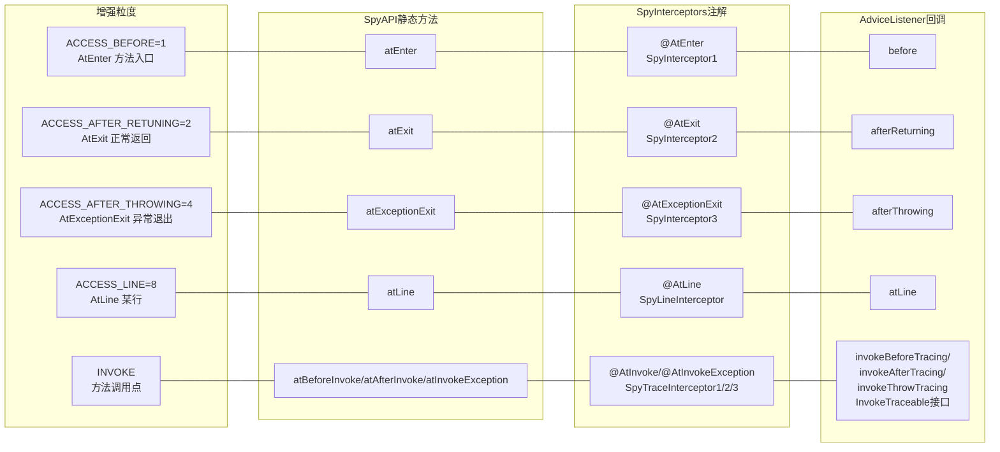
```mermaid
flowchart LR
    subgraph 增强粒度
      AP1[ACCESS_BEFORE=1<br/>AtEnter 方法入口]
      AP2[ACCESS_AFTER_RETUNING=2<br/>AtExit 正常返回]
      AP3[ACCESS_AFTER_THROWING=4<br/>AtExceptionExit 异常退出]
      AP4[ACCESS_LINE=8<br/>AtLine 某行]
      AP5[INVOKE<br/>方法调用点]
    end
    subgraph SpyAPI静态方法
      S1[atEnter]
      S2[atExit]
      S3[atExceptionExit]
      S4[atLine]
      S5[atBeforeInvoke/atAfterInvoke/atInvokeException]
    end
    subgraph SpyInterceptors注解
      I1["@AtEnter<br/>SpyInterceptor1"]
      I2["@AtExit<br/>SpyInterceptor2"]
      I3["@AtExceptionExit<br/>SpyInterceptor3"]
      I4["@AtLine<br/>SpyLineInterceptor"]
      I5["@AtInvoke/@AtInvokeException<br/>SpyTraceInterceptor1/2/3"]
    end
    subgraph AdviceListener回调
      L1[before]
      L2[afterReturning]
      L3[afterThrowing]
      L4[atLine]
      L5[invokeBeforeTracing/<br/>invokeAfterTracing/<br/>invokeThrowTracing<br/>InvokeTraceable接口]
    end
    AP1 --- S1 --- I1 --- L1
    AP2 --- S2 --- I2 --- L2
    AP3 --- S3 --- I3 --- L3
    AP4 --- S4 --- I4 --- L4
    AP5 --- S5 --- I5 --- L5
```

`AccessPoint`（`core/advisor/AccessPoint.java`）：

```java
public enum AccessPoint {
    ACCESS_BEFORE(1, "AtEnter"),
    ACCESS_AFTER_RETUNING(1 << 1, "AtExit"),
    ACCESS_AFTER_THROWING(1 << 2, "AtExceptionExit"),
    ACCESS_LINE(1 << 3, "AtLine");
}
```

不同命令选用不同粒度：
- `watch`：方法级（before/afterReturning/afterThrowing），用 `SpyInterceptor1/2/3`
- `trace`：方法级 + 调用级（`isTracing=true`），额外用 `SpyTraceInterceptor1/2/3`（`@AtInvoke`）
- `monitor/stack/tt`：方法级
- `watch --line` / `LineCommand`：行级，用 `SpyLineInterceptor`（`@AtLine`）

### 5.3 SpyAPI：注入目标 JVM 的桥接接口

`spy/src/main/java/java/arthas/SpyAPI.java` 是 arthas 增强代码与诊断逻辑之间的「桥梁」。它位于 `java.arthas` 包（非 `com.taobao` 前缀），在启动期被加入 BootstrapClassLoader，因此**任何 ClassLoader 加载的业务类，其增强后字节码中的 `SpyAPI.atEnter(...)` 调用都能解析到同一个 `SpyAPI` 类**。

```java
// SpyAPI.java
public class SpyAPI {
    public static final AbstractSpy NOPSPY = new NopSpy();
    private static volatile AbstractSpy spyInstance = NOPSPY;   // 默认空实现

    public static void setSpy(AbstractSpy spy) { spyInstance = spy; }

    // 织入到目标方法的代码就是调用这些静态方法
    public static void atEnter(Class<?> clazz, String methodInfo, Object target, Object[] args) {
        spyInstance.atEnter(clazz, methodInfo, target, args);
    }
    public static void atExit(Class<?> clazz, String methodInfo, Object target, Object[] args, Object returnObject) { ... }
    public static void atExceptionExit(...) { ... }
    public static void atBeforeInvoke(Class<?> clazz, String invokeInfo, Object target) { ... }
    public static void atAfterInvoke(...) { ... }
    public static void atInvokeException(...) { ... }
    public static void atLine(Class<?> clazz, String methodInfo, int lineNumber, Object target, Object[] args,
            String[] argNames, Object[] localVars, String[] localVarNames) { ... }
}
```

**关键设计**：`SpyAPI` 持有 `volatile AbstractSpy spyInstance`，默认 `NopSpy`（空实现，无副作用）。`Enhancer` 静态块执行 `SpyAPI.setSpy(new SpyImpl())` 后，所有调用才真正路由到诊断逻辑。`NopSpy` 的存在保证：即使 arthas 未就绪或已卸载，已增强的方法调用 `SpyAPI` 也只是空操作，不会抛错。

### 5.4 SpyInterceptors：ByteKit 声明式拦截器定义

`core/advisor/SpyInterceptors.java` 是 arthas 对 ByteKit 注解 API 的使用——用注解声明「在什么位置插入什么代码、绑定哪些运行时值」：

```java
// SpyInterceptors.java L20-44  方法级拦截
public static class SpyInterceptor1 {
    @AtEnter(inline = true)
    public static void atEnter(@Binding.This Object target, @Binding.Class Class<?> clazz,
            @Binding.MethodInfo String methodInfo, @Binding.Args Object[] args) {
        SpyAPI.atEnter(clazz, methodInfo, target, args);   // ← 织入后调用 SpyAPI
    }
}
public static class SpyInterceptor2 {
    @AtExit(inline = true)
    public static void atExit(..., @Binding.Return Object returnObj) {
        SpyAPI.atExit(clazz, methodInfo, target, args, returnObj);
    }
}
public static class SpyInterceptor3 {
    @AtExceptionExit(inline = true)
    public static void atExceptionExit(..., @Binding.Throwable Throwable throwable) {
        SpyAPI.atExceptionExit(clazz, methodInfo, target, args, throwable);
    }
}
```

```java
// SpyInterceptors.java L57-100  调用级拦截（trace 用）
public static class SpyTraceInterceptor1 {
    @AtInvoke(name = "", inline = true, whenComplete = false,
              excludes = {"java.arthas.SpyAPI", "java.lang.Byte", /*...8个包装类*/})
    public static void onInvoke(@Binding.This Object target, @Binding.Class Class<?> clazz,
            @Binding.InvokeInfo String invokeInfo) {
        SpyAPI.atBeforeInvoke(clazz, invokeInfo, target);
    }
}
public static class SpyTraceInterceptor2 {
    @AtInvoke(name = "", inline = true, whenComplete = true, excludes = {...})
    public static void onInvokeAfter(...) { SpyAPI.atAfterInvoke(...); }
}
public static class SpyTraceInterceptor3 {
    @AtInvokeException(name = "", inline = true, excludes = {...})
    public static void onInvokeException(..., @Binding.Throwable Throwable throwable) {
        SpyAPI.atInvokeException(clazz, invokeInfo, target, throwable);
    }
}
```

```java
// SpyInterceptors.java L46-55  行级拦截
public static class SpyLineInterceptor {
    @AtLine(lines = { -1 }, inline = true)   // -1 表示由外部 LineLocationMatcher 指定行
    public static void atLine(@Binding.This Object target, @Binding.Class Class<?> clazz,
            @Binding.MethodInfo String methodInfo, @Binding.Line int lineNumber, @Binding.Args Object[] args,
            @Binding.ArgNames(optional = true) String[] argNames,
            @Binding.LocalVars(ignoreThis = true, optional = true) Object[] localVars,
            @Binding.LocalVarNames(ignoreThis = true, optional = true) String[] localVarNames) {
        SpyAPI.atLine(clazz, methodInfo, lineNumber, target, args, argNames, localVars, localVarNames);
    }
}
```

**要点解读**：
- `inline = true`：把拦截方法体**内联**到目标方法中（而非生成额外的方法调用），减少开销。
- `@Binding.Xxx`：ByteKit 的参数绑定——`@Binding.This` 绑定 `this`、`@Binding.Class` 绑定当前类、`@Binding.MethodInfo` 绑定「方法名+描述符」字符串、`@Binding.Args` 绑定参数数组、`@Binding.Return` 绑定返回值、`@Binding.Throwable` 绑定异常、`@Binding.Line` 绑定行号、`@Binding.InvokeInfo` 绑定「被调用方法 owner+name+desc+行号」、`@Binding.LocalVars/@Binding.LocalVarNames` 绑定局部变量。ByteKit 在织入时生成读取这些值的字节码作为拦截方法参数（详见[第六章](#六bytekit-字节码增强引擎深入)）。
- `@AtInvoke(name="", ...)`：`name=""` 表示匹配方法体内**所有** `INVOKE` 指令；`whenComplete=false/true` 分别对应调用前/调用后；`excludes` 排除 `SpyAPI` 自身和包装类型，避免无限递归与噪声。
- `SpyTraceExcludeJDKInterceptor*`：`excludes="java.**"` 排除整个 JDK（对应 trace `--skipJDKTrace` 选项）。

### 5.5 SpyImpl 与 AdviceListenerManager：运行时事件路由

#### 5.5.1 SpyImpl：把 SpyAPI 调用路由到 listener

`core/advisor/SpyImpl.java`（219 行）实现 `SpyAPI.AbstractSpy`，把每个 `atXxx` 调用解析后查路由表分发：

```java
// SpyImpl.java L27-50  atEnter
public void atEnter(Class<?> clazz, String methodInfo, Object target, Object[] args) {
    ClassLoader classLoader = clazz.getClassLoader();
    String[] info = StringUtils.splitMethodInfo(methodInfo);
    String methodName = info[0];
    String methodDesc = info[1];
    List<AdviceListener> listeners = AdviceListenerManager.queryAdviceListeners(
            classLoader, clazz.getName(), methodName, methodDesc);
    if (listeners != null) {
        for (AdviceListener adviceListener : listeners) {
            if (skipAdviceListener(adviceListener)) continue;   // 跳过已终止命令
            adviceListener.before(clazz, methodName, methodDesc, target, args);
        }
    }
}
```

`skipAdviceListener`（L204-217）检查 listener 关联的 `Process` 状态——若命令已 `TERMINATED`/`STOPPED` 则跳过，避免向已结束命令发事件：

```java
private static boolean skipAdviceListener(AdviceListener adviceListener) {
    if (adviceListener instanceof ProcessAware) {
        Process process = ((ProcessAware) adviceListener).getProcess();
        if (process == null) return true;
        ExecStatus status = process.status();
        if (status.equals(ExecStatus.TERMINATED) || status.equals(ExecStatus.STOPPED)) return true;
    }
    return false;
}
```

调用级（`atBeforeInvoke` 等）则把 listener 转为 `InvokeTraceable` 接口调用：

```java
// SpyImpl.java L101-124  atBeforeInvoke
List<AdviceListener> listeners = AdviceListenerManager.queryTraceAdviceListeners(
        classLoader, clazz.getName(), owner, methodName, methodDesc);
for (AdviceListener adviceListener : listeners) {
    if (skipAdviceListener(adviceListener)) continue;
    final InvokeTraceable listener = (InvokeTraceable) adviceListener;   // trace listener 实现此接口
    listener.invokeBeforeTracing(classLoader, owner, methodName, methodDesc, Integer.parseInt(info[3]));
}
```

#### 5.5.2 AdviceListenerManager：按 ClassLoader + 方法 三级路由表

`core/advisor/AdviceListenerManager.java`（298 行）维护增强点 → listener 的路由表。**按 ClassLoader 分桶**（`ConcurrentWeakKeyHashMap`，弱引用便于 ClassLoader 卸载），桶内用 `ConcurrentHashMap<String, List<AdviceListener>>`，三种 key：

```java
// AdviceListenerManager.java L106-116
private String key(String className, String methodName, String methodDesc) {
    return className + methodName + methodDesc;                              // 方法级
}
private String keyForTrace(String className, String owner, String methodName, String methodDesc) {
    return className + owner + methodName + methodDesc;                     // 调用级
}
private String keyForLine(String className, String methodName, String methodDesc, int lineNumber) {
    return className + methodName + methodDesc + "#" + lineNumber;           // 行级
}
```

注册发生在 `Enhancer.transform` 织入时（见 5.2.3 的 `registerAdviceListener/registerTraceAdviceListener/registerLineAdviceListener`），查询发生在运行时 `SpyImpl`。此外有定时任务（3 秒，L57-99）清理已 `TERMINATED` 的 listener，避免内存泄漏：

```java
// AdviceListenerManager.java L57-98（定时清理）
ArthasBootstrap.getInstance().getScheduledExecutorService().scheduleWithFixedDelay(() -> {
    for (Entry<ClassLoader, ClassLoaderAdviceListenerManager> entry : adviceListenerMap.entrySet()) {
        // 移除 status == TERMINATED 的 listener
    }
}, 3, 3, TimeUnit.SECONDS);
```

> **为什么按 ClassLoader + 方法 而不是 adviceId？** 因为同一个业务方法可能被多个 watch/trace 命令同时增强（多次 retransform 但不重复织入），用 `className+method+desc` 能一次查到所有相关 listener 并逐一分发。`AdviceWeaver`（L17-78）保留的是旧的按 `adviceId` 路由方式，现仅作 listener 注册表与 `--listenerId` 复用支持。

#### 5.5.3 路由表结构图

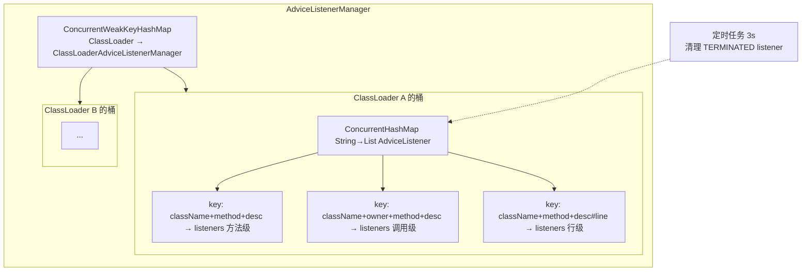
```mermaid
flowchart TB
    subgraph AdviceListenerManager
        MAP[ConcurrentWeakKeyHashMap<br/>ClassLoader → ClassLoaderAdviceListenerManager]
        subgraph CL1["ClassLoader A 的桶"]
            M1[ConcurrentHashMap String→List AdviceListener]
            K1[key: className+method+desc → listeners 方法级]
            K2[key: className+owner+method+desc → listeners 调用级]
            K3[key: className+method+desc#line → listeners 行级]
        end
        subgraph CL2["ClassLoader B 的桶"]
            M2[...]
        end
    end
    MAP --> CL1
    MAP --> CL2
    M1 --> K1
    M1 --> K2
    M1 --> K3
    TIMER[定时任务 3s<br/>清理 TERMINATED listener] -.-> M1
```

### 5.6 AdviceListener 接口与 Advice 数据对象

`AdviceListener`（`core/advisor/AdviceListener.java`）定义回调：

```java
public interface AdviceListener {
    long id();
    void create();
    void destroy();
    void before(Class<?> clazz, String methodName, String methodDesc, Object target, Object[] args);
    void afterReturning(..., Object returnObject);
    void afterThrowing(..., Throwable throwable);
    default void atLine(..., int lineNumber, String[] argNames, Object[] localVars, String[] localVarNames) { }
}
```

调用级回调定义在 `InvokeTraceable` 接口（`core/advisor/InvokeTraceable.java`），trace 类命令的 listener 同时实现 `AdviceListener` + `InvokeTraceable`：

```java
public interface InvokeTraceable {
    void invokeBeforeTracing(ClassLoader cl, String tracingClassName, String tracingMethodName,
                            String tracingMethodDesc, int tracingLineNumber);
    void invokeAfterTracing(...);
    void invokeThrowTracing(...);
}
```

`Advice`（`core/advisor/Advice.java`）是通知点的数据载体，封装 `loader/clazz/method(ArthasMethod)/target/params/returnObj/throwExp/lineNumber/argNames/localVars/localVarNames`，并用 `isBefore/isReturn/isThrow/isLine`（基于 `AccessPoint` 位运算）标识当前通知类型。提供静态工厂 `Advice.newForBefore/newForAfterReturning/newForAfterThrowing/newForLine`。`normalizeLocalVariables` 会过滤 `this` 局部变量，`buildLocalVarMap` 构造 `name→value` 映射供 OGNL 求值。

### 5.7 EnhancerAffect：增强影响统计

`core/util/affect/EnhancerAffect.java` 统计增强结果：

```java
private final AtomicInteger cCnt;   // 类计数
private final AtomicInteger mCnt;   // 方法计数
private ClassFileTransformer transformer;   // 持有 enhancer 引用（用于结束时移除）
private long listenerId;
private Throwable throwable;
private final List<String> methods;   // "classLoaderHash|class#method|desc"
private String overLimitMsg;         // 超过匹配上限提示
```

`Enhancer.transform` 中每增强一个方法调用 `affect.addMethodAndCount(...)`（L343），每增强一个类调用 `affect.cCnt(1)`（L360）。命令侧据此判断是否成功（`effect.cCnt()==0 || effect.mCnt()==0` 时提示「No class or method is affected」）。

### 5.8 InstrumentationUtils：retransform 工具

`core/util/InstrumentationUtils.java` 提供两种 retransform：

```java
// 一次性 transformer：注册→retransform→移除
public static void retransformClasses(Instrumentation inst, ClassFileTransformer transformer, Set<Class<?>> classes) {
    try {
        inst.addTransformer(transformer, true);
        for (Class<?> clazz : classes) {
            if (ClassUtils.isLambdaClass(clazz)) continue;   // JDK 不支持 retransform lambda
            inst.retransformClasses(clazz);
        }
    } finally {
        inst.removeTransformer(transformer);
    }
}

// 按类名触发已加载类的 retransform
public static void trigerRetransformClasses(Instrumentation inst, Collection<String> classes) {
    for (Class<?> clazz : inst.getAllLoadedClasses()) {
        if (classes.contains(clazz.getName())) inst.retransformClasses(clazz);
    }
}
```

---

## 六、ByteKit 字节码增强引擎深入

ByteKit 是 arthas 底层依赖的字节码增强引擎（`bytekit-core`）。它提供了一套**声明式、注解驱动**的 API：开发者用 `@AtEnter/@AtExit/@AtInvoke` 等注解声明「在方法何处插入代码」，用 `@Binding.This/@Binding.Args` 等注解声明「拦截方法参数绑定什么运行时值」，ByteKit 自动用 ASM 把对应代码织入目标方法。arthas 的 `SpyInterceptors`（见 5.4）就是用这套 API 声明的。

### 6.1 整体架构与织入流程

ByteKit 的核心由四个概念构成：

| 概念 | 类 | 职责 |
|------|----|------|
| 位置（Location） | `Location`/`LocationType`/`LocationMatcher` | 描述「方法内何处可织入」（入口/返回/异常/调用点/行） |
| 拦截处理器（InterceptorProcessor） | `InterceptorProcessor` | 一个拦截方法对应一个，负责在所有匹配位置织入「调用拦截方法」字节码 |
| 方法处理器（MethodProcessor） | `MethodProcessor` | 被增强方法的状态封装，提供 ASM 辅助 + inline 能力 |
| 参数绑定（Binding） | `Binding`/`BindingContext` | 拦截方法每个参数如何从运行时上下文取值并压栈 |

```mermaid
flowchart TB
    SRC[拦截类<br/>如 SpyInterceptor1] -->|@AtEnter/@Binding.This| PARSE
    subgraph 解析阶段
        PARSE[DefaultInterceptorClassParser.parse]
        PARSE -->|扫描方法注解| META[元注解 @InterceptorParserHander]
        META --> P1[EnterInterceptorProcessorParser]
        P1 -->|new EnterLocationMatcher + bindings| IP[InterceptorProcessor]
    end
    subgraph 织入阶段
        IP -->|process MethodProcessor| LM[LocationMatcher.match]
        LM -->|返回 List Location| LOC[匹配位置列表]
        LOC --> WEAVE[对每个 Location<br/>保存栈+binding压参+INVOKESTATIC+恢复栈]
        WEAVE --> INL{inline?}
        INL -->|是| INLINE[MethodProcessor.inline<br/>INVOKESTATIC 替换为方法体内联]
        INL -->|否| DONE[完成]
        INLINE --> DONE
    end
```

### 6.2 元注解驱动的解析体系

ByteKit 最精巧的设计是「**双轴元注解驱动**」：位置注解与绑定注解各自被一个元注解标注，元注解指明对应的 Parser，Parser 负责把注解转成运行时对象。

#### 位置轴：`@InterceptorParserHander`

每个 `@AtXxx` 注解本身被 `@InterceptorParserHander(parserHander=XXXParser.class)` 标注：

```java
// AtEnter.java
@Documented
@Retention(RetentionPolicy.RUNTIME)
@Target(ElementType.METHOD)
@InterceptorParserHander(parserHander = AtEnter.EnterInterceptorProcessorParser.class)  // ← 元注解
public @interface AtEnter {
    boolean inline() default true;
    Class<? extends Throwable> suppress() default None.class;
    Class<?> suppressHandler() default Void.class;

    class EnterInterceptorProcessorParser implements InterceptorProcessorParser {
        public InterceptorProcessor parse(Method method, Annotation annotationOnMethod) {
            LocationMatcher locationMatcher = new EnterLocationMatcher();   // 构造位置匹配器
            AtEnter atEnter = (AtEnter) annotationOnMethod;
            return InterceptorParserUtils.createInterceptorProcessor(method,
                    locationMatcher, atEnter.inline(), atEnter.suppress(), atEnter.suppressHandler());
        }
    }
}
```

`@AtInvoke`（`AtInvoke.java`）更复杂，属性包括 `owner`（限定调用者）、`name`（方法名，`""` 表全部）、`desc`（签名）、`count`（第几次，`-1` 全部）、`whenComplete`（前/后）、`excludes`（排除类，如 `java.**`）：

```java
// AtInvoke.java
@InterceptorParserHander(parserHander = AtInvoke.InvokeInterceptorProcessorParser.class)
public @interface AtInvoke {
    boolean inline() default true;
    Class<?> owner() default Void.class;
    String name();
    String desc() default "";
    int count() default -1;
    boolean whenComplete() default false;
    String[] excludes() default {};
    // ...
    class InvokeInterceptorProcessorParser implements InterceptorProcessorParser {
        public InterceptorProcessor parse(Method method, Annotation annotationOnMethod) {
            AtInvoke atInvoke = (AtInvoke) annotationOnMethod;
            LocationMatcher locationMatcher = new InvokeLocationMatcher(owner, atInvoke.name(),
                    desc, atInvoke.count(), atInvoke.whenComplete(), excludes);
            return InterceptorParserUtils.createInterceptorProcessor(...);
        }
    }
}
```

#### 绑定轴：`@BindingParserHandler`

拦截方法的参数注解（`@Binding.This` 等）同理被 `@BindingParserHandler(parser=XXXBindingParser.class)` 标注：

```java
// Binding.java（节选）
@Documented @Retention(RUNTIME) @Target(ElementType.PARAMETER)
@BindingParserHandler(parser = ThisBindingParser.class)   // ← 元注解
public static @interface This { }

public static class ThisBindingParser implements BindingParser {
    public Binding parse(Annotation annotation) { return new ThisBinding(); }
}
```

`Binding.java` 内部集中定义了全部绑定注解 + Parser 对（`@Args/@ArgNames/@LocalVars/@LocalVarNames/@Class/@Field/@InvokeArgs/@InvokeReturn/@InvokeMethodName/@InvokeMethodOwner/@InvokeMethodDeclaration/@InvokeInfo/@Method/@MethodName/@MethodDesc/@MethodInfo/@Return/@This/@Throwable/@Line/@Monitor`）。

#### 解析入口 `DefaultInterceptorClassParser.parse`

`DefaultInterceptorClassParser.java`（51 行）遍历拦截类的所有方法，对每个方法扫描注解，发现带 `@InterceptorParserHander` 元注解的就用其 parser 解析：

```java
// DefaultInterceptorClassParser.java
public List<InterceptorProcessor> parse(Class<?> clazz) {
    List<InterceptorProcessor> result = new ArrayList<>();
    ReflectionUtils.doWithMethods(clazz, new ReflectionUtils.MethodCallback() {
        public void doWith(Method method) {
            for (Annotation annotation : method.getAnnotations()) {
                // 注解上是否有 @InterceptorParserHander 元注解？
                InterceptorParserHander interceptorParserHander = annotation.annotationType()
                        .getAnnotation(InterceptorParserHander.class);
                if (interceptorParserHander != null) {
                    InterceptorProcessorParser parser = interceptorParserHander.parserHander().newInstance();
                    InterceptorProcessor interceptorProcessor = parser.parse(method, annotation);
                    result.add(interceptorProcessor);   // 一个 @AtXxx 方法 -> 一个 InterceptorProcessor
                }
            }
        }
    });
    return result;
}
```

> **关键**：`Enhancer.transform` 调用 `defaultInterceptorClassParser.parse(SpyInterceptor1.class)` 得到 `InterceptorProcessor` 列表（见 5.2.3）。一个 `@AtEnter` 静态方法 -> 一个 `InterceptorProcessor`，内含 `LocationMatcher`（从注解属性构造）+ 拦截方法元信息 + bindings（从参数 `@Binding.Xxx` 解析）。

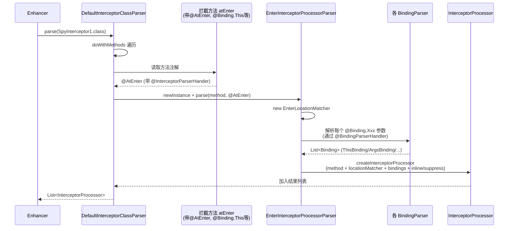
```mermaid
sequenceDiagram
    participant E as Enhancer
    participant P as DefaultInterceptorClassParser
    participant M as 拦截方法 atEnter<br/>(带@AtEnter, @Binding.This等)
    participant AP as EnterInterceptorProcessorParser
    participant BP as 各 BindingParser
    participant IP as InterceptorProcessor

    E->>P: parse(SpyInterceptor1.class)
    P->>P: doWithMethods 遍历
    P->>M: 读取方法注解
    M-->>P: @AtEnter (带 @InterceptorParserHander)
    P->>AP: newInstance + parse(method, @AtEnter)
    AP->>AP: new EnterLocationMatcher
    AP->>BP: 解析每个 @Binding.Xxx 参数<br/>(通过 @BindingParserHandler)
    BP-->>AP: List<Binding> (ThisBinding/ArgsBinding/...)
    AP->>IP: createInterceptorProcessor<br/>(method + locationMatcher + bindings + inline/suppress)
    IP-->>P: 加入结果列表
    P-->>E: List<InterceptorProcessor>
```

### 6.3 Location 体系：方法内的织入位置

#### LocationType 枚举

`LocationType.java` 定义所有可织入位置类型：

| LocationType | 含义 | 对应注解 |
|--------------|------|----------|
| `ENTER` | 方法入口 | `@AtEnter` |
| `EXIT` | 方法返回（每个 return 指令） | `@AtExit` |
| `EXCEPTION_EXIT` | 异常退出（全方法 try/catch） | `@AtExceptionExit` |
| `LINE` | 指定行号 | `@AtLine` |
| `INVOKE` | 方法调用前 | `@AtInvoke(whenComplete=false)` |
| `INVOKE_COMPLETED` | 方法调用后 | `@AtInvoke(whenComplete=true)` |
| `INVOKE_EXCEPTION_EXIT` | 调用抛异常 | `@AtInvokeException` |
| `READ/WRITE` | 字段读/写 | `@AtFieldAccess` |
| `SYNC_*` | synchronized 进出 | `@AtSyncEnter/AtSyncExit` |
| `THROW` | athrow 指令 | `@AtThrow` |

#### LocationMatcher：找到所有匹配位置

每个 `LocationType` 有对应 `LocationMatcher`，其 `match(MethodProcessor)` 遍历方法指令返回 `List<Location>`：

- `EnterLocationMatcher`：返回方法入口（构造器特殊处理--`super()/this()` 之后，避免在父类初始化前织入）。
- `ExitLocationMatcher`：返回所有 `RETURN/xRETURN` 指令。
- `ExceptionExitLocationMatcher`：为整个方法加 try/catch，返回 catch 块位置。
- `LineLocationMatcher`：返回指定行号的 `LineNumberNode`。
- `InvokeLocationMatcher`：遍历所有 `MethodInsnNode`（见 6.4）。

`Location` 对象封装：匹配到的 `AbstractInsnNode`、`LocationType`、`StackSaver`（保存/恢复操作数栈的策略，如 `@AtExit` 需保存返回值到局部变量）、`whenComplete` 标志。

### 6.4 InvokeLocationMatcher：调用点匹配详解

`InvokeLocationMatcher.java`（244 行）是 trace 命令调用级增强的核心。其 `match` 遍历方法所有指令，对每个 `MethodInsnNode` 用 `matchCall` 判定是否匹配：

```java
// InvokeLocationMatcher.java
public List<Location> match(MethodProcessor methodProcessor) {
    List<Location> locations = new ArrayList<>();
    AbstractInsnNode insnNode = methodProcessor.getEnterInsnNode();   // 从方法入口开始
    LocationFilter locationFilter = methodProcessor.getLocationFilter();  // 防重复增强
    LocationType locationType = whenComplete ? LocationType.INVOKE_COMPLETED : LocationType.INVOKE;

    int matchedCount = 0;
    while (insnNode != null) {
        if (insnNode instanceof MethodInsnNode) {
            MethodInsnNode methodInsnNode = (MethodInsnNode) insnNode;
            if (matchCall(methodInsnNode)) {                            // owner/name/desc/excludes 匹配？
                if (locationFilter.allow(methodInsnNode, locationType, this.whenComplete)) {  // 防重复
                    matchedCount++;
                    if (count <= 0 || count == matchedCount) {        // count 控制（-1=全部）
                        locations.add(new InvokeLocation(methodInsnNode, count, whenComplete));
                    }
                }
            }
        }
        insnNode = insnNode.getNext();
    }
    return locations;
}

private boolean matchCall(MethodInsnNode methodInsnNode) {
    if (methodName != null && !methodName.isEmpty()
            && !this.methodName.equals(methodInsnNode.name)) return false;   // name 匹配
    if (!excludes.isEmpty()) {
        String ownerClassName = Type.getObjectType(methodInsnNode.owner).getClassName();
        for (String exclude : excludes) {
            if (MatchUtils.wildcardMatch(ownerClassName, exclude)) return false;  // excludes 通配
        }
    }
    if (this.owner != null && !this.owner.equals(methodInsnNode.owner)) return false;  // owner 匹配
    if (this.desc != null && !desc.equals(methodInsnNode.desc)) return false;          // desc 匹配
    return true;
}
```

- `name=""`（arthas 的 `SpyTraceInterceptor` 用法）：匹配**所有**方法调用。
- `excludes`（如 `java.**`）：用 `MatchUtils.wildcardMatch` 通配排除，避免 trace 进 JDK 噪声与 `SpyAPI` 递归。
- `count`：`-1` 全部，`n` 第 n 次。
- `locationFilter.allow`：防止同一 invoke 点被多次 watch/trace 重复织入。
- `whenComplete`：决定 `INVOKE`（调用前）还是 `INVOKE_COMPLETED`（调用后），对应 `InterceptorProcessor.process` 里 `insertBefore` 还是 `insert`。

`matchForException`（`@AtInvokeException`）为每个匹配的 invoke 单独插入 try/catch 块，在 catch 块织入异常回调：

```java
// InvokeLocationMatcher.matchForException 节选
for (MethodInsnNode methodInsnNode : methodInsnNodes) {
    TryCatchBlock tryCatchBlock = new TryCatchBlock(methodNode);
    // ... 构造 try { 原调用 } catch { 抛异常回调 + rethrow } 的指令序列
    locations.add(new InvokeExceptionExitLocation(methodInsnNode, endLabelNode));
}
```

### 6.5 InterceptorProcessor.process：三段式织入核心

`InterceptorProcessor.java`（261 行）的 `process(MethodProcessor)` 是 ByteKit 最核心方法，把「调用拦截方法」的字节码织入所有匹配位置：

```java
// InterceptorProcessor.java L46-190（核心节选）
public List<Location> process(MethodProcessor methodProcessor) {
    List<Location> locations = locationMatcher.match(methodProcessor);   // ① 找所有匹配位置
    for (Location location : locations) {
        BindingContext bindingContext = new BindingContext(location, methodProcessor, stackSaver);
        // 校验：bindings 数量 == 拦截方法参数数量；fromStack binding 最多一个
        StackSaver stackSaver = location.getStackSaver();
        InsnList toInsert = new InsnList();

        stackSaver.save(toInsert, bindingContext);   // ②a 保存操作数栈（如返回值）

        // ②b 每个 binding 生成「取值压栈」字节码 + box
        for (int i = 0; i < bindings.size(); i++) {
            bindings.get(i).pushOntoStack(toInsert, bindingContext);
            AsmOpUtils.box(toInsert, bindings.get(i).getType(bindingContext));   // 基本类型装箱
        }

        // ②c 生成 INVOKESTATIC 调用拦截方法（如 SpyAPI.atEnter）
        toInsert.add(new MethodInsnNode(INVOKESTATIC, owner, methodName, methodDesc));

        // ②d 处理拦截方法返回值（更新保存的栈 或 pop）
        stackSaver.restore(toInsert, bindingContext);   // ②e 恢复操作数栈

        // ②f 可选 try/catch 包围（防拦截方法抛异常影响目标方法）
        // ... exceptionHandlerConfig

        // ③ 插入到方法：whenComplete 用 insert（之后），否则 insertBefore（之前）
        if (location.isWhenComplete()) {
            methodNode.instructions.insert(location.getInsnNode(), toInsert);
        } else {
            methodNode.instructions.insertBefore(location.getInsnNode(), toInsert);
        }

        // ④ inline 优化：把 INVOKESTATIC 替换为拦截方法体内联
        if (interceptorMethodConfig.isInline()) {
            ClassNode interceptorClassNode = loadClass(owner);
            MethodNode toInlineMethodNode = findMethod(interceptorClassNode, methodName, methodDesc);
            methodProcessor.inline(owner, toInlineMethodNode);
        }
    }
    return locations;
}
```

**三段式织入结构**（以 `@AtExit` 织入 `SpyAPI.atExit(..., returnObj)` 为例）：

```
目标方法 return 前，此时返回值在操作数栈顶：
  ┌─ ① stackSaver.save：把栈顶返回值存入 _$bytekit$_return 局部变量
  │   (ASTORE _$bytekit$_return)
  ├─ ②a @Binding.This -> ALOAD 0           (this 压栈)
  │   ②b @Binding.Class -> LDC 类常量      (clazz 压栈)
  │   ②c @Binding.MethodInfo -> LDC 字符串 (methodInfo 压栈)
  │   ②d @Binding.Args -> 生成 Object[]    (args 压栈)
  │   ②e @Binding.Return -> ALOAD _$bytekit$_return (returnObj 压栈)
  │   ②f INVOKESTATIC SpyAPI.atExit         (调用拦截方法)
  ├─ ③ stackSaver.restore：把保存的返回值压回栈顶
  │   (ALOAD _$bytekit$_return)
  └─ 原 RETURN 指令                          (正常返回)
```

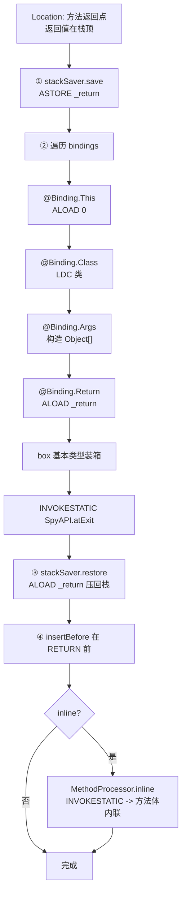
```mermaid
flowchart TD
    LOC[Location: 方法返回点<br/>返回值在栈顶] --> S1[① stackSaver.save<br/>ASTORE _return]
    S1 --> S2[② 遍历 bindings]
    S2 --> B1["@Binding.This<br/>ALOAD 0"]
    B1 --> B2["@Binding.Class<br/>LDC 类"]
    B2 --> B3["@Binding.Args<br/>构造 Object[]"]
    B3 --> B4["@Binding.Return<br/>ALOAD _return"]
    B4 --> S3[box 基本类型装箱]
    S3 --> S4[INVOKESTATIC SpyAPI.atExit]
    S4 --> S5[③ stackSaver.restore<br/>ALOAD _return 压回栈]
    S5 --> S6[④ insertBefore 在 RETURN 前]
    S6 --> S7{inline?}
    S7 -->|是| S8[MethodProcessor.inline<br/>INVOKESTATIC -> 方法体内联]
    S7 -->|否| DONE[完成]
    S8 --> DONE
```

### 6.6 MethodProcessor：方法状态封装与 inline

`MethodProcessor.java`（791 行）封装被增强方法的状态与 ASM 辅助：

```java
// MethodProcessor.java（核心字段）
public class MethodProcessor {
    private String owner;
    private ClassNode classNode;
    private MethodNode methodNode;
    private Type[] argumentTypes;
    private Type returnType;
    private int nextLocals;                          // 下一个可用 local 变量槽
    private AbstractInsnNode enterInsnNode;          // 方法入口指令
    private LabelNode interceptorVariableStartLabelNode;  // 织入变量区起始
    private LocationFilter locationFilter;           // 防重复增强

    // 织入用的临时变量（前缀 _$bytekit$_）
    private int initThrowVariableNode();             // 异常变量
    private int initReturnVariableNode();           // 返回值变量
    private int initInvokeArgsVariableNode();       // 调用参数变量
    private int initMonitorVariableNode();          // monitor 变量
}
```

**构造时定位入口**：`enterInsnNode` 是织入 `@AtEnter` 的位置。对构造器特殊处理--找到 `super()`/`this()` 调用之后的第一条指令（在父类构造完成前不能使用 `this`）：

```java
// MethodProcessor 构造逻辑（简化）
if (methodNode.name.equals("<init>")) {
    enterInsnNode = 找到 invokespecial <init> 之后的第一条指令;  // 跳过 super()/this()
} else {
    enterInsnNode = methodNode.instructions.getFirst();         // 普通方法：首指令
}
```

**`inline(owner, toInlineMethodNode)`（L659-761）**：把刚插入的 `INVOKESTATIC` 调用替换为拦截方法体的内联，避免方法调用开销：

```java
// MethodProcessor.inline 核心逻辑
public void inline(String owner, MethodNode toInlineMethodNode) {
    // 1. 在方法指令中找到刚插入的 INVOKESTATIC（拦截方法调用）
    MethodInsnNode methodInsnNode = 找到匹配的 INVOKESTATIC;
    // 2. 把拦截方法的参数从操作数栈保存到新分配的 local 变量（offset = currentMaxLocals）
    for (Type argType : toInlineMethodNode.argumentTypes 逆序) {
        toInsert.add(new VarInsnNode(对应 store 指令, currentMaxLocals + offset));
    }
    // 3. 复制拦截方法体指令，调整所有 VarInsnNode 的 var（+ currentMaxLocals）
    for (AbstractInsnNode insn : toInlineMethodNode.instructions) {
        if (insn instanceof VarInsnNode) {
            ((VarInsnNode) insn).var += currentMaxLocals;   // 重映射局部变量索引
        }
    }
    // 4. 把拦截方法的 RETURN 指令转成 GOTO endLabel（内联后不能 return）
    // 5. 用内联后的指令序列替换原 INVOKESTATIC 调用
    // 6. 合并 tryCatchBlocks、更新 maxLocals/maxStack
}
```

> **inline 的本质**：先插入 `INVOKESTATIC` 调用拦截方法（保证语义正确），然后把这一条调用指令替换成拦截方法的完整方法体（参数从栈存入新 local、var 索引重映射、return->goto）。结果是拦截方法体直接嵌入目标方法，无方法调用开销。`SpyInterceptors` 全部用 `inline=true`。

### 6.7 Binding 体系：参数绑定的字节码生成

`Binding`（抽象类，`Binding.java`）的核心契约：

```java
public abstract class Binding {
    public boolean optional() { return false; }      // 不可得值时是否转 null
    public boolean check(BindingContext ctx) { return true; }  // 当前上下文是否可用
    public abstract void pushOntoStack(InsnList instructions, BindingContext bindingContext);  // ★ 生成取值压栈字节码
    public abstract Type getType(BindingContext bindingContext);
    public boolean fromStack() { return false; }     // 是否从操作数栈取值（如 @Binding.Return）
}
```

`BindingContext` 封装织入上下文（`Location`、`MethodProcessor`、`StackSaver`），各 Binding 通过它访问方法状态。

#### 典型 Binding 实现

**`ThisBinding`**（绑定 `@Binding.This`）--最简单：

```java
public class ThisBinding extends Binding {
    public void pushOntoStack(InsnList instructions, BindingContext bindingContext) {
        bindingContext.getMethodProcessor().loadThis(instructions);   // 生成 ALOAD 0
    }
    public Type getType(BindingContext bindingContext) { return Type.getType(Object.class); }
}
```

其他常见 Binding（行为简述）：

| Binding | 注解 | 生成的字节码 |
|---------|------|-------------|
| `ThisBinding` | `@Binding.This` | `ALOAD 0`（this） |
| `ArgsBinding` | `@Binding.Args` | 构造 `Object[]` 装入所有参数 |
| `ClassBinding` | `@Binding.Class` | `LDC` 类常量 |
| `MethodInfoBinding` | `@Binding.MethodInfo` | `LDC` "方法名+desc" 字符串 |
| `ReturnBinding` | `@Binding.Return` | `ALOAD _$bytekit$_return`（fromStack=true） |
| `ThrowableBinding` | `@Binding.Throwable` | `ALOAD _$bytekit$_throw`（异常变量） |
| `LineBinding` | `@Binding.Line` | `LDC` 行号常量 |
| `FieldBinding` | `@Binding.Field` | `GETFIELD`/`GETSTATIC` |
| `LocalVarsBinding` | `@Binding.LocalVars` | 遍历 local 变量表构造 `Object[]` |
| `InvokeArgsBinding` | `@Binding.InvokeArgs` | 当前 invoke 指令的参数 |
| `InvokeReturnBinding` | `@Binding.InvokeReturn` | invoke 的返回值 |
| `InvokeInfoBinding` | `@Binding.InvokeInfo` | "owner+name+desc+行号" 字符串 |

#### 绑定解析流程

拦截方法参数上的 `@Binding.Xxx` 注解，由 `@BindingParserHandler` 指定的 Parser 解析成对应 `Binding` 实例，存入 `InterceptorProcessor.bindings`。织入时按参数顺序逐个 `pushOntoStack` 生成取值字节码，确保调用 `INVOKESTATIC` 时栈上的实参与形参一一对应。

```mermaid
flowchart LR
    subgraph 拦截方法签名
        P1["@Binding.This<br/>Object target"]
        P2["@Binding.Class<br/>Class clazz"]
        P3["@Binding.Args<br/>参数数组 args"]
    end
    subgraph 解析
        P1 -->|@BindingParserHandler| BP1[ThisBindingParser]
        P2 -->|@BindingParserHandler| BP2[ClassBindingParser]
        P3 -->|@BindingParserHandler| BP3[ArgsBindingParser]
        BP1 --> B1[ThisBinding]
        BP2 --> B2[ClassBinding]
        BP3 --> B3[ArgsBinding]
    end
    subgraph WEAVE["织入时 pushOntoStack"]
        B1 -->|ALOAD 0| ST[操作数栈]
        B2 -->|LDC 类| ST
        B3 -->|构造参数数组| ST
        ST -->|INVOKESTATIC| CALL[SpyAPI.atEnter]
    end
```

### 6.8 LocationFilter：防止重复织入

`Enhancer.transform`（见 5.2.3）在织入前构建 `GroupLocationFilter`，内含多个子 filter：

- `InvokeContainLocationFilter`：检测方法是否已含 `SpyAPI.atEnter/atExit/atExceptionExit` 调用。若已含，说明该方法已被增强，跳过对应位置（避免多次 watch 命令重复织入同一段代码）。
- `InvokeCheckLocationFilter`：invoke 级防重复，检测 `SpyAPI.atBeforeInvoke/atAfterInvoke` 调用。

```java
// Enhancer.java L253-274（见 5.2.3）
LocationFilter enterFilter = new InvokeContainLocationFilter(
        Type.getInternalName(SpyAPI.class), "atEnter", LocationType.ENTER);
// 匹配 ENTER 位置前，先检查方法是否已调用 SpyAPI.atEnter
```

`MethodProcessor.getLocationFilter()` 返回此 filter，`InvokeLocationMatcher.match` 在每个候选 invoke 点调用 `locationFilter.allow(...)` 决定是否织入。这是 arthas 支持「同方法多次 watch/trace 叠加增强而不重复织入」的关键。

### 6.9 ByteKit 织入全流程总览

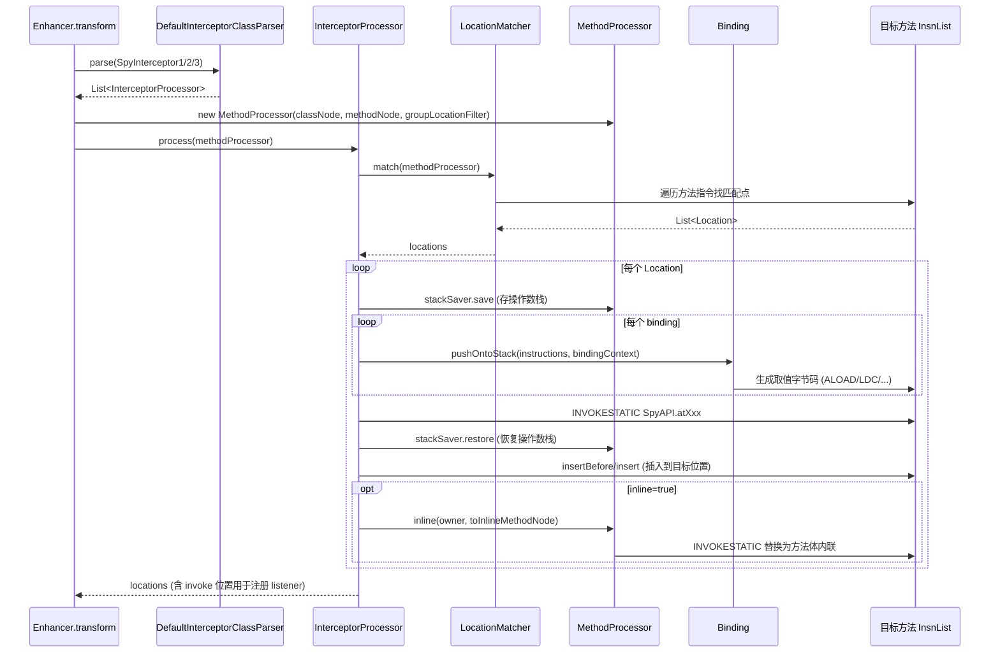
```mermaid
sequenceDiagram
    participant E as Enhancer.transform
    participant P as DefaultInterceptorClassParser
    participant IP as InterceptorProcessor
    participant LM as LocationMatcher
    participant MP as MethodProcessor
    participant B as Binding
    participant ASM as 目标方法 InsnList

    E->>P: parse(SpyInterceptor1/2/3)
    P-->>E: List<InterceptorProcessor>
    E->>MP: new MethodProcessor(classNode, methodNode, groupLocationFilter)
    E->>IP: process(methodProcessor)
    IP->>LM: match(methodProcessor)
    LM->>ASM: 遍历方法指令找匹配点
    ASM-->>LM: List<Location>
    LM-->>IP: locations
    loop 每个 Location
        IP->>MP: stackSaver.save (存操作数栈)
        loop 每个 binding
            IP->>B: pushOntoStack(instructions, bindingContext)
            B->>ASM: 生成取值字节码 (ALOAD/LDC/...)
        end
        IP->>ASM: INVOKESTATIC SpyAPI.atXxx
        IP->>MP: stackSaver.restore (恢复操作数栈)
        IP->>ASM: insertBefore/insert (插入到目标位置)
        opt inline=true
            IP->>MP: inline(owner, toInlineMethodNode)
            MP->>ASM: INVOKESTATIC 替换为方法体内联
        end
    end
    IP-->>E: locations (含 invoke 位置用于注册 listener)
```

### 6.10 ByteKit 关键设计点

1. **声明式 + 元注解驱动**：位置注解与绑定注解各自被 `@InterceptorParserHander`/`@BindingParserHandler` 标注，扩展新位置/新绑定只需新增注解 + Parser，无需改框架代码。这正是 arthas 能用 `SpyInterceptors` 简洁声明所有增强点的基础。
2. **三段式织入（save-call-restore）**：`StackSaver` 保证织入拦截调用前后操作数栈状态一致，使 `@AtExit`（返回值在栈顶）等场景也能正确织入而不破坏原方法语义。
3. **inline 消除调用开销**：先 `INVOKESTATIC` 保证语义，再替换为方法体内联（var 重映射、return->goto），既正确又高效。arthas 所有拦截器用 `inline=true`。
4. **try/catch 保护**：`exceptionHandlerConfig` 可把拦截调用包在 try/catch 内，防止拦截方法抛异常影响目标方法原逻辑。`@AtExceptionExit` 的全方法 try/catch 由 `MethodProcessor.initTryCatchBlock` 完成。
5. **LocationFilter 幂等**：通过检测已存在的 `SpyAPI` 调用避免重复织入，支持多命令叠加增强同一方法。

---

## 七、运行时事件回调与结果输出

本节追踪一次目标方法执行如何触发增强回调、求值、并回写到客户端。以 `watch` 命令为例。

### 7.1 命令侧触发增强：EnhancerCommand

`core/command/monitor200/EnhancerCommand.java`（331 行）是所有增强类命令（watch/trace/stack/monitor/tt/line）的抽象基类，`extends AnnotatedCommand`。其 `process(CommandProcess)` 是触发增强的衔接点：

```java
// EnhancerCommand.java L160-169
@Override
public void process(final CommandProcess process) {
    process.interruptHandler(new CommandInterruptHandler(process));  // Ctrl+C 支持
    process.stdinHandler(new QExitHandler(process));                 // Q 退出支持
    enhance(process);   // ← 触发增强
}
```

`enhance(CommandProcess)`（L193-292）的关键步骤：

```java
// EnhancerCommand.java L193-292（核心节选）
protected void enhance(CommandProcess process) {
    Session session = process.session();
    if (!session.tryLock()) {                       // ① 会话互斥锁：同一时刻只允许一个增强命令
        process.end(-1, "someone else is enhancing classes, pls. wait.");
        return;
    }
    try {
        Instrumentation inst = session.getInstrumentation();
        AdviceListener listener = getAdviceListenerWithId(process);   // ② 获取 listener
        // ③ 创建 Enhancer
        Enhancer enhancer = new Enhancer(listener, listener instanceof InvokeTraceable,
                skipJDKTrace, getClassNameMatcher(), getClassNameExcludeMatcher(),
                getMethodNameMatcher(), this.lazy, this.hashCode);
        enhancer.setLineEnhanceOptions(getLineEnhanceOptions());
        process.register(listener, enhancer);      // ④ 注册（用于结束时清理）
        effect = enhancer.enhance(inst, this.maxNumOfMatchedClass);  // ⑤ 触发增强！

        if (effect.getThrowable() != null) { ...; process.end(1, msg); return; }
        if (effect.cCnt() == 0 || effect.mCnt() == 0) {
            if (this.lazy) {
                process.write("Lazy mode... waiting for class to be loaded...\n");
            } else {
                process.end(-1, "No class or method is affected..."); return;
            }
        }
        process.appendResult(EnhancerModelFactory.create(effect, true));  // ⑥ 输出影响范围
        scheduleTimeoutTask(process);   // ⑦ 超时任务
        // ⑧ 异步执行：命令在此挂起，由 AdviceListener 在运行时触发 process.end()
    } finally {
        if (session.getLock() == lock) session.unLock();   // 解锁
    }
}
```

> **关键注释**（L280）`// 异步执行，在AdviceListener中结束`：增强完成后 `process` 并不立即 `end()`，命令挂起等待目标方法被调用时由 listener 触发结束（如 watch 达到 `-n` 次数后 `abortProcess`，或 `--timeout` 到期，或 `Ctrl+C`）。

### 7.2 WatchCommand 与 WatchAdviceListener

`WatchCommand`（`core/command/monitor200/WatchCommand.java`）用注解声明命令元数据，并实现三个抽象方法：

```java
// WatchCommand.java
@Name("watch")
@Summary("Display the input/output parameter, return object, and thrown exception ...")
public class WatchCommand extends EnhancerCommand {
    @Argument(index = 0, argName = "class-pattern")  ... setClassPattern(...)
    @Argument(index = 1, argName = "method-pattern") ... setMethodPattern(...)
    @Argument(index = 2, argName = "express", required = false)
    @DefaultValue("{params, target, returnObj}")   ... setExpress(...)
    @Option(shortName = "b", flag = true) ... setBefore(...)    // -b 方法调用前
    @Option(shortName = "f", flag = true) ... setFinish(...)    // -f 方法返回后（默认）
    @Option(shortName = "e", flag = true) ... setException(...) // -e 抛异常时
    @Option(shortName = "s", flag = true) ... setSuccess(...)   // -s 成功返回时
    @Option(shortName = "n") ... setNumberOfLimit(...)           // -n 次数限制

    @Override
    public void process(CommandProcess process) {
        String validateError = validateSizeLimit(sizeLimit);
        if (validateError != null) { process.end(-1, validateError); return; }
        super.process(process);   // 走 EnhancerCommand.process
    }

    @Override
    protected AdviceListener getAdviceListener(CommandProcess process) {
        return new WatchAdviceListener(this, process, GlobalOptions.verbose || this.verbose);
    }
    // getClassNameMatcher / getMethodNameMatcher：把 pattern 转 Matcher
}
```

`WatchAdviceListener`（`core/command/monitor200/WatchAdviceListener.java`，117 行）继承 `AdviceListenerAdapter`，实现 `before/afterReturning/afterThrowing`：

```java
// WatchAdviceListener.java
@Override
public void before(...) {
    threadLocalWatch.start();                                  // 开始计时
    if (command.isBefore()) {                                  // -b
        watching(Advice.newForBefore(loader, clazz, method, target, args));
    }
}
@Override
public void afterReturning(..., Object returnObject) {
    Advice advice = Advice.newForAfterReturning(...);
    if (command.isSuccess()) watching(advice);                 // -s
    finishing(advice);                                         // -f（默认）
}
@Override
public void afterThrowing(..., Throwable throwable) {
    Advice advice = Advice.newForAfterThrowing(...);
    if (command.isException()) watching(advice);               // -e
    finishing(advice);                                         // -f（默认）
}
```

核心的 `watching(Advice advice)`（L76-116）完成「条件过滤 → OGNL 求值 → 输出 → 次数限制」：

```java
private void watching(Advice advice) {
    double cost = threadLocalWatch.costInMillis();                        // 耗时
    boolean conditionResult = isConditionMet(command.getConditionExpress(), advice, cost);  // OGNL 条件
    if (conditionResult) {
        Object value = getExpressionResult(command.getExpress(), advice, cost);             // OGNL 求值
        WatchModel model = new WatchModel();
        model.setValue(new ObjectVO(value, command.getExpand()));   // -x 展开层级
        ...
        process.appendResult(model);                                // 写入结果
        process.times().incrementAndGet();
        if (isLimitExceeded(command.getNumberOfLimit(), process.times().get())) {
            abortProcess(process, command.getNumberOfLimit());      // 达 -n 限制，结束命令
        }
    }
}
```

### 7.3 运行时回调时序图（watch 为例）

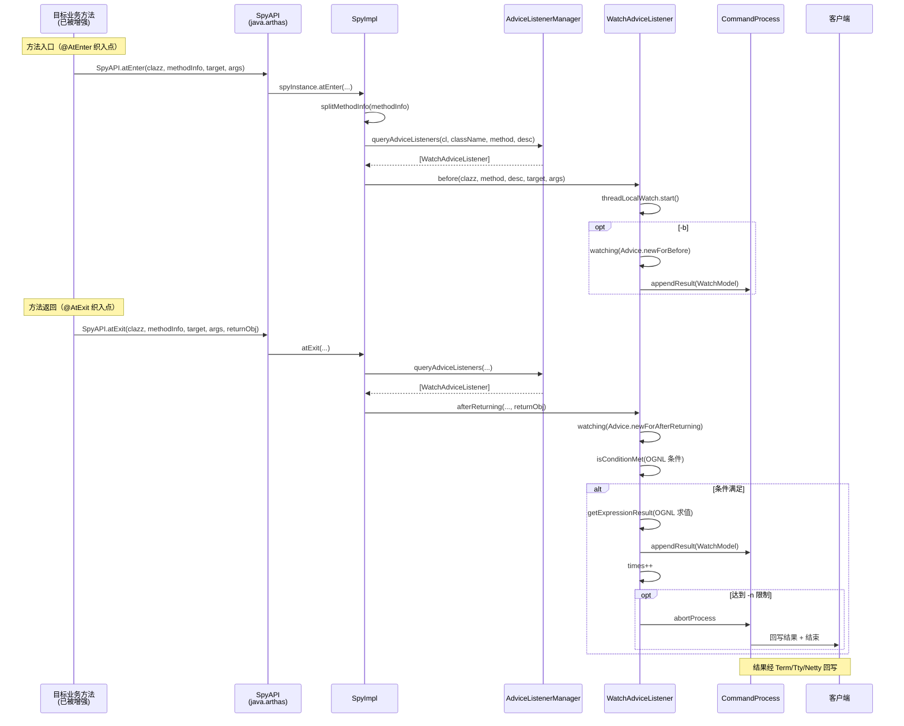
```mermaid
sequenceDiagram
    participant T as 目标业务方法<br/>(已被增强)
    participant SA as SpyAPI<br/>(java.arthas)
    participant SI as SpyImpl
    participant ALM as AdviceListenerManager
    participant WAL as WatchAdviceListener
    participant CP as CommandProcess
    participant CL as 客户端

    Note over T: 方法入口（@AtEnter 织入点）
    T->>SA: SpyAPI.atEnter(clazz, methodInfo, target, args)
    SA->>SI: spyInstance.atEnter(...)
    SI->>SI: splitMethodInfo(methodInfo)
    SI->>ALM: queryAdviceListeners(cl, className, method, desc)
    ALM-->>SI: [WatchAdviceListener]
    SI->>WAL: before(clazz, method, desc, target, args)
    WAL->>WAL: threadLocalWatch.start()
    opt -b
        WAL->>WAL: watching(Advice.newForBefore)
        WAL->>CP: appendResult(WatchModel)
    end

    Note over T: 方法返回（@AtExit 织入点）
    T->>SA: SpyAPI.atExit(clazz, methodInfo, target, args, returnObj)
    SA->>SI: atExit(...)
    SI->>ALM: queryAdviceListeners(...)
    ALM-->>SI: [WatchAdviceListener]
    SI->>WAL: afterReturning(..., returnObj)
    WAL->>WAL: watching(Advice.newForAfterReturning)
    WAL->>WAL: isConditionMet(OGNL 条件)
    alt 条件满足
        WAL->>WAL: getExpressionResult(OGNL 求值)
        WAL->>CP: appendResult(WatchModel)
        WAL->>WAL: times++
        opt 达到 -n 限制
            WAL->>CP: abortProcess
            CP->>CL: 回写结果 + 结束
        end
    end
    Note over CP,CL: 结果经 Term/Tty/Netty 回写
```

### 7.4 命令触发增强时序图（增强期）

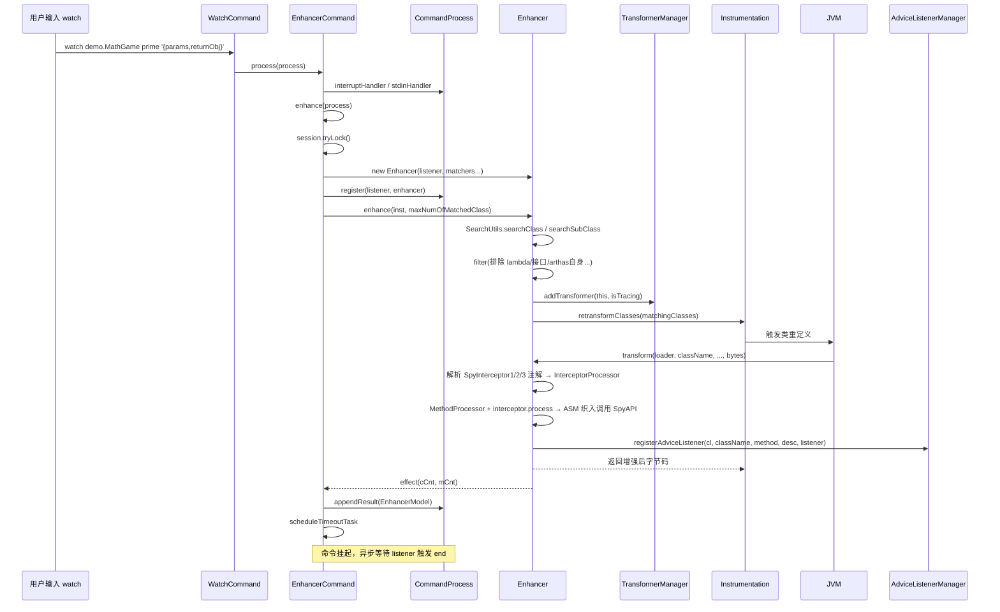
```mermaid
sequenceDiagram
    participant U as 用户输入 watch
    participant WC as WatchCommand
    participant EC as EnhancerCommand
    participant CP as CommandProcess
    participant E as Enhancer
    participant TM as TransformerManager
    participant IN as Instrumentation
    participant JVM as JVM
    participant ALM as AdviceListenerManager

    U->>WC: watch demo.MathGame prime '{params,returnObj}'
    WC->>EC: process(process)
    EC->>CP: interruptHandler / stdinHandler
    EC->>EC: enhance(process)
    EC->>EC: session.tryLock()
    EC->>E: new Enhancer(listener, matchers...)
    EC->>CP: register(listener, enhancer)
    EC->>E: enhance(inst, maxNumOfMatchedClass)
    E->>E: SearchUtils.searchClass / searchSubClass
    E->>E: filter(排除 lambda/接口/arthas自身...)
    E->>TM: addTransformer(this, isTracing)
    E->>IN: retransformClasses(matchingClasses)
    IN->>JVM: 触发类重定义
    JVM->>E: transform(loader, className, ..., bytes)
    E->>E: 解析 SpyInterceptor1/2/3 注解 → InterceptorProcessor
    E->>E: MethodProcessor + interceptor.process → ASM 织入调用 SpyAPI
    E->>ALM: registerAdviceListener(cl, className, method, desc, listener)
    E-->>IN: 返回增强后字节码
    E-->>EC: effect(cCnt, mCnt)
    EC->>CP: appendResult(EnhancerModel)
    EC->>EC: scheduleTimeoutTask
    Note over EC,CP: 命令挂起，异步等待 listener 触发 end
```

---

## 八、端到端全链路总览

本节用一个完整的端到端时序图，把前面各章串联：从用户发起 `watch` 命令，经 Netty 接入、Shell 分发、命令执行、字节码增强、运行时事件回调，到结果回写客户端的全过程。

### 8.1 端到端完整时序图

```mermaid
sequenceDiagram
    autonumber
    participant U as 用户
    participant NET as Netty Pipeline<br/>(ProtocolDetect/Http/WS)
    participant SS as ShellServerImpl
    participant SH as ShellImpl
    participant J as Job
    participant WC as WatchCommand
    participant CP as CommandProcess<br/>(ProcessImpl)
    participant E as Enhancer
    participant TM as TransformerManager
    participant JVM as JVM Instrumentation
    participant BK as ByteKit<br/>(InterceptorProcessor)
    participant ALM as AdviceListenerManager
    participant T as 目标业务方法<br/>(已增强)
    participant SA as SpyAPI
    participant SI as SpyImpl
    participant WAL as WatchAdviceListener
    participant RD as ResultDistributor

    Note over U,NET: ① 接入阶段（见第三章）
    U->>NET: websocket 连接 / telnet
    NET->>SS: handler.accept(conn)
    SS->>SH: createShell -> readline

    Note over U,WC: ② 命令分发阶段（见第四章）
    U->>NET: "watch demo.A foo '{params,returnObj}' -n 3"
    NET->>SH: ShellLineHandler.handle
    SH->>J: createJob(tokens)
    J->>WC: process(process)

    Note over WC,E: ③ 触发增强阶段（见第五、七、六章）
    WC->>CP: interruptHandler / stdinHandler
    WC->>E: new Enhancer(listener, matchers...)
    WC->>CP: register(listener, enhancer)
    WC->>E: enhance(inst, maxNum)
    E->>TM: addTransformer(this)
    E->>JVM: retransformClasses(matchingClasses)

    Note over JVM,BK: ④ 织入阶段（JVM 回调 transform）
    JVM->>E: transform(loader, className, ..., bytes)
    E->>BK: DefaultInterceptorClassParser.parse(SpyInterceptor1/2/3)
    BK-->>E: List<InterceptorProcessor>
    E->>BK: interceptor.process(MethodProcessor)
    BK->>BK: LocationMatcher.match -> 保存栈+binding压参+INVOKESTATIC SpyAPI+恢复栈+inline
    BK-->>E: 增强后字节码
    E->>ALM: registerAdviceListener(cl, className, method, desc, listener)
    E-->>JVM: 返回增强字节码
    E-->>WC: EnhancerAffect(cCnt, mCnt)
    WC->>CP: appendResult(EnhancerModel)
    Note over WC,CP: 命令挂起，异步等待事件

    Note over U,T: ⑤ 运行时事件阶段（业务方法被调用）
    U->>T: 调用 demo.A.foo()
    Note over T: 方法入口(@AtEnter 织入点)
    T->>SA: SpyAPI.atEnter(clazz, methodInfo, target, args)
    SA->>SI: spyInstance.atEnter(...)
    SI->>ALM: queryAdviceListeners(cl, className, method, desc)
    ALM-->>SI: [WatchAdviceListener]
    SI->>WAL: before(...)
    opt -b
        WAL->>RD: appendResult(WatchModel)
    end

    Note over T: 方法返回(@AtExit 织入点)
    T->>SA: SpyAPI.atExit(..., returnObj)
    SA->>SI: atExit(...)
    SI->>ALM: queryAdviceListeners(...)
    SI->>WAL: afterReturning(...)
    WAL->>WAL: watching(Advice): OGNL 条件 + 求值
    WAL->>RD: appendResult(WatchModel)
    WAL->>CP: times++

    Note over RD,U: ⑥ 结果回写阶段
    RD->>SH: 结果经 Tty -> Netty
    NET->>U: websocket 文本帧 / http 响应

    Note over WAL: 达到 -n 3 限制
    WAL->>CP: abortProcess
    CP->>CP: end() -> unregister(移除 transformer + listener)
    CP->>SH: ShellJobHandler.onTerminated -> resetAndReadLine
    Note over T: 后续 foo() 调用因 listener 已移除/TERMINATED 跳过
```

### 8.2 增强期 vs 运行期：两条链路对照

```mermaid
flowchart LR
    subgraph 增强期链路["增强期 同步 织入"]
        direction TB
        A1[WatchCommand.process] --> A2[Enhancer.enhance]
        A2 --> A3[TransformerManager.addTransformer]
        A3 --> A4[Instrumentation.retransformClasses]
        A4 --> A5[JVM 回调 Enhancer.transform]
        A5 --> A6[ByteKit 解析注解+ASM织入]
        A6 --> A7[AdviceListenerManager.register]
        A7 --> A8[返回增强字节码]
    end
    subgraph 运行期链路["运行期 事件回调"]
        direction TB
        B1[目标方法执行到织入点] --> B2[调用 SpyAPI.atXxx]
        B2 --> B3[SpyImpl 查路由表]
        B3 --> B4[AdviceListenerManager.query]
        B4 --> B5[分发到 WatchAdviceListener]
        B5 --> B6[OGNL 求值+过滤]
        B6 --> B7[appendResult]
        B7 --> B8[结果回写客户端]
    end
    A8 -.->|命令挂起，等待事件| B1
```

### 8.3 关键跨越点

| 跨越点 | 从 -> 到 | 机制 |
|--------|---------|------|
| 客户端 -> 目标 JVM | Netty -> Shell | `ProtocolDetectHandler` 检测协议，`handler.accept(conn)` 建桥 |
| Shell -> 命令 | `ShellLineHandler` -> `Command` | `CliTokenizer` 分词 + `JobController.createJob` + `job.run()` |
| 命令 -> 增强 | `EnhancerCommand.process` -> `Enhancer.enhance` | `process.register` + `enhance` 触发 retransform |
| 增强 -> ByteKit | `Enhancer.transform` -> `InterceptorProcessor.process` | `DefaultInterceptorClassParser.parse` 解析 `SpyInterceptors` 注解 |
| ByteKit -> SpyAPI | 织入的 `INVOKESTATIC` | ASM 在目标方法织入 `SpyAPI.atXxx` 调用 |
| 增强期 -> 运行期 | `AdviceListenerManager.register` -> `query` | 按 ClassLoader+className+method 路由表 |
| 运行期 SpyAPI -> listener | `SpyImpl.atXxx` -> `AdviceListener` | `splitMethodInfo` + 查表 + `before/afterReturning` |
| listener -> 客户端 | `WatchAdviceListener` -> `CommandProcess` -> Netty | `appendResult` -> `ResultDistributor` -> `Tty` -> WebSocket |

> **核心闭环**：增强期在目标方法织入「调用 `SpyAPI`」的字节码并在路由表注册；运行期目标方法执行触发 `SpyAPI` 调用，经 `SpyImpl` 查路由表分发到 listener，listener 求值后把结果经 `CommandProcess` 回写客户端。两条链路通过 `AdviceListenerManager` 路由表与 `SpyAPI` 桥接类解耦，是 arthas 不侵入业务代码实现运行时诊断的根本机制。

---

## 九、关键设计点与实现技巧总结

1. **Spy 桥接模式**：`SpyAPI`（BootstrapClassLoader）与 `SpyImpl`（arthas ClassLoader）通过 `AbstractSpy` 抽象类解耦。`NopSpy` 默认实现保证增强代码在 arthas 未就绪/已卸载时仍安全运行。

2. **双根 transformer**：`TransformerManager` 只向 JVM 注册 2 个根 transformer，命令级 transformer 在内部列表管理，避免 JVM transformer 数量膨胀；同时通过链式串联支持多命令叠加增强。

3. **懒加载增强**：`lazyClassFileTransformer`（`canRetransform=false`）在类首次定义时触发，配合 `--lazy`/`-L` 支持类尚未加载时的增强。

4. **防重复织入**：`GroupLocationFilter` + `InvokeContainLocationFilter`/`InvokeCheckLocationFilter` 检测方法是否已含 `SpyAPI` 调用，避免多次 watch 命令重复织入同一段代码。

5. **按 ClassLoader+方法路由**：`AdviceListenerManager` 用 `ConcurrentWeakKeyHashMap<ClassLoader, ...>` 分桶，key 为 `className+method+desc`（方法级）/`+owner`（调用级）/`+#line`（行级），支持同方法多 listener 分发且随 ClassLoader 卸载回收。

6. **声明式增强（ByteKit）**：`SpyInterceptors` 用 `@AtEnter/@AtExit/@AtInvoke/@AtLine` + `@Binding` 声明增强点与参数绑定，`inline=true` 内联减少调用开销。增强逻辑与字节码操作分离，可读性强。

7. **命令异步生命周期**：`EnhancerCommand.enhance` 完成后命令挂起，由 listener 在运行时事件中触发 `process.end`/`abortProcess`，支持 watch 类命令长时间监听。`skipAdviceListener` 防止向已终止命令发事件。

8. **影响统计与可观测**：`EnhancerAffect` 统计 `cCnt/mCnt`、记录 `methods` 列表与 `classDumpFiles`，命令结束时回显，便于用户确认增强范围。

---

*本文档基于 arthas 源码（master 分支）精读整理。部分子系统章节由并行源码分析补充完善。*
