# Arthas 终端实现与命令发送全流程深度分析

> 本文聚焦两个核心问题：**arthas 是如何使用 termd 实现终端的**，以及**用户敲下的命令是如何被"发送出去"并执行的**。所有流程图、时序图均以 mermaid 呈现。
>
> 涉及源码版本：arthas core（master 分支）+ `com.alibaba.middleware:termd-core:1.1.7.16`（termd 源码取自 Maven Central sources jar）。

---

## 目录

- [第一章 引言：arthas 终端与 termd](#第一章-引言arthas-终端与-termd)
- [第二章 termd 核心抽象](#第二章-termd-核心抽象)
- [第三章 arthas 终端分层架构](#第三章-arthas-终端分层架构)
- [第四章 接入流程：从连接到 readline](#第四章-接入流程从连接到-readline)
- [第五章 输入解码链路](#第五章-输入解码链路)
- [第六章 readline 行编辑](#第六章-readline-行编辑)
- [第七章 命令如何发送出去（核心）](#第七章-命令如何发送出去核心)
- [第八章 命令执行与输出闭环](#第八章-命令执行与输出闭环)
- [第九章 信号处理](#第九章-信号处理)
- [第十章 Tab 补全](#第十章-tab-补全)
- [第十一章 Job 生命周期与状态机](#第十一章-job-生命周期与状态机)
- [第十二章 端到端总览](#第十二章-端到端总览)
- [第十三章 设计要点总结](#第十三章-设计要点总结)

---

## 第一章 引言：arthas 终端与 termd

### 1.1 arthas 终端要解决什么

arthas 是 JVM 在线诊断工具，它需要在**被诊断的目标 JVM 进程内**提供一个可交互的命令行终端。这个终端有几条硬约束：

1. **不能依赖本地 PTY**：arthas 注入到目标 JVM，通常没有可用的本地终端设备，必须通过网络协议（telnet / websocket）接入。
2. **多协议统一**：同一个命令处理内核要同时服务 telnet 客户端、websocket（浏览器 Web UI）、以及 VM 内部 Local 连接。
3. **行编辑能力**：要支持方向键、退格、历史、Ctrl-C 等行编辑与信号语义，而不是把字节流原样回显。
4. **命令可接管输入**：交互式命令（如 `watch`、`trace`）运行时需要直接读取按键，与 readline 行编辑共用同一个输入通道。

### 1.2 termd 是什么

termd 是 Julien Viet（Vert.x 作者）开发的 Java 终端库，`com.alibaba.middleware:termd-core` 是 alibaba 在此基础上的 fork。arthas 直接复用 termd 的以下能力：

| termd 能力 | 对应类 | 作用 |
|---|---|---|
| 传输抽象 | `io.termd.core.tty.TtyConnection` | 屏蔽 telnet/websocket/pty 差异 |
| 行编辑器 | `io.termd.core.readline.Readline` | 行缓冲、回显、历史、信号 |
| 键映射 | `io.termd.core.readline.Keymap` | 按键序列 → readline 函数 |
| readline 函数 | `io.termd.core.readline.Function` | accept-line / complete / kill-line … |
| 信号解码 | `io.termd.core.tty.TtyEventDecoder` | 识别 Ctrl-C / Ctrl-D / Ctrl-Z |
| HTTP/WebSocket 连接 | `io.termd.core.http.HttpTtyConnection` | JSON over WebSocket 协议 |
| Telnet 连接 | `io.termd.core.telnet.TelnetTtyConnection` | telnet 协议协商 |

arthas 在 termd 之上做了一层薄适配 `TermImpl`，并构建 `ShellImpl` 会话层与命令分发层。

### 1.3 终端分层总览

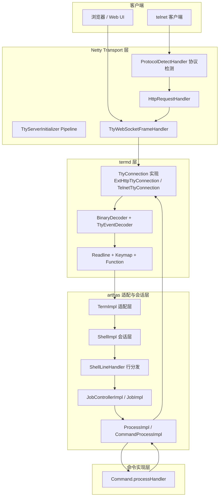

整条链路的本质是：**输入字节 → 解码 → readline 行编辑 → 回车触发命令分发 → 命令执行 → 输出回写 → 回到 readline**。下面逐层展开。

---

## 第二章 termd 核心抽象

理解 arthas 终端的前提是先理解 termd 的六个核心抽象。

### 2.1 TtyConnection：传输抽象

`TtyConnection` 是一个接口，定义了终端连接的所有能力，但不绑定任何具体传输：

```java
public interface TtyConnection {
  long lastAccessedTime();
  Vector size();                              // 终端宽高
  String terminalType();                      // 终端类型 vt100 等
  Consumer<int[]> getStdinHandler();           // 输入处理器（codePoints）
  void setStdinHandler(Consumer<int[]> h);    // 设置输入处理器 ← 切换输入走向的关键
  Consumer<int[]> stdoutHandler();            // 输出处理器（codePoints）
  BiConsumer<TtyEvent, Integer> getEventHandler();   // 信号处理器
  void setEventHandler(BiConsumer<TtyEvent,Integer> h);
  TtyConnection write(String s);              // 写字符串给客户端
  void execute(Runnable task);                // 在连接的 EventLoop 上调度
  void close();
}
```

关键点：`stdinHandler` / `eventHandler` / `sizeHandler` 都是**可替换的回调**。termd 的 readline 正是通过替换 `stdinHandler` 来接管输入的。`execute(Runnable)` 把任务调度到该连接绑定的线程（Netty EventLoop），保证单线程串行执行。

### 2.2 Readline + Interaction：行编辑状态机

`Readline` 是 termd 行编辑的入口，内部用 `Interaction` 表示一次"读一行"的交互状态：

- `readline(conn, prompt, requestHandler, completionHandler)`：开始读一行，`requestHandler` 在用户回车（或 Ctrl-D 空行）时被回调，参数就是整行文本——**这是命令"发送出去"的出口**。
- `Interaction.install()`：保存 conn 原有的 stdin/size/event handler，然后把自己的内部 handler 设为 conn.stdinHandler（接管输入）。
- `Interaction.handle(KeyEvent)`：处理一个解码后的按键事件，做行编辑或分发 Function。
- `Interaction.end(String)`：结束本次交互，恢复 conn 原有 handler，回调 `requestHandler.accept(line)`。

### 2.3 Keymap + EventQueue + KeyEvent：按键解码

`Keymap` 把按键序列绑定到 readline 函数名（来自 `inputrc` 配置）：

```
"\e[D": backward-char       # 左方向键
"\C-i": complete            # Tab
"\C-j": accept-line         # 回车(LF)
"\C-m": accept-line         # 回车(CR)
"\C-k": kill-line           # Ctrl-K 删到行尾
"\C-a": beginning-of-line
"\C-?": backward-delete-char # 退格
```

`EventQueue` 是一个按键缓冲队列，用 `Keymap.bindings` 对原始 codePoints 做**最长前缀匹配**：
- 完整匹配某个绑定 → 产生 `FunctionEvent`（如 accept-line）。
- 只是某个绑定的前缀（如 `\e` 后续未到）→ 等待更多输入。
- 不匹配任何绑定 → 退化为单字符 `KeyEvent`（普通可打印字符）。

### 2.4 Function：readline 函数

`Function` 是一个接口，`name()` 返回函数名，`apply(Interaction)` 执行编辑动作。termd 内置了一批（`io.termd.core.readline.functions.*`）：

| 函数名 | 作用 |
|---|---|
| accept-line | 提交当前行（回车） |
| complete | Tab 补全 |
| backward-char / forward-char | 左右移动 |
| backward-delete-char | 退格 |
| kill-line | 删到行尾 |
| beginning-of-line / end-of-line | 行首/行尾 |
| previous-history / next-history | 上下历史 |
| undo | 撤销 |

arthas 还通过 SPI 加载这些 Function，并对 `history` 类函数用 `FunctionInvocationHandler` 动态代理，**未鉴权时禁止查看历史**。

### 2.5 LineBuffer：行缓冲与差异回显

`LineBuffer` 维护一行 codePoints + 光标位置。它的核心是 `update(dst, out, width)` 方法：比较**旧缓冲**（屏幕当前状态）与**目标缓冲**（编辑后的新内容），生成**最小差异的 ANSI 转义序列**输出到 `out`（即 stdoutHandler）。

两套算法：
- `Update`：单宽字符场景，逐格比较、局部重写、`\033[K` 清行尾。
- `Redraw`：含宽字符（中文等）场景，整行擦除重绘，正确处理宽字符与组合字符。

这就是为什么你按一个键，屏幕上只有对应位置变化——termd 在做增量 diff 回显。

### 2.6 TtyEventDecoder：信号分流

`TtyEventDecoder` 实现了 `Consumer<int[]>`，接在 `BinaryDecoder` 之后。它扫描 codePoints，检测三个控制字符：

```java
TtyEvent.INTR  = 'C' - 64  // Ctrl-C (codePoint 3)
TtyEvent.EOF   = 'D' - 64  // Ctrl-D (codePoint 4)
TtyEvent.SUSP  = 'Z' - 64  // Ctrl-Z (codePoint 26)
```

一旦命中：
- 命中点之前的普通字符 → 转给 `readHandler`（即 stdinHandler）。
- 信号本身 → 转给 `eventHandler`（即 EventHandler）。
- 命中点之后继续扫描。

这是 arthas 能区分"普通输入"与"Ctrl-C 中断"的关键。

### 2.7 termd 核心类关系

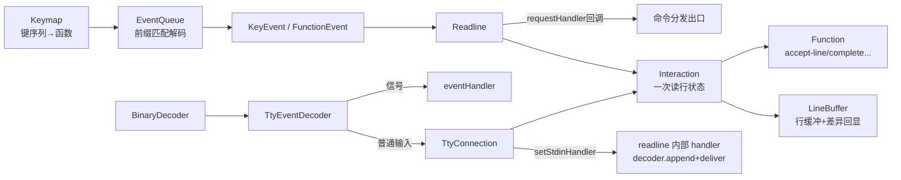

---

## 第三章 arthas 终端分层架构

### 3.1 五层划分

arthas 终端自底向上分为五层：

| 层 | 代表类 | 职责 |
|---|---|---|
| ① Netty Transport | `TtyServerInitializer`、`TtyWebSocketFrameHandler`、`ProtocolDetectHandler` | 接收网络字节、协议检测、WebSocket 握手 |
| ② termd TtyConnection | `ExtHttpTtyConnection`、`TelnetTtyConnection` | 把字节解码为 codePoints、信号分流、输出编码 |
| ③ arthas Term 适配 | `TermImpl` | 封装 Readline、三层 stdinHandler 切换、echo、信号分发 |
| ④ Shell 会话 | `ShellImpl`、`ShellLineHandler` | 鉴权、readline 调用、命令行 tokenize、Job 创建 |
| ⑤ Job/Process | `JobControllerImpl`、`JobImpl`、`ProcessImpl` | 命令查找、管道/重定向、进程状态机、命令执行 |

### 3.2 TermImpl：termd 之上的适配层

`TermImpl` 是 arthas 对 `TtyConnection` 的包装，构造时完成 termd 初始化：

```java
public TermImpl(Keymap keymap, TtyConnection conn) {
    this.conn = conn;
    readline = new Readline(keymap);                              // 1. 创建行编辑器
    readline.setHistory(FileUtils.loadCommandHistory(...));        // 2. 加载命令历史
    for (Function function : readlineFunctions) {                  // 3. 注册 readline 函数
        if (function.name().contains("history")) {
            // 代理 history 函数，未鉴权时禁止
            function = (Function) Proxy.newProxyInstance(..., funcHandler);
        }
        readline.addFunction(function);
    }
    echoHandler = new DefaultTermStdinHandler(this);
    conn.setStdinHandler(echoHandler);                             // 4. 设置默认输入处理器（echo+queueEvent）
    conn.setEventHandler(new EventHandler(this));                  // 5. 设置信号处理器
}
```

`TermImpl` 维护三个关键回调：
- `echoHandler`（`DefaultTermStdinHandler`）：默认/空闲态输入处理器，echo 回显 + `readline.queueEvent` 暂存。
- `stdinHandler`（命令运行时）：命令注册的输入处理器，经 `StdinHandlerWrapper` 透传。
- `readline` 内部 handler：readline 模式下由 `Interaction.install` 设置，`decoder.append + deliver`。

### 3.3 三层 stdinHandler 模型

`conn.stdinHandler` 在不同阶段是不同对象，这是 arthas 终端输入分发的核心设计：

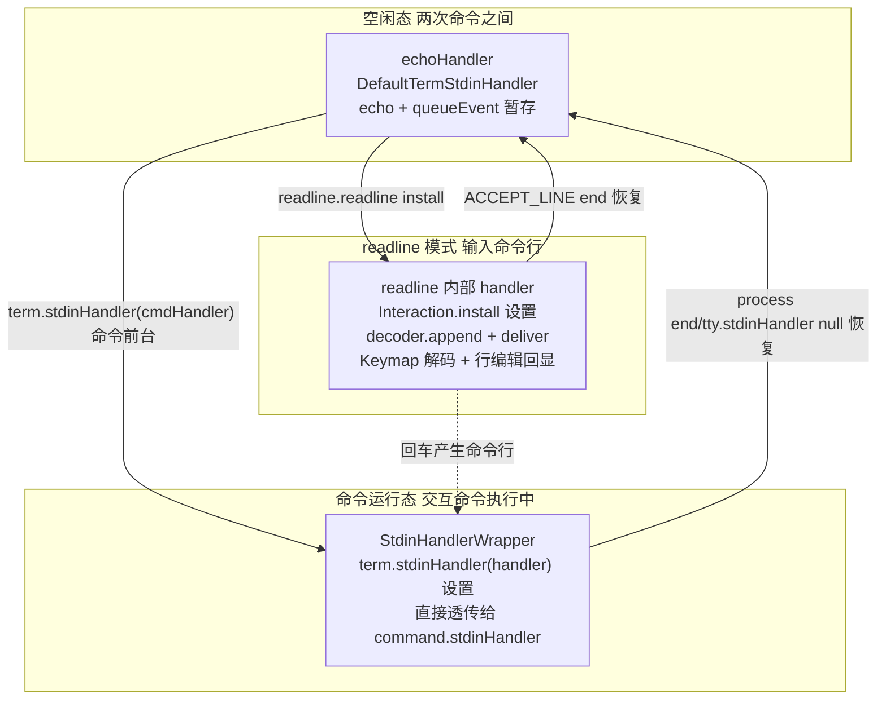

切换规则（都在 `TermImpl` 中）：
- `readline(prompt, lineHandler)`：进入 readline，`Readline.readline` 内部 `install()` 把 stdinHandler 设为 readline 内部 handler。
- `Interaction.end(raw)`：恢复 stdinHandler 为 `echoHandler`（`prevReadHandler`）。
- `term.stdinHandler(handler)`（`handler != null`）：命令前台运行，设为 `StdinHandlerWrapper(handler)`。
- `term.stdinHandler(null)`：命令结束，恢复为 `echoHandler`。

### 3.4 分层架构图

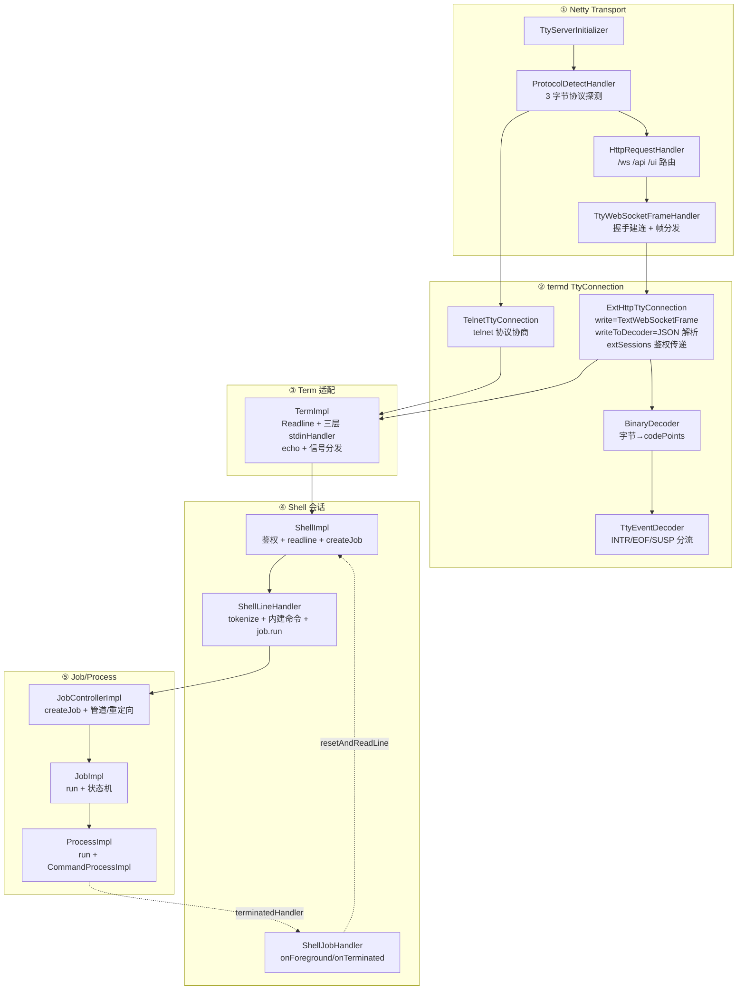

---

## 第四章 接入流程：从连接到 readline

### 4.1 HttpTermServer：termd 与 arthas 的桥

`HttpTermServer.listen()` 是接入入口，它把 termd 的 `Consumer<TtyConnection>` 回调转成 arthas 的 `TermImpl`：

```java
// HttpTermServer.listen()
bootstrap.start(new Consumer<TtyConnection>() {
    public void accept(TtyConnection conn) {
        // 每来一个连接，包装成 TermImpl 并交给 termHandler
        termHandler.handle(new TermImpl(Helper.loadKeymap(), conn));
    }
});
```

`bootstrap`（`NettyWebsocketTtyBootstrap`）启动 Netty ServerBootstrap，并额外绑定一个 `LocalAddress`（`ArthasConstants.NETTY_LOCAL_ADDRESS`）用于 VM 内部通信——所以同一个服务器同时服务 websocket 和 VM-local。

### 4.2 Netty Pipeline

`TtyServerInitializer` 构建的处理链：

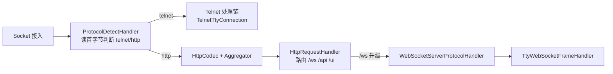

- `ProtocolDetectHandler`：读前几个字节，telnet 走 telnet 分支，http 走 http 分支。
- `HttpRequestHandler`：处理 `/api`（REST）、`/ui`（Web 静态资源）、`/ws`（WebSocket 升级）。
- WebSocket 握手成功后，`HttpRequestHandler` 从 pipeline 移除，`TtyWebSocketFrameHandler` 接管。

### 4.3 握手建连

`TtyWebSocketFrameHandler` 在握手完成事件里创建 `ExtHttpTtyConnection` 并触发 termd 回调：

```java
public void userEventTriggered(ChannelHandlerContext ctx, Object evt) {
    if (evt == HANDSHAKE_COMPLETE) {
        ctx.executor().execute(() -> handleHandshakeComplete(ctx, null));
    } else if (evt instanceof HandshakeComplete) {
        handleHandshakeComplete(ctx, ((HandshakeComplete) evt).requestUri());
    }
    // IdleStateEvent -> 发 PingWebSocketFrame 心跳
}

private void handleHandshakeComplete(ChannelHandlerContext ctx, String requestUri) {
    if (conn != null) return;
    ctx.pipeline().remove(HttpRequestHandler.class);      // 移除 HTTP 处理
    group.add(ctx.channel());
    conn = new ExtHttpTtyConnection(ctx, isQuietRequest(ctx, requestUri));
    handler.accept(conn);                                  // ← 触发 HttpTermServer 回调 -> new TermImpl
}
```

握手时还会解析 `quiet=true` 查询参数（静默会话，不写历史）。

### 4.4 从 TermImpl 到 ShellImpl.readline

`termHandler` 最终是 `ShellImpl` 设置的。`ShellImpl` 构造时处理鉴权（从 `ExtHttpTtyConnection.extSessions()` 取出 httpSession 里的 subject/userId，或 telnet 本地 principal），然后调用 `shell.readline()` 进入第一次读行循环。

### 4.5 接入时序图

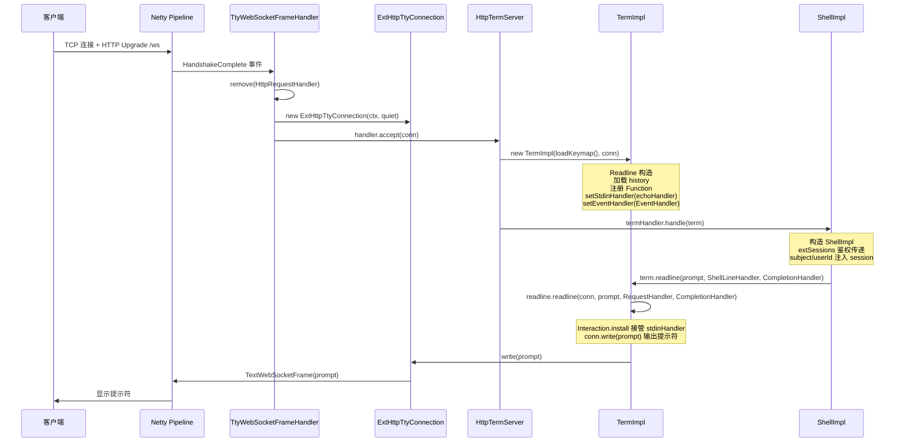

---

## 第五章 输入解码链路

### 5.1 从 WebSocket 帧到 codePoints

用户在 Web UI 敲键，前端把输入封装成 JSON 通过 WebSocket 发送：

```json
{"action":"read","data":"watch demo.MathGame primeFactors"}
```

`TtyWebSocketFrameHandler.channelRead0` 收到 `TextWebSocketFrame`：

```java
public void channelRead0(ChannelHandlerContext ctx, TextWebSocketFrame msg) {
    HttpTtyConnection tmp = conn;
    if (tmp == null) { ctx.close(); return; }
    tmp.writeToDecoder(msg.text());          // ← 输入入口
}
```

`HttpTtyConnection.writeToDecoder(String msg)` 解析 JSON：
- `action == "read"`：取 `data`，按字符集 `decoder.write(data.getBytes(charset))`。
- `action == "resize"`：更新 `size`，回调 `sizeHandler`。

### 5.2 BinaryDecoder：字节 → codePoints

`BinaryDecoder.write(byte[])` 用 `CharsetDecoder` 把字节流转成 codePoints 数组，正确处理 UTF-8 多字节与代理对，然后 `onChar.accept(codePoints)`。`onChar` 就是 `TtyEventDecoder`。

### 5.3 TtyEventDecoder：信号分流

```java
// TtyEventDecoder.accept(int[] data)
while (index < data.length) {
    int val = data[index];
    TtyEvent event = null;
    if (val == vintr) event = TtyEvent.INTR;      // 3 = Ctrl-C
    else if (val == vsusp) event = TtyEvent.SUSP;  // 26 = Ctrl-Z
    else if (val == veof) event = TtyEvent.EOF;   // 4 = Ctrl-D
    if (event != null) {
        // 信号前的普通字符先给 readHandler
        readHandler.accept(data[0..index]);
        // 信号给 eventHandler
        eventHandler.accept(event, val);
        // 剩余继续扫描
        data = data[index+1..]; index = 0; continue;
    }
    index++;
}
readHandler.accept(data);   // 无信号的普通输入
```

`readHandler` 就是 `conn.getStdinHandler()`（由 `TermImpl` / `readline` 设置），`eventHandler` 是 `EventHandler`。

### 5.4 输入解码链路图

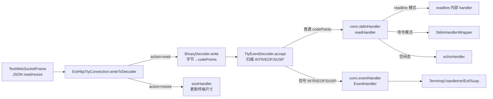

### 5.5 三种 stdinHandler 的数据走向

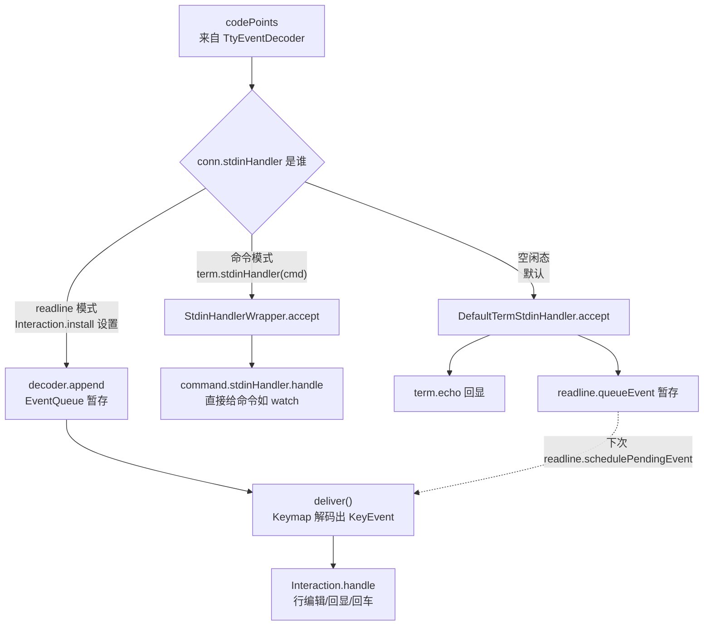

注意 `DefaultTermStdinHandler` 在空闲态（命令已结束、尚未进入下一次 readline）做 echo + queueEvent，把输入暂存到 EventQueue；下次 `readline.readline` 启动时 `schedulePendingEvent` 会消费这些暂存事件，避免用户在两次提示符之间快速输入时丢键。

---

## 第六章 readline 行编辑

### 6.1 readline 启动

`TermImpl.readline(prompt, lineHandler, completionHandler)`：

```java
public void readline(String prompt, Handler<String> lineHandler, Handler<Completion> completionHandler) {
    if (conn.getStdinHandler() != echoHandler) throw new IllegalStateException();
    if (inReadline) throw new IllegalStateException();
    inReadline = true;
    readline.readline(conn, prompt, new RequestHandler(this, lineHandler), new CompletionHandler(...));
}
```

入口检查 `conn.stdinHandler == echoHandler`，确保上一次命令已干净退出。然后委托 termd `Readline.readline`。

`Readline.readline`：
```java
public void readline(TtyConnection conn, String prompt, Consumer<String> requestHandler, Consumer<Completion> completionHandler) {
    interaction = new Interaction(conn, prompt, requestHandler, completionHandler);
    interaction.install();        // 接管 stdinHandler/sizeHandler/eventHandler
    conn.write(prompt);           // 输出提示符
    schedulePendingEvent();       // 处理之前暂存的事件
}
```

### 6.2 Interaction.install：接管输入

```java
private void install() {
    prevReadHandler = conn.getStdinHandler();      // 保存当前（echoHandler）
    prevSizeHandler = conn.getSizeHandler();
    prevEventHandler = conn.getEventHandler();
    conn.setStdinHandler(new Consumer<int[]>() {   // 替换为 readline 内部 handler
        public void accept(int[] data) {
            decoder.append(data);    // 进 EventQueue
            deliver();               // 立即派发
        }
    });
    conn.setEventHandler(null);      // readline 模式下信号由它自己处理（见 6.3）
    size = conn.size();
}
```

### 6.3 deliver：事件派发循环

```java
private void deliver() {
    while (true) {
        synchronized (this) {
            if (decoder.hasNext() && interaction != null && !interaction.paused) {
                event = decoder.next();      // Keymap 解码出 KeyEvent
                handler = interaction;
            } else return;
        }
        handler.handle(event);
    }
}
```

`decoder.next()` 即 `EventQueue.next()`，用 Keymap bindings 做最长前缀匹配，产出 `KeyEvent`（普通字符）或 `FunctionEvent`（accept-line/complete 等）。

### 6.4 Interaction.handle：按键处理

```java
private void handle(KeyEvent event) {
    if (event.length() == 1) {
        if (event.getCodePointAt(0) == 4 && buffer.getSize() == 0) {
            end(null);                    // Ctrl-D 空行 -> EOF，命令"发送"为 null
            return;
        } else if (event.getCodePointAt(0) == 3) {
            // Ctrl-C：清空缓冲，重置提示符
            line.clear(); buffer.clear(); data.clear();
            historyIndex = -1; currentPrompt = prompt;
            conn.stdoutHandler().accept(new int[]{'\n'});
            conn.write(prompt);
            return;
        } else if (event.getCodePointAt(0) == 12) {
            // Ctrl-L：清屏重绘
            conn.write("\033[H\033[2J");
            redraw();
            return;
        }
    }
    if (event instanceof FunctionEvent) {
        Function function = functions.get(((FunctionEvent) event).name());
        paused = true;
        function.apply(this);              // 执行 readline 函数（如 accept-line）
    } else {
        // 普通可打印字符：插入缓冲并 refresh 回显
        LineBuffer buf = buffer.copy();
        for (int i = 0; i < event.length(); i++) buf.insert(event.getCodePointAt(i));
        refresh(buf);
    }
}
```

### 6.5 refresh：增量回显

`refresh(update)` 把 `prompt + update` 组装成目标 `LineBuffer`，与当前屏幕状态（`prompt + buffer`）做 `LineBuffer.update`，生成最小差异 ANSI 序列，通过 `conn.stdoutHandler().accept(...)` 输出。这就是行编辑的"所见即所得"。

### 6.6 行编辑时序图

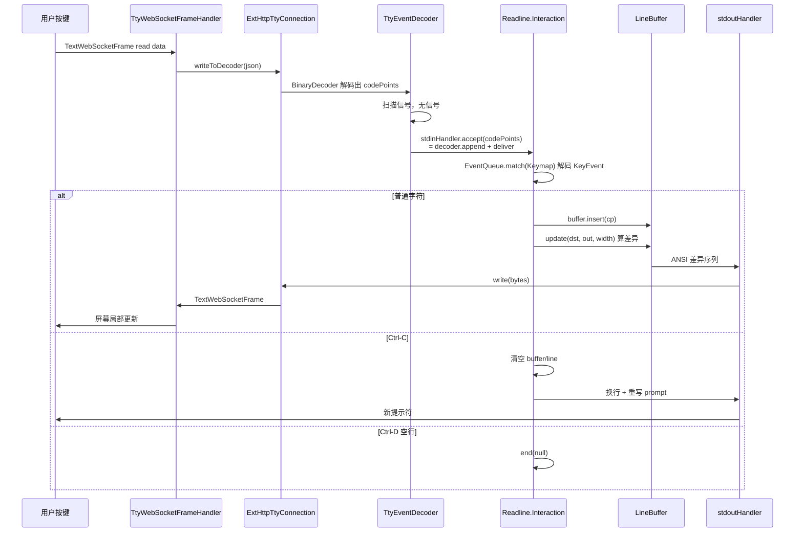

### 6.7 KeyEvent 解码与分发

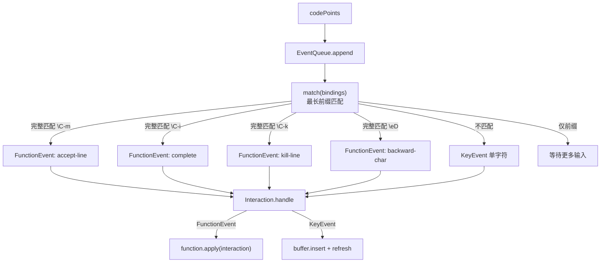

---

## 第七章 命令如何发送出去（核心）

本章回答用户的核心问题：**敲下回车后，命令是如何"发送出去"被执行的**。

### 7.1 回车 → ACCEPT_LINE

inputrc 中 `"\C-m"` / `"\C-j"` 绑定到 `accept-line`。`Readline` 内置的 `ACCEPT_LINE` 函数：

```java
private final Function ACCEPT_LINE = new Function() {
    public String name() { return "accept-line"; }
    public void apply(Interaction interaction) {
        interaction.line.insert(interaction.buffer.toArray());  // buffer 追加到 line
        LineStatus pb = new LineStatus();
        for (int i = 0; i < interaction.line.getSize(); i++) pb.accept(interaction.line.getAt(i));
        interaction.buffer.clear();
        if (pb.isEscaping()) {
            // 行尾反斜杠续行
            interaction.line.delete(-1);
            interaction.currentPrompt = "> ";
            interaction.conn.write("\n> ");
            interaction.resume();
        } else if (pb.isQuoted()) {
            // 引号未闭合，多行输入
            interaction.line.insert('\n');
            interaction.conn.write("\n> ");
            interaction.currentPrompt = "> ";
            interaction.resume();
        } else {
            // ★ 一行完整，发送出去
            String raw = interaction.line.toString();
            if (interaction.line.getSize() > 0) addToHistory(interaction.line.toArray());
            interaction.line.clear();
            interaction.conn.write("\n");
            interaction.end(raw);   // ← 命令发送出口
        }
    }
};
```

`LineStatus` 负责判断当前行是否需要续行（反斜杠续行、引号未闭合）。只有完整一行才 `end(raw)`。

### 7.2 end(raw)：恢复 handler + 回调

```java
private boolean end(String s) {
    synchronized (Readline.this) {
        if (interaction == null) return false;
        interaction = null;
        conn.setStdinHandler(prevReadHandler);   // 恢复 echoHandler
        conn.setSizeHandler(prevSizeHandler);
        conn.setEventHandler(prevEventHandler);   // 恢复 EventHandler
    }
    requestHandler.accept(s);   // ← 把命令行交给 arthas
    return true;
}
```

`requestHandler` 是 arthas 的 `RequestHandler`。

### 7.3 RequestHandler → ShellLineHandler

```java
// RequestHandler.accept(String line)
public void accept(String line) {
    term.setInReadline(false);
    lineHandler.handle(line);    // lineHandler = ShellLineHandler
}
```

### 7.4 ShellLineHandler：tokenize + 分发

`ShellLineHandler.handle(String line)`：

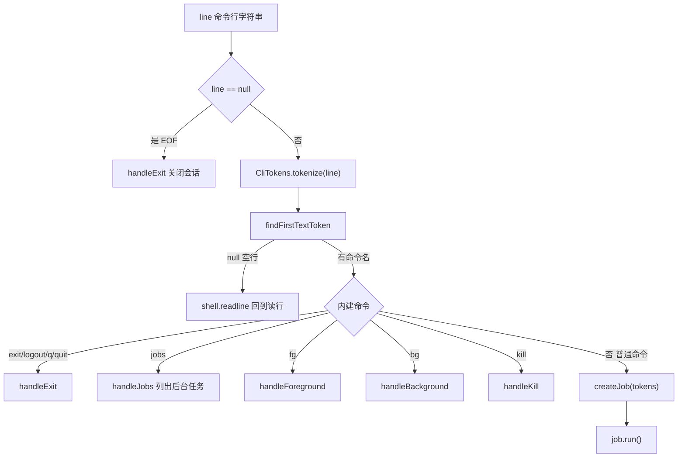

`createJob` 内部调 `shell.createJob(tokens)`，异常时 echo 错误并重新 readline。

### 7.5 ShellImpl.createJob → JobControllerImpl.createJob

```java
// ShellImpl.createJob(List<CliToken> args)
public Job createJob(List<CliToken> args) {
    return jobController.createJob(commandManager, args, session, new ShellJobHandler(this), term, null);
}
```

`JobControllerImpl.createJob`：
1. `checkPermission(session, firstToken)`：鉴权检查（未登录且非 auth 命令则抛异常）。
2. `createProcess(...)` → `createCommandProcess(...)`：解析管道 `|`、重定向 `>`/`>>`，构建 `stdoutHandlerChain`。
3. `new ProcessImpl(command, remaining, command.processHandler(), processOutput, resultDistributor)`。
4. `process.setTty(term)`：把终端绑定到 process。
5. `new JobImpl(jobId, this, process, line, runInBackground, session, jobHandler)`。

### 7.6 stdoutHandlerChain：输出链构建

`createCommandProcess` 根据命令行结构构建输出处理链：

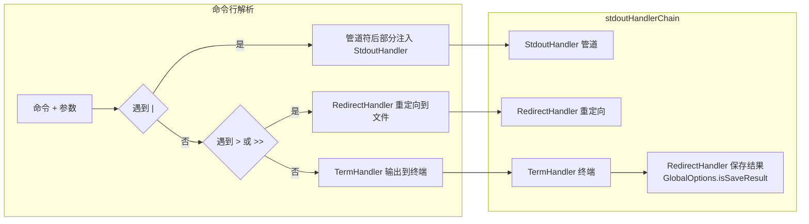

无重定向时，链尾是 `TermHandler`（→ `term.write` → `conn.write` → WebSocket 帧）。

### 7.7 JobImpl.run → ProcessImpl.run

```java
// JobImpl.run(boolean foreground)
public Job run(boolean foreground) {
    actualStatus = ExecStatus.RUNNING;
    process.setSession(this.session);
    process.run(foreground);          // ← 启动进程
    if (this.status() == ExecStatus.RUNNING) {
        if (foreground) jobHandler.onForeground(this);
        else jobHandler.onBackground(this);
    }
    return this;
}
```

`ShellJobHandler.onForeground`（前台命令）：`shell.setForegroundJob(job)`。注意**前台命令此时不立即回到 readline**——输入通道被命令接管，直到命令结束 `onTerminated` 才回到 readline。`onBackground`（后台命令 `&`）：`resetAndReadLine`，立即回到 readline 读下一行。

### 7.8 ProcessImpl.run：实际执行

```java
// ProcessImpl.run(boolean fg)
public synchronized void run(boolean fg) {
    processStatus = ExecStatus.RUNNING;
    process = new CommandProcessImpl(this, tty);          // 命令运行时上下文
    // 解析 CLI 参数（commandContext.cli().parse(args2)），支持 --help
    CommandLine cl = commandContext.cli().parse(args2);
    process.setArgs2(args2);
    process.setCommandLine(cl);
    Runnable task = new CommandProcessTask(process);
    ArthasBootstrap.getInstance().execute(task);          // ← 线程池执行命令
}

// CommandProcessTask.run()
public void run() {
    try {
        handler.handle(process);    // ← 命令实现入口
    } catch (Throwable t) {
        process.end(1, "Error during processing...");
    }
}
```

`handler` 就是 `command.processHandler()`，即每个命令（watch/trace/jad/...）自己实现的 `Handler<CommandProcess>`。至此，命令"发送"完成，进入命令自己的执行逻辑。

### 7.9 命令发送与执行时序图（核心大图）

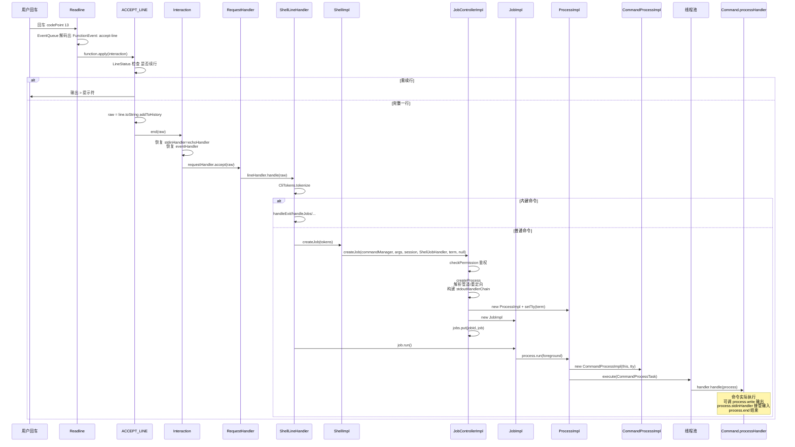

---

## 第八章 命令执行与输出闭环

### 8.1 命令如何输出

命令实现调用 `CommandProcessImpl.write(data)`：

```java
// CommandProcessImpl
public CommandProcess write(String data) {
    if (processStatus != ExecStatus.RUNNING) throw new IllegalStateException(...);
    processOutput.write(data);    // ← 进输出链
    return this;
}
```

`ProcessOutput.write` 遍历 `stdoutHandlerChain`，每一步 `data = function.apply(data)`：

```java
private void write(String data) {
    int size = stdoutHandlerChain.size();
    for (int i = 0; i < size; i++) {
        Function<String, String> function = stdoutHandlerChain.get(i);
        data = function.apply(data);    // TermHandler / StdoutHandler / RedirectHandler
    }
}
```

### 8.2 TermHandler → conn.write

`TermHandler.apply(data)` → `term.write(data)` → `TermImpl.write`：

```java
public Term write(String data) {
    if (stdoutHandlerChain != null) {
        for (Function<String, String> function : stdoutHandlerChain) {
            data = function.apply(data);    // term 级输出过滤链
        }
    }
    conn.write(data);    // ← 落到 TtyConnection
    return this;
}
```

`conn.write(s)`（`ExtHttpTtyConnection` 继承 `HttpTtyConnection`）走 `stdoutHandler()` = `TtyOutputMode(BinaryEncoder(charset, write(bytes)))`：codePoints → 字节 → `ExtHttpTtyConnection.write(byte[])`：

```java
protected void write(byte[] buffer) {
    ByteBuf byteBuf = Unpooled.buffer();
    byteBuf.writeBytes(buffer);
    context.writeAndFlush(new TextWebSocketFrame(byteBuf));   // ← WebSocket 帧
}
```

### 8.3 命令如何接管输入

交互式命令（如 `watch`）需要直接读按键，调用 `CommandProcessImpl.stdinHandler(handler)`：

```java
public CommandProcess stdinHandler(Handler<String> handler) {
    stdinHandler = handler;
    if (processForeground && stdinHandler != null) {
        tty.stdinHandler(stdinHandler);    // ← 切换到命令模式（StdinHandlerWrapper）
    }
    return this;
}
```

`TermImpl.stdinHandler(handler)` 把 `conn.stdinHandler` 设为 `StdinHandlerWrapper(handler)`：

```java
// StdinHandlerWrapper.accept
public void accept(int[] codePoints) {
    handler.handle(Helper.fromCodePoints(codePoints));    // ← 直接给命令
}
```

此后用户按键经 `BinaryDecoder → TtyEventDecoder → StdinHandlerWrapper → command.stdinHandler`，**绕过 readline 行编辑直达命令**。

### 8.4 命令如何结束

命令调 `process.end(statusCode, message)` → `ProcessImpl.terminate` → `updateStatus(TERMINATED, ...)`：

```java
// updateStatus
if (statusUpdate == ExecStatus.TERMINATED) {
    terminatedHandler.handle(exitCodeUpdate);    // ← JobImpl.TerminatedHandler
}
```

`JobImpl.TerminatedHandler.handle`：
```java
jobHandler.onTerminated(JobImpl.this);    // ShellJobHandler.onTerminated
controller.removeJob(jobId);
terminateFuture.complete();
```

`ShellJobHandler.onTerminated`（前台命令）：
```java
public void onTerminated(Job job) {
    if (job == foregroundJob) {
        resetAndReadLine();    // ← 回到 readline 读下一行
    }
    // 保存命令历史
    ((TermImpl) term).getReadline().getHistory() ...
}
```

`resetAndReadLine`：`setForegroundJob(null)` + `shell.readline()`，回到第六章的 readline 循环。

### 8.5 输出闭环时序图

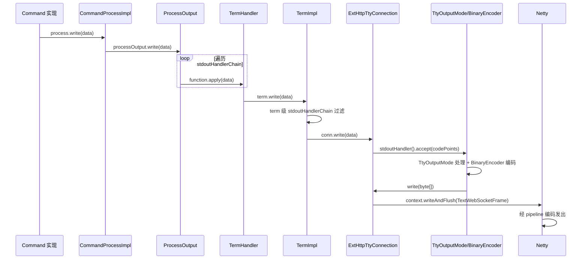

### 8.6 输入输出双向闭环总图

```mermaid
flowchart LR
    subgraph IN["输入方向 ←"]
        NET1["WebSocket 帧"] --> WTD["writeToDecoder JSON"]
        WTD --> BD["BinaryDecoder"]
        BD --> TED["TtyEventDecoder"]
        TED --> STDIN["stdinHandler"]
        STDIN --> RL["readline 行编辑"]
        STDIN --> CMD["command.stdinHandler"]
        RL -->|"回车 ACCEPT_LINE"| SEND["命令发送"]
    end
    subgraph OUT["输出方向 →"]
        CMDOUT["command.write"] --> PO["ProcessOutput.write"]
        PO --> CHAIN["stdoutHandlerChain"]
        CHAIN --> TH["TermHandler"]
        TH --> TERMW["term.write"]
        TERMW --> CONNW["conn.write"]
        CONNW --> OM["TtyOutputMode+BinaryEncoder"]
        OM --> FRAME["TextWebSocketFrame"]
    end
    SEND -.->|"createJob+job.run"| CMDOUT
```

---

## 第九章 信号处理

### 9.1 信号检测与分发

`TtyEventDecoder` 检测到 Ctrl-C/Ctrl-D/Ctrl-Z 后转给 `conn.eventHandler`，即 arthas `EventHandler`：

```java
// EventHandler (BiConsumer<TtyEvent, Integer>)
public void accept(TtyEvent event, Integer key) {
    switch (event) {
        case INTR: term.handleIntr(key); break;   // Ctrl-C
        case EOF:  term.handleEof(key);  break;   // Ctrl-D
        case SUSP: term.handleSusp(key); break;   // Ctrl-Z
    }
}
```

`TermImpl` 的信号处理：

```java
public void handleIntr(Integer key) {
    if (interruptHandler == null || !interruptHandler.deliver(key)) {
        echo(key, '\n');     // 无命令处理时：回显 ^C + 换行
    }
}
public void handleEof(Integer key) {
    if (stdinHandler != null) {
        // 命令运行时 Ctrl-D：作为输入传给命令
        stdinHandler.handle(Helper.fromCodePoints(new int[]{key}));
    } else {
        echo(key);
        readline.queueEvent(new int[]{key});    // readline 空行 Ctrl-D -> EOF
    }
}
public void handleSusp(Integer key) {
    if (suspendHandler == null || !suspendHandler.deliver(key)) {
        echo(key, 'Z' - 64);    // 回显 ^Z
    }
}
```

### 9.2 两种信号语义

信号处理依赖当前模式：

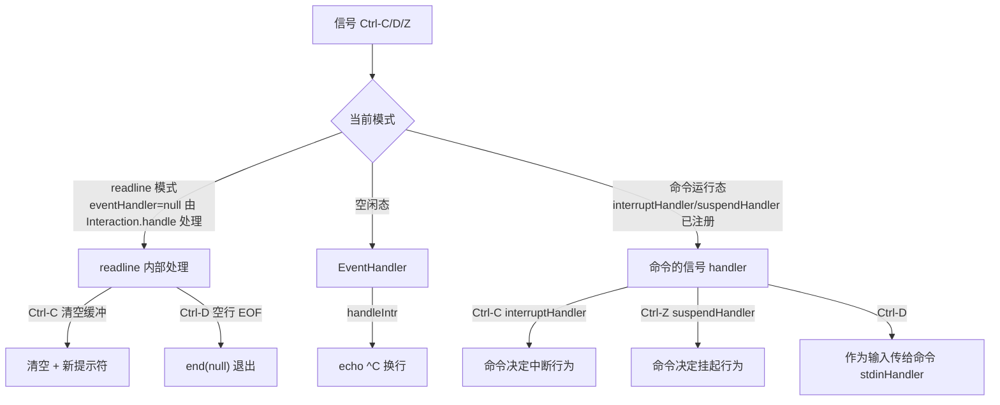

注意：readline 模式下 `Interaction.install` 把 `conn.eventHandler` 设为 `null`，所以 Ctrl-C/D 在 readline 模式由 `Interaction.handle` 直接处理（codePoint 3/4），不走 `EventHandler`。命令运行时，`ProcessImpl` 注册的 `interruptHandler`/`suspendHandler` 通过 `TermImpl.interruptHandler(...)` 设置，命令可自定义中断行为（如 `watch` 收到 Ctrl-C 停止监控并输出统计）。

### 9.3 命令中断闭环

命令运行时 Ctrl-C → `interruptHandler.deliver(key)` → 命令自己的中断逻辑 → 通常调 `process.end()` → `terminate` → `onTerminated` → `resetAndReadLine`。

---

## 第十章 Tab 补全

### 10.1 补全触发

inputrc 中 `"\C-i"`（Tab）绑定到 `complete`。`Complete` 函数：

```java
public class Complete implements Function {
    public String name() { return "complete"; }
    public void apply(Readline.Interaction interaction) {
        Consumer<Completion> handler = interaction.completionHandler();
        if (handler != null) {
            Completion completion = new Completion(interaction);
            handler.accept(completion);    // ← 交给 arthas 补全器
        } else {
            interaction.resume();
        }
    }
}
```

### 10.2 arthas 补全器

`TermImpl.readline` 传入的 `completionHandler` 是 arthas 的 `CompletionHandler`，最终委托 `CommandManagerCompletionHandler`：

```java
// CommandManagerCompletionHandler
public void handle(Completion completion) {
    commandManager.complete(completion);    // ← 对接命令注册表
}
```

`InternalCommandManager.complete` 根据当前 buffer 内容补全命令名或命令参数，调用 `Completion.complete(...)` 写入候选，readline 负责回显补全结果。

### 10.3 Tab 补全时序图

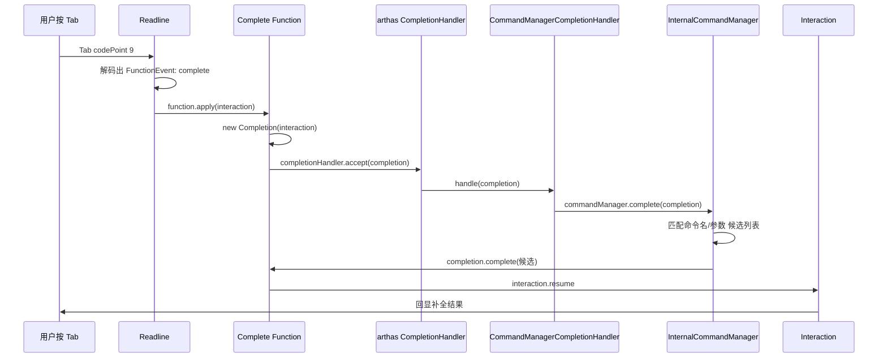

---

## 第十一章 Job 生命周期与状态机

### 11.1 Process 状态机

`ProcessImpl` 的 `processStatus` 取值 `ExecStatus`：

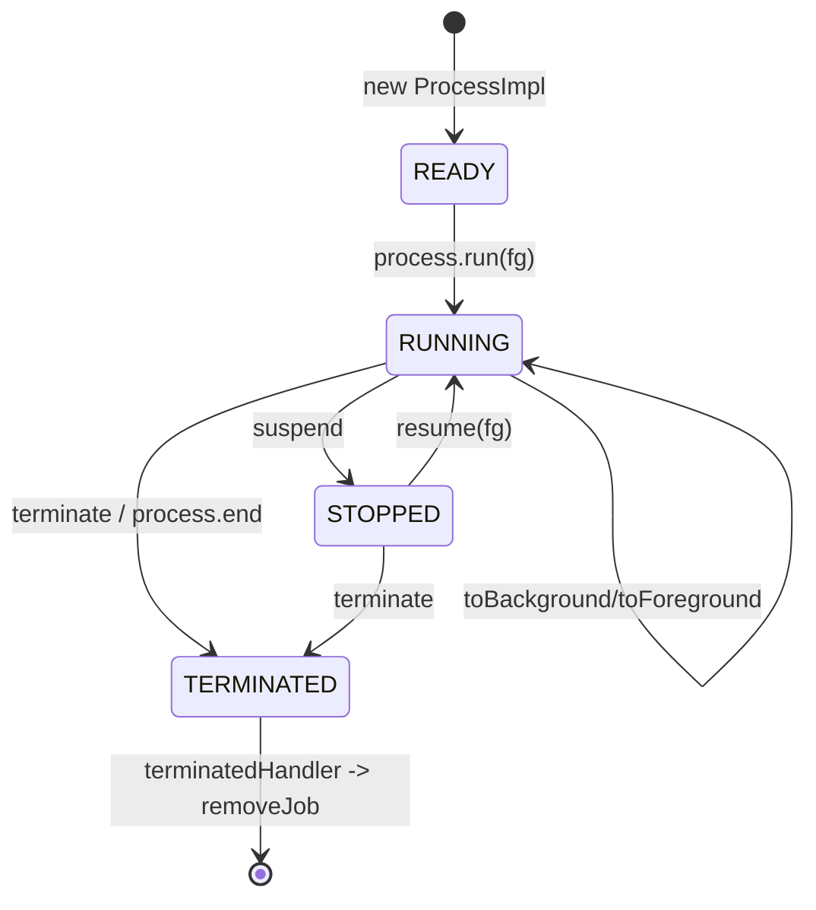

### 11.2 前台/后台切换

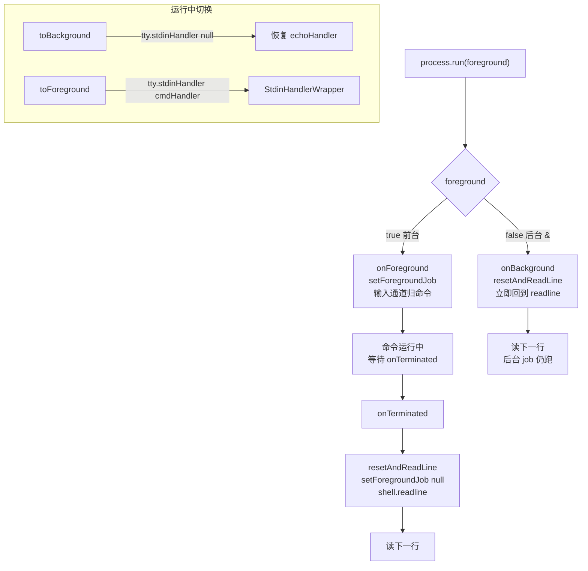

### 11.3 onTerminated 时序

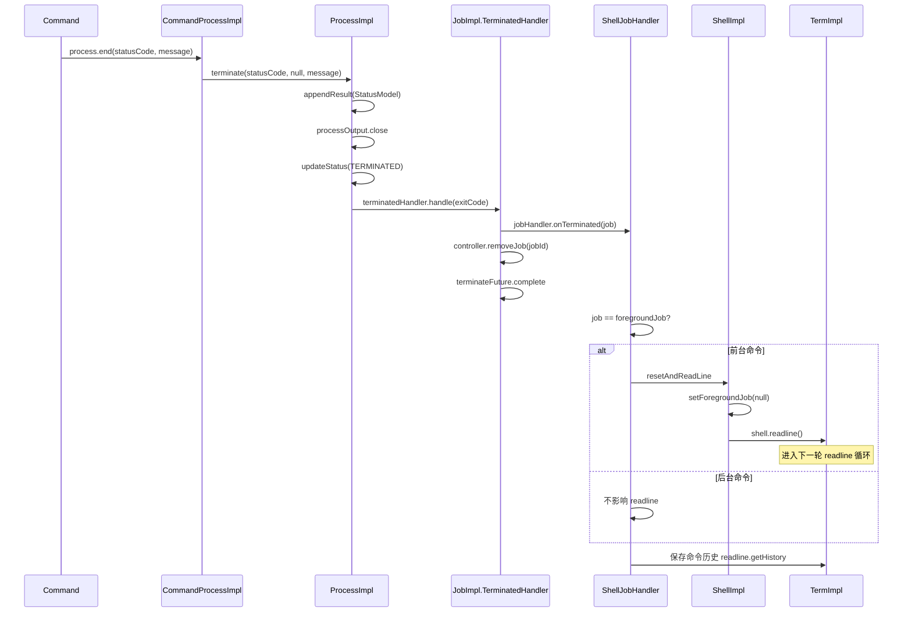

---

## 第十二章 端到端总览

### 12.1 完整端到端时序图

```mermaid
sequenceDiagram
    participant U as 用户/浏览器
    participant N as Netty
    participant CONN as ExtHttpTtyConnection
    participant TED as TtyEventDecoder
    participant TERM as TermImpl
    participant RL as Readline.Interaction
    participant RH as RequestHandler
    participant SLH as ShellLineHandler
    participant JC as JobControllerImpl
    participant JOB as JobImpl
    participant PROC as ProcessImpl
    participant CMD as Command 实现

    Note over U,CMD: 接入阶段
    U->>N: WebSocket 连接 /ws
    N->>CONN: new ExtHttpTtyConnection
    CONN->>TERM: new TermImpl(keymap, conn)
    TERM->>RL: readline readline
    RL->>U: 输出提示符

    Note over U,CMD: 行编辑阶段
    U->>N: 帧读 watch MathGame
    N->>CONN: writeToDecoder
    CONN->>TED: BinaryDecoder
    TED->>RL: stdinHandler = readline 内部 handler
    RL->>U: refresh 增量回显

    Note over U,CMD: 命令发送阶段
    U->>N: 回车
    N->>CONN: writeToDecoder
    CONN->>TED: 解码
    TED->>RL: 回车 codePoint
    RL->>RL: ACCEPT_LINE end(raw)
    RL->>TERM: 恢复 echoHandler
    RL->>RH: requestHandler.accept(raw)
    RH->>SLH: handle(raw)
    SLH->>SLH: tokenize
    SLH->>JC: createJob
    JC->>JC: 鉴权 + 解析管道 + 构建 stdoutHandlerChain
    JC->>PROC: new ProcessImpl + setTty(term)
    JC->>JOB: new JobImpl
    SLH->>JOB: job.run
    JOB->>PROC: process.run(foreground)
    PROC->>CMD: 线程池 handler.handle(process)

    Note over U,CMD: 命令运行阶段
    CMD->>PROC: process.stdinHandler 接管输入
    PROC->>TERM: tty.stdinHandler 切 StdinHandlerWrapper
    CMD->>PROC: process.write 输出
    PROC->>CONN: stdoutHandlerChain -> term.write -> conn.write
    CONN->>N: TextWebSocketFrame
    N->>U: 显示结果

    Note over U,CMD: 结束阶段
    CMD->>PROC: process.end
    PROC->>JOB: onTerminated
    JOB->>TERM: resetAndReadLine
    TERM->>RL: shell.readline
    RL->>U: 新提示符 循环
```

### 12.2 一图总览：输入输出与控制流

```mermaid
flowchart TB
    subgraph TRANSPORT["传输层"]
        NET["Netty Pipeline"]
    end
    subgraph CONN2["TtyConnection 层"]
        EHC["ExtHttpTtyConnection"]
        DECODE["BinaryDecoder + TtyEventDecoder"]
    end
    subgraph TERM2["Term 适配层"]
        TI2["TermImpl"]
        RL2["Readline + Interaction"]
        ECHO2["echoHandler / StdinHandlerWrapper"]
    end
    subgraph SHELL2["Shell 会话层"]
        SHELLI["ShellImpl"]
        SLH2["ShellLineHandler"]
        SJH2["ShellJobHandler"]
    end
    subgraph JOB2["Job/Process 层"]
        JCI["JobControllerImpl"]
        JI2["JobImpl"]
        PI2["ProcessImpl + CommandProcessImpl"]
    end
    subgraph EXEC["命令实现"]
        CMD2["Command.processHandler"]
    end

    NET -->|"TextWebSocketFrame 读"| EHC
    EHC --> DECODE
    DECODE -->|"codePoints 普通输入"| TI2
    DECODE -->|"信号 INTR/EOF/SUSP"| TI2
    TI2 --> RL2
    TI2 --> ECHO2
    RL2 -->|"回车 raw"| SHELLI
    SHELLI --> SLH2
    SLH2 --> JCI
    JCI --> JI2
    JI2 --> PI2
    PI2 --> CMD2
    CMD2 -->|"process.write 输出"| PI2
    PI2 -->|"stdoutHandlerChain"| TI2
    TI2 -->|"conn.write"| EHC
    EHC -->|"TextWebSocketFrame 写"| NET
    PI2 -.->|"process.end onTerminated"| SJH2
    SJH2 -.->|"resetAndReadLine"| SHELLI
    CMD2 -.->|"process.stdinHandler"| ECHO2
```

---

## 第十三章 设计要点总结

### 13.1 termd 的解耦哲学

termd 把终端拆成三个正交维度：
- **传输**（TtyConnection）：只管字节进出，不关心行编辑。
- **行编辑**（Readline）：只管按键→行，不关心传输。
- **函数**（Function）：每个编辑动作独立，可插拔（SPI 加载）。

arthas 只需实现 `TtyConnection`（ExtHttp/Telnet）并复用 Readline，就拿到了完整的行编辑能力。

### 13.2 arthas 的三层 stdinHandler 模型

这是 arthas 终端最精巧的设计——同一个 `conn.stdinHandler` 在三个阶段扮演三种角色：

| 阶段 | stdinHandler | 行为 |
|---|---|---|
| 空闲（命令间） | `DefaultTermStdinHandler` | echo 回显 + queueEvent 暂存 |
| readline | readline 内部 handler | Keymap 解码 + 行编辑 + 回车触发 |
| 命令运行 | `StdinHandlerWrapper` | 直接透传给命令 |

切换点统一在 `TermImpl`，配合 `Interaction.install/end` 和 `term.stdinHandler(handler/null)`，使一条输入通道在"行编辑"与"命令交互"间无缝切换。

### 13.3 单线程 EventLoop 串行化

`conn.execute(Runnable)` 把任务调度到该连接绑定的 Netty EventLoop 线程。`Readline.schedulePendingEvent` / `deliver` 都通过 `conn.execute` 跑，保证：
- 同一连接的输入处理、行编辑、命令回调都在**同一个线程**上串行执行，无需加锁即可保证状态一致。
- 命令实际执行通过 `ArthasBootstrap.getInstance().execute(task)` 走**独立线程池**，避免阻塞 EventLoop——命令回调输出时再经 `conn.execute` 切回连接线程。

### 13.4 多协议收敛

```mermaid
flowchart LR
    subgraph PROTO["多协议接入"]
        WS["websocket 浏览器"]
        TN["telnet 客户端"]
        LO["VM-local 内部"]
    end
    WS --> EHC["ExtHttpTtyConnection"]
    TN --> TTC["TelnetTtyConnection"]
    LO --> LTC["LocalTtyConnection"]
    EHC --> TC["统一为 TtyConnection"]
    TTC --> TC
    LTC --> TC
    TC --> TI["new TermImpl(keymap, conn)"]
    TI --> SAME["后续 ShellImpl/Job/Process 链路完全相同"]
```

telnet/websocket/VM-local 三种接入只产生不同的 `TtyConnection` 实现，之后 `TermImpl → ShellImpl → Job → Process → Command` 链路完全一致。这是 arthas 能用一套命令内核服务多端的关键。

### 13.5 鉴权传递

websocket 接入时，`ExtHttpTtyConnection.extSessions()` 从 `HttpSession` 提取 `subject`/`userId`（http 路由阶段 `auth` 命令写入），在 `ShellImpl` 构造时注入 arthas `Session`。`JobControllerImpl.checkPermission` 在每次 `createJob` 时校验。同时 `TermImpl` 对 `history` 类 readline 函数做动态代理，未鉴权时禁用历史查看——防止通过历史命令泄露敏感信息。

### 13.6 输出链的可组合性

`JobControllerImpl.createCommandProcess` 根据命令行语法动态构建 `stdoutHandlerChain`：
- 普通命令：`TermHandler`（→终端）。
- 管道 `cmd1 | cmd2`：`StdoutHandler`（管道后部注入）。
- 重定向 `cmd > file` / `cmd >> file`：`RedirectHandler`（写文件）。
- `GlobalOptions.isSaveResult`：额外 `RedirectHandler`（保存结果）。

命令实现只需调 `process.write(data)`，不关心输出最终去向——由链路决定。`ProcessOutput` 还支持 `StatisticsFunction`（统计）与 `flushHandlerChain`（延迟刷新），用于 `dashboard` 等需要汇总的场景。

### 13.7 命令"发送出去"的本质

回到最初的问题——命令如何"发送出去"：它不是一次网络调用，而是**一次回调链的触发**。

```mermaid
flowchart LR
    ENTER["回车 KeyEvent"] --> AL["ACCEPT_LINE.apply"]
    AL --> END["Interaction.end(raw)"]
    END --> RH["RequestHandler.accept(raw)"]
    RH --> SLH["ShellLineHandler.handle(raw)"]
    SLH --> CREATE["createJob -> job.run"]
    CREATE --> EXEC["handler.handle(process)"]
    style EXEC fill:#ffe
```

从"回车"到"命令执行"，是一条贯穿 termd `Readline` → arthas `ShellLineHandler` → `JobControllerImpl` → `ProcessImpl` → `Command` 的回调链。每一环都通过回调（`Consumer`/`Handler`）把控制权交给下一环，没有任何阻塞等待或显式"发送"动作。命令行字符串 `raw` 就是这条链上流动的"信使"，在 `Interaction.end` 处被交出，在 `CommandProcessTask.run` 处被消费（经 tokenize + createJob + run 转化为对 `command.processHandler` 的调用）。

---

> **附：关键源码索引**
>
> | 关注点 | 类 |
> |---|---|
> | termd 传输抽象 | `io.termd.core.tty.TtyConnection` |
> | termd 行编辑 | `io.termd.core.readline.Readline` (+ `Interaction` 内部类) |
> | termd 键映射 | `io.termd.core.readline.Keymap` / `EventQueue` / `inputrc` |
> | termd 信号解码 | `io.termd.core.tty.TtyEventDecoder` / `TtyEvent` |
> | termd 行缓冲 | `io.termd.core.readline.LineBuffer` |
> | termd HTTP 连接 | `io.termd.core.http.HttpTtyConnection` |
> | termd Telnet 连接 | `io.termd.core.telnet.TelnetTtyConnection` |
> | arthas Netty 桥 | `TtyServerInitializer` / `TtyWebSocketFrameHandler` / `ProtocolDetectHandler` |
> | arthas TtyConnection | `ExtHttpTtyConnection` |
> | arthas Term 适配 | `TermImpl` |
> | arthas 输入处理器 | `DefaultTermStdinHandler` / `StdinHandlerWrapper` / `RequestHandler` / `EventHandler` |
> | arthas Shell 会话 | `ShellImpl` / `ShellLineHandler` / `ShellJobHandler` |
> | arthas Job/Process | `JobControllerImpl` / `JobImpl` / `ProcessImpl` |
> | arthas 补全 | `CommandManagerCompletionHandler` |
