# Arthas 通信机制深度解析

> 本文档基于 Arthas 4.3.x 源码，系统分析 Arthas 从客户端到目标 JVM 的完整通信链路，涵盖 Attach 机制、Telnet/HTTP/WebSocket 多协议复用、命令执行链路、MCP 新协议以及隧道远程通信。

---

## 一、整体通信架构

Arthas 采用 **C/S + Agent** 架构，通过 JVM Attach API 把诊断代理注入目标进程，再以 Netty 为底座同时承载 Telnet / HTTP / WebSocket / MCP 四种协议。

### 1.1 架构总览图

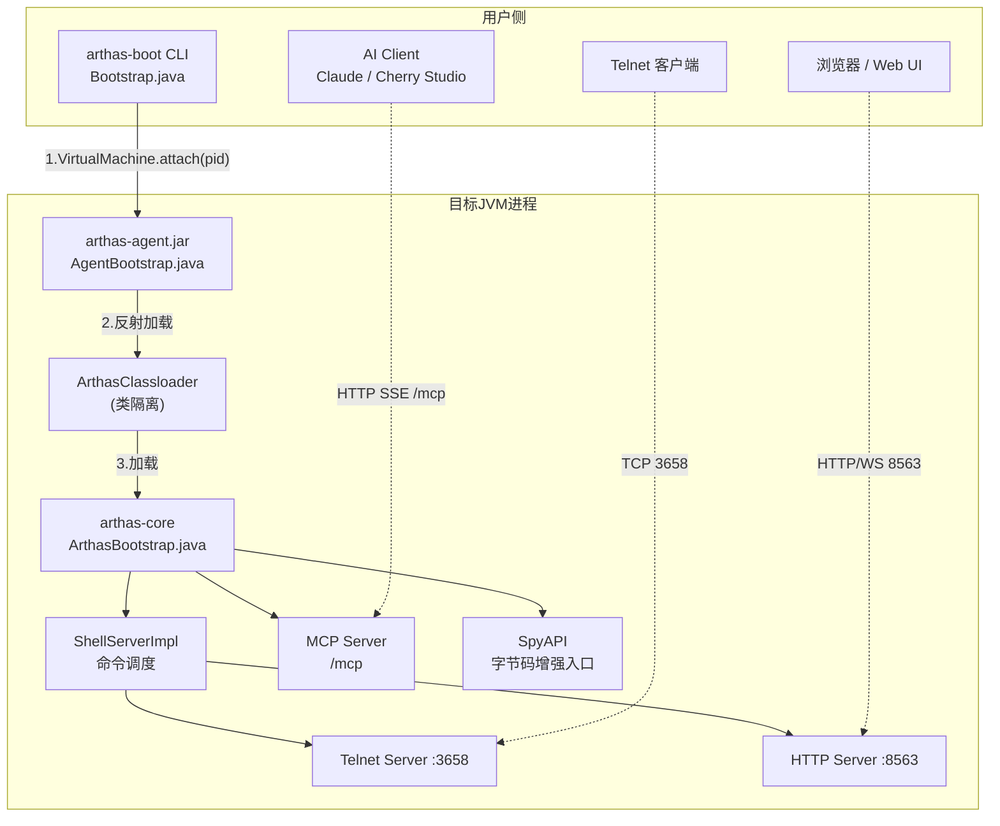
```mermaid
graph TB
    subgraph 用户侧
        CLI["arthas-boot CLI<br/>Bootstrap.java"]
        TELNET_CLIENT["Telnet 客户端"]
        WEB_UI["浏览器 / Web UI"]
        AI_CLIENT["AI Client<br/>Claude / Cherry Studio"]
    end

    subgraph 目标JVM进程
        AGENT["arthas-agent.jar<br/>AgentBootstrap.java"]
        CLASSLOADER["ArthasClassloader<br/>(类隔离)"]
        CORE["arthas-core<br/>ArthasBootstrap.java"]
        SHELL["ShellServerImpl<br/>命令调度"]
        TELNET_SVR["Telnet Server :3658"]
        HTTP_SVR["HTTP Server :8563"]
        MCP_SVR["MCP Server<br/>/mcp"]
        SPY["SpyAPI<br/>字节码增强入口"]
    end

    CLI -->|"1.VirtualMachine.attach(pid)"| AGENT
    AGENT -->|"2.反射加载"| CLASSLOADER
    CLASSLOADER -->|"3.加载"| CORE
    CORE --> SPY
    CORE --> SHELL
    SHELL --> TELNET_SVR
    SHELL --> HTTP_SVR
    CORE --> MCP_SVR

    TELNET_CLIENT -.->|"TCP 3658"| TELNET_SVR
    WEB_UI -.->|"HTTP/WS 8563"| HTTP_SVR
    AI_CLIENT -.->|"HTTP SSE /mcp"| MCP_SVR

```

### 1.2 模块职责划分

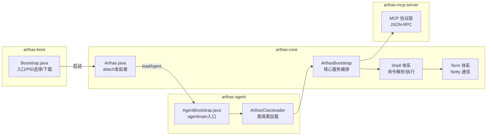
```mermaid
graph LR
    subgraph arthas-boot
        BOOT["Bootstrap.java<br/>入口/PID选择/下载"]
    end
    subgraph arthas-agent
        AB["AgentBootstrap.java<br/>agentmain入口"]
        ACL["ArthasClassloader<br/>类隔离加载"]
    end
    subgraph arthas-core
        ARTHAS["Arthas.java<br/>attach发起者"]
        ASB["ArthasBootstrap<br/>核心服务编排"]
        SHELL2["Shell 体系<br/>命令解析/执行"]
        TERM["Term 体系<br/>Netty 通信"]
    end
    subgraph arthas-mcp-server
        MCP["MCP 协议层<br/>JSON-RPC"]
    end

    BOOT -->|"启动"| ARTHAS
    ARTHAS -->|"loadAgent"| AB
    AB --> ACL
    ACL --> ASB
    ASB --> SHELL2
    ASB --> MCP
    SHELL2 --> TERM
```

---

## 二、Attach 机制：进程间注入通信

Arthas 的诊断能力始于把 agent 注入目标 JVM。这一步不走网络，而是利用 **JVM Attach API**（Unix Domain Socket / Windows 命名管道）完成跨进程通信。

### 2.1 Attach 全流程时序图

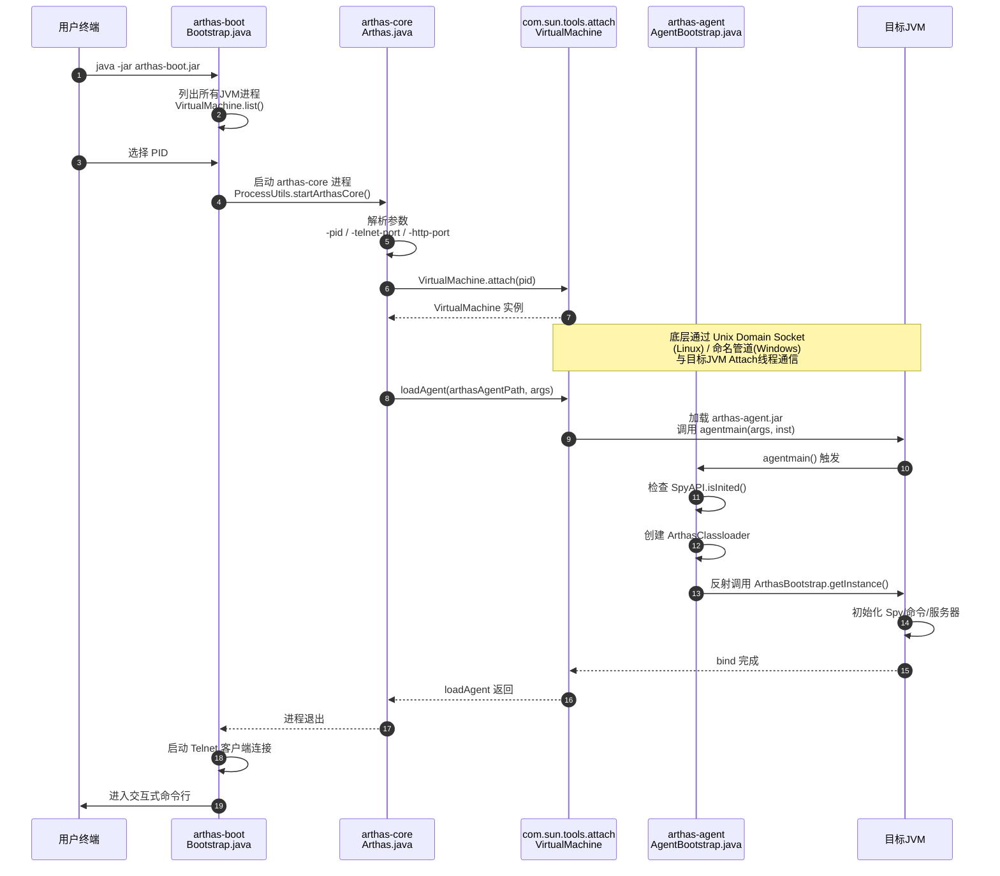
```mermaid
sequenceDiagram
    autonumber
    participant U as 用户终端
    participant Boot as arthas-boot<br/>Bootstrap.java
    participant Core as arthas-core<br/>Arthas.java
    participant VM as com.sun.tools.attach<br/>VirtualMachine
    participant Agent as arthas-agent<br/>AgentBootstrap.java
    participant Target as 目标JVM

    U->>Boot: java -jar arthas-boot.jar
    Boot->>Boot: 列出所有JVM进程<br/>VirtualMachine.list()
    U->>Boot: 选择 PID
    Boot->>Core: 启动 arthas-core 进程<br/>ProcessUtils.startArthasCore()
    Core->>Core: 解析参数<br/>-pid / -telnet-port / -http-port
    Core->>VM: VirtualMachine.attach(pid)
    VM-->>Core: VirtualMachine 实例
    Note over VM,Target: 底层通过 Unix Domain Socket<br/>(Linux) / 命名管道(Windows)<br/>与目标JVM Attach线程通信
    Core->>VM: loadAgent(arthasAgentPath, args)
    VM->>Target: 加载 arthas-agent.jar<br/>调用 agentmain(args, inst)
    Target->>Agent: agentmain() 触发
    Agent->>Agent: 检查 SpyAPI.isInited()
    Agent->>Agent: 创建 ArthasClassloader
    Agent->>Target: 反射调用 ArthasBootstrap.getInstance()
    Target->>Target: 初始化 Spy/命令/服务器
    Target-->>VM: bind 完成
    VM-->>Core: loadAgent 返回
    Core-->>Boot: 进程退出
    Boot->>Boot: 启动 Telnet 客户端连接
    Boot->>U: 进入交互式命令行
```

### 2.2 关键源码定位

#### (1) arthas-boot：启动入口

`boot/src/main/java/com/taobao/arthas/boot/Bootstrap.java:309`

```java
public static void main(String[] args) throws Exception {
    // 1. 解析命令行参数
    CLI cli = CLIConfigurator.define(Bootstrap.class);
    CommandLine commandLine = cli.parse(Arrays.asList(args));

    // 2. 选择/匹配目标 PID
    long pid = bootstrap.getPid();
    if (pid < 0) {
        pid = ProcessUtils.select(...); // 交互式选择
    }

    // 3. 查找/下载 arthas 安装包
    File arthasHomeDir = findArthasHome();

    // 4. 构造 attach 参数并启动 arthas-core
    List<String> attachArgs = buildAttachArgs(bootstrap);
    ProcessUtils.startArthasCore(pid, attachArgs); // Bootstrap.java:584

    // 5. 启动本地 Telnet 客户端
    startTelnetClient(arthasHomeDir, bootstrap);
}
```

#### (2) arthas-core：执行 Attach

`core/src/main/java/com/taobao/arthas/core/Arthas.java:91`

```java
private void attachAgent(Configure configure) throws Exception {
    VirtualMachine virtualMachine = null;
    try {
        // Attach 到目标 JVM（进程间通信）
        if (null == virtualMachineDescriptor) {
            virtualMachine = VirtualMachine.attach("" + configure.getJavaPid());   // :102
        } else {
            virtualMachine = VirtualMachine.attach(virtualMachineDescriptor);       // :105
        }

        // 加载 agent jar，触发 AgentBootstrap.agentmain()
        virtualMachine.loadAgent(arthasAgentPath,                                     // :125
                configure.getArthasCore() + ";" + configure.toString());              // :126
    } finally {
        if (null != virtualMachine) {
            virtualMachine.detach();
        }
    }
}
```

#### (3) arthas-agent：注入入口

`agent/src/main/java/com/taobao/arthas/agent334/AgentBootstrap.java`

```java
// MANIFEST.MF 配置:
// Agent-Class: com.taobao.arthas.agent334.AgentBootstrap
// Can-Redefine-Classes: true
// Can-Retransform-Classes: true

public static void agentmain(String args, Instrumentation inst) {  // :67
    main(args, inst);
}

private static synchronized void main(String args, final Instrumentation inst) {
    // 1. 幂等检查
    if (SpyAPI.isInited()) { return; }

    // 2. 解析参数，定位 arthas-core.jar
    String arthasCoreJar = parseArthasCoreJarPath(args);

    // 3. 创建隔离类加载器（父加载器 = ExtClassLoader）
    ClassLoader agentLoader = getClassLoader(inst, new File(arthasCoreJar));

    // 4. 独立线程执行 bind，避免污染 attach 线程
    Thread bindingThread = new Thread(() -> bind(inst, agentLoader, agentArgs));
    bindingThread.start();
    bindingThread.join();
}

private static void bind(Instrumentation inst, ClassLoader agentLoader, String args) {
    // 反射调用 ArthasBootstrap.getInstance(inst, args)
    Class<?> bootstrapClass = agentLoader.loadClass(ARTHAS_BOOTSTRAP);
    Object bootstrap = bootstrapClass.getMethod(GET_INSTANCE,
            Instrumentation.class, String.class).invoke(null, inst, args);
    boolean isBind = (Boolean) bootstrapClass.getMethod(IS_BIND).invoke(bootstrap);
    if (!isBind) throw new RuntimeException("Arthas server port binding failed!");
}
```

#### (4) ArthasClassloader：类隔离

`agent/src/main/java/com/taobao/arthas/agent/ArthasClassloader.java`

```java
public class ArthasClassloader extends URLClassLoader {
    public ArthasClassloader(URL[] urls) {
        super(urls, ClassLoader.getSystemClassLoader().getParent()); // 父 = ExtClassLoader
    }

    @Override
    protected Class<?> loadClass(String name, boolean resolve) throws ClassNotFoundException {
        Class<?> loadedClass = findLoadedClass(name);
        if (loadedClass != null) return loadedClass;

        // JDK 系统类走父加载器
        if (name.startsWith("sun.") || name.startsWith("java.")) {
            return super.loadClass(name, resolve);
        }

        // Arthas 自身类优先自己加载，避免被目标应用的 classpath 污染
        try {
            Class<?> aClass = findClass(name);
            if (resolve) resolveClass(aClass);
            return aClass;
        } catch (Exception e) {
            return super.loadClass(name, resolve);
        }
    }
}
```

### 2.3 Attach 通信原理图

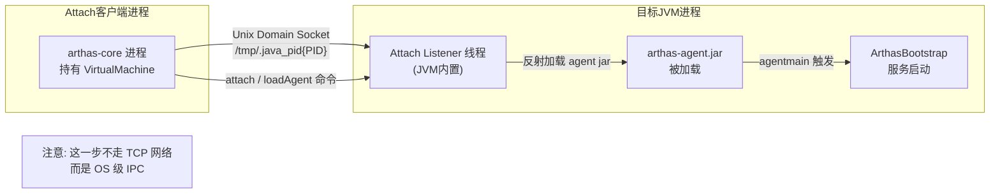
```mermaid
graph LR
    subgraph Attach客户端进程
        A1["arthas-core 进程<br/>持有 VirtualMachine"]
    end
    subgraph 目标JVM进程
        A2["Attach Listener 线程<br/>(JVM内置)"]
        A3["arthas-agent.jar<br/>被加载"]
        A4["ArthasBootstrap<br/>服务启动"]
    end

    A1 -->|"Unix Domain Socket<br/>/tmp/.java_pid{PID}"| A2
    A1 -->|"attach / loadAgent 命令"| A2
    A2 -->|"反射加载 agent jar"| A3
    A3 -->|"agentmain 触发"| A4

    note["注意: 这一步不走 TCP 网络<br/>而是 OS 级 IPC"]
```

> **关键点**：Attach 通信是 OS 层 IPC，不是 TCP 网络。Linux 通过 `/tmp/.java_pid{pid}` Unix Domain Socket，Windows 通过命名管道 `\\.\pipe\java_pid{pid}`。这也是 Arthas 必须"同机"attach 的原因，跨机器诊断需要借助 Tunnel。

---

## 三、多协议复用：Telnet / HTTP / WebSocket

Arthas 最精巧的设计是**在同一个 TCP 端口上复用三种协议**。`HttpTelnetTermServer` 通过 `ProtocolDetectHandler` 在首包阶段识别协议类型，再动态装配不同的 Netty Pipeline。

### 3.1 协议复用架构图

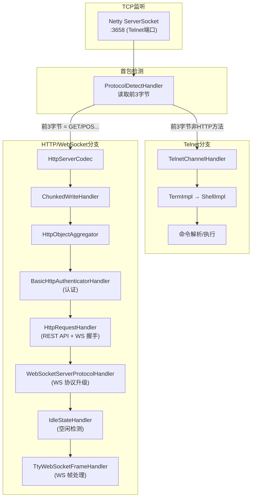
```mermaid
graph TB
    subgraph TCP监听
        LISTEN["Netty ServerSocket<br/>:3658 (Telnet端口)"]
    end

    subgraph 首包检测
        PDH["ProtocolDetectHandler<br/>读取前3字节"]
    end

    subgraph Telnet分支
        T1["TelnetChannelHandler"]
        T2["TermImpl → ShellImpl"]
        T3["命令解析/执行"]
    end

    subgraph HTTP/WebSocket分支
        H1["HttpServerCodec"]
        H2["ChunkedWriteHandler"]
        H3["HttpObjectAggregator"]
        H4["BasicHttpAuthenticatorHandler<br/>(认证)"]
        H5["HttpRequestHandler<br/>(REST API + WS 握手)"]
        H6["WebSocketServerProtocolHandler<br/>(WS 协议升级)"]
        H7["IdleStateHandler<br/>(空闲检测)"]
        H8["TtyWebSocketFrameHandler<br/>(WS 帧处理)"]
    end

    LISTEN --> PDH
    PDH -->|"前3字节 = GET/POS..."| H1
    PDH -->|"前3字节非HTTP方法"| T1
    H1 --> H2 --> H3 --> H4 --> H5 --> H6 --> H7 --> H8
    T1 --> T2 --> T3

```

### 3.2 协议检测核心源码

`core/src/main/java/com/taobao/arthas/core/shell/term/impl/httptelnet/ProtocolDetectHandler.java`

```java
@Override
public void channelRead(ChannelHandlerContext ctx, Object msg) {     // :71
    ByteBuf in = (ByteBuf) msg;
    if (in.readableBytes() < 3) return;

    byte[] bytes = new byte[3];
    in.getBytes(0, bytes);
    String httpHeader = new String(bytes);                            // 读取前3字节

    if (!"GET".equalsIgnoreCase(httpHeader)) {                       // 非 GET → Telnet
        channelGroup.add(ctx.channel());
        TelnetChannelHandler handler = new TelnetChannelHandler(handlerFactory);
        pipeline.addLast(handler);
        ctx.fireChannelActive();
    } else {                                                          // GET → HTTP/WebSocket
        // 动态装配 HTTP + WebSocket pipeline
        pipeline.addLast(new HttpServerCodec());
        pipeline.addLast(new ChunkedWriteHandler());
        pipeline.addLast(new HttpObjectAggregator(ArthasConstants.MAX_HTTP_CONTENT_LENGTH));
        pipeline.addLast(new BasicHttpAuthenticatorHandler(httpSessionManager));
        pipeline.addLast(workerGroup, "HttpRequestHandler",
                new HttpRequestHandler(ArthasConstants.DEFAULT_WEBSOCKET_PATH));
        pipeline.addLast(new WebSocketServerProtocolHandler(
                ArthasConstants.DEFAULT_WEBSOCKET_PATH, null, false,
                ArthasConstants.MAX_HTTP_CONTENT_LENGTH, false, true));
        pipeline.addLast(new IdleStateHandler(0, ArthasConstants.WEBSOCKET_IDLE_SECONDS, 0));
        pipeline.addLast(new TtyWebSocketFrameHandler(channelGroup, ttyConnectionFactory));
        ctx.fireChannelActive();
    }
    // 移除自己，后续请求由真实 handler 处理
    pipeline.remove(this);
}
```

### 3.3 两种端口的角色

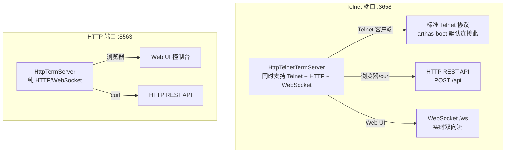
```mermaid
graph TB
    subgraph "Telnet 端口 :3658"
        TP["HttpTelnetTermServer<br/>同时支持 Telnet + HTTP + WebSocket"]
        TP -->|"Telnet 客户端"| TELNET["标准 Telnet 协议<br/>arthas-boot 默认连接此"]
        TP -->|"浏览器/curl"| HTTP1["HTTP REST API<br/>POST /api"]
        TP -->|"Web UI"| WS1["WebSocket /ws<br/>实时双向流"]
    end

    subgraph "HTTP 端口 :8563"
        HP["HttpTermServer<br/>纯 HTTP/WebSocket"]
        HP -->|"浏览器"| WEBUI["Web UI 控制台"]
        HP -->|"curl"| HTTP2["HTTP REST API"]
    end

```

### 3.4 HTTP 端口（8563）vs Telnet 端口（3658）

| 维度 | Telnet 端口 (3658) | HTTP 端口 (8563) |
|------|-------------------|------------------|
| 实现类 | `HttpTelnetTermServer` | `HttpTermServer` |
| 支持协议 | Telnet + HTTP + WebSocket | HTTP + WebSocket |
| 用途 | CLI 客户端主入口 | Web UI 主入口 |
| 认证 | 可选（本地免认证） | 可选 |
| 默认开启 | 是 | 是 |

---

## 四、命令执行链路

从用户输入到命令返回，要经过 Term → Shell → CommandManager → Job → Command 的完整链路。

### 4.1 命令执行时序图

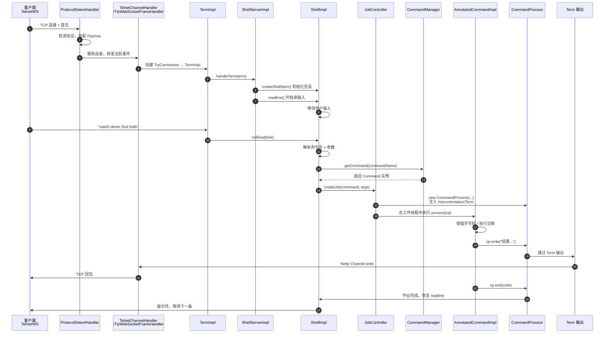
```mermaid
sequenceDiagram
    autonumber
    participant C as 客户端<br/>Telnet/WS
    participant PDH as ProtocolDetectHandler
    participant TH as TelnetChannelHandler<br/>/TtyWebSocketFrameHandler
    participant T as TermImpl
    participant SS as ShellServerImpl
    participant SI as ShellImpl
    participant JC as JobController
    participant CM as CommandManager
    participant CMD as AnnotatedCommandImpl
    participant CP as CommandProcess
    participant OUT as Term 输出

    C->>PDH: TCP 连接 + 首包
    PDH->>PDH: 检测协议，装配 Pipeline
    PDH->>TH: 移除自身，转发活跃事件
    TH->>T: 创建 TtyConnection → TermImpl
    T->>SS: handleTerm(term)
    SS->>SI: createShell(term) 初始化会话
    SS->>SI: readline() 开始读输入
    SI->>SI: 等待用户输入
    C->>T: "watch demo.Test hello"
    T->>SI: onRead(line)
    SI->>SI: 解析命令名 + 参数
    SI->>CM: getCommand(commandName)
    CM-->>SI: 返回 Command 实例
    SI->>JC: createJob(command, args)
    JC->>CP: new CommandProcess(...)<br/>注入 Instrumentation/Term
    JC->>CMD: 在工作线程中执行 process(cp)
    CMD->>CMD: 增强字节码 / 执行诊断
    CMD->>CP: cp.write("结果...")
    CP->>OUT: 通过 Term 输出
    OUT->>TH: Netty Channel write
    TH->>C: TCP 回包
    CMD->>CP: cp.exit(code)
    CP->>SI: 作业完成，恢复 readline
    SI->>C: 提示符，等待下一条
```

### 4.2 命令解析与执行流程图

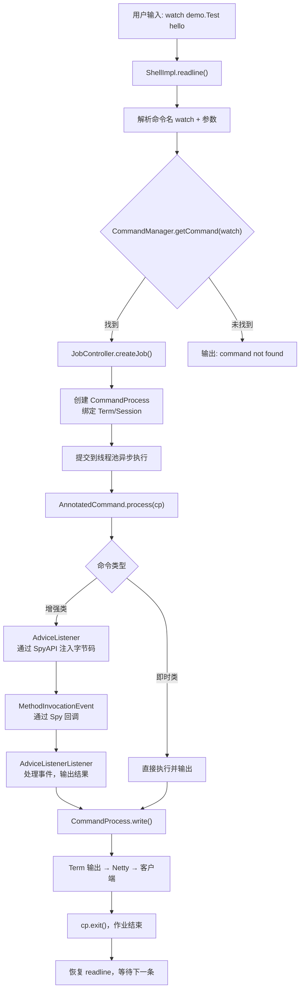
```mermaid
flowchart TB
    A["用户输入: watch demo.Test hello"] --> B["ShellImpl.readline()"]
    B --> C["解析命令名 watch + 参数"]
    C --> D{"CommandManager.getCommand(watch)"}
    D -->|找到| E["JobController.createJob()"]
    D -->|未找到| F["输出: command not found"]
    E --> G["创建 CommandProcess<br/>绑定 Term/Session"]
    G --> H["提交到线程池异步执行"]
    H --> I["AnnotatedCommand.process(cp)"]
    I --> J{"命令类型"}
    J -->|增强类| K["AdviceListener<br/>通过 SpyAPI 注入字节码"]
    J -->|即时类| L["直接执行并输出"]
    K --> M["MethodInvocationEvent<br/>通过 Spy 回调"]
    M --> N["AdviceListenerListener<br/>处理事件，输出结果"]
    N --> O["CommandProcess.write()"]
    L --> O
    O --> P["Term 输出 → Netty → 客户端"]
    P --> Q["cp.exit()，作业结束"]
    Q --> R["恢复 readline，等待下一条"]

```

### 4.3 关键源码定位

#### (1) ShellServerImpl：会话创建

`core/src/main/java/com/taobao/arthas/core/shell/impl/ShellServerImpl.java:89`

```java
// 连接建立时回调
protected void handleTerm(Term term) {
    ShellImpl session = createShell(term);            // 创建会话
    session.setWelcome(welcomeMessage);
    session.closedFuture.setHandler(new SessionClosedHandler(this, session));
    session.init();
    sessions.put(session.id, session);
    session.readline();                              // 开始读取用户输入 :98
}
```

#### (2) ShellServerImpl：监听启动

`core/src/main/java/com/taobao/arthas/core/shell/impl/ShellServerImpl.java:120`

```java
public ShellServer listen(Handler<Throwable> listenHandler) {
    for (TermServer termServer : termServers) {
        termServer.listen(handler -> {               // 启动 Netty 监听
            if (handler.succeeded()) {
                // 监听成功
            } else {
                listenHandler.handle(handler.cause());
            }
        });
    }
    return this;
}
```

#### (3) ArthasBootstrap.bind()：服务器编排

`core/src/main/java/com/taobao/arthas/core/server/ArthasBootstrap.java:366`

```java
private void bind(Configure configure) throws Throwable {
    // 1. 随机端口处理
    if (configure.getTelnetPort() != null && configure.getTelnetPort() == 0) {
        configure.setTelnetPort(SocketUtils.findAvailableTcpPort());
    }
    if (configure.getHttpPort() != null && configure.getHttpPort() == 0) {
        configure.setHttpPort(SocketUtils.findAvailableTcpPort());
    }

    // 2. 创建 ShellServer
    ShellServerOptions options = new ShellServerOptions()
            .setInstrumentation(instrumentation)
            .setPid(PidUtils.currentLongPid());
    this.shellServer = new ShellServerImpl(options);

    // 3. 注册 Telnet 端口（协议复用）
    if (configure.getTelnetPort() > 0) {
        shellServer.registerTermServer(new HttpTelnetTermServer(
                configure.getIp(), configure.getTelnetPort(),
                options.getConnectionTimeout(), workerGroup, httpSessionManager));   // :453
    }

    // 4. 注册 HTTP 端口
    if (configure.getHttpPort() > 0) {
        shellServer.registerTermServer(new HttpTermServer(
                configure.getIp(), configure.getHttpPort(),
                options.getConnectionTimeout(), workerGroup, httpSessionManager));   // :460
    }

    // 5. 注册命令
    shellServer.registerCommandResolver(builtinCommands);

    // 6. 启动监听
    shellServer.listen(new BindHandler(isBindRef));                                  // :474

    // 7. 启动 MCP Server（如果配置了）
    if (mcpEndpoint != null && !mcpEndpoint.trim().isEmpty()) {                     // :486
        CommandExecutor commandExecutor = new CommandExecutorImpl(sessionManager);
        this.arthasMcpBootstrap = new ArthasMcpBootstrap(commandExecutor, mcpEndpoint, mcpProtocol);
        this.mcpRequestHandler = this.arthasMcpBootstrap.start().getMcpRequestHandler();
    }
}
```

---

## 五、MCP 通信机制（4.x 新增）

MCP（Model Context Protocol）是 Arthas 4.x 引入的 AI 友好协议，让 Claude、Cherry Studio 等 AI 客户端能直接调用 Arthas 诊断工具。**Arthas 没有使用官方 MCP Java SDK，而是用 Netty 自研实现**（原因：官方 SDK 要求 Java 17+，而 Arthas 需兼容 Java 8）。

### 5.1 MCP 通信架构图

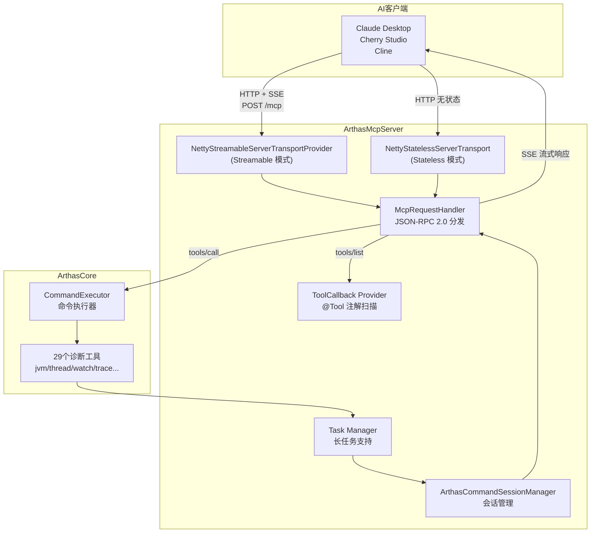
```mermaid
graph TB
    subgraph AI客户端
        AI["Claude Desktop<br/>Cherry Studio<br/>Cline"]
    end

    subgraph ArthasMcpServer
        TRANS["NettyStreamableServerTransportProvider<br/>(Streamable 模式)"]
        TRANS2["NettyStatelessServerTransport<br/>(Stateless 模式)"]
        HANDLER["McpRequestHandler<br/>JSON-RPC 2.0 分发"]
        TOOLS["ToolCallback Provider<br/>@Tool 注解扫描"]
        SESSION["ArthasCommandSessionManager<br/>会话管理"]
        TASK["Task Manager<br/>长任务支持"]
    end

    subgraph ArthasCore
        CMD_EXEC["CommandExecutor<br/>命令执行器"]
        DIAG["29个诊断工具<br/>jvm/thread/watch/trace..."]
    end

    AI -->|"HTTP + SSE<br/>POST /mcp"| TRANS
    AI -->|"HTTP 无状态"| TRANS2
    TRANS --> HANDLER
    TRANS2 --> HANDLER
    HANDLER -->|"tools/list"| TOOLS
    HANDLER -->|"tools/call"| CMD_EXEC
    CMD_EXEC --> DIAG
    DIAG --> TASK
    TASK --> SESSION
    SESSION --> HANDLER
    HANDLER -->|"SSE 流式响应"| AI

```

### 5.2 MCP 请求处理时序图

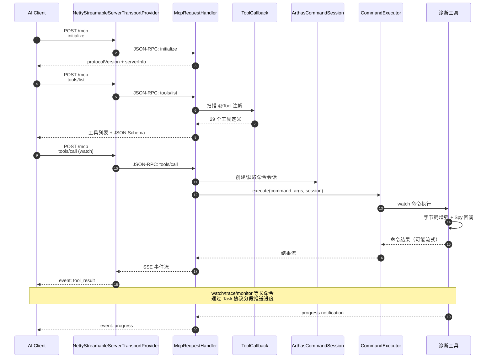
```mermaid
sequenceDiagram
    autonumber
    participant AI as AI Client
    participant NET as NettyStreamableServerTransportProvider
    participant H as McpRequestHandler
    participant T as ToolCallback
    participant S as ArthasCommandSession
    participant E as CommandExecutor
    participant D as 诊断工具

    AI->>NET: POST /mcp<br/>initialize
    NET->>H: JSON-RPC: initialize
    H-->>AI: protocolVersion + serverInfo

    AI->>NET: POST /mcp<br/>tools/list
    NET->>H: JSON-RPC: tools/list
    H->>T: 扫描 @Tool 注解
    T-->>H: 29 个工具定义
    H-->>AI: 工具列表 + JSON Schema

    AI->>NET: POST /mcp<br/>tools/call (watch)
    NET->>H: JSON-RPC: tools/call
    H->>S: 创建/获取命令会话
    H->>E: execute(command, args, session)
    E->>D: watch 命令执行
    D->>D: 字节码增强 + Spy 回调
    D-->>E: 命令结果（可能流式）
    E-->>H: 结果流
    H-->>NET: SSE 事件流
    NET-->>AI: event: tool_result

    Note over D,AI: watch/trace/monitor 等长命令<br/>通过 Task 协议分段推送进度
    D-->>H: progress notification
    H-->>AI: event: progress
```

### 5.3 MCP 启动流程图

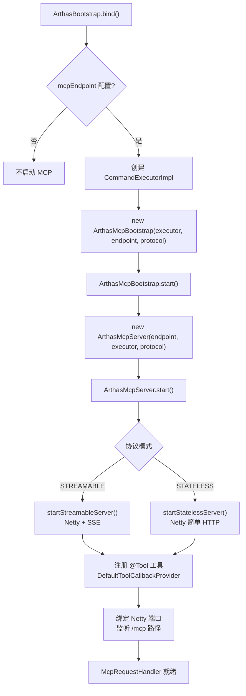
```mermaid
flowchart TB
    A["ArthasBootstrap.bind()"] --> B{"mcpEndpoint 配置?"}
    B -->|否| END["不启动 MCP"]
    B -->|是| C["创建 CommandExecutorImpl"]
    C --> D["new ArthasMcpBootstrap(executor, endpoint, protocol)"]
    D --> E["ArthasMcpBootstrap.start()"]
    E --> F["new ArthasMcpServer(endpoint, executor, protocol)"]
    F --> G["ArthasMcpServer.start()"]
    G --> H{"协议模式"}
    H -->|"STREAMABLE"| I["startStreamableServer()<br/>Netty + SSE"]
    H -->|"STATELESS"| J["startStatelessServer()<br/>Netty 简单 HTTP"]
    I --> K["注册 @Tool 工具<br/>DefaultToolCallbackProvider"]
    J --> K
    K --> L["绑定 Netty 端口<br/>监听 /mcp 路径"]
    L --> M["McpRequestHandler 就绪"]

```

### 5.4 MCP 关键源码定位

`core/src/main/java/com/taobao/arthas/core/mcp/ArthasMcpServer.java`

```java
public void start() {
    if ("STATELESS".equalsIgnoreCase(protocol)) {
        startStatelessServer();     // :279 无状态模式
    } else {
        startStreamableServer();    // :190 流式模式（默认）
    }
}
```

`core/src/main/java/com/taobao/arthas/core/mcp/ArthasMcpBootstrap.java`

```java
public ArthasMcpServer start() {                                    // :36
    mcpServer = new ArthasMcpServer(mcpEndpoint, commandExecutor, protocol);
    mcpServer.start();
    return mcpServer;
}
```

---

## 六、隧道（Tunnel）远程通信

Tunnel 是 Arthas 实现跨机器远程诊断的机制。当目标 JVM 在内网，无法直接 telnet 时，通过 Tunnel Server 中转。

### 6.1 Tunnel 通信架构图

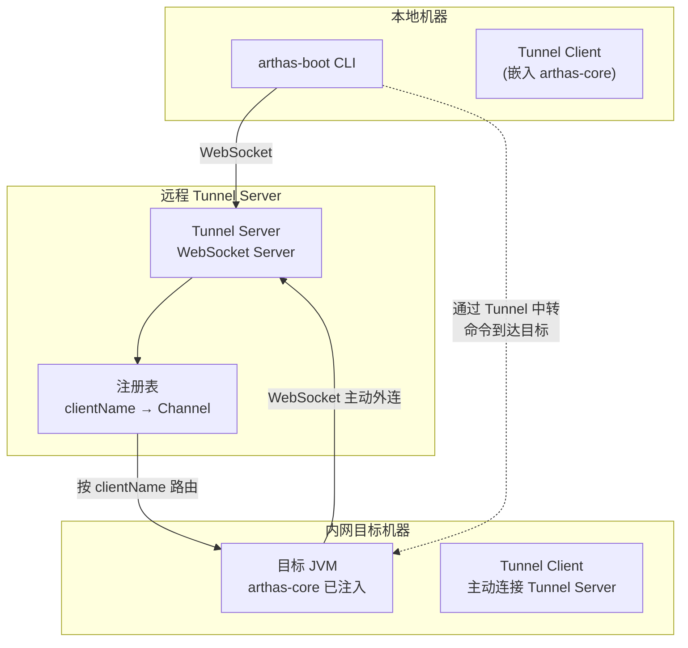
```mermaid
graph TB
    subgraph 本地机器
        CLI["arthas-boot CLI"]
        TUNNEL_CLIENT["Tunnel Client<br/>(嵌入 arthas-core)"]
    end

    subgraph "远程 Tunnel Server"
        TS["Tunnel Server<br/>WebSocket Server"]
        REG["注册表<br/>clientName → Channel"]
    end

    subgraph 内网目标机器
        TARGET["目标 JVM<br/>arthas-core 已注入"]
        TC2["Tunnel Client<br/>主动连接 Tunnel Server"]
    end

    CLI -->|"WebSocket"| TS
    TARGET -->|"WebSocket 主动外连"| TS
    TS --> REG
    REG -->|"按 clientName 路由"| TARGET

    CLI -.->|"通过 Tunnel 中转<br/>命令到达目标"| TARGET

```

### 6.2 Tunnel 工作原理

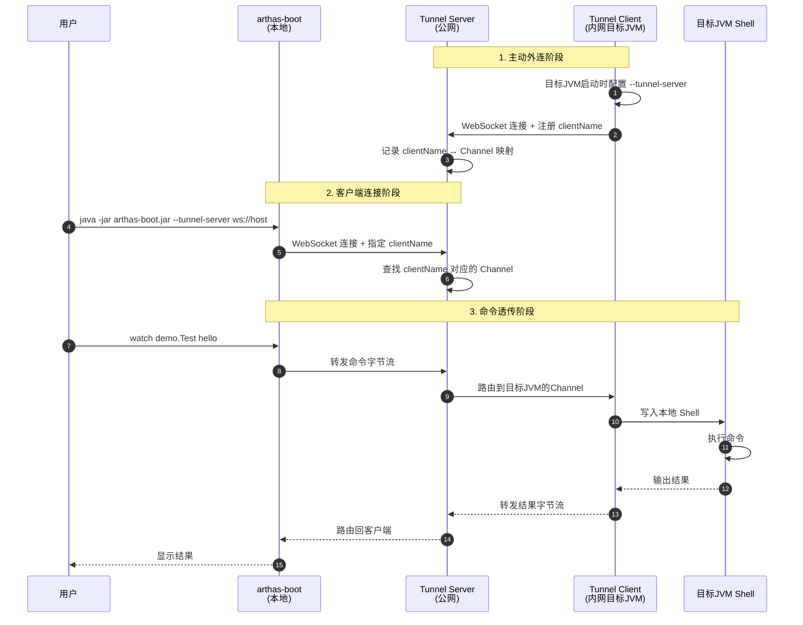
```mermaid
sequenceDiagram
    autonumber
    participant U as 用户
    participant CLI as arthas-boot<br/>(本地)
    participant TS as Tunnel Server<br/>(公网)
    participant TC as Tunnel Client<br/>(内网目标JVM)
    participant J as 目标JVM Shell

    Note over TC,TS: 1. 主动外连阶段
    TC->>TC: 目标JVM启动时配置 --tunnel-server
    TC->>TS: WebSocket 连接 + 注册 clientName
    TS->>TS: 记录 clientName ↔ Channel 映射

    Note over CLI,TS: 2. 客户端连接阶段
    U->>CLI: java -jar arthas-boot.jar --tunnel-server ws://host
    CLI->>TS: WebSocket 连接 + 指定 clientName
    TS->>TS: 查找 clientName 对应的 Channel

    Note over CLI,J: 3. 命令透传阶段
    U->>CLI: watch demo.Test hello
    CLI->>TS: 转发命令字节流
    TS->>TC: 路由到目标JVM的Channel
    TC->>J: 写入本地 Shell
    J->>J: 执行命令
    J-->>TC: 输出结果
    TC-->>TS: 转发结果字节流
    TS-->>CLI: 路由回客户端
    CLI-->>U: 显示结果
```

---

## 七、线程模型与 I/O 模型

### 7.1 线程模型架构图

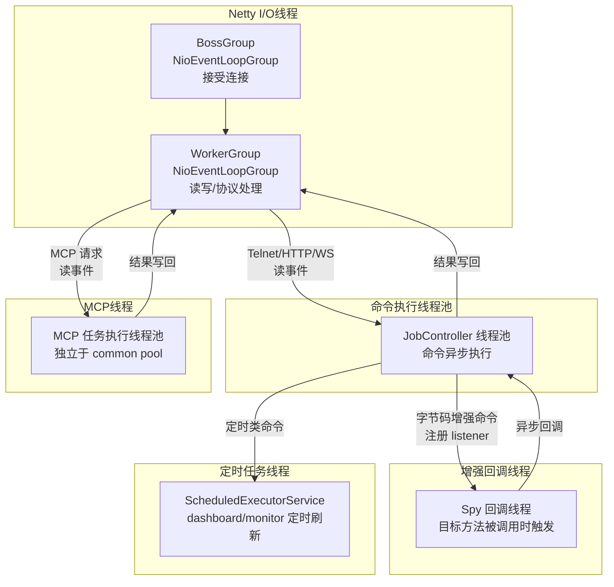
```mermaid
graph TB
    subgraph Netty I/O线程
        BOSS["BossGroup<br/>NioEventLoopGroup<br/>接受连接"]
        WORKER["WorkerGroup<br/>NioEventLoopGroup<br/>读写/协议处理"]
    end

    subgraph 命令执行线程池
        JOB["JobController 线程池<br/>命令异步执行"]
    end

    subgraph 增强回调线程
        SPY_T["Spy 回调线程<br/>目标方法被调用时触发"]
    end

    subgraph 定时任务线程
        SCHED["ScheduledExecutorService<br/>dashboard/monitor 定时刷新"]
    end

    subgraph MCP线程
        MCP_T["MCP 任务执行线程池<br/>独立于 common pool"]
    end

    BOSS --> WORKER
    WORKER -->|"Telnet/HTTP/WS<br/>读事件"| JOB
    WORKER -->|"MCP 请求<br/>读事件"| MCP_T
    JOB -->|"字节码增强命令<br/>注册 listener"| SPY_T
    SPY_T -->|"异步回调"| JOB
    JOB -->|"定时类命令"| SCHED
    JOB -->|"结果写回"| WORKER
    MCP_T -->|"结果写回"| WORKER

```

### 7.2 关键设计点

| 线程 | 职责 | 阻塞风险 |
|------|------|---------|
| BossGroup | accept 连接 | 极低 |
| WorkerGroup | 读写、协议解码、Pipeline 处理 | 中（避免业务逻辑） |
| Job 线程池 | 命令执行（watch/trace 等长任务） | 高（用户命令可能阻塞） |
| Spy 回调线程 | 目标方法触发时的字节码增强回调 | 中 |
| ScheduledExecutor | dashboard / monitor 定时输出 | 低 |
| MCP 线程池 | MCP tool 调用 | 中 |

---

## 八、端口与配置体系

### 8.1 端口分配图

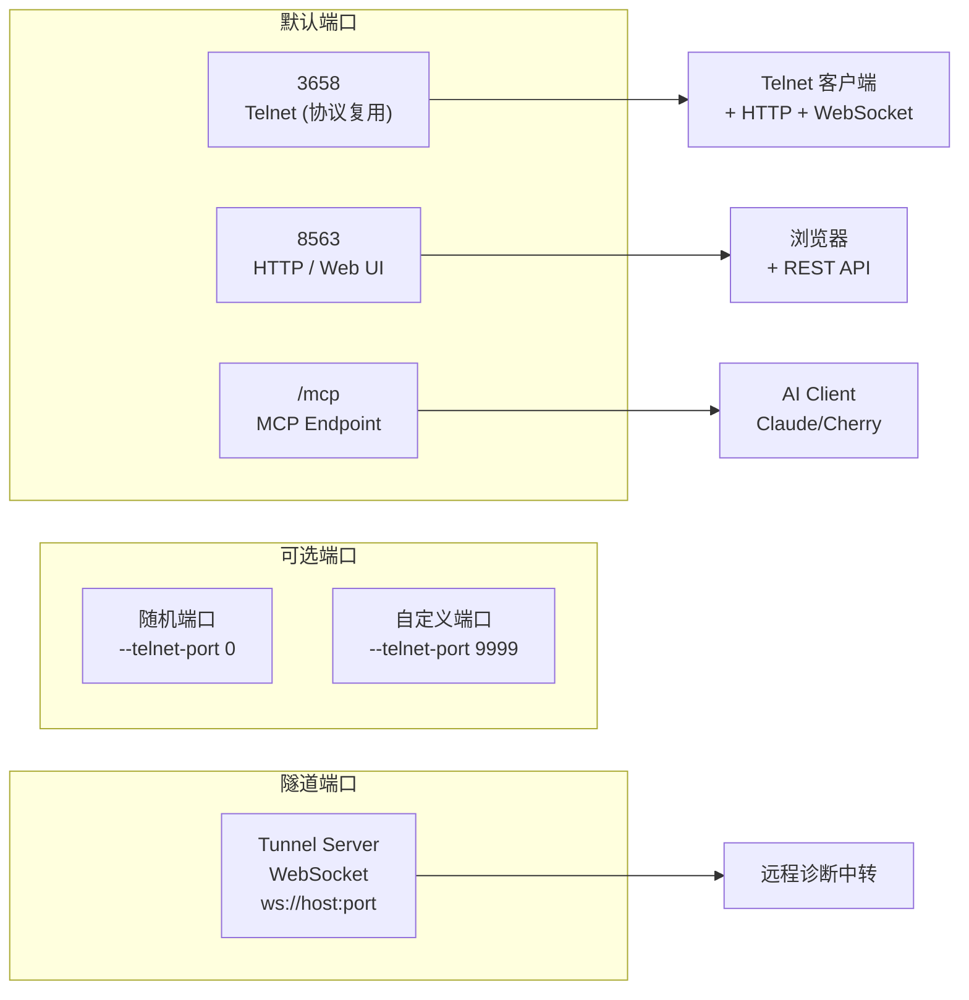
```mermaid
graph LR
    subgraph 默认端口
        P1["3658<br/>Telnet (协议复用)"]
        P2["8563<br/>HTTP / Web UI"]
        P3["/mcp<br/>MCP Endpoint"]
    end

    subgraph 可选端口
        P4["随机端口<br/>--telnet-port 0"]
        P5["自定义端口<br/>--telnet-port 9999"]
    end

    subgraph 隧道端口
        P6["Tunnel Server<br/>WebSocket<br/>ws://host:port"]
    end

    P1 --> T1["Telnet 客户端<br/>+ HTTP + WebSocket"]
    P2 --> T2["浏览器<br/>+ REST API"]
    P3 --> T3["AI Client<br/>Claude/Cherry"]
    P6 --> T4["远程诊断中转"]

```

### 8.2 配置优先级

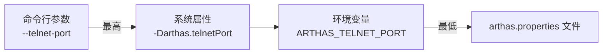
```mermaid
graph LR
    A["命令行参数<br/>--telnet-port"] -->|最高| B["系统属性<br/>-Darthas.telnetPort"]
    B --> C["环境变量<br/>ARTHAS_TELNET_PORT"]
    C -->|最低| D["arthas.properties 文件"]

```

### 8.3 核心配置参数

| 参数 | 默认值 | 说明 |
|------|--------|------|
| `arthas.ip` | 127.0.0.1 | 绑定 IP |
| `arthas.telnetPort` | 3658 | Telnet 端口（0=随机） |
| `arthas.httpPort` | 8563 | HTTP 端口（0=随机） |
| `arthas.sessionTimeout` | 10800 | 会话超时（秒） |
| `arthas.localConnectionNonAuth` | true | 本地连接免认证 |
| `arthas.mcpEndpoint` | /mcp | MCP 路由路径 |
| `arthas.mcpProtocol` | STREAMABLE | MCP 协议模式 |
| `--tunnel-server` | 无 | Tunnel Server 地址 |
| `--username`/`--password` | 无 | HTTP 认证 |

---

## 九、通信安全机制

### 9.1 安全分层架构

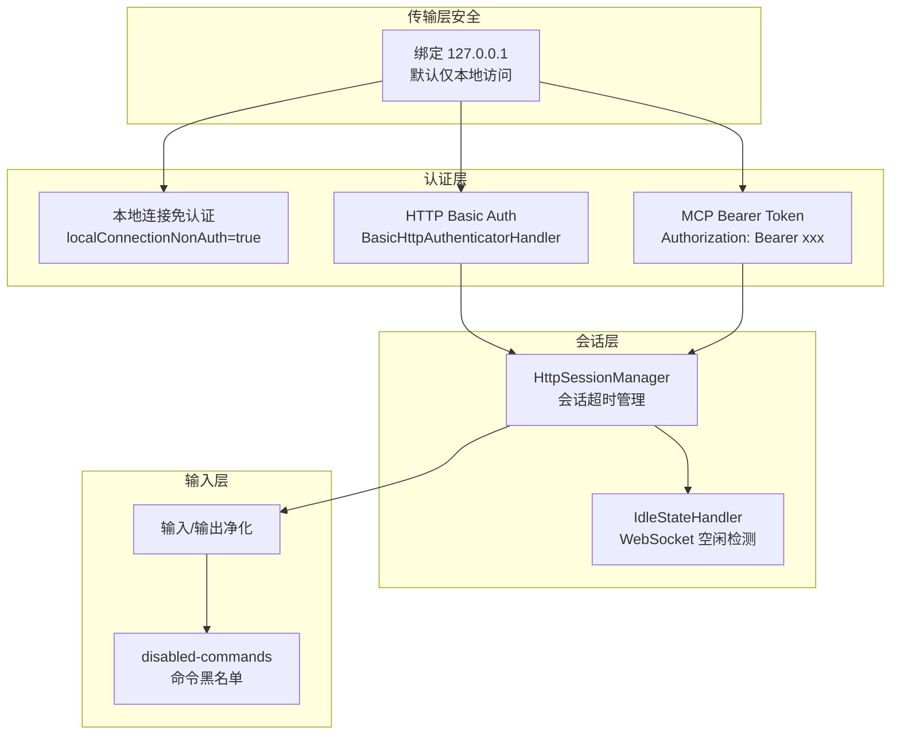
```mermaid
graph TB
    subgraph 传输层安全
        BIND["绑定 127.0.0.1<br/>默认仅本地访问"]
    end

    subgraph 认证层
        LOCAL["本地连接免认证<br/>localConnectionNonAuth=true"]
        AUTH["HTTP Basic Auth<br/>BasicHttpAuthenticatorHandler"]
        BEARER["MCP Bearer Token<br/>Authorization: Bearer xxx"]
    end

    subgraph 会话层
        SESSION["HttpSessionManager<br/>会话超时管理"]
        IDLE["IdleStateHandler<br/>WebSocket 空闲检测"]
    end

    subgraph 输入层
        SANITIZE["输入/输出净化"]
        DISABLE["disabled-commands<br/>命令黑名单"]
    end

    BIND --> LOCAL
    BIND --> AUTH
    BIND --> BEARER
    AUTH --> SESSION
    BEARER --> SESSION
    SESSION --> IDLE
    SESSION --> SANITIZE
    SANITIZE --> DISABLE

```

### 9.2 认证流程时序图

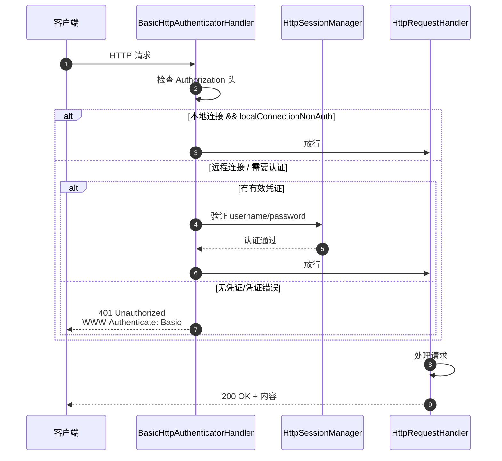
```mermaid
sequenceDiagram
    autonumber
    participant C as 客户端
    participant BH as BasicHttpAuthenticatorHandler
    participant HSM as HttpSessionManager
    participant H as HttpRequestHandler

    C->>BH: HTTP 请求
    BH->>BH: 检查 Authorization 头
    alt 本地连接 && localConnectionNonAuth
        BH->>H: 放行
    else 远程连接 / 需要认证
        alt 有有效凭证
            BH->>HSM: 验证 username/password
            HSM-->>BH: 认证通过
            BH->>H: 放行
        else 无凭证/凭证错误
            BH-->>C: 401 Unauthorized<br/>WWW-Authenticate: Basic
        end
    end
    H->>H: 处理请求
    H-->>C: 200 OK + 内容
```

---

## 十、完整通信链路总览

### 10.1 端到端通信全链路图

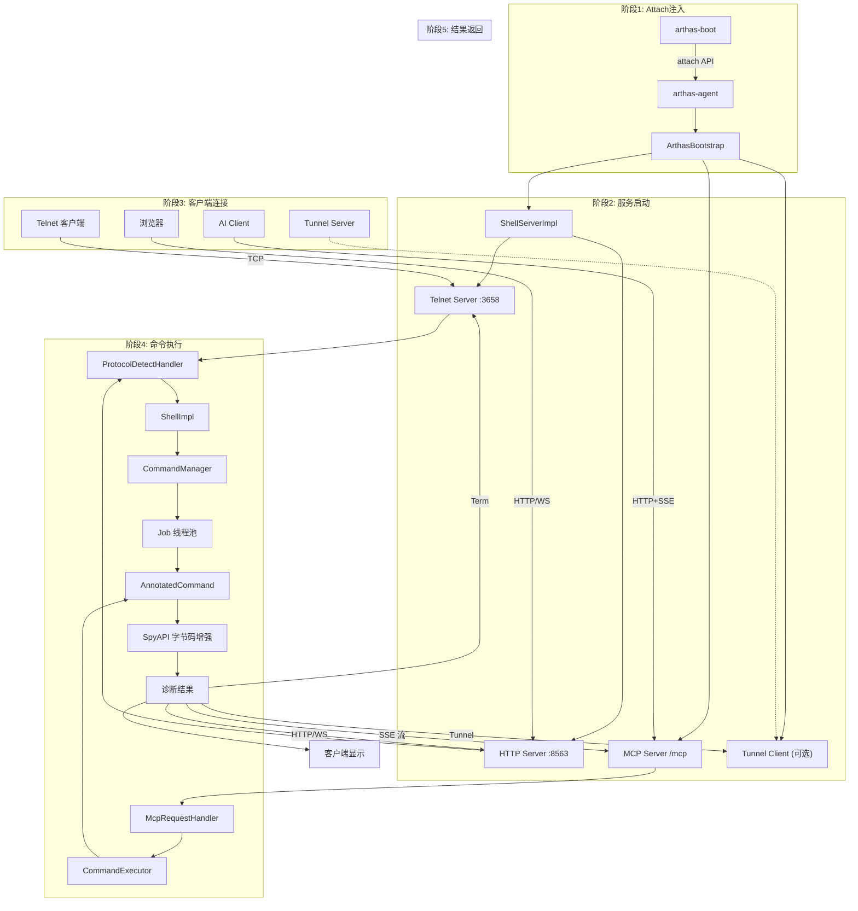
```mermaid
graph TB
    subgraph "阶段1: Attach注入"
        A1["arthas-boot"] -->|"attach API"| A2["arthas-agent"] --> A3["ArthasBootstrap"]
    end

    subgraph "阶段2: 服务启动"
        A3 --> B1["ShellServerImpl"]
        B1 --> B2["Telnet Server :3658"]
        B1 --> B3["HTTP Server :8563"]
        A3 --> B4["MCP Server /mcp"]
        A3 --> B5["Tunnel Client (可选)"]
    end

    subgraph "阶段3: 客户端连接"
        C1["Telnet 客户端"] -->|"TCP"| B2
        C2["浏览器"] -->|"HTTP/WS"| B3
        C3["AI Client"] -->|"HTTP+SSE"| B4
        C4["Tunnel Server"] -.-> B5
    end

    subgraph "阶段4: 命令执行"
        B2 --> D1["ProtocolDetectHandler"]
        B3 --> D1
        D1 --> D2["ShellImpl"]
        D2 --> D3["CommandManager"]
        D3 --> D4["Job 线程池"]
        B4 --> D5["McpRequestHandler"]
        D5 --> D6["CommandExecutor"]
        D4 --> D7["AnnotatedCommand"]
        D6 --> D7
        D7 --> D8["SpyAPI 字节码增强"]
        D8 --> D9["诊断结果"]
    end

    subgraph "阶段5: 结果返回"
        D9 -->|"Term"| B2
        D9 -->|"HTTP/WS"| B3
        D9 -->|"SSE 流"| B4
        D9 -->|"Tunnel"| B5
    end

    D9 --> E1["客户端显示"]

```

### 10.2 通信协议矩阵

| 通信场景 | 协议 | 传输层 | 端口/路径 |
|---------|------|--------|----------|
| Attach 注入 | JVM Attach API | Unix Socket / 命名管道 | 进程内 IPC |
| CLI 诊断交互 | Telnet | TCP | 3658 |
| Web UI 诊断 | HTTP + WebSocket | TCP | 8563 |
| REST API | HTTP | TCP | 3658 或 8563 |
| AI 集成 | MCP (JSON-RPC over HTTP+SSE) | TCP | /mcp |
| 跨机器诊断 | WebSocket（Tunnel） | TCP | Tunnel Server 端口 |
| 字节码回调 | SpyAPI（进程内） | Java 方法调用 | 进程内 |

---

## 十一、关键设计总结

### 11.1 设计亮点

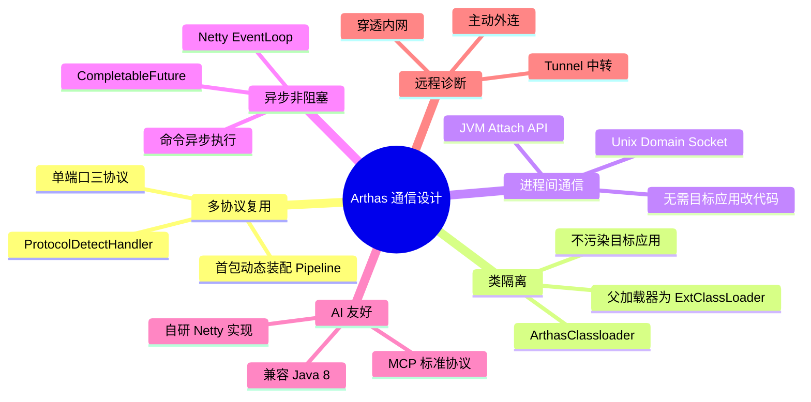
```mermaid
mindmap
  root((Arthas 通信设计))
    多协议复用
      单端口三协议
      首包动态装配 Pipeline
      ProtocolDetectHandler
    类隔离
      ArthasClassloader
      父加载器为 ExtClassLoader
      不污染目标应用
    进程间通信
      JVM Attach API
      Unix Domain Socket
      无需目标应用改代码
    异步非阻塞
      Netty EventLoop
      CompletableFuture
      命令异步执行
    AI 友好
      MCP 标准协议
      自研 Netty 实现
      兼容 Java 8
    远程诊断
      Tunnel 中转
      主动外连
      穿透内网
```

### 11.2 通信机制对比

| 机制 | 延迟 | 透传性 | 适用场景 |
|------|------|--------|---------|
| Attach | 低（IPC） | 仅本地 | 注入 agent |
| Telnet | 低 | 本地/远程 | CLI 交互 |
| HTTP/WS | 中 | 本地/远程 | Web UI |
| MCP | 中 | 本地/远程 | AI 集成 |
| Tunnel | 高（多一跳） | 穿透内网 | 远程诊断 |
| SpyAPI | 极低（方法调用） | 进程内 | 字节码回调 |

---

## 附录：关键源码文件索引

| 模块 | 文件 | 职责 |
|------|------|------|
| arthas-boot | `boot/.../Bootstrap.java` | 启动入口、PID选择、attach |
| arthas-core | `core/.../Arthas.java` | attach 发起者 |
| arthas-agent | `agent/.../AgentBootstrap.java` | agentmain 入口 |
| arthas-agent | `agent/.../ArthasClassloader.java` | 类隔离加载 |
| arthas-core | `core/.../server/ArthasBootstrap.java` | 核心服务编排 |
| arthas-core | `core/.../shell/impl/ShellServerImpl.java` | Shell 会话管理 |
| arthas-core | `core/.../shell/term/impl/httptelnet/HttpTelnetTermServer.java` | Telnet+HTTP 复用服务 |
| arthas-core | `core/.../shell/term/impl/httptelnet/ProtocolDetectHandler.java` | 协议检测 |
| arthas-core | `core/.../shell/term/impl/httptelnet/HttpRequestHandler.java` | HTTP 请求处理 |
| arthas-core | `core/.../shell/term/impl/httptelnet/TtyWebSocketFrameHandler.java` | WebSocket 帧处理 |
| arthas-core | `core/.../mcp/ArthasMcpBootstrap.java` | MCP 启动 |
| arthas-core | `core/.../mcp/ArthasMcpServer.java` | MCP 服务实现 |
| arthas-mcp-server | `mcp-server/.../transport/NettyStreamableServerTransportProvider.java` | MCP Netty 传输 |

---

*本文档基于 Arthas 4.3.x 源码分析，涵盖 Attach 机制、多协议复用、命令执行链路、MCP 新协议、隧道远程通信、线程模型与安全机制。所有源码引用均标注 file_path:line_number，便于追溯。*