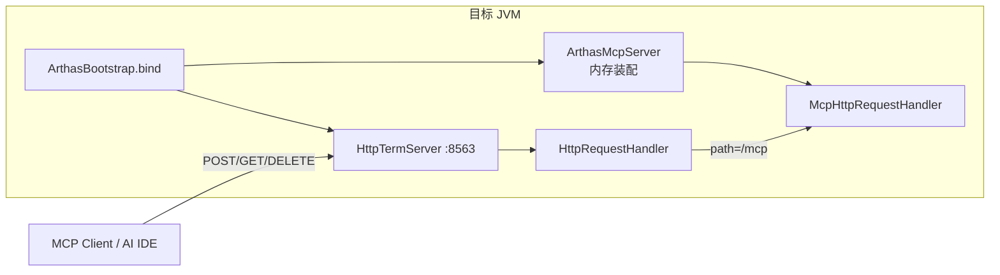
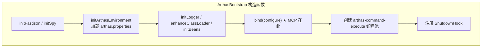
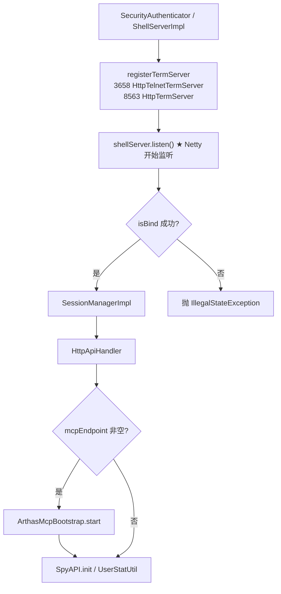
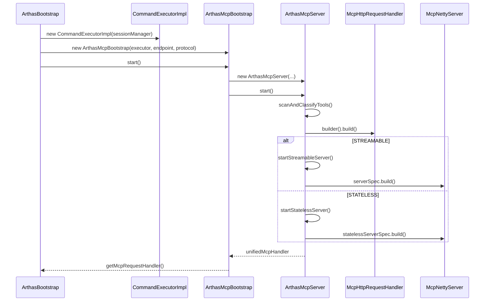
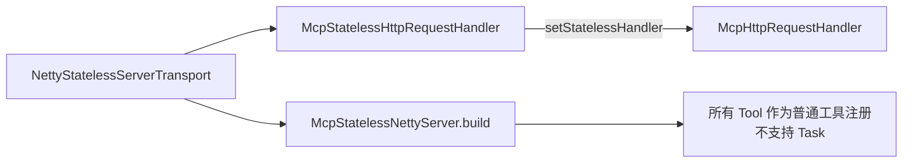
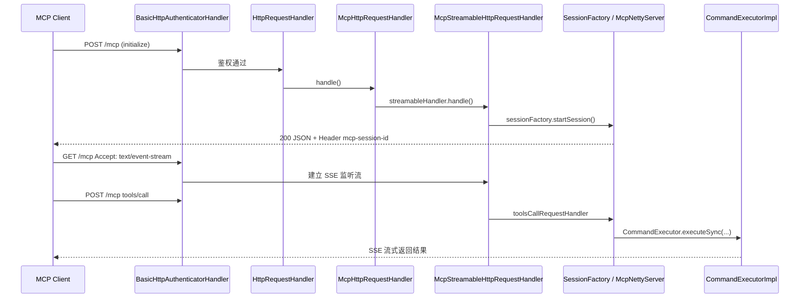
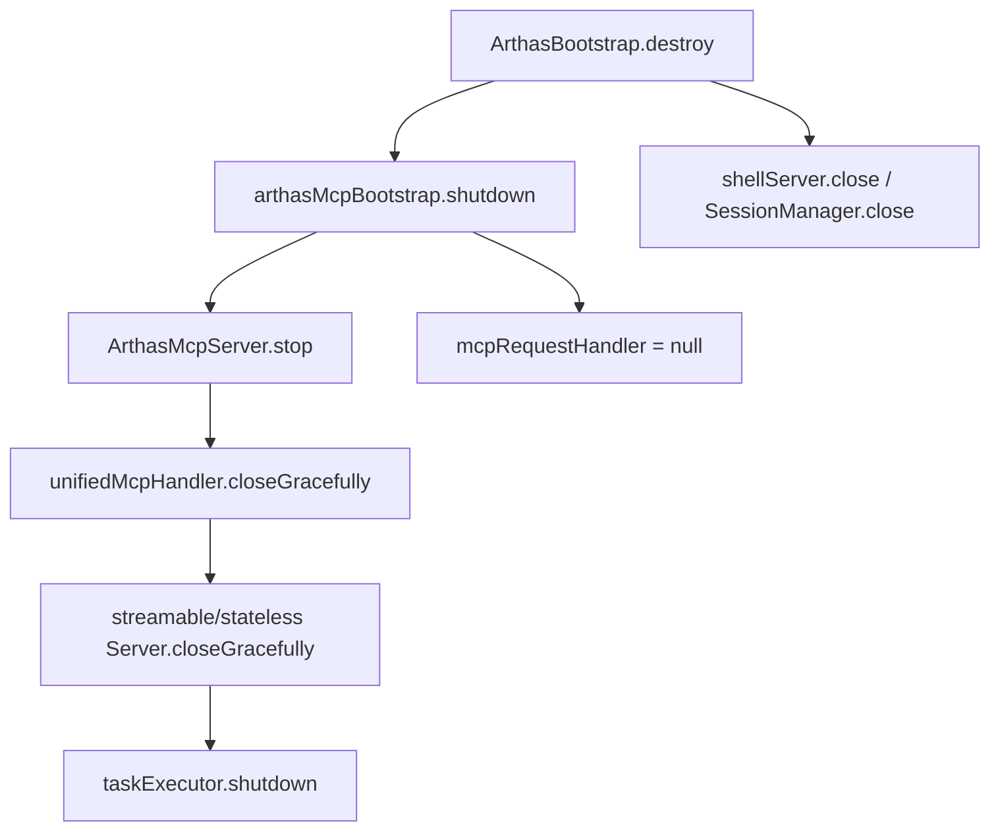

# Arthas MCP Server 启动流程深度剖析

> 文档日期：2026-06-06  
> 分析范围：`ArthasBootstrap.bind()` → `ArthasMcpBootstrap` → `ArthasMcpServer` → HTTP 8563 路由挂载  
> 关联文档：[arthas-startup-flow.md](./arthas-startup-flow.md)、[arthas-mcp-server-源码剖析.md](./arthas-mcp-server-源码剖析.md)  
> 默认配置：`arthas.mcpEndpoint=/mcp`，`arthas.mcpProtocol=STREAMABLE`，HTTP 端口 **8563**

---

## 1. 核心结论（先读这段）

Arthas MCP Server 的「启动」**不是**另起一个进程或单独 `bind()` 端口，而是在 Agent 已 attach、HTTP **8563** 已监听之后，于目标 JVM 内完成：

1. 读取 `mcpEndpoint` / `mcpProtocol` 配置  
2. 扫描 `@Tool` 诊断工具并分类  
3. 构建 `McpNettyServer`（JSON-RPC 协议层）与 Transport Handler（HTTP/SSE 层）  
4. 将 `McpHttpRequestHandler` 注册到 `ArthasBootstrap`，由 `HttpRequestHandler` 在路径 `/mcp` 转发  

客户端访问 **`http://{ip}:8563/mcp`** 即进入 MCP 协议栈。



| 维度 | 说明 |
|------|------|
| 是否独立端口 | **否**，复用 HTTP 8563 |
| 启动开关 | `mcpEndpoint` 非空才启动；为空则跳过全部 MCP 初始化 |
| 与 CLI 关系 | 共用 `SessionManager` / `JobController` / 命令体系，经 `CommandExecutorImpl` 桥接 |
| 「启动」含义 | 内存注册 Handler + Tool + SessionFactory；**不**新建 `ServerSocket` |

---

## 2. 在 Arthas 总启动中的位置

MCP 启动发生在 `ArthasBootstrap` 构造函数的 **`bind(configure)`** 阶段，且 **晚于** Telnet/HTTP Netty 绑定成功。



`bind()` 内部与服务启动相关的顺序：



**关键依赖**：MCP 必须在 `shellServer.listen()` 成功之后启动，因为：

- HTTP Pipeline 已就绪（8563 可 accept 连接）  
- `SessionManagerImpl` 已创建，MCP 的 `CommandExecutorImpl` 依赖其 `JobController` / `CommandManager`  

---

## 3. 配置加载

### 3.1 默认配置

`core/src/main/java/arthas.properties`：

```properties
arthas.httpPort=8563
arthas.mcpEndpoint=/mcp
arthas.mcpProtocol=STREAMABLE
```

### 3.2 优先级

`ArthasBootstrap.initArthasEnvironment()`：

```
命令行 attach 参数 > 环境变量 > System Properties > arthas.properties
（arthas.config.overrideAll=true 时可反转，properties 优先）
```

注入到 `Configure.mcpEndpoint` / `Configure.mcpProtocol`。

### 3.3 关闭 MCP

将 `mcpEndpoint` 设为空字符串或删除该配置项，`bind()` 中不会进入 MCP 分支：

```java
if (mcpEndpoint != null && !mcpEndpoint.trim().isEmpty()) {
    // 仅此时启动 MCP
}
```

### 3.4 协议模式

| 值 | 枚举 | 行为 |
|----|------|------|
| `STREAMABLE`（默认） | `ServerProtocol.STREAMABLE` | 有状态 Session + SSE；支持 Task 长任务 |
| `STATELESS` | `ServerProtocol.STATELESS` | 无 Session；单次 POST/JSON；不支持 Task |

非法值会打 warn 并回退为 `STREAMABLE`。

---

## 4. bind() 中的 MCP 启动源码

```486:494:core/src/main/java/com/taobao/arthas/core/server/ArthasBootstrap.java
            // Mcp Server
            String mcpEndpoint = configure.getMcpEndpoint();
            String mcpProtocol = configure.getMcpProtocol();
            if (mcpEndpoint != null && !mcpEndpoint.trim().isEmpty()) {
                logger().info("try to start mcp server, endpoint: {}, protocol: {}.", mcpEndpoint, mcpProtocol);
                CommandExecutor commandExecutor = new CommandExecutorImpl(sessionManager);
                this.arthasMcpBootstrap = new ArthasMcpBootstrap(commandExecutor, mcpEndpoint, mcpProtocol);
                this.mcpRequestHandler = this.arthasMcpBootstrap.start().getMcpRequestHandler();
            }
```

启动完成后，`mcpRequestHandler` 保存在 `ArthasBootstrap` 单例上，供 HTTP 路由读取。

---

## 5. 三层启动调用链



### 5.1 ArthasMcpBootstrap

```36:49:core/src/main/java/com/taobao/arthas/core/mcp/ArthasMcpBootstrap.java
    public ArthasMcpServer start() {
        mcpServer = new ArthasMcpServer(mcpEndpoint, commandExecutor, protocol);
        mcpServer.start();
        return mcpServer;
    }
```

- 保存静态 `instance`，供 `shutdown()` 使用  
- 失败时抛 `RuntimeException`，导致整个 `bind()` 失败、Agent 启动中断  

### 5.2 ArthasMcpServer.start() 步骤

```mermaid
flowchart TB
    S1[McpObjectVOFilter.register<br/>JSON 序列化过滤]
    S2[McpServerProperties.Builder<br/>name/version/endpoint/protocol]
    S3[scanAndClassifyTools<br/>扫描 tool.function 包]
    S4[McpHttpRequestHandler.builder().build<br/>统一 HTTP 入口]
    S5{protocol?}
    S6[startStreamableServer]
    S7[startStatelessServer]

    S1 --> S2 --> S3 --> S4 --> S5
    S5 -->|STREAMABLE| S6
    S5 -->|STATELESS| S7
```

#### ① Tool 扫描与分类

```147:184:core/src/main/java/com/taobao/arthas/core/mcp/ArthasMcpServer.java
    private ToolClassification scanAndClassifyTools() {
        DefaultToolCallbackProvider toolCallbackProvider = new DefaultToolCallbackProvider();
        toolCallbackProvider.setToolBasePackage(ARTHAS_TOOL_BASE_PACKAGE);
        // ARTHAS_TOOL_BASE_PACKAGE = "com.taobao.arthas.core.mcp.tool.function"
        ToolCallback[] allCallbacks = toolCallbackProvider.getToolCallbacks();
        // 按 @Tool taskSupport 分为 FORBIDDEN / OPTIONAL / REQUIRED
```

| taskSupport | 注册方式 | 典型命令 |
|-------------|----------|----------|
| `FORBIDDEN` | 普通 `serverSpec.tools(...)` | jvm、memory、thread |
| `OPTIONAL` / `REQUIRED` | `serverSpec.taskTool(...)` + TaskStore | watch、trace、monitor |

#### ② 统一 HTTP Handler

```123:127:core/src/main/java/com/taobao/arthas/core/mcp/ArthasMcpServer.java
            unifiedMcpHandler = McpHttpRequestHandler.builder()
                    .mcpEndpoint(properties.getMcpEndpoint())
                    .objectMapper(properties.getObjectMapper())
                    .protocol(properties.getProtocol())
                    .build();
```

根据 `protocol` 字段，运行时转发到 `streamableHandler` 或 `statelessHandler`。

---

## 6. STREAMABLE 模式启动细节

```mermaid
flowchart TB
    subgraph StreamableStart["startStreamableServer()"]
        A1[ArthasCommandSessionManager]
        A2["ThreadPoolExecutor<br/>线程名 mcp-task-N<br/>SynchronousQueue + AbortPolicy"]
        A3[NettyStreamableServerTransportProvider]
        A4[McpStreamableHttpRequestHandler]
        A5[McpServer.netty(transport).build()]
        A6[McpNettyServer 构造]
        A7[transport.setSessionFactory(...)]
    end

    A1 --> A5
    A2 --> A5
    A3 --> A4
    A4 -->|setStreamableHandler| Unified[McpHttpRequestHandler]
    A5 --> A6 --> A7
```

**Task 支持（若有 task-aware 工具）**：

- `InMemoryTaskStore`（TTL 30 分钟）  
- `InMemoryTaskMessageQueue`  
- 每个 task 工具包装为 `TaskAwareToolSpecification` + `ToolCallbackCreateTaskHandler`  

**Keep-Alive**：Transport 默认 15 秒 ping（`DEFAULT_KEEP_ALIVE_INTERVAL`）。

**McpNettyServer.build()** 在构造时：

1. 注册 `initialize`、`tools/list`、`tools/call`、`tasks/*` 等 JSON-RPC Handler  
2. 创建 `ServerTaskToolHandler`  
3. 调用 `mcpTransportProvider.setSessionFactory(DefaultMcpStreamableServerSessionFactory)`  

**注意**：`build()` 只做协议层装配，**不监听端口**。

---

## 7. STATELESS 模式启动细节



- 无 `ArthasCommandSessionManager`（Streamable 专用）  
- 无 `mcp-task-*` 线程池  
- 每个 HTTP 请求临时创建/销毁 Arthas Session  

---

## 8. HTTP 8563 路由挂载

MCP **不修改** Netty listen 逻辑，只在已有 Pipeline 中增加路由分支。

### 8.1 8563 Pipeline

```40:48:core/src/main/java/com/taobao/arthas/core/shell/term/impl/http/TtyServerInitializer.java
    pipeline.addLast(new HttpServerCodec());
    pipeline.addLast(new ChunkedWriteHandler());
    pipeline.addLast(new HttpObjectAggregator(...));
    pipeline.addLast(new BasicHttpAuthenticatorHandler(httpSessionManager));
    pipeline.addLast(workerGroup, "HttpRequestHandler", new HttpRequestHandler(...));
    pipeline.addLast(new WebSocketServerProtocolHandler(...));  // /ws WebConsole
    pipeline.addLast(new TtyWebSocketFrameHandler(...));
```

### 8.2 MCP 路径转发

```78:85:core/src/main/java/com/taobao/arthas/core/shell/term/impl/http/HttpRequestHandler.java
                if (mcpRequestHandler != null) {
                    String mcpEndpoint = mcpRequestHandler.getMcpEndpoint();
                    if (mcpEndpoint.equals(path)) {
                        mcpRequestHandler.handle(ctx, request);
                        isMcpHandled = true;
                        return;
                    }
                }
```

`HttpRequestHandler` 在 **每条新 TCP 连接** 的 `initChannel` 时创建，构造函数从 `ArthasBootstrap.getMcpRequestHandler()` 读取 handler——此时 `bind()` 已完成，MCP 已装配。

### 8.3 鉴权（Pipeline 上游）

`BasicHttpAuthenticatorHandler` 对 `/mcp` 走 MCP 专用鉴权：

- `isMcpRequest()` → path 等于 `configure.mcpEndpoint`  
- 支持 Bearer Token、Basic Auth、URL 参数  
- 401 返回 `WWW-Authenticate: Bearer` + `Basic`  

MCP 启动本身不单独配置鉴权；复用 Arthas `username`/`password` 体系。

---

## 9. 启动完成后的首次客户端握手（STREAMABLE）

MCP Server 内存装配完成后，**不会**主动推送任何数据；客户端需按 MCP 规范发起 HTTP 请求。



Stateless 模式无 Session/SSE：每次 POST 独立处理，响应为单次 JSON。

更详细的传输层语义见 [arthas-mcp-server-源码剖析.md §4](./arthas-mcp-server-源码剖析.md)。

---

## 10. 与 CLI 命令执行线程的关系

| 线程池 | 创建时机 | 线程名 | 用途 |
|--------|----------|--------|------|
| `ArthasBootstrap.executorService` | `bind()` **之后**（构造函数内） | `arthas-command-execute` | Telnet/HTTP API 命令 `ProcessImpl.run()` |
| MCP `taskExecutor` | `startStreamableServer()` 内 | `mcp-task-N` | Task 模式长耗时 Tool（watch/trace 等） |
| Netty EventLoop | `shellServer.listen()` | `arthas-TermServer` | HTTP/Telnet I/O |

MCP 普通 Tool 通过 `CommandExecutorImpl` 同步/异步执行命令，底层仍走 `SessionManager` → `JobController`，与 CLI **共享**命令注册表与 Job 体系；MCP 额外拥有 Task 专用线程池处理流式长任务。

---

## 11. 关闭流程

触发路径：`stop` 命令、`ArthasBootstrap.destroy()`、JVM ShutdownHook。



```832:841:core/src/main/java/com/taobao/arthas/core/server/ArthasBootstrap.java
        if (this.arthasMcpBootstrap != null) {
            this.arthasMcpBootstrap.shutdown();
            this.arthasMcpBootstrap = null;
            this.mcpRequestHandler = null;
        }
```

关闭 MCP 时需主动停止 keep-alive 调度与 SSE Session，避免 Agent 卸载后线程残留导致 `ArthasClassLoader` 无法回收。

---

## 12. 启动失败与排查

| 现象 | 可能原因 |
|------|----------|
| 日志无 `try to start mcp server` | `mcpEndpoint` 为空或未配置 |
| `bind()` 整体失败 | Tool 扫描异常、`McpNettyServer.build()` 校验失败（Task 配置不一致等） |
| HTTP 8563 404 on `/mcp` | HTTP 端口未开启（`httpPort=-1`）；或 endpoint 路径不匹配 |
| MCP 401 | 未提供 Bearer/Basic 鉴权；listen `0.0.0.0` 时强制随机密码 |
| Tool 列表为空 | `tool.function` 包扫描失败；检查 ClassLoader / jar 完整性 |

成功启动时的典型日志：

```
try to start mcp server, endpoint: /mcp, protocol: STREAMABLE.
Initializing Arthas MCP Bootstrap...
Scanned N tools: X normal, Y optional-task, Z required-task
Arthas MCP server started successfully
- MCP Endpoint: /mcp
- Transport mode: STREAMABLE
as-server listening on network=...;telnet=3658;http=8563;...;mcp=/mcp;mcpProtocol=STREAMABLE;
```

---

## 13. 关键源码索引

| 组件 | 路径 | 职责 |
|------|------|------|
| 配置默认值 | `core/src/main/java/arthas.properties` | `mcpEndpoint` / `mcpProtocol` |
| 启动总控 | `core/.../ArthasBootstrap.java` | `bind()` 条件启动 MCP |
| Bootstrap 包装 | `core/.../mcp/ArthasMcpBootstrap.java` | 生命周期 start/shutdown |
| Server 组装 | `core/.../mcp/ArthasMcpServer.java` | Tool 扫描、Transport、Server build |
| 命令桥接 | `core/.../command/CommandExecutorImpl.java` | MCP → Arthas Session/Job |
| HTTP 路由 | `core/.../http/HttpRequestHandler.java` | `/mcp` 路径转发 |
| HTTP Pipeline | `core/.../http/TtyServerInitializer.java` | 8563 Handler 链 |
| MCP 鉴权 | `core/.../http/BasicHttpAuthenticatorHandler.java` | MCP Bearer/Basic |
| 统一入口 | `arthas-mcp-server/.../McpHttpRequestHandler.java` | 协议分发 |
| Streamable Transport | `arthas-mcp-server/.../McpStreamableHttpRequestHandler.java` | Session + SSE |
| 协议核心 | `arthas-mcp-server/.../McpNettyServer.java` | JSON-RPC 方法注册 |
| Tool 扫描 | `arthas-mcp-server/.../DefaultToolCallbackProvider.java` | `@Tool` 注解扫描 |

---

## 14. 与其他接入方式对比

| 接入方式 | 端口/路径 | 启动组件 | 协议 |
|----------|-----------|----------|------|
| Telnet CLI | 3658 | `HttpTelnetTermServer` | Telnet + termd |
| Web Console | 8563 `/ws` | `TtyWebSocketFrameHandler` | WebSocket |
| HTTP API | 8563 `/api` | `HttpApiHandler` | REST JSON |
| **MCP Server** | **8563 `/mcp`** | **ArthasMcpServer** | **JSON-RPC + SSE/JSON** |

MCP 与 Web Console、HTTP API **共享同一 HTTP 监听端口**，仅在 `HttpRequestHandler` 层按 path 分流。

---

## 15. 小结

1. **嵌入式**：MCP 是 `bind()` 后半段的条件初始化，不单独占端口。  
2. **前置条件**：HTTP 8563 listen 成功 + `SessionManagerImpl` 就绪 + `mcpEndpoint` 非空。  
3. **启动实质**：扫描 Tool → 构建 `McpNettyServer` + Transport Handler → 注册 `McpHttpRequestHandler` 到 `ArthasBootstrap`。  
4. **运行时入口**：8563 Pipeline → `HttpRequestHandler` → `/mcp` → `McpHttpRequestHandler` → Streamable/Stateless Handler → JSON-RPC。  
5. **命令执行**：经 `CommandExecutorImpl` 接入 Arthas 原有 Session/Job 体系；长任务另用 `mcp-task-*` 线程池。  

协议层、Tool 实现、Task 流式收集等细节请参阅 [arthas-mcp-server-源码剖析.md](./arthas-mcp-server-源码剖析.md)。
